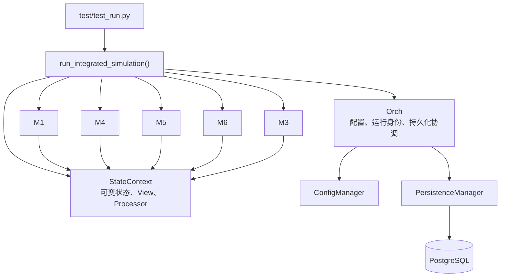
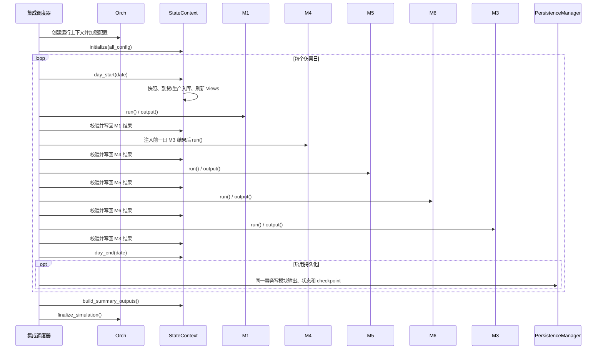

# ChainSight 重构后系统导览、架构与维护手册

## 文档目标

编写一份面向新成员的项目导览、运行架构与维护手册。读者完成阅读后，应能够回答并实践以下问题：

- ChainSight 在供应链计划中解决什么问题；
- 一次日度仿真如何从配置启动、经过各模块并形成结果；
- `Orch`、`StateContext`、M1、M4、M5、M6、M3 分别负责什么；
- 可变业务状态、动态 View、模块结果与跨日数据如何协作；
- 配置、数据质量、数据库持久化、checkpoint、续跑和性能观测如何工作；
- 面对配置、模块、跨日状态、持久化或性能问题时，应从哪里定位和维护。

本文档以当前重构后的集成链路为唯一主线：

```text
test/test_run.py
	→ test/test_integration.py: run_integrated_simulation()
	→ Orch + StateContext
	→ M1 → M4 → M5 → M6 → M3
	→ 日度状态、模块结果、checkpoint、Summary
```

Excel 是配置导入来源；PostgreSQL 提供配置、日度状态、模块结果、运行事件与汇总结果的持久化能力。文档围绕这一条统一运行链路展开。

## 写作原则

1. 先业务、后架构、再代码：先帮助新人理解项目要做什么，再说明运行方式和实现边界。
2. 以当前重构代码为事实源：重点核验 `test/`、`src/core/orchestrator/`、`src/modules/state_context.py` 和各模块 `integration_refactor.py`。
3. 使用“职责、输入、输出、状态影响、下游消费者”描述组件；不以文件修改记录代替架构说明。
4. 对日期、稳定排序、业务 UID、随机种子、模块结果合同、持久化事务和恢复边界给出明确约束。
5. 提供可操作的代码阅读路线和维护任务导航，使新成员能够据此完成首次排障和改动。

## 建议章节结构

### 1. 项目是什么：业务目标与仿真边界

- 说明 ChainSight 是供应链计划与日度离散仿真系统。
- 说明一个仿真日的含义：日初状态处理、当天计划与执行、日末状态提交。
- 使用业务语言解释：
	- M1：需求、订单、客户发货与削减；
	- M4：生产与产能计划；
	- M5：网络部署与库存平衡；
	- M6：物理物流、发运和到货；
	- M3：MRP 净需求，供下一自然日生产规划使用。
- 用一张业务闭环图展示需求、生产、调拨、物流与 MRP 的关系。


### 2. 新人 30 分钟阅读路线

提供术语表：`Orch`、`StateContext`、View、模块结果、`run_id`、checkpoint、持久化、跨日状态、Planning Facts。

建议首次阅读代码的顺序：

1. [test/test_run.py](../../test/test_run.py)：CLI 参数与集成入口调用；
2. [test/test_integration.py](../../test/test_integration.py)：对象组装、日度调度、写回、持久化和性能观测；
3. [src/core/orchestrator/models.py](../../src/core/orchestrator/models.py)：模块执行顺序和结果合同；
4. [src/modules/state_context.py](../../src/modules/state_context.py)：状态域、日初/日末操作、动态 View 和结果写回；
5. [src/core/orchestrator/new_orchestrator.py](../../src/core/orchestrator/new_orchestrator.py)：`Orch` 的运行身份、配置和持久化协作；
6. 各业务模块的 `integration_refactor.py`：阅读相应领域计算。

说明阅读原则：先掌握“谁调度、谁持有状态、谁计算、谁持久化”，再进入单模块算法细节。

### 3. 从命令到仿真：启动与初始化

说明 [test/test_run.py](../../test/test_run.py) 的参数及作用：

| 参数 | 作用 |
|---|---|
| `--config` | Excel 配置文件路径 |
| `--start-date`、`--end-date` | 仿真日期范围 |
| `--test` | 使数据库操作使用 `test` schema |
| `--no-persist` | 关闭数据库持久化，在内存中执行集成链路 |
| `--skip-dq` | 跳过配置数据质量检测，用于受控的性能或集成测试 |
| `--verbose` | 输出模块内部逐步骤耗时日志 |
| `--performance-report` | 写入结构化性能 JSON |
| `--run-mode` | 为性能报告标记运行方式 |

说明 `run_integrated_simulation()` 的初始化步骤：

1. 创建 `Orch`；
2. 加载系统参数和 Excel 配置，执行或跳过数据质量检查；
3. 建立 `run_id`、随机种子和可选的数据库连接；
4. 创建 `StateContext` 并使用 `all_config` 初始化库存与容量等业务状态；
5. 创建 M1、M4、M5、M6、M3；
6. 调用每个模块的 `prepare()`；
7. 创建模块结果归档、状态快照与性能遥测对象。

### 4. 重构后核心架构：职责与协作关系

#### 4.1 集成调度器

集成调度器负责组装运行时对象，组织日度循环，按顺序调用模块，校验模块结果，调用状态写回，收集性能数据，并在启用持久化时提交日度结果。

#### 4.2 `Orch`

`Orch` 负责：

- 配置生命周期、数据质量、系统参数和随机种子；
- 配置名称、`run_id`、日期范围、运行事件和续跑元数据；
- 通过 `ConfigManager` 协作完成配置加载、数据库连接与表迁移；
- 通过 `PersistenceManager` 协作完成模块输出、状态、checkpoint 和 Summary 的数据库写入。

#### 4.3 `StateContext`

`StateContext` 是可变业务状态的单一事实源，负责：

- 持有库存、开放调拨、在途、生产与交付收货、发货记录、生产 backlog 等状态；
- 持有 M3 净需求和 M4 产线状态、已分配产能等跨日状态；
- 由当前状态构造供模块读取的动态 View；
- 接收模块输出并以统一 Processor 更新状态；
- 执行 `initialize()`、`day_start()` 和 `day_end()`。

#### 4.4 业务模块与基础设施协作者

- 每个模块遵循 `prepare()`、`run()`、`output()` 生命周期；
- M1、M4、M5、M6、M3 只负责领域计算，并通过结果合同向状态层返回 DataFrame；
- `ConfigManager` 管理配置导入和数据质量；
- `PersistenceManager` 管理数据库事务与写入。



### 5. 日度仿真生命周期

日度主序列为：`day_start → M1 → M4 → M5 → M6 → M3 → day_end`。

逐步说明：

1. `day_start()` 保存期初库存、清理超期开放调拨、处理当天到货和生产入库，并刷新 Views；
2. M1 产生订单、发货、削减和供需日志；
3. M4 严格消费前一个自然日的 M3 净需求，并更新生产和产线相关状态；
4. M5 依据当日网络状态产生部署计划与当日 Planning Facts；
5. M6 将调拨计划转化为车辆、发运、在途和交付结果；
6. M3 在日末计算净需求，为下一自然日 M4 保存输入；
7. `day_end()` 固化期末业务状态；
8. 启用持久化时，以一个批量事务写模块输出、StateContext 状态和 checkpoint；
9. 记录日度性能遥测、集成 View 快照和运行日志。

### 6. 模块结果合同与状态写回

说明每个模块的统一集成合同：

```python
module.prepare()
module.run()
result = module.output()
validate_module_result(module_id, result, date_str)
ctx.apply_module_result(module_id, result, date_str)
ctx.record_summary_module_result(module_id, result, date_str)
```

说明 [src/core/orchestrator/models.py](../../src/core/orchestrator/models.py) 中：

- `MODULE_EXECUTION_ORDER` 定义权威执行顺序；
- `MODULE_RESULT_DATAFRAMES` 定义各模块必须返回的 DataFrame；
- `INTEGRATION_CONTEXT_VIEW_GETTERS` 定义集成回归与状态快照关注的日末 View。

| 模块 | 当日业务职责 | 主要输出 | 状态影响 | 主要下游 |
|---|---|---|---|---|
| M1 | 需求、订单、客户发货与削减 | 订单、发货、削减、供需日志 | 库存与客户发货历史 | M5、M3、汇总 |
| M4 | 生产与产能计划 | 生产、超限、问题、换型 | backlog、生产收货、产线跨日状态 | M5、后续日 |
| M5 | 网络部署与库存平衡 | 部署计划、缺口、SOH、校验 | 开放调拨、当日 Planning Facts | M6、M3 |
| M6 | 物理物流执行 | 交付、车辆、卡车、未满足、校验 | 在途、到货、调拨发运记录 | 下一日状态 |
| M3 | 网络净需求与 MRP | 净需求 | M3 跨日净需求 | 下一日 M4 |

### 7. `StateContext`：状态、View 与跨日数据

梳理下列状态域及其业务语义：

- 可用库存、日初库存和日末库存；
- 开放调拨及其供给聚合；
- 在途、交付收货、生产收货；
- 客户发货、调拨发运和库存变动流水；
- 未来生产 backlog；
- M3 按日净需求；
- M4 按日产线状态与已分配产能；
- M5 当日 Planning Facts；
- Summary 所用的模块结果归档与状态快照。

明确说明：View 从当前状态计算得到，是模块在当前日期读取业务事实的统一入口；模块返回结果后，`StateContext.apply_module_result()` 负责将其转为持久的运行期状态变化。

### 8. 配置、持久化、恢复与性能观测

- Excel 配置通过 Reader 加载为 `all_config`；
- 数据质量检查可清洗并替换运行配置；
- `enable_persistence` 决定数据库连接与日度、汇总数据写入；
- `test_mode` 使用独立的 `test` schema；
- `run_id` 关联配置、运行事件、模块结果、状态 View 与 Summary；
- checkpoint 只在某日模块输出和状态成功写入后推进，恢复从最后完整完成日的下一天开始；
- `PerformanceTelemetry` 按日记录日初、模块运行、日末和持久化耗时，性能报告可包含主要结果行数和运行标签。

### 9. 输出、观测与问题定位

说明一次运行可查看的材料：运行日志、模块结果、日末 StateContext Views、审计数据、checkpoint、Summary、性能 JSON。

给出分层定位路径：配置与数据质量 → 模块输入 View → 模块结果 → 状态写回 → 持久化与恢复。

### 10. 维护任务导航

| 维护任务 | 优先阅读或修改区域 | 首先确认的事项 |
|---|---|---|
| 配置读取或数据质量异常 | `ConfigManager`、配置 Reader | 配置表、列名、标识符标准化、DQ 结果 |
| M1/M4/M5/M6/M3 业务结果异常 | 对应 `integration_refactor.py` | 输入 View、结果合同、状态写回 |
| 某日开始产生差异 | `StateContext.day_start()` 与前一日日末状态 | 到货、生产入库、开放调拨、M3/M4 跨日数据 |
| 模块结果未持久化 | `PersistenceManager` 与输出注册表 | 输出 key、DataFrame 类型、表映射、事务 |
| 新增状态字段 | `StateContext`、View 注册、持久化注册 | 状态归属、初始化、日初/日末、恢复、持久化 |
| 新增模块 | `Module` 基类、结果合同、集成调度器 | `prepare/run/output`、执行顺序、状态写回、输出注册 |
| 新增模块输出 | 模块结果、`MODULE_RESULT_DATAFRAMES`、输出注册 | DataFrame 合同、持久化映射、回归比较 |
| 性能定位 | 模块实现、`spends`、性能 JSON | 数据规模、重复计算、View 构建、数据库写入边界 |

### 11. 维护规则与验证清单

- 修改算法前，确认输入来源、状态归属和结果合同；
- 新增跨日状态时，同时设计初始化、状态写入、View、日初/日末、持久化和恢复；
- 修改模块输出时，同步维护输出合同、状态 Processor、数据库输出映射和比较逻辑；
- 修改日期逻辑、稳定排序、业务 UID 或随机种子时，执行兼容性回归；
- 维护后的最小验证顺序：
	1. 模块结果合同；
	2. 单日集成调度；
	3. 多日状态流转；
	4. 数据库持久化；
	5. checkpoint 与续跑；
	6. 性能改动后的结果一致性与性能报告复核。

## 日度运行时序图


