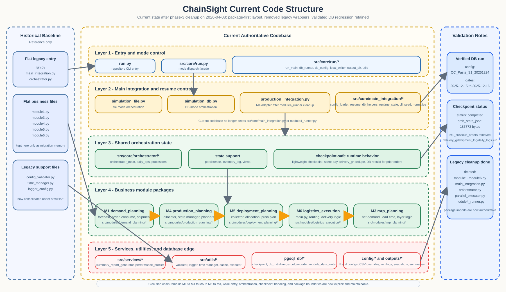

# Optimized Code Structure Diagram

更新时间：2026-04-08

本文档说明当前优化后代码结构的静态图和目录映射。  
注意：截至 2026-04-08，第三阶段“legacy wrapper 清理”已经完成，旧单体兼容文件不再保留在代码树中。

## 1. Architecture Overview



## 2. Current Authoritative Structure

当前应按下面的层次理解代码：

| 层级 | 当前权威位置 | 说明 |
|---|---|---|
| 仓库入口 | `run.py` | CLI 顶层入口 |
| 运行分发层 | `src/core/run.py`、`src/core/run/*` | 解析参数、选择文件模式/数据库模式、组织输出 |
| 主集成流程层 | `src/core/main_integration/*` | 文件模式、数据库模式、配置加载、续跑、M4 集成适配 |
| 共享状态层 | `src/core/orchestrator/*` | Orchestrator 状态、每日操作、状态处理、持久化 |
| 业务模块层 | `src/modules/*` 五个子包 | M1/M3/M4/M5/M6 的真实实现 |
| 服务层 | `src/services/*` | Summary、性能分析等 |
| 工具层 | `src/utils/*` | 配置校验、日志、时间管理、缓存等 |
| 数据库边界层 | `pgsql_db/*` | 配置导库、表定义、checkpoint、批量写入、summary 落库 |

## 3. Legacy To Current Mapping

| ChainSight_Dev 中的旧文件 | 当前对应位置 | 当前状态 |
|---|---|---|
| `run.py` | `run.py`、`src/core/run.py`、`src/core/run/*` | 仍存在，但职责已拆分 |
| `main_integration.py` | `src/core/main_integration/__init__.py`、`src/core/main_integration/*` | 旧单体文件已删除 |
| `orchestrator.py` | `src/core/orchestrator/__init__.py`、`src/core/orchestrator/*` | 旧单体文件已删除 |
| `parallel_executor.py` | `src/core/parallel_executor/__init__.py`、`src/core/parallel_executor/*` | 旧单体文件已删除 |
| `module1.py` | `src/modules/demand_planning/*` | 旧平铺入口已删除 |
| `module3.py` | `src/modules/mrp_planning/*` | 旧平铺入口已删除 |
| `module4.py` | `src/modules/production_planning/*` | 旧平铺入口已删除 |
| `module5.py` | `src/modules/deployment_planning/*` | 旧平铺入口已删除 |
| `module6.py` | `src/modules/logistics_execution/*` | 旧平铺入口已删除，真实实现位于 `main.py` |
| `module4_runner.py` | `src/core/main_integration/production_integration.py` | 旧名字已删除并规范化 |
| `config_validator.py`、`time_manager.py`、`logger_config.py` 等 | `src/utils/*` | 工具层集中管理 |
| `summary_report_generator.py`、`performance_profiler.py` | `src/services/*` | 服务层集中管理 |
| 零散 DB 代码 | `pgsql_db/*` | 数据库边界集中管理 |

## 4. Import Rules After Cleanup

### 4.1 正确写法

```python
from src.modules import demand_planning as module1
from src.modules import mrp_planning as module3
from src.modules import production_planning as module4
from src.modules import deployment_planning as module5
from src.modules import logistics_execution as module6

from src.core.main_integration import run_integrated_simulation
from src.core.main_integration.production_integration import run_module4_integrated
from src.core.orchestrator import create_orchestrator
```

### 4.2 不再推荐也不再可用的写法

```python
from src.modules import module1, module3, module4, module5, module6
from src.core.main_integration.module4_runner import run_module4_integrated
```

## 5. Reading Guide

- 想找运行入口，从 `run.py` 开始。
- 想找文件模式和数据库模式分叉，从 `src/core/run.py` 和 `src/core/run/*` 开始。
- 想找每日执行主链路，从 `src/core/main_integration/simulation_file.py` 或 `src/core/main_integration/simulation_db.py` 开始。
- 想找共享状态和每日状态变更，从 `src/core/orchestrator/orchestrator_main.py`、`daily_ops.py`、`processors.py` 开始。
- 想找 M4 集成适配逻辑，从 `src/core/main_integration/production_integration.py` 开始。
- 想找真实业务实现，直接进入五个模块子包，不要再找 `module1.py` 之类的旧文件。
