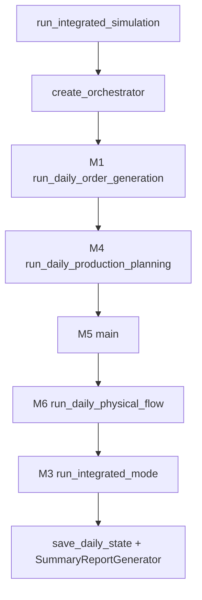
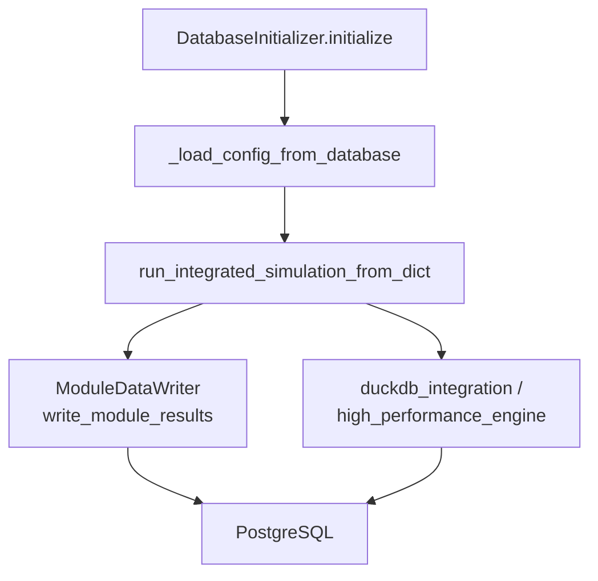

# ChainSight API 文档（本地版 + 数据库版）

## 文档信息

| 项 | 内容 |
|---|---|
| 文档版本 | v2.1 |
| 最后更新 | 2026-04-10 |
| 编写人 | 陈显跃 |
| 适用范围 | `src/`（本地文件模式）+ `pgsql_db/`（数据库模式） |
| 目标读者 | 开发工程师、测试工程师、算法工程师、集成人员、后端工程师、DBA |

---

# 第一部分：本地版 API（src/）

---

## 1. API 概览

ChainSight 本地版 API 采用“编排层 API + 业务模块 API + 工具层 API”三类结构。

### 1.1 API 分类

| 分类 | 主要文件 | 核心能力 |
|---|---|---|
| Core 编排 API | `src/core/main_integration/`（包）、`src/core/orchestrator/`（包） | 运行仿真、维护全局状态、断点续跑 |
| 业务模块 API | `src/modules/demand_planning/` ~ `src/modules/logistics_execution/`（5 个子包） | 需求、MRP、生产、调拨、物流算法 |
| 工具与服务 API | `src/utils/*`、`src/services/*` | DuckDB加速、内存数据、校验、性能分析、日志 |

> **第三阶段更新说明（2026-04-10）**：原 `src/modules/module1.py`～`module6.py` 与 `src/core/main_integration.py`、`src/core/orchestrator.py`、`src/core/run.py`、`src/core/parallel_executor.py` 单体文件已全部删除，替换为对应包目录。调用函数签名保持一致，只是 `from` 位置换成了包路径。

### 1.2 调用流程图



---

## 2. Core 模块 API

本节覆盖编排主入口、编排器构造函数和 `Orchestrator` 核心方法。

### 2.1 `run_integrated_simulation()`

**签名**

```python
def run_integrated_simulation(
    config_path: str,
    start_date: str,
    end_date: str,
    output_base_dir: str = "./integrated_output",
    force_restart: bool = False,
)
```

**位置**：`src/core/main_integration/`（包；入口函数在 `simulation_file.py`）

**功能**
- 本地模式全流程入口：校验配置、初始化状态、按日调度模块、保存快照、生成报告。

**参数说明**

| 参数 | 类型 | 必填 | 说明 |
|---|---|---|---|
| `config_path` | `str` | 是 | Excel 配置文件路径 |
| `start_date` | `str` | 是 | 仿真开始日期，格式 `YYYY-MM-DD` |
| `end_date` | `str` | 是 | 仿真结束日期，格式 `YYYY-MM-DD` |
| `output_base_dir` | `str` | 否 | 输出根目录 |
| `force_restart` | `bool` | 否 | 是否忽略续跑状态并强制重跑 |

**返回值**
- `dict`，典型字段包括：`simulation_completed`、`results`、`final_stats`、`summary_reports`、`balance_check_passed`。

**异常/失败行为**
- 配置校验失败时不抛异常，返回 `simulation_completed=False`；
- 运行中未捕获异常会向上抛出。

**示例**

```python
from src.core.main_integration import run_integrated_simulation

result = run_integrated_simulation(
    config_path="test_files/BC_S5.xlsx",
    start_date="2025-01-01",
    end_date="2025-01-31",
    output_base_dir="./outputs/bc_s5",
)

if result.get("simulation_completed"):
    print("仿真完成", result.get("final_stats", {}))
```

---

### 2.2 `run_integrated_simulation_from_dict()`

**签名**

```python
def run_integrated_simulation_from_dict(
    config_data: dict,
    config_name: str,
    start_date: str,
    end_date: str,
    output_base_dir: str = "./integrated_output",
    skip_validation: bool = True,
    skip_summary_report: bool = False,
) -> dict
```

**位置**：`src/core/main_integration/`（包；入口函数在 `simulation_db.py`）

**功能**
- 数据库模式/内存模式入口：直接接收 DataFrame 字典，避免临时 Excel。

**要点**
- 会尝试启用 `MemoryDataStore`（DuckDB 内存模式）；
- 保持与文件模式相同的模块执行顺序与口径。

---

### 2.3 `create_orchestrator()`

**签名**

```python
def create_orchestrator(
    start_date: str,
    output_dir: str = "./orchestrator_output",
) -> Orchestrator
```

**位置**：`src/core/orchestrator/`（包；入口在 `orchestrator_main.py`）

**功能**
- 创建并初始化 `Orchestrator` 实例。

**示例**

```python
from src.core.orchestrator import create_orchestrator

orch = create_orchestrator("2025-01-01", "./outputs/orchestrator")
```

---

### 2.4 `Orchestrator` 类

**构造签名**

```python
class Orchestrator:
    def __init__(self, start_date: str, output_dir: str = "./orchestrator_output")
```

**位置**：`src/core/orchestrator/`（包；类定义在 `orchestrator_main.py`）

#### 2.4.1 状态写入 API

| API | 说明 |
|---|---|
| `initialize_inventory(initial_inventory_df)` | 初始化期初库存 |
| `set_space_capacity(space_capacity_df)` | 设置空间容量 |
| `process_module1_shipments(shipment_df, date)` | 应用 M1 发货结果 |
| `process_module4_production(production_df, date)` | 应用 M4 生产结果 |
| `process_module5_deployment(deployment_df, date)` | 应用 M5 调拨计划 |
| `process_module6_delivery(delivery_df, date)` | 应用 M6 发运/到货结果 |
| `_process_delivery_arrivals(date)` | 在途到货入库 |
| `save_daily_state(date)` | 写出日快照 CSV |

#### 2.4.2 状态查询 API

| API | 返回 |
|---|---|
| `get_unrestricted_inventory_view(date)` | 当日库存 DataFrame |
| `get_open_deployment_view(date)` | 开放调拨 DataFrame |
| `get_planning_intransit_view(date)` | 在途 DataFrame |
| `get_production_gr_view(date)` | 生产收货 DataFrame |
| `get_delivery_gr_view(date)` | 调拨到货 DataFrame |
| `get_shipment_log_view(date)` | 客户发货 DataFrame |
| `get_delivery_shipment_log_view(date)` | 调拨发运 DataFrame |

#### 2.4.3 运行辅助 API

| API | 说明 |
|---|---|
| `cleanup_past_due_open_deployments(date, grace_days=0, write_audit=True)` | 清理过期调拨 |
| `save_beginning_inventory(date)` | 保存期初库存快照 |
| `save_ending_inventory(date)` | 保存期末库存快照 |
| `output_daily_inventory_summary(date)` | 输出日库存摘要 |
| `get_summary_statistics(date)` | 获取日统计 |

---

### 2.5 `ParallelExecutor` 并行 API

**签名（核心）**

```python
class ParallelExecutor:
    def __init__(self, max_workers: int = 3, enable_parallel: Optional[bool] = None)
    def run_parallel_stage(self, tasks: List[Tuple[str, Callable[[], Any]]]) -> Tuple[Dict[str, ParallelTaskResult], bool]
```

**位置**：`src/core/parallel_executor/`（包；类定义在 `parallel_executor_main.py`）

**说明**
- 支持串行/并行双模式；
- 通过环境变量 `CHAINSIGHT_PARALLEL` 控制默认并行开关；
- 返回每个任务结果与整体成功标记。

---

## 3. 六个业务模块 API

> 说明：代码层面公开入口以 M1/M3/M4/M5/M6 为主；M2 供给策略能力以函数形式内嵌在 M1 子包中（`apply_dps`、`apply_supply_choice`）。

### 3.1 Module1（需求与订单）

**包路径**：`src/modules/demand_planning/`（原 `src/modules/module1.py` 单体已删除，仅保留同名兼容别名）

#### API-1 `run_daily_order_generation()`

```python
def run_daily_order_generation(
    config_dict: dict,
    simulation_date: pd.Timestamp,
    output_dir: str,
    orchestrator: object = None,
    skip_file_output: bool = False,
    previous_orders_df: Optional[pd.DataFrame] = None,
) -> dict
```

- **功能**：生成当日订单、发货、缺货、供需日志。
- **返回关键字段**：`orders_df`、`shipment_df`、`cut_df`、`supply_demand_df`、`summary_df`、`all_orders_for_next_day`。

#### API-2 `generate_supply_demand_log_for_integration()`

```python
def generate_supply_demand_log_for_integration(
    demand_forecast: pd.DataFrame,
    consumed_forecast: pd.DataFrame,
    simulation_date: pd.Timestamp,
) -> pd.DataFrame
```

- **功能**：基于消耗后的预测生成未来窗口供需日志。

#### API-3 `simulate_shipment_for_single_day()`

```python
def simulate_shipment_for_single_day(
    simulation_date: pd.Timestamp,
    order_log: pd.DataFrame,
    current_inventory: Dict[Tuple[str, str], int],
    material_list: list,
    location_list: list,
    production_plan: Optional[pd.DataFrame] = None,
    delivery_plan: Optional[pd.DataFrame] = None,
) -> Tuple[pd.DataFrame, pd.DataFrame, Dict[Tuple[str, str], int]]
```

- **功能**：在 ML 粒度计算发货和缺货。

#### M2 内嵌策略 API（位于 M1 子包）

| API | 说明 |
|---|---|
| `apply_dps(demand_forecast, dps_config)` | 需求拆分到 DPS 地点 |
| `apply_supply_choice(demand_dps, supply_choice_config)` | 供给源选择与调整 |

---

### 3.2 Module3（MRP）

**包路径**：`src/modules/mrp_planning/`（原 `src/modules/module3.py` 单体已删除，仅保留同名兼容别名）

#### API-1 `run_integrated_mode()`

```python
def run_integrated_mode(
    module1_output_dir: str,
    orchestrator: object,
    config_dict: Dict[str, pd.DataFrame],
    start_date: str,
    end_date: str,
    output_dir: str,
    skip_file_output: bool = False,
    module1_result: Optional[Dict[str, pd.DataFrame]] = None,
) -> Dict[str, Any]
```

- **功能**：按日执行 MRP，输出净需求。

#### API-2 `calculate_daily_net_demand()`

```python
def calculate_daily_net_demand(
    material: str,
    location: str,
    date: pd.Timestamp,
    supply_demand_df: pd.DataFrame,
    safety_stock_df: pd.DataFrame,
    beginning_inventory_df: pd.DataFrame,
    in_transit_df: pd.DataFrame,
    delivery_gr_df: pd.DataFrame,
    future_production_df: pd.DataFrame,
    today_shipment_df: pd.DataFrame,
    open_deployment_df: pd.DataFrame,
    downstream_forecast_gap: float,
    downstream_safety_gap: float,
    horizon: int,
    delivery_shipment_df: Optional[pd.DataFrame] = None,
    order_df: Optional[pd.DataFrame] = None,
    downstream_ao_gap: float = 0.0,
) -> Tuple[float, float, float]
```

- **功能**：计算 AO/Forecast/Safety 三类缺口。

#### API-3 `assign_location_layers()` + `determine_lead_time()`

```python
def assign_location_layers(network_df: pd.DataFrame) -> pd.DataFrame
def determine_lead_time(
    sending: str,
    receiving: str,
    location_type: str,
    lead_time_df: pd.DataFrame,
    m4_mlcfg_df: Optional[pd.DataFrame] = None,
    material: Optional[str] = None,
    ptf_lsk_cache: Optional[Dict[Tuple[str, str], Tuple[int, int]]] = None,
) -> Tuple[int, str]
```

- **功能**：构建网络层级并计算提前期窗口。

---

### 3.3 Module4（生产计划）

**包路径**：`src/modules/production_planning/`（原 `src/modules/module4.py` 单体已删除，仅保留同名兼容别名）

#### API-1 `run_daily_production_planning()`

```python
def run_daily_production_planning(
    config_file: str,
    module3_output_dir: str,
    simulation_date: pd.Timestamp,
    simulation_start: pd.Timestamp,
    output_dir: str,
) -> str
```

- **功能**：单日生产计划主入口。
- **返回**：当日输出文件路径。

#### API-2 `build_unconstrained_plan_for_single_day()`

```python
def build_unconstrained_plan_for_single_day(
    net_demand_df: pd.DataFrame,
    mlcfg: pd.DataFrame,
    simulation_date: pd.Timestamp,
    simulation_start: pd.Timestamp,
    issues: List[Dict[str, Any]],
) -> pd.DataFrame
```

- **功能**：生成无约束生产计划。

#### API-3 `centralized_capacity_allocation_with_changeover()`

```python
def centralized_capacity_allocation_with_changeover(
    uncon: pd.DataFrame,
    cap_df: pd.DataFrame,
    rate_map: pd.Series,
    co_mat: pd.Series,
    co_def: Dict[tuple, float],
    mlcfg: pd.DataFrame,
    previous_line_states: Optional[Dict[str, Any]] = None,
    simulation_date: Optional[pd.Timestamp] = None,
    previously_allocated_capacity: Optional[Dict[str, float]] = None,
    issues: Optional[List[Dict[str, Any]]] = None,
) -> Tuple[pd.DataFrame, pd.DataFrame]
```

- **功能**：集中产能分配并处理换型。
- **返回**：`(plan_log_df, exceed_log_df)`。

---

### 3.4 Module5（调拨规划）

**包路径**：`src/modules/deployment_planning/`（原 `src/modules/module5.py` 单体已删除，仅保留同名兼容别名）

#### API-1 `main()`

```python
def main(
    input_path: str = None,
    output_path: str = None,
    sim_start: str = None,
    sim_end: str = None,
    config_dict: dict = None,
    module1_output_dir: str = None,
    module4_output_path: str = None,
    orchestrator: object = None,
    current_date: str = None,
    skip_file_output: bool = False,
    module1_result: dict = None,
    module4_result: dict = None,
) -> dict
```

- **功能**：M5 主入口（支持独立模式和集成模式）。
- **返回关键字段**：`deployment_plan`、`stock_on_hand_log`、`unfulfilled_log`、`validation_log`。

#### API-2 `collect_node_demands()`

```python
def collect_node_demands(
    material: str,
    location: str,
    sim_date: pd.Timestamp,
    config: dict,
    up_gap_buffer: dict,
    ptf_lsk_cache: Optional[dict] = None,
    lead_time_cache: Optional[dict] = None,
    active_network_cache: Optional[dict] = None,
    sdl_index: Optional[Dict[tuple, pd.DataFrame]] = None,
    ss_index: Optional[Dict[tuple, pd.DataFrame]] = None,
    order_index: Optional[Dict[tuple, pd.DataFrame]] = None,
    deploy_config_index: Optional[Dict[tuple, pd.DataFrame]] = None,
) -> List[dict]
```

- **功能**：收集节点需求（SDL + 安全库存 + 订单 + 上游 Gap）。

#### API-3 `apply_priority_allocation_vectorized()` / `push_softpush_allocation()`

```python
def apply_priority_allocation_vectorized(
    demand_rows: List[dict],
    adjusted_qtys: Dict[int, int],
    current_stock: int,
    demand_priority_map: Dict[str, int],
) -> int

def push_softpush_allocation(
    deployment_plan_rows: List[dict],
    config: dict,
    dynamic_soh: dict,
    sim_date: pd.Timestamp,
    ptf_lsk_cache: Optional[dict] = None,
    lead_time_cache: Optional[dict] = None,
    projected_soh: Optional[dict] = None,
    node_demands_map: Optional[Dict] = None,
) -> List[dict]
```

- **功能**：按优先级分配库存，并执行 push/soft-push 补货。

---

### 3.5 Module6（物流执行）

**包路径**：`src/modules/logistics_execution/`（原 `src/modules/module6.py` 单体已删除，仅保留同名兼容别名）

#### API-1 `run_daily_physical_flow()`

```python
def run_daily_physical_flow(
    config_dict: Dict[str, Any],
    orchestrator: object,
    current_date: pd.Timestamp,
    output_dir: str,
    max_wait_days: int = 30,
    random_seed: Optional[int] = None,
    skip_file_output: bool = False,
) -> Dict[str, Any]
```

- **功能**：执行单日物流仿真，产出发运/车辆/未满足/校验日志。

#### API-2 `run_physical_flow_module()`

```python
def run_physical_flow_module(
    input_excel: Optional[str] = None,
    simulation_start: Optional[str] = None,
    simulation_end: Optional[str] = None,
    output_excel: Optional[str] = None,
    config_dict: Optional[Dict[str, Any]] = None,
    orchestrator: Optional[object] = None,
    current_date: Optional[str] = None,
    output_path: Optional[str] = None,
    max_wait_days: int = 30,
    random_seed: Optional[int] = None,
    skip_file_output: bool = False,
) -> Dict[str, Any]
```

- **功能**：M6 总入口（独立/集成双模式）。

#### API-3 物流延迟采样

```python
def sample_delivery_delay(
    sending: str,
    receiving: str,
    dist_df: pd.DataFrame,
) -> int

def batch_sample_delivery_delays_duckdb(
    routes: List[Tuple[str, str]],
    dist_df: pd.DataFrame,
    seed: Optional[int] = None,
    run_id: Optional[str] = None,
) -> np.ndarray
```

- **功能**：单条路线或批量路线的延迟采样。

---

## 4. Utils 工具 API

### 4.1 DuckDB 加速 API

**类**：`DuckDBAccelerator`（`src/utils/duckdb_accelerator.py`）

| API | 说明 |
|---|---|
| `get_instance()` | 获取全局单例 |
| `batch_filter_by_material_location(df, pairs, ...)` | 批量过滤 ML 组合 |
| `aggregate_by_groups(df, group_cols, agg_col, agg_func='SUM')` | 分组聚合 |
| `filter_date_range(df, date_col, start_date, end_date)` | 日期窗口过滤 |
| `build_material_location_index(df, ...)` | 构建 ML 索引映射 |

---

### 4.2 内存数据存储 API

**类**：`MemoryDataStore`（`src/utils/memory_data_store.py`）

```python
class MemoryDataStore:
    def enable(self, memory_limit: str = None, threads: int = None) -> bool
    def write_module_output(self, module: str, sheet: str, date_str: str, df: pd.DataFrame, replace: bool = True) -> bool
    def read_module_output(self, module: str, sheet: str, date_str: str) -> Optional[pd.DataFrame]
    def table_exists(self, module: str, sheet: str, date_str: str) -> bool
    def clear_all(self)
```

**便捷函数**
- `enable_memory_mode()`
- `disable_memory_mode()`
- `is_memory_mode_enabled()`
- `write_module4_output()` / `read_module3_net_demand()` 等模块级快捷写读函数。

---

### 4.3 性能分析 API

**类/函数**：`PerformanceProfiler`、`profile_function`（`src/services/performance_profiler.py`）

```python
class PerformanceProfiler:
    def __init__(self, module_name: str, output_dir: Path = None, enabled: bool = True)

def profile_function(func)
```

**用法示例**

```python
from pathlib import Path
from src.services.performance_profiler import PerformanceProfiler

with PerformanceProfiler("Module5", output_dir=Path("./perf"), enabled=True):
    # 执行热点计算
    run_module5()
```

---

### 4.4 配置校验 API

**类/函数**：`ConfigValidator`、`run_pre_simulation_validation`（`src/utils/config_validator.py`）

```python
class ConfigValidator:
    def validate_all_configurations(self, config_path: str, config_dict: Dict) -> bool

def run_pre_simulation_validation(config_path: str, output_dir: str) -> tuple
```

**行为说明**
- 执行全局 + M1~M6 + 跨模块一致性校验；
- 输出 `validation.txt` 报告并返回通过状态。

---

## 5. 类型定义

### 5.1 核心数据结构

| 类型 | 定义位置 | 用途 |
|---|---|---|
| `DeploymentUID` | `src/core/orchestrator/`（包） | 调拨记录唯一标识 |
| `ParallelTaskResult` | `src/core/parallel_executor/`（包；定义在 `parallel_executor_main.py`） | 并行任务执行结果 |
| `LineState` | `src/modules/production_planning/types.py` | 产线跨天状态 |
| `ChangeoverInfo` | `src/modules/production_planning/types.py` | 换型过程状态 |
| `PlanRecord` | `src/modules/production_planning/types.py` | 生产计划记录 |

### 5.2 建议的 TypedDict（调用端）

> 说明：以下为文档推荐类型，便于上层服务静态检查。

```python
from typing import TypedDict, Any
import pandas as pd

class Module1Result(TypedDict, total=False):
    orders_df: pd.DataFrame
    shipment_df: pd.DataFrame
    cut_df: pd.DataFrame
    supply_demand_df: pd.DataFrame
    summary_df: pd.DataFrame

class SimulationResult(TypedDict, total=False):
    simulation_completed: bool
    results: dict[str, Any]
    final_stats: dict[str, Any]
    output_directory: str
    summary_reports: dict[str, str]
```

---

## 6. 最佳实践

### 6.1 推荐调用顺序

1. `run_pre_simulation_validation()`
2. `run_integrated_simulation()`
3. 使用 `summary_reports` 和 `final_stats` 做结果分析

### 6.2 错误处理

- 外层统一捕获异常并记录 `config_name/start_date/end_date`；
- 对模块返回空 DataFrame 场景做兜底（避免下游 `KeyError`）；
- 关键路径（M5/M3）建议加 `PerformanceProfiler`。

### 6.3 性能建议

- 启用 DuckDB 内存模式（`enable_memory_mode()`）；
- 对重复查询建立缓存（`SimulationCache`）；
- 需要时开启并行执行（`CHAINSIGHT_PARALLEL=true`）。

---

## 7. 与 ChainSight_Dev 的兼容性

### 7.1 兼容范围

| 维度 | 兼容情况 | 说明 |
|---|---|---|
| 模块入口文件 | 高 | 5 个业务子包（`demand_planning` / `mrp_planning` / `production_planning` / `deployment_planning` / `logistics_execution`）通过 `src/modules/__init__.py` 同时暴露 `module1`~`module6` 别名，老脚本 `from src.modules import module1` 仍可工作 |
| 执行语义 | 高 | 仍按 M1->M4->M5->M6->M3 顺序执行 |
| 输出形态 | 中高 | 本地模式保持 Excel/CSV 产出，内部可切换内存路径 |
| 参数命名 | 中高 | 大部分关键参数兼容，新增了 `skip_file_output` 等增强参数 |

### 7.2 迁移指南（Dev -> src）

1. **入口迁移**：将旧入口改为 `run_integrated_simulation()`；
2. **编排迁移**：统一使用 `Orchestrator` 作为状态读写中心；
3. **模块迁移**：优先通过 `src/modules/<子包名>/`（如 `demand_planning`、`production_planning`）访问 API，或继续使用 `from src.modules import moduleX as ...` 兼容别名，不直接依赖子包内部私有函数；
4. **性能迁移**：逐步启用 DuckDB 与缓存，不建议一次性替换全部路径；
5. **回归验证**：对关键报表（订单、生产、调拨、物流）做逐日对比。

### 7.3 常见兼容风险

- 旧脚本直接依赖“文件中间态”的场景，需要适配内存输出模式；
- 字段标准化（如 `material` 去 `.0`、`location` 补零）可能影响下游 join；
- 若自定义脚本依赖未公开私有函数，建议改为调用兼容层公开 API。

---

## 附录：快速调用模板

```python
from src.utils.config_validator import run_pre_simulation_validation
from src.core.main_integration import run_integrated_simulation

ok, report = run_pre_simulation_validation("test_files/BC_S5.xlsx", "./outputs/check")
if not ok:
    raise RuntimeError(f"配置校验失败: {report}")

res = run_integrated_simulation(
    config_path="test_files/BC_S5.xlsx",
    start_date="2025-01-01",
    end_date="2025-01-31",
    output_base_dir="./outputs/run_bc_s5",
)

print(res.get("simulation_completed"), res.get("output_directory"))
```

---

# 第二部分：数据库版 API（pgsql_db/）

---

## 1. 架构和概览

数据库版 API 采用“PostgreSQL 持久化 + DuckDB 计算加速 + DataFrame 作为交换对象”的设计。

### 1.1 API 分层

| 层级 | 主要文件 | API 类型 |
|---|---|---|
| 连接与会话层 | `db_connection.py`、`db_initializer.py` | 连接、事务、数据库初始化 |
| 查询与处理层 | `duckdb_integration.py`、`high_performance_engine.py` | DuckDB 批量算法桥接、混合查询、增量计算 |
| 写入与汇总层 | `module_data_writer.py`、`excel_importer.py` | 模块输出落库、配置导入、汇总生成 |
| 监控与诊断层 | `src/services/performance_profiler.py`、`duckdb_integration.py` | 性能画像、A/B对比、统计汇总 |

### 1.2 典型调用流程



### 1.3 与本地版 API 的关系

- 数据库版沿用 Core 编排语义（模块执行顺序、状态更新逻辑一致）；
- 差异主要体现在“数据输入输出通道”与“高性能查询方式”；
- 本地版以文件为主，数据库版以表为主。

---

## 2. 连接管理 API

### 2.1 `DatabaseConnection` 连接对象

**构造签名**

```python
class DatabaseConnection:
    def __init__(
        self,
        host: str = "localhost",
        port: int = 5432,
        database: str = "test_db",
        user: str = "postgres",
        password: str = "123456",
    )
```

**核心 API**

| API | 说明 |
|---|---|
| `connection_string` | 返回 PostgreSQL URL |
| `connect()` | 建立或复用连接 |
| `close()` | 关闭连接 |
| `test_connection()` | 返回连接状态与耗时 |
| `database_exists()` | 检查数据库存在 |
| `create_database_if_not_exists()` | 自动建库 |

**示例**

```python
from pgsql_db.db_connection import DatabaseConnection

db = DatabaseConnection(host="localhost", database="test_db", user="postgres", password="***")
print(db.connection_string)
print(db.test_connection())
```

---

### 2.2 `get_cursor()` 会话上下文

**签名**

```python
@contextmanager
def get_cursor(self, commit: bool = True)
```

**行为**
- `commit=True`：成功自动提交；
- 发生异常自动回滚；
- `commit=False`：适用于只读查询或外层事务控制。

**示例**

```python
with db.get_cursor(commit=False) as cur:
    cur.execute("SELECT COUNT(*) FROM information_schema.tables")
    total = cur.fetchone()[0]
```

---

### 2.3 初始化与连接治理 API

`DatabaseInitializer` 提供运行前全链路检查：

| API | 说明 |
|---|---|
| `initialize(config_name, auto_import_config=True, verbose=True)` | 建库、连通性检查、配置导入 |
| `check_config_data_exists(config_name)` | 检查场景数据是否已入库 |
| `get_available_configs()` | 获取可用配置列表 |
| `get_status_report(config_name=None)` | 输出数据库状态报告 |

**示例**

```python
from pgsql_db.db_initializer import DatabaseInitializer

init = DatabaseInitializer(database="test_db", user="postgres", password="***")
result = init.initialize(config_name="BC_S5", auto_import_config=True)
print(result["success"], result["config_tables_count"])
```

---

### 2.4 ConnectionPool 对应说明

计划文档中的 `ConnectionPool` 在当前代码中尚未独立实现。当前版本为单连接模型；建议在生产扩展中引入 `psycopg_pool`，并保留与 `DatabaseConnection` 相同方法风格。

### 2.5 连接参数与重试策略（生产建议）

`DatabaseConnection` 默认参数适用于本地开发；生产环境建议将连接参数外置并增加失败重试。

| 参数 | 开发默认 | 生产建议 |
|---|---|---|
| `host` | `localhost` | 固定内网域名，避免漂移 IP |
| `port` | `5432` | 明确白名单与安全组放行 |
| `database` | `test_db` | 按环境分库（`chainsight_dev/stg/prod`） |
| `user` | `postgres` | 专用业务账号，禁止超级用户直连 |
| `password` | 明文参数 | 使用环境变量或密钥管理服务 |

**推荐重试模板（调用端）**

```python
import time
from pgsql_db.db_connection import DatabaseConnection

def connect_with_retry(max_retries: int = 3, delay: float = 1.5):
    db = DatabaseConnection(host="db.internal", database="chainsight_prod", user="chainsight", password="***")
    last_err = None
    for i in range(max_retries):
        try:
            db.connect()
            return db
        except Exception as e:
            last_err = e
            time.sleep(delay * (i + 1))
    raise RuntimeError(f"DB connect failed after {max_retries} retries: {last_err}")
```

---

## 3. SQL 查询 API

### 3.1 PostgreSQL 查询 API

#### API-1 `execute_query()`

```python
def execute_query(self, query: str, params: tuple = None) -> List[tuple]
```

- 用于执行 `SELECT` 并返回结果列表。

#### API-2 `read_table()`

```python
def read_table(self, table_name: str) -> pd.DataFrame
```

- 将整表读取为 DataFrame，常用于配置加载与验证。

#### API-3 元数据查询

| API | 用途 |
|---|---|
| `table_exists(table_name)` | 判断表是否存在 |
| `get_all_tables(schema='public')` | 列出全部表 |
| `get_table_info(table_name)` | 获取列、类型、行数 |

---

### 3.2 DuckDB 查询 API

DuckDB 查询加速统一通过 `src/utils/duckdb_accelerator.py` 的 `DuckDBAccelerator` 暴露；原 `pgsql_db/duckdb_processor.py`（`DuckDBProcessor` / `DuckDBToPostgres`）及其 `DataPipeline` 组合器已作为死代码删除。

```python
from src.utils.duckdb_accelerator import get_accelerator

acc = get_accelerator()
res = acc.query("SELECT material, SUM(quantity) qty FROM orders GROUP BY material")
```

---

### 3.3 参数绑定规范

- PostgreSQL（psycopg）：使用 `%s` 占位符；
- DuckDB：支持 `?` 参数占位；
- 禁止字符串拼接用户输入，避免注入风险。

**示例：参数绑定**

```python
rows = db.execute_query(
    "SELECT * FROM cfg_global_network WHERE config_name = %s",
    ("BC_S5",),
)
```

---

### 3.4 游标管理建议

1. 所有 SQL 均通过 `get_cursor()`；
2. 只读查询使用 `commit=False`；
3. 大查询后及时释放游标，避免连接持有过长。

### 3.5 高频查询模板（可复用）

**模板 A：按配置名查询配置表**

```python
def query_config(db, table_name: str, config_name: str):
    sql = f'SELECT * FROM "{table_name}" WHERE config_name = %s'
    return db.execute_query(sql, (config_name,))
```

**模板 B：按 `run_id` 聚合模块输出量**

```python
def count_by_run(db, table_name: str, run_id: str):
    sql = f'SELECT run_id, COUNT(*) cnt FROM "{table_name}" WHERE run_id = %s GROUP BY run_id'
    rows = db.execute_query(sql, (run_id,))
    return rows[0][1] if rows else 0
```

**模板 C：仅拉取必要列（避免 `SELECT *`）**

```python
rows = db.execute_query(
    'SELECT material, location, quantity FROM "module3_output_netdemand" WHERE run_id = %s',
    (run_id,),
)
```

---

## 4. 数据操作 API

### 4.1 插入类 API

#### API-1 `create_table_from_df()`

```python
def create_table_from_df(
    self,
    df: pd.DataFrame,
    table_name: str,
    if_exists: str = "replace",
    add_write_time: bool = True,
    config_name: str = None,
    config_type: str = None,
) -> bool
```

**能力**
- 自动建表（类型推断）；
- 可追加 `config_name/config_type/db_write_time`；
- 结构不兼容时自动补列。

#### API-2 `_insert_dataframe()`（内部高性能写入）

```python
def _insert_dataframe(self, df: pd.DataFrame, table_name: str, batch_size: int = 1000)
```

- 使用 `COPY ... FROM STDIN` 批量写入。

---

### 4.2 更新类 API

当前实现通过通用非查询接口完成更新：

```python
def execute_non_query(self, query: str, params: tuple = None)
```

**示例：UPDATE**

```python
db.execute_non_query(
    'UPDATE "module5_output_deploymentplan" SET deployed_qty_invcon = %s WHERE run_id = %s',
    (100, "BC_S5_20260305_101500"),
)
```

---

### 4.3 删除类 API

| API | 场景 |
|---|---|
| `delete_config_data(table_name, config_name)` | 删除指定配置数据 |
| `truncate_output_tables(run_id)` | 删除某次运行的全部输出 |
| `drop_table(table_name, cascade=False)` | 删除整张表 |

**示例：按 run_id 清理**

```python
writer.truncate_output_tables(run_id="BC_S5_20260305_101500")
```

---

### 4.4 批量插入与文件导入 API

| API | 说明 |
|---|---|
| `ExcelImporter.import_excel_file(...)` | 单 Excel 全 Sheet 导入 |
| `ExcelImporter.import_multiple_files(...)` | 批量导入多个 Excel |
| `ModuleDataWriter.write_module_results_from_dict(...)` | 内存结果批量落库 |
| `ModuleDataWriter.write_orchestrator_data(...)` | Orchestrator CSV 批量落库 |

**示例：配置导入**

```python
from pgsql_db.excel_importer import ExcelImporter

importer = ExcelImporter(db)
stats = importer.import_excel_file(
    excel_path="test_files/BC_S5.xlsx",
    if_exists="replace",
    config_name="BC_S5",
)
print(stats)
```

### 4.5 幂等写入与 `run_id` 策略

数据库版推荐以 `run_id` 作为“单次仿真输出边界”，通过“先清理后写入”实现可重复执行：

1. 调用 `truncate_output_tables(run_id)` 清理历史结果；
2. 执行 `write_module_results_from_dict(...)` 写入模块结果；
3. 执行 `write_orchestrator_data(...)` 补齐状态类输出；
4. 执行 `write_summary_only(...)` 写入汇总。

**建议**：将 `run_id` 设计为 `config_name + 时间戳`，保证唯一且可追溯。

---

## 5. ORM 风格 API（项目内等价实现）

当前代码库未提供 Django/SQLAlchemy 风格的 `Model` 类，但已具备“查询/创建/更新/删除”的等价能力。

### 5.1 映射关系

| ORM 风格动作 | 项目内等价 API |
|---|---|
| `Model.query()` | `read_table()` / `execute_query()` |
| `Model.create()` | `create_table_from_df()` |
| `Model.update()` | `execute_non_query("UPDATE ...")` |
| `Model.delete()` | `delete_config_data()` / `execute_non_query("DELETE ...")` |

### 5.2 表映射 API

`table_mapping.py` 提供“逻辑模型 -> 物理表名”映射：

- `get_config_table_name(sheet_name)`：配置表映射到 `cfg_*`；
- `get_output_table_name(module, file_pattern)`：输出文件映射到目标表；
- `get_all_output_tables()`：返回全部输出表。

### 5.3 推荐封装示例（可选）

```python
class TableGateway:
    def __init__(self, db, table_name: str):
        self.db = db
        self.table_name = table_name

    def query_all(self):
        return self.db.read_table(self.table_name)

    def create(self, df):
        return self.db.create_table_from_df(df, self.table_name, if_exists="append")
```

> 上述示例是建议封装，不是仓库内置类。

---

## 6. 事务 API

### 6.1 事务控制能力

| 语义 | 当前 API | 说明 |
|---|---|---|
| `begin_transaction()` | `with db.get_cursor(...)` 或 `with conn.transaction():` | 进入事务上下文 |
| `commit()` | 上下文正常退出自动提交 | 无需显式调用 |
| `rollback()` | 异常时自动回滚 | 保证原子性 |

### 6.2 大批量写入事务

`_insert_dataframe()` 在单事务中写完整批记录，避免分块提交的频繁 IO 同步开销。

### 6.3 嵌套事务说明

- 当前项目未暴露专用 `nested transaction` API；
- 如需嵌套控制，可在 SQL 层使用 `SAVEPOINT`（需谨慎封装并统一错误处理）。

**示例：手工 Savepoint（扩展写法）**

```python
with db.get_cursor() as cur:
    cur.execute("SAVEPOINT sp1")
    try:
        cur.execute("UPDATE ...")
    except Exception:
        cur.execute("ROLLBACK TO SAVEPOINT sp1")
```

### 6.4 事务边界反模式（避免）

- 在一个事务里串行写入过多大表（锁持有时间过长）；
- 在事务中执行外部 RPC 或文件 IO（失败点不可控）；
- 异常后继续复用同一游标（状态可能已损坏）；
- 混用“自动提交上下文”和“手工提交”导致边界混乱。

**推荐原则**：每个事务仅覆盖“同一业务原子动作”，并保证可重试。

---

## 7. 性能优化 API

### 7.1 批处理 API

| API | 优化点 |
|---|---|
| `create_table_from_df()` + COPY | DataFrame 到 PG 批量快速落库 |
| `write_summary_only()` | 只写关键汇总，减少重复写入 |
| `write_module_results_from_dict()` | 跳过中间文件，内存直写数据库 |

### 7.2 缓存与增量 API

| API | 说明 |
|---|---|
| `IncrementalComputeManager.register_dataset()` | 注册增量检测数据集 |
| `IncrementalComputeManager.get_changes()` | 获取新增/修改/删除集合 |
| `save_checkpoint()/load_checkpoint()` | 检查点持久化 |
| `HybridQueryEngine.attach_postgres()` | 将 PostgreSQL 附加到 DuckDB |
| `HybridQueryEngine.query_config()` | 读取配置表并复用缓存 |

### 7.3 索引管理 API

| API | 说明 |
|---|---|
| `_create_auto_indexes(table_name, df)` | 自动创建常用字段索引 |
| `_check_table_compatible(table_name, df)` | 写入前结构兼容检查 |

### 7.4 DuckDB 优化切换 API

`duckdb_integration.py` 提供按开关和规模阈值自动选择：

| API | 功能 |
|---|---|
| `with_duckdb_fallback(operation_name)` | DuckDB失败自动回退Pandas |
| `calculate_net_demand_batch_duckdb(...)` | 批量净需求计算 |
| `apply_moq_rv_batch_duckdb(...)` | 批量 MOQ/RV 计算 |
| `priority_allocation_batch_duckdb(...)` | 批量优先级分配 |

### 7.5 何时启用 DuckDB（经验阈值）

| 数据规模 | 推荐引擎 | 原因 |
|---|---|---|
| < 5万行 | Pandas | 初始化开销更低 |
| 5万~50万行 | DuckDB 优先 | 聚合/连接收益明显 |
| > 50万行 | DuckDB + 分批 | 控制内存峰值并保持吞吐 |

> 实际阈值需结合机器内存、列类型和 SQL 复杂度做 A/B 校准。

---

## 8. 监控和调试

### 8.1 性能监控 API

`PerformanceProfiler`（`src/services/performance_profiler.py`）

```python
class PerformanceProfiler:
    def __enter__(self)
    def __exit__(self, exc_type, exc_val, exc_tb)
```

**示例**

```python
with PerformanceProfiler("Module5", enabled=True):
    run_module5()
```

`duckdb_integration.get_perf_stats()` 提供 DuckDB/Pandas 运行统计：

```python
with performance_comparison("module5_ab") as run_id:
    duck_func(df, run_id=run_id)
    pandas_func(df, run_id=run_id)

print(get_perf_stats().get_comparison(run_id))
```

### 8.2 DuckDB A/B 诊断 API

| API | 作用 |
|---|---|
| `performance_comparison(name)` | 单次运行统计上下文 |
| `run_ab_comparison(func_a, func_b, test_data, iterations=5, warmup=1)` | 两实现对比 |
| `get_perf_stats().get_comparison(run_id)` | DuckDB/Pandas 速度对比 |

### 8.3 数据库诊断 API

| API | 说明 |
|---|---|
| `test_connection()` | 连接健康 |
| `get_table_info(table_name)` | 表结构与行数健康 |
| `get_status_report(config_name)` | 初始化器状态报告 |
| `print_import_summary()` / `print_summary()` | 导入/写入结果审计 |

### 8.4 常用排障脚本片段

```python
# 1) 检查配置是否入库
exists, rows = initializer.check_config_data_exists("BC_S5")

# 2) 检查关键输出表
print(db.get_table_info("module3_output_netdemand"))

# 3) 查询指定 run_id 数据量
cnt = db.execute_query(
    'SELECT COUNT(*) FROM "module1_output_orderlog" WHERE run_id = %s',
    (run_id,),
)[0][0]
print(cnt)
```

### 8.5 线上排障最小闭环

1. **连通性**：`test_connection()`；
2. **配置完整性**：`check_config_data_exists(config_name)`；
3. **输出完整性**：检查 M1/M3/M4/M5/M6 关键输出表是否存在当前 `run_id`；
4. **性能定位**：查看 `PerformanceProfiler` 输出报告，或用 `get_perf_stats().get_comparison(run_id)` 比较 DuckDB/Pandas；
5. **回退验证**：对慢查询执行 DuckDB/Pandas A/B，确认是否需要关闭 DuckDB 优化。

该闭环可在 10-20 分钟内完成一次标准故障初判。

---

## 附录 A：高频 API 速查

| 场景 | 推荐 API |
|---|---|
| 初始化数据库并自动导入配置 | `DatabaseInitializer.initialize()` |
| 读取某配置所有表 | `_load_config_from_database()` + `read_table()` |
| 将模块内存结果写回数据库 | `write_module_results_from_dict()` |
| 只写最终汇总和状态 | `write_summary_only()` + `write_orchestrator_data()` |
| 生成 DB 内 summary | `generate_summary_reports_from_db()` |
| 做 DuckDB/Pandas 性能对比 | `performance_comparison()` / `run_ab_comparison()` |

## 附录 B：实现差异声明

1. 计划文档中的 `get_connection()` 对应当前实现 `connect()`；
2. 计划文档中的 `execute_batch()` 对应当前批量写入主路径 `create_table_from_df()` + COPY；
3. 计划文档中的 `Model.*` 为概念接口，当前版本采用 DataFrame+TableGateway 风格实现。

## 附录 C：推荐权限模型（最小权限）

| 角色 | 建议权限 | 说明 |
|---|---|---|
| 只读分析账号 | `SELECT` | BI 或诊断场景 |
| 写入执行账号 | `SELECT/INSERT/UPDATE/DELETE` | 仿真运行与落库 |
| 维护账号 | DDL + 管理权限 | 仅用于初始化、迁移、索引维护 |

**实践建议**：运行账号与维护账号分离；生产禁用超管账号直连业务流程。

---

# 第三部分：API 对比与迁移指南

## 3.1 API 类别对比

| API 类别 | 本地版实现 | 数据库版实现 |
|---|---|---|
| Core 编排 API | `run_integrated_simulation()`、`Orchestrator` | `run_integrated_simulation_from_dict()`、`DatabaseInitializer` |
| 业务模块 API | 5 个业务子包（`demand_planning`、`mrp_planning`、`production_planning`、`deployment_planning`、`logistics_execution`，配合 `module1`~`module6` 兼容别名） | 保持兼容，通过 `ModuleDataWriter` 落库 |
| 工具层 API | `DuckDBAccelerator`、`MemoryDataStore`、`PerformanceProfiler` | `HybridQueryEngine`、`IncrementalComputeManager`、`PerformanceStats` |
| 数据操作 API | pandas DataFrame 操作 | `DatabaseConnection`、`execute_query()`、`create_table_from_df()` |

## 3.2 接口兼容性

| 接口 | 本地版 | 数据库版 | 兼容状态 |
|---|---|---|---|
| `run_integrated_simulation_from_dict()` | ✅ 支持 | ✅ 支持（默认入口） |
| 模块入口（`run_daily_*`） | ✅ 文件模式 | ✅ 保留兼容层 |
| 配置输入 | Excel 文件 | PostgreSQL 配置表 | ⚠️ 需迁移 |
| 输出方式 | CSV/XLSX 文件 | PostgreSQL 表 | ⚠️ 需适配 |

## 3.3 迁移代码示例

### 示例 1：从本地版 API 切换到数据库版

**本地版调用**：
```python
from src.core.main_integration import run_integrated_simulation

result = run_integrated_simulation(
    config_path="test_files/BC_S5.xlsx",
    start_date="2025-01-01",
    end_date="2025-01-31",
    output_base_dir="./outputs/bc_s5",
)
```

**数据库版调用**：
```python
from src.core.main_integration import _load_config_from_database
from src.core.main_integration import run_integrated_simulation_from_dict
from pgsql_db.db_initializer import DatabaseInitializer

# 初始化数据库并导入配置
init = DatabaseInitializer(database="test_db", user="postgres", password="***")
init.initialize(config_name="BC_S5", auto_import_config=True)

# 从数据库加载配置
config_dict = _load_config_from_database(config_name="BC_S5")

# 运行仿真
result = run_integrated_simulation_from_dict(
    config_data=config_dict,
    config_name="BC_S5",
    start_date="2025-01-01",
    end_date="2025-01-31",
    output_base_dir="./outputs/bc_s5",
)
```

### 示例 2：读取模块输出的差异

**本地版**：
```python
import pandas as pd

orders_df = pd.read_csv("outputs/module1/20250101_orderlog.csv")
```

**数据库版**：
```python
from pgsql_db.db_connection import DatabaseConnection

db = DatabaseConnection(database="test_db", user="postgres", password="***")
orders_df = db.read_table("module1_output_orderlog")
orders_df = orders_df[orders_df["run_id"] == "BC_S5_20260305_101500"]
```

## 3.4 性能 API 对比

| 操作 | 本地版 API | 数据库版 API | 性能特征 |
|---|---|---|
| 配置加载 | `pd.read_excel()` | `db.read_table()` | DB 版适合多场景共享配置 |
| 批量写入 | `df.to_csv()` | `db.create_table_from_df()` + COPY | DB 版约 50x 写入加速 |
| 批量查询 | `df.groupby().sum()` | `duck.query("SELECT ... GROUP BY")` | DuckDB 向量化约 10x 查询加速 |
| 监控统计 | `PerformanceProfiler` | `PerformanceStats` | DB 版增加 DuckDB/Pandas 对比维度（按 run_id、按操作） |

## 3.5 推荐迁移路径

1. **Phase 1：配置迁移**
   - 使用 `DatabaseInitializer.initialize()` 导入所有 Excel 配置到 PostgreSQL
   - 验证配置表完整性（`cfg_*` 表）

2. **Phase 2：接口适配**
   - 保持 `run_integrated_simulation_from_dict()` 调用不变
   - 添加 `ModuleDataWriter.write_module_results_from_dict()` 落库逻辑
   - 移除 CSV 输出路径，改为数据库表查询

3. **Phase 3：验证对比**
   - 使用相同配置分别运行本地版和数据库版
   - 对比关键输出（订单量、生产量、库存量）
   - 建立回归测试用例

4. **Phase 4：全量切换**
   - CI/CD 流程切换到数据库模式
   - 保留本地版作为快速回退选项

---

# 附录：快速调用模板

## 附录 A：本地版完整模板

```python
from src.utils.config_validator import run_pre_simulation_validation
from src.core.main_integration import run_integrated_simulation

ok, report = run_pre_simulation_validation("test_files/BC_S5.xlsx", "./outputs/check")
if not ok:
    raise RuntimeError(f"配置校验失败: {report}")

res = run_integrated_simulation(
    config_path="test_files/BC_S5.xlsx",
    start_date="2025-01-01",
    end_date="2025-01-31",
    output_base_dir="./outputs/run_bc_s5",
)

print(res.get("simulation_completed"), res.get("output_directory"))
```

## 附录 B：数据库版完整模板

```python
from src.core.main_integration import _load_config_from_database
from src.core.main_integration import run_integrated_simulation_from_dict
from pgsql_db.db_initializer import DatabaseInitializer
from pgsql_db.db_connection import DatabaseConnection

# 初始化数据库
init = DatabaseInitializer(database="test_db", user="postgres", password="***")
result = init.initialize(config_name="BC_S5", auto_import_config=True)

if not result["success"]:
    raise RuntimeError(f"数据库初始化失败: {result}")

# 加载配置
config_dict = _load_config_from_database(config_name="BC_S5")

# 运行仿真
res = run_integrated_simulation_from_dict(
    config_data=config_dict,
    config_name="BC_S5",
    start_date="2025-01-01",
    end_date="2025-01-31",
    output_base_dir="./outputs/db_run_bc_s5",
)

# 查询输出
db = DatabaseConnection(database="test_db", user="postgres", password="***")
run_id = res.get("run_id")
summary = db.read_table("summary_output_performance_summary")
summary = summary[summary["run_id"] == run_id]

print(f"仿真完成: {res.get('simulation_completed')}")
print(f"输出统计: {summary.to_dict('records')}")
```

## 附录 C：API 速查表

| 场景 | 本地版 API | 数据库版 API |
|---|---|---|
| 初始化并运行 | `run_integrated_simulation()` | `DatabaseInitializer.initialize()` + `run_integrated_simulation_from_dict()` |
| 读取配置 | `pd.read_excel()` | `db.read_table("cfg_*")` |
| 写入输出 | `df.to_csv()` | `db.create_table_from_df()` |
| 批量查询 | `DuckDBAccelerator.aggregate_by_groups()` | `HybridQueryEngine.query_config()` |
| 性能监控 | `PerformanceProfiler` | `get_perf_stats()` / `performance_comparison()` |
| 配置校验 | `ConfigValidator.validate_all_configurations()` | `DatabaseInitializer.check_config_data_exists()` |
| 连接管理 | 不适用 | `DatabaseConnection.connect()` / `close()` |
| 事务处理 | 不适用 | `db.get_cursor(commit=True)` |
| 批量导入 | 不适用 | `ExcelImporter.import_excel_file()` |
| 增量计算 | 不适用 | `IncrementalProcessor` |
| A/B 测试 | 不适用 | `run_ab_comparison()` |

