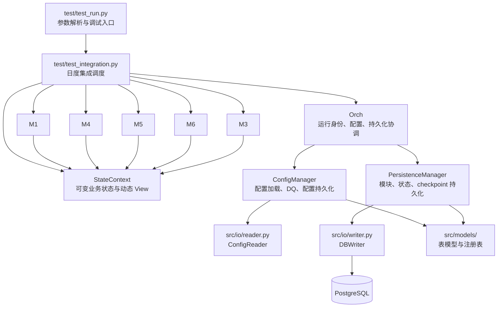
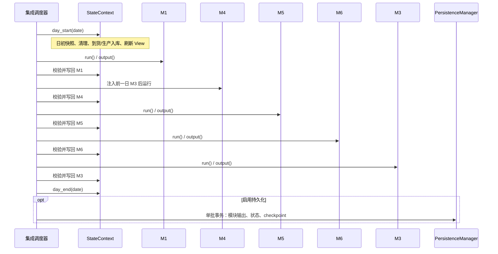
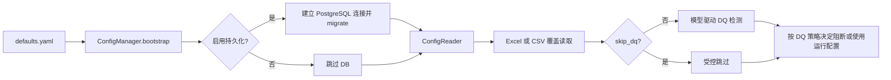
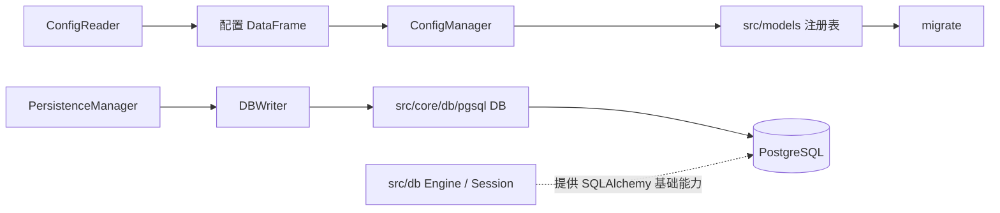

# ChainSight 架构设计文档（Refactor Preview）

## 文档信息

| 项 | 内容 |
|---|---|
| 维护者 | 林宏南 |
| 文档版本 | Preview v3.3 |
| 最后更新 | 2026-08-21 |
| 文档状态 | Preview，持续重构中 |
| 适用代码库 | `ChainSight-Decoupling` |
| 代码事实源 | `src/`、`test/test_run.py`、`test/test_integration.py` |

> **版本定位**：当前实现以 ChainSight 1.0 为基础进行重构（refactor），重点包括集成链路性能改善、M1 需求与发货逻辑调整、运行期状态与持久化职责拆分，以及配置/表模型统一治理。
>
> **兼容策略**：历史 legacy 实现仍保留，用于结果回归、问题追溯和逐步迁移。本文仅描述当前重构链路，不将遗留实现视为当前架构事实。
>
> **运行入口**：当前完整重构链路通过 `test/test_run.py` 启动；它同时提供集成执行、隔离测试、性能采集和诊断接口。该入口在 Preview 阶段承担运行入口职责，后续仍会继续进行交互开发与入口演进。

---

## 1. 架构概述

ChainSight 是按自然日推进的供应链计划仿真系统。每个仿真日以当前库存、在途、生产 backlog、开放调拨和前序计划为输入，依次执行 M1、M4、M5、M6、M3，并将结果经统一状态处理器写回，形成下一日的输入。

当前重构架构将职责明确分为：

1. **运行与调度**：`test/test_run.py` 和 `test/test_integration.py` 组装并推进日度流程；
2. **运行协调**：`Orch` 管理运行身份、配置生命周期和持久化协作；
3. **业务状态**：`StateContext` 是可变业务状态的单一事实源；
4. **领域计算**：M1、M3、M4、M5、M6 通过一致的模块生命周期运行；
5. **基础设施**：`src/io/`、`src/db/`、`src/models/` 分别处理数据读写、数据库会话能力和模型/表注册。



### 1.1 核心边界

| 组件 | 负责 | 不负责 |
|---|---|---|
| `test/test_integration.py` | 日度顺序、模块结果校验、状态写回调用、结果归档 | 领域算法、直接修改库存、数据库表细节 |
| `Orch` | `config_name`/`run_id`、配置分发、配置与持久化协作、续跑识别 | 可变业务状态、模块算法 |
| `StateContext` | 库存/调拨/在途等可变状态、动态 View、结果处理器、日初日末 | 数据库写入、调度决策 |
| 业务模块 | 静态准备和当日领域计算，返回结果合同 | 直接突变全局业务状态 |
| `ConfigManager` | 系统配置、Excel/字典/数据库配置读取、DQ、配置写入 | 业务状态和模块输出写入 |
| `PersistenceManager` | 模块输出、状态、checkpoint、汇总持久化 | 配置读取、领域算法 |

### 1.2 重构目录结构

```text
src/
├── core/
│   ├── orchestrator/       # Orch、ConfigManager、PersistenceManager
│   ├── main_integration/   # 共享集成辅助能力（如随机种子）
│   ├── db/pgsql/           # 当前运行期 PostgreSQL DB 封装
│   ├── run/                # 输出目录、配置目录与 schema 解析
│   └── parallel_executor/  # 可复用并行执行辅助能力
├── modules/                # M1/M3/M4/M5/M6、模块基类和 StateContext
├── io/                     # 配置读取器和统一 Writer 接口
├── db/                     # SQLAlchemy Engine / Session 基础能力
├── models/                 # SQLAlchemy 表模型、注册表与迁移
├── services/               # 性能分析、汇总等服务
└── utils/                  # 标识符归一化、排序、性能遥测与数据质量检测
    └── data_quality/       # 模型驱动的配置表字段质量检测
```


---

## 2. 运行、调试与日度调度

### 2.1 当前运行入口

`test/test_run.py` 解析参数、创建输出目录并调用 `run_integrated_simulation()`。该入口支持 `pandas` 与 `polars` 后端，并将执行参数传递给集成调度器。

| 参数 | 用途 |
|---|---|
| `--config` | Excel 配置文件路径 |
| `--start-date` / `--end-date` | 仿真闭区间 |
| `--engine` | 计算后端：`pandas` 或 `polars`，默认 `polars` |
| `--test` / `--test-schema` | 将持久化写入隔离 PostgreSQL schema |
| `--no-persist` | 禁用数据库连接与持久化，仅执行内存链路 |
| `--skip-dq` | 跳过配置数据质量检测，仅适用于受控性能或诊断场景 |
| `--verbose` | 输出模块内部逐步骤耗时日志 |
| `--performance-report` / `--run-mode` | 写出结构化性能遥测 JSON，并记录运行模式 |

### 2.2 权威日度执行顺序

`src/core/orchestrator/models.py` 中的 `MODULE_EXECUTION_ORDER` 定义当前唯一的完整集成顺序：

```text
day_start → M1 → M4 → M5 → M6 → M3 → day_end
```



### 2.3 集成结果合同

模块执行后，调度器固定执行 `run()`、`output()`、`validate_module_result()`、`StateContext.apply_module_result()` 和汇总归档。每个必需输出必须是 pandas `DataFrame`。

| 模块 | 必需结果 |
|---|---|
| M1 | `orders_df`、`shipment_df`、`cut_df`、`supply_demand_df`、`summary_df` |
| M4 | `production_df`、`exceed_log`、`issues_df`、`changeover_log`、`unconstrained_plan` |
| M5 | `deployment_plan`、`unfulfilled_log`、`stock_on_hand_log`、`validation_log` |
| M6 | `delivery_plan`、`vehicle_log`、`truck_usage`、`unsatisfied_log`、`validation_log`、`bypass_log` |
| M3 | `net_demand_df` |

此合同是状态写回、数据库持久化和回归比对的共同边界。模块可以提供附加字段，但不能删除或替换上述字段。

---

## 3. Core：Orch、配置与持久化协作

### 3.1 `Orch`：轻量运行协调器

当前重构主协调器位于 `src/core/orchestrator/new_orchestrator.py`，并通过 `src/core/orchestrator/__init__.py` 以 `Orch` 导出。它装配两个协作者：

| 协作者 | 文件 | 职责 |
|---|---|---|
| `ConfigManager` | `config_manager.py` | 系统参数、数据库 bootstrap、配置加载、DQ、配置持久化 |
| `PersistenceManager` | `persistence_manager.py` | 日度模块输出、状态 View、checkpoint、汇总持久化 |

`Orch` 保持 `config_name` 和 `run_id` 身份，向模块分发其 `schema` 所需的配置表，并代理持久化调用。它不拥有库存、在途、开放调拨等可变业务状态。

`orchestrator_main.py` 与其 mixin 文件仍在目录中，用于 legacy 兼容；当前重构集成链路使用的是 `new_orchestrator.py` 导出的 `Orch`。

### 3.2 配置生命周期



`ConfigManager` 的配置可来自传入字典、Excel 路径或已持久化的配置。文件模式中，`ConfigReader` 以 `src/models/cfg.py` 的 `CONFIG_TABLE_REGISTRY` 为权威：它按模型投影字段、按模型类型转换列，并允许同名 CSV 覆盖 Excel sheet。

在配置读取完成后、模块创建之前，`ConfigManager` 会调用 `src/utils/data_quality/` 的 `ConfigInputDataQualityChecker` 对 `all_config` 执行 DQ。检测规则不重复维护在独立配置中，而是从 `src/models/cfg.py` 的 SQLAlchemy 模型提取：字段 `Column.info` 与表 `__table_args__["info"]` 中声明的 `notnull`、`enumerate`、`range`、`date_flag`、主键及表启用信息共同构成约束来源。

DQ 负责发现和记录缺失 Sheet、缺失字段、空表、空值、类型/格式异常、数值越界、非法枚举、日期区间异常和主键重复等问题，不负责业务转换或数据清洗。`ConfigManager` 根据 `defaults.yaml` 中 `data_quality` 的启用、审计和失败阻断策略决定是否中止初始化；`--skip-dq` 仅用于受控的诊断和性能场景。

### 3.3 断点续跑与事务边界

启用持久化时，每个自然日的模块输出、`StateContext` 状态和 checkpoint 由 `PersistenceManager.batch_transaction()` 包裹在一个批量事务中。只有整日写入成功后，checkpoint 才推进为最后完整完成日。

续跑时，`Orch` 查询未完成运行、复用原 `run_id`，并由 `StateContext` 从已持久化的 View 恢复状态。恢复后的下一步是最后完整日的下一天 M1，而不是重复执行已经提交的自然日。

---

## 4. Modules：一致的模块生命周期

### 4.1 模块公共基类

`src/modules/module.py` 定义抽象基类 `Module`。所有重构模块遵循同一生命周期：

```python
module.prepare()  # 仿真前一次：静态配置、索引和预计算
module.run()      # 每日一次：读取当前 View，完成当日计算
result = module.output()  # 返回 DataFrame 结果合同
```

基类同时提供依据 `schema` 分发配置、合并共享与模块专属参数、通用数值校验，以及模块方法的计时能力。

### 4.2 各模块结构

业务模块以 M1、M3、M4、M5、M6 五个子包提供。当前重构入口统一收敛在各包的 `integration_refactor.py`，每个包配套 `backends.py` 处理 pandas/polars 后端差异或后端适配。

| 模块 | 包 | 当前重构入口 | 职责 |
|---|---|---|---|
| M1 | `demand_planning/` | `integration_refactor.py` | 需求、订单、客户发货与削减 |
| M4 | `production_planning/` | `integration_refactor.py` | 生产计划、产能与换产 |
| M5 | `deployment_planning/` | `integration_refactor.py` | 网络部署、调拨与供需平衡 |
| M6 | `logistics_execution/` | `integration_refactor.py` | 物流执行、车辆、发运、在途与到货 |
| M3 | `mrp_planning/` | `integration_refactor.py` | 净需求计算，作为下一日 M4 输入 |

`demand_planning_refactor/` 等历史或过渡目录仍可能存在，但当前集成调度器导入并执行的是上述业务包的重构入口。

### 4.3 跨模块依赖


关键时序约束：

1. M4 严格读取**前一个自然日**的 M3 净需求；首日使用空净需求合同。
2. M5 发布的 Planning Facts 仅在当日 M5→M6→M3 交接时有效，不是跨日状态，也不作为恢复数据持久化。
3. 模块通过结果合同写回 `StateContext`；不应直接修改其库存、在途或调拨容器。

---

## 5. StateContext：业务状态单一事实源

`src/modules/state_context.py` 将旧协调器中混杂的可变业务状态、View 构建与结果处理器收敛为 `StateContext`。`Orch` 是运行协调器，`StateContext` 才是运行期业务状态的唯一拥有者。

### 5.1 主要状态域

| 状态域 | 代表状态 | 用途 |
|---|---|---|
| 库存 | `unrestricted_inventory`、日初/日末快照 | 维护可用库存和库存历史 |
| 调拨 | `open_deployment`、聚合供给账本 | 保存未完成调拨，并供 M5/M3 查询 |
| 在途与收货 | `in_transit`、`delivery_gr`、`production_gr` | 管理发运后运输和入库事实 |
| 发运记录 | `shipment_log`、`delivery_shipment_log` | 客户发货与调拨发运审计 |
| 生产跨日状态 | `production_plan_backlog`、`m4_line_states`、`m4_allocated_capacity` | 处理生产可用日、换产连续性与已分配产能 |
| M3 跨日结果 | `m3_net_demand_by_date` | 向下一日 M4 提供严格一日滞后的净需求 |
| M5 当日事实 | `_planning_facts` | 同日 M5→M3 的临时规划数据 |
| 汇总归档 | `summary_module_results`、`summary_state_snapshots` | 仿真结束时生成全周期 Summary，不参与跨日计算 |

### 5.2 日初、日末和状态写回

`day_start(date)` 保存期初库存、清理过期开放调拨、接收当日到货、将可用生产 backlog 入库，并从最新状态重建模块读取的动态 View。`day_end(date)` 保存期末快照并刷新视图。

| 模块 | `StateContext` 写回效果 |
|---|---|
| M1 | 客户发货扣减库存，并按日保存部署所需需求/订单事实 |
| M4 | 维护生产 backlog、生产收货、产线状态和已分配产能 |
| M5 | 以稳定排序和业务 UID 写入可执行开放调拨，并发布当日 Planning Facts |
| M6 | 处理实际发运：扣减库存/开放调拨，更新在途或当日到货，并记录发运日志 |
| M3 | 按结果日期保存净需求，供下一日 M4 消费 |

对 M5 部署记录的稳定排序和 `DeploymentUID` 序号属于兼容性边界；改变排序会影响 M6 单据关联及回归结果。

---

## 6. IO、DB 与 Models 基础设施

### 6.1 `src/io/`：数据读取与写入边界

| 组件 | 文件 | 当前职责 |
|---|---|---|
| `ConfigReader` | `src/io/reader.py` | 模型驱动读取 Excel；同名 CSV 可覆盖 Excel；输出标准化列名的配置字典 |
| `DataWriter` | `src/io/writer.py` | 统一写入协议 |
| `DBWriter` | `src/io/writer.py` | 当前主持久化写入器，封装 PostgreSQL DataFrame 批量写入 |
| `ExcelWriter` | `src/io/writer.py` | 本地 Excel 输出适配器，供 legacy/本地场景使用 |
| `MemoryWriter` / `NoopWriter` | `src/io/writer.py` | 测试内存写入和无写入计算模式 |

### 6.2 `src/models/`：表结构与注册表权威

`src/models/` 采用 SQLAlchemy 声明式模型维护表结构和注册表。`migrate(db)` 从共享 `Base.metadata` 创建并演进表结构。

| 模型文件 | 内容 |
|---|---|
| `base.py` | SQLAlchemy `Base`、模型分组 mixin 与类型映射 |
| `cfg.py` | 配置表模型及 `CONFIG_TABLE_REGISTRY` |
| `orch.py` | 运行事件相关模型 |
| `module.py` | 模块输出表/输出注册表 |
| `viewcontext.py` | `StateContext` View 到表的注册映射 |
| `resume.py` | 断点续跑快照与索引注册 |

配置读取、数据库迁移、持久化表映射均依赖这些注册表，避免在业务模块中分散维护物理表名。

### 6.3 `src/utils/data_quality/`：模型驱动的 DQ

`src/utils/data_quality/checker.py` 是配置输入的数据质量检测实现。它通过 `build_schema_compat_dict()` 将 `src/models/cfg.py` 的模型元数据转换为兼容的规则视图，因此模型同时服务于：

1. `ConfigReader` 的 Sheet/列投影与类型定型；
2. 数据库迁移的表结构声明；
3. `ConfigInputDataQualityChecker` 的字段约束与主键规则。

这使“配置字段是什么、能否为空、有哪些允许值、数值是否有范围、日期字段如何配对”等约束以模型为单一事实源，避免 Excel 读取、DQ 和数据库表结构发生漂移。

### 6.4 `src/db/` 与当前运行时数据库路径

`src/db/` 提供 SQLAlchemy 基础设施：`engine.py` 创建带连接池配置的 `Engine`，`session.py` 提供 `Session`、事务上下文和原生连接访问。

当前完整集成持久化主路径仍使用 `src/core/db/pgsql/` 的 `DB` 封装，并经 `DBWriter` 走 psycopg COPY 批量写入。SQLAlchemy 模型与迁移负责结构声明和建表演进；SQLAlchemy Engine/Session 是已提供的基础能力，不应误写为当前集成链路的唯一运行时写入路径。



---

## 7. 性能、可观测性与一致性

### 7.1 当前性能设计

重构链路通过以下方式改善性能：

1. `prepare()` 只在仿真开始执行一次，避免逐日重复读取静态配置；
2. 各模块通过 `backends.py` 适配 pandas/polars；
3. `StateContext` 对开放调拨维护面向 M5/M3 的聚合供给账本，降低跨日明细增长带来的读取成本；
4. `PersistenceManager.batch_transaction()` 将同一自然日的多项写入合并提交；
5. `PerformanceTelemetry` 将日初、模块、日末、持久化和收尾阶段写入结构化性能报告。

性能结论必须以具体配置、日期范围、后端和性能报告为准；本文不将历史基准数值视为当前版本承诺。

### 7.2 可观测性与调试

调试时优先使用 `test/test_run.py` 的 `--no-persist`、`--test`、`--test-schema`、`--skip-dq`、`--verbose` 和 `--performance-report`。定位差异建议遵循：

```text
配置读取 / DQ
  → 模块输入 View
  → 模块输出合同
  → StateContext 状态写回
  → 日末 View 与跨日状态
  → 数据库持久化与 checkpoint
```

### 7.3 一致性边界

以下规则不应在缺少多日回归的情况下修改：

- `M1 → M4 → M5 → M6 → M3` 的执行顺序；
- M4 对 M3 的严格一日滞后；
- 模块结果合同的字段名、类型和 DataFrame 要求；
- 标识符归一化规则；
- M5 稳定排序与调拨 UID 生成规则；
- 当日输出、状态和 checkpoint 的原子提交关系；
- M5 Planning Facts 仅限同日有效的生命周期。

---

## 8. 维护与扩展指南

### 8.1 新增或修改模块

修改模块时应同时确认：

1. 继承 `Module` 并保持 `prepare()`、`run()`、`output()` 生命周期；
2. 在对应业务包的 `integration_refactor.py` 提供集成入口；
3. 在 `backends.py` 处理 pandas/polars 的后端差异；
4. 在 `MODULE_RESULT_DATAFRAMES` 定义或更新结果合同；
5. 在 `StateContext.apply_module_result()` 添加受控状态写回；
6. 在 `src/models/module.py`、`viewcontext.py` 或相关注册表补齐持久化映射；
7. 覆盖单日、多日、持久化和续跑回归。

### 8.2 新增跨日状态

新增状态不能只添加成员变量；至少需设计初始化来源、模块写入者、消费 View/getter、日初日末行为、持久化映射、恢复逻辑和多日回归快照。

### 8.3 Preview 阶段说明

当前架构处于 Preview。legacy 代码、历史 `orchestrator_main.py` 和旧模块实现仍保留，不能在未完成回归确认前删除。未来将继续完善运行交互、入口形态和基础设施整合；架构文档应随实际代码更新，而不是提前将规划描述为已实现能力。

---

## 附录：关键入口索引

| 类别 | 关键位置 |
|---|---|
| 当前运行入口 | `test/test_run.py` |
| 集成调度器 | `test/test_integration.py` |
| 重构协调器 | `src/core/orchestrator/new_orchestrator.py` |
| 配置管理器 | `src/core/orchestrator/config_manager.py` |
| 持久化管理器 | `src/core/orchestrator/persistence_manager.py` |
| 模块合同与顺序 | `src/core/orchestrator/models.py` |
| 状态单一事实源 | `src/modules/state_context.py` |
| 模块公共基类 | `src/modules/module.py` |
| 统一配置读取 | `src/io/reader.py` |
| 统一写入接口 | `src/io/writer.py` |
| SQLAlchemy 基础设施 | `src/db/engine.py`、`src/db/session.py` |
| 表模型与迁移 | `src/models/` |

## 术语

| 术语 | 说明 |
|---|---|
| `Orch` | 当前重构协调器，管理配置、运行身份和持久化协作。 |
| `StateContext` | 可变业务状态的单一事实源，提供 View 与状态写回。 |
| View | 从当前状态派生的 DataFrame 读模型。 |
| DQ | Data Quality，配置数据质量检测与清洗。 |
| GR | Goods Receipt，收货过账。 |
| Planning Facts | M5 产生、仅在当日对 M3 有效的临时规划事实。 |
| checkpoint | 最后一个已完整提交的仿真日，是安全续跑边界。 |
| `run_id` | 一次仿真运行的唯一标识。 |