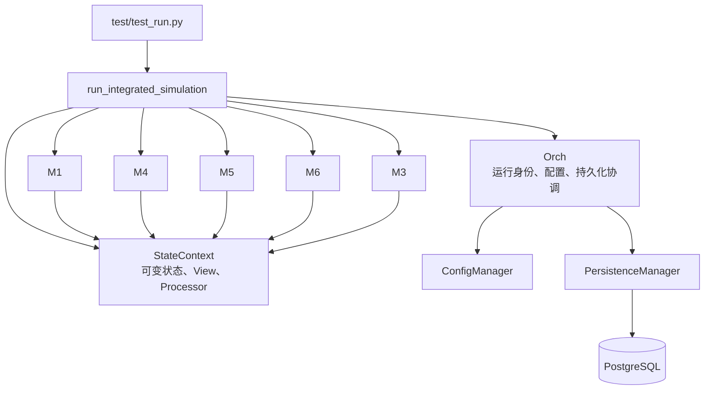
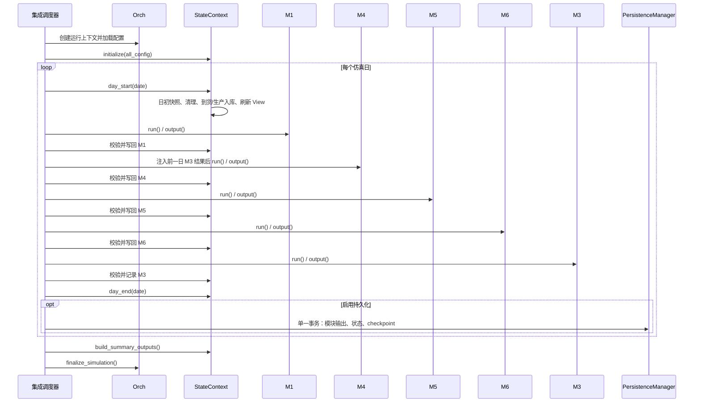

# ChainSight 1.0：系统导览、运行架构与维护手册

## 文档信息

| 项 | 内容 |
|---|---|
| 维护者 | 林宏南 |
| 文档版本 | Preview v1.0 |
| 最后更新 | 2026-08-21 |
| 文档状态 | Preview（持续重构中） |
| 适用范围 | `ChainSight-Decoupling` 重构后的集成链路 |

> **适用范围**：本文以重构后的集成链路为准，面向首次接触 ChainSight 的开发、实施和运维成员。业务模块的单项算法细节应继续参阅 `docs/modules/` 下的专项文档。
>
> **代码事实源**：`test/test_run.py`、`test/test_integration.py`、`src/core/orchestrator/`、`src/modules/state_context.py` 与五个模块的 `integration_refactor.py`。
>
> **版本说明**：当前实现以 ChainSight 1.0 为基础进行重构（refactor），重点包括集成链路性能提升，以及 M1 需求与发货逻辑调整。历史 legacy 代码仍保留，用于结果回归、问题追溯和逐步迁移；当前重构链路暂定为 Preview 版本，接口、交互方式和运行流程仍可能继续演进。
>
> **当前运行与调试入口**：当前重构链路通过 `test/test_run.py` 启动。该入口除执行集成仿真外，还提供测试隔离、内存运行、跳过 DQ、模块耗时日志和性能报告等调试接口，用于问题定位、性能分析与重构回归。

## 1. ChainSight 是什么

ChainSight 是一个供应链计划与日度离散仿真系统。它把配置中定义的需求、库存、生产资源、网络路径、运输约束和安全库存，放入按自然日推进的运行时中，计算客户需求满足、生产计划、网络部署、物流执行及物料净需求。

一个仿真日不是一次静态报表计算，而是一个完整的业务周期：

1. 以日初库存、在途和跨日计划为起点；
2. 处理当日需求、发货、生产、部署和运输；
3. 写入当日产生的业务状态；
4. 将日末状态作为下一自然日的输入。

### 1.1 业务闭环


| 模块 | 业务职责 | 关键结果 | 主要状态影响 | 主要下游 |
|---|---|---|---|---|
| M1 | 将预测与订单规则转为需求，安排客户发货与削减 | 订单、发货、削减、供需日志 | 客户发货记录；M5 所需的当日需求/订单事实 | M4、M5、M3、汇总 |
| M4 | 根据前一日 M3 净需求和产能约束制定生产计划 | 生产、超限、问题、换产、无约束计划 | 生产 backlog、生产收货、产线状态、已分配产能 | M5、后续日 M4 |
| M5 | 根据网络、库存和供需平衡生成部署计划 | 部署计划、未满足、库存日志、校验 | 开放调拨；仅当日有效的 Planning Facts | M6、M3 |
| M6 | 将可执行调拨转为车辆、发运、在途和到货 | 交付计划、车辆、卡车使用、未满足、校验 | 发货库存、在途、交付收货、调拨发运记录 | 下一日状态、M3 |
| M3 | 计算供应网络的物料净需求 | 净需求 | 按日期保存的 M3 净需求 | 下一自然日 M4 |

## 2. 新成员 30 分钟阅读路线

先理解“谁调度、谁持有状态、谁计算、谁持久化”，再进入算法实现。建议按以下顺序阅读：

1. [`test/test_run.py`](../../test/test_run.py)：命令行参数及集成入口；
2. [`test/test_integration.py`](../../test/test_integration.py)：对象组装、日度循环、结果校验和提交顺序；
3. [`src/core/orchestrator/models.py`](../../src/core/orchestrator/models.py)：权威模块顺序、结果合同和回归快照范围；
4. [`src/modules/state_context.py`](../../src/modules/state_context.py)：状态域、日初/日末、动态 View 和写回处理器；
5. [`src/core/orchestrator/new_orchestrator.py`](../../src/core/orchestrator/new_orchestrator.py)：运行身份、配置与持久化协调；
6. 五个 `integration_refactor.py`：依次阅读 M1、M4、M5、M6、M3 的领域实现和生命周期。

### 2.1 术语表

| 术语 | 含义 |
|---|---|
| `Orch` | `Orchestrator` 的公开别名；管理运行身份、配置生命周期、持久化协作，不保存可变业务状态。 |
| `StateContext` | 运行期可变业务状态的单一事实源（Single Source of Truth）。 |
| View | 由 `StateContext` 根据当前状态即时构建的 DataFrame；模块读取当日业务事实的统一入口。 |
| 模块结果合同 | 每个模块 `output()` 返回的最小 DataFrame 集合，由 `validate_module_result()` 校验。 |
| `run_id` | 一次运行的唯一标识，关联配置、模块结果、状态、事件、checkpoint 和汇总。 |
| checkpoint | 已完整提交的最后一个仿真日；是续跑的安全边界。 |
| Planning Facts | M5 为同日 M3 发布的网络、路径、需求等中间规划事实；不属于跨日持久状态。 |
| 持久化 | 将配置、模块结果、日度状态、运行事件和汇总写入 PostgreSQL。 |

## 3. 从命令到仿真：启动与初始化

当前重构链路的运行入口是 `test/test_run.py`，它同时承担集成执行与调试职责。示例：

```powershell
conda run --no-capture-output -n work python test/test_run.py `
  --config .\config\OC_Paste_S1_20251224.xlsx `
  --start-date 2025-12-15 --end-date 2025-12-19 `
  --no-persist --engine polars
```

### 3.1 常用参数

| 参数 | 说明 |
|---|---|
| `--config` | Excel 配置文件路径。 |
| `--start-date`、`--end-date` | 仿真的闭区间日期范围，格式为 `YYYY-MM-DD`。 |
| `--engine` | 计算后端：`pandas` 或 `polars`；集成入口默认 `polars`。 |
| `--test` | 使用隔离数据库 schema；默认 schema 为 `test`。 |
| `--test-schema` | 覆盖测试隔离 schema 名称。 |
| `--no-persist` | 不连接数据库、不落库，仅在内存中执行链路。 |
| `--skip-dq` | 跳过 Excel 配置的数据质量检测；仅用于受控集成或性能场景。 |
| `--verbose` | 输出模块内部的细粒度耗时日志。 |
| `--performance-report` | 写出结构化性能 JSON 的目标路径。 |
| `--run-mode` | 写入性能报告的运行方式标签，默认 `continuous`。 |

### 3.2 调试接口

`test/test_run.py` 当前提供以下调试能力，可按问题类型组合使用：

| 调试目标 | 接口 | 用途 |
|---|---|---|
| 隔离数据库影响 | `--test`、`--test-schema` | 将持久化写入测试 schema，避免影响常规运行数据。 |
| 排除持久化影响 | `--no-persist` | 仅在内存中运行，用于快速定位模块、状态流转或计算差异。 |
| 排除 DQ 耗时 | `--skip-dq` | 在受控配置下跳过数据质量检测，便于性能基线和计算链路诊断。 |
| 定位模块耗时 | `--verbose` | 输出模块内部逐步骤耗时日志。 |
| 沉淀性能证据 | `--performance-report`、`--run-mode` | 输出结构化性能报告，并标识本次运行模式。 |

### 3.3 初始化顺序

`run_integrated_simulation()` 的初始化具有明确边界：

1. 创建 `Orch`；
2. `ConfigManager` 加载系统 YAML，按需建立数据库连接和迁移表；
3. 从 Excel 读取 `all_config`，执行 DQ，必要时用 DQ 清洗后的表替换运行配置；
4. 确立 `config_name`、`run_id`、日期范围和随机种子；
5. 创建 `StateContext`，用 `M1_InitialInventory` 与 `Global_SpaceCapacity` 初始化库存和空间容量；
6. 创建 M1、M4、M5、M6、M3；
7. 对所有模块各调用一次 `prepare()`，加载静态配置；
8. 创建日度结果归档、集成 View 快照与可选的 `PerformanceTelemetry`。

模块的 `prepare()` 与 `run()` 必须分离：前者只准备静态数据，后者只计算当前日期。M5/M6 的门面明确禁止 `run()` 隐式调用 `prepare()`，避免逐日重复读取与验证静态配置。

## 4. 核心运行架构



### 4.1 集成调度器

`run_integrated_simulation()` 是当前重构链路的日度调度者。它负责：

- 按 `MODULE_EXECUTION_ORDER` 执行模块；
- 在每个模块后校验结果合同；
- 通过 `StateContext.apply_module_result()` 统一写回状态；
- 归档 Summary 所需的每日模块输出；
- 在日末更新状态、可选地原子持久化，并保存回归快照与性能事件。

它**不应**承载模块算法或手工修改库存、在途等状态。此类逻辑属于模块或 `StateContext`。

### 4.2 `Orch`

`Orch` 负责运行横切能力，而非领域计算：

- 读取 `config/defaults.yaml` 中的系统参数；
- 识别 `config_name`，生成或复用 `run_id`；
- 通过 `ConfigManager` 加载 Excel/数据库配置、执行 DQ、建立数据库连接并迁移表；
- 为模块按其 `schema` 分发所需配置；
- 通过 `PersistenceManager` 写配置、模块结果、日度状态、checkpoint 与 Summary；
- 检测未完成运行并提供续跑信息。

### 4.3 `StateContext`

`StateContext` 是所有可变业务状态的唯一拥有者。它负责：

- 保存库存、开放调拨、在途、生产/交付收货、发货记录和生产 backlog；
- 保存 M3 净需求、M4 产线状态与已分配产能等跨日数据；
- 从当前状态产生模块读取的动态 View；
- 将通过合同校验的模块输出转化为持久的内存状态改变；
- 管理 `initialize()`、`day_start()`、`day_end()` 和 Summary 所需的内存快照。

模块不应直接突变 `StateContext` 的库存、调拨或在途容器。它们返回 DataFrame，由调度器调用 `apply_module_result()` 统一写回；M3 保存净需求、M5 发布当日 Planning Facts 是有意保留的受控接口。

### 4.4 模块与基础设施的边界

每个业务模块遵循相同生命周期：

```python
module.prepare()  # 一次：静态配置与预计算
module.run()      # 每日：读取 View，计算当前日
result = module.output()
```

`ConfigManager` 只管理配置与 DQ；`PersistenceManager` 只管理数据库写入。业务状态不属于它们，业务算法也不属于 `Orch`。

## 5. 日度仿真生命周期

权威执行顺序定义在 `MODULE_EXECUTION_ORDER`：

```text
day_start → M1 → M4 → M5 → M6 → M3 → day_end
```



### 5.1 日初：`day_start()`

日初操作按以下顺序进行：

1. 保存期初非限制库存快照；
2. 清理超过宽限期的开放调拨，并记录审计数据；
3. 接收当天到货的在途运输，增加收货地库存并写入交付收货；
4. 将当天可用的历史生产 backlog 入库；
5. 基于更新后的状态刷新动态 View。

因此，模块读取到的是“到货、生产入库和清理已处理完成”的当日事实，而不是前一天的旧缓存。

### 5.2 M1：需求与客户发货

M1 根据需求预测、订单日历、AO、DPS、供货选择等配置产生订单与供需日志，并根据当前库存生成客户发货与削减。状态层随后：

- 用 `shipment_df` 扣减客户发货的库存并保留发货日志；
- 按日期保存 `supply_demand_df` 和订单事实，供 M5 使用。

### 5.3 M4：生产与前一日 M3 的严格一日滞后

M4 **只能**消费前一个自然日的 M3 净需求。调度器在运行 M4 前注入：

- `ctx.get_previous_m3_result(date_str)`；
- 前一日的产线状态；
- 历史已分配产能。

首日没有前一日 M3 结果时，状态层返回空的净需求合同。M4 的生产计划被写入 backlog；当 `available_date` 到达时，由日初步骤入库。M4 同时向状态层写回产线连续性和已分配产能，保证后续日期不会错误地重新分配资源。

### 5.4 M5：部署和同日 Planning Facts

M5 读取当日库存、需求、在途、生产及空间约束，输出网络部署计划。状态层只把满足库存约束、且发送与接收地点不同的可执行计划写入 `open_deployment`。

M5 还会发布仅当日有效的 Planning Facts，包含活动网络、路线、节点时间窗、直接需求、层级映射等。Planning Facts 在新一天的 `day_start()` 立即清空，不能作为跨日状态或数据库恢复数据使用。

### 5.5 M6：物流执行

M6 读取 M5 留在状态中的开放调拨和物流约束，产生交付计划、车辆日志、卡车使用、未满足与校验结果。之后 `StateContext.apply_delivery()`：

- 仅处理实际发运日等于当天的交付；
- 扣减开放调拨与发货地库存；
- 创建发运日志；
- 对未来到货创建在途记录；
- 对当天到货直接增加收货库存并生成交付收货。

### 5.6 M3：净需求与下一日反馈

M3 在 M6 之后运行，消费 M5 当日发布的 Planning Facts 以及 M6 写回后的供应状态，计算净需求。结果按 M3 产出日期保存；下一自然日才由 M4 读取。这个顺序同时保证：同日 M3 能看到物流执行后的事实，而 M4 仍保持一日滞后。

### 5.7 日末与提交

`day_end()` 会重新计算 View、保存期末库存快照及 Summary 所需快照。持久化启用时，以下操作位于同一个批量事务中：

1. 保存每个模块的输出；
2. 保存 `StateContext` 日末 View、审计和 M4 跨日状态；
3. 推进 checkpoint 到当前完整完成日。

任一步失败会回滚整个事务，所以 checkpoint 不会领先于完整的日度状态和模块输出。

## 6. 模块结果合同与状态写回

集成调度器对每一个模块执行下列固定协议：

```python
module.run()
result = module.output()
validate_module_result(module_id, result, date_str)
result["simulation_date"] = current_date
ctx.apply_module_result(module_id, result, date_str)
ctx.record_summary_module_result(module_id, result, date_str)
```

`src/core/orchestrator/models.py` 是结果合同的权威来源：

- `MODULE_EXECUTION_ORDER`：唯一的模块执行顺序；
- `MODULE_RESULT_DATAFRAMES`：模块必须提供的 DataFrame；
- `INTEGRATION_CONTEXT_VIEW_GETTERS`：日末集成回归要快照的状态 View。

### 6.1 必需 DataFrame

| 模块 | 必需输出 |
|---|---|
| M1 | `orders_df`、`shipment_df`、`cut_df`、`supply_demand_df`、`summary_df` |
| M4 | `production_df`、`exceed_log`、`issues_df`、`changeover_log`、`unconstrained_plan` |
| M5 | `deployment_plan`、`unfulfilled_log`、`stock_on_hand_log`、`validation_log` |
| M6 | `delivery_plan`、`vehicle_log`、`truck_usage`、`unsatisfied_log`、`validation_log`、`bypass_log` |
| M3 | `net_demand_df` |

所有必需字段必须存在且为 pandas `DataFrame`。模块可以额外返回统计或辅助字段，但不能删除或将合同字段替换成列表、字典或 Polars DataFrame。

### 6.2 写回规则

| 模块 | `StateContext.apply_module_result()` 的写回 |
|---|---|
| M1 | 发货扣库存；保存当日部署供需和订单输入。 |
| M4 | 保存产线状态与已分配产能；维护生产 backlog 和当天生产收货。 |
| M5 | 根据部署计划创建开放调拨，并以稳定排序生成业务 UID。 |
| M6 | 扣减开放调拨和库存，记录发运、在途及当天交付收货。 |
| M3 | 通过 M3 的受控接口按日期保存净需求，供下一日 M4 使用。 |

### 6.3 稳定性约束

以下规则属于兼容性合同，不可随意修改：

- 用 `stable_sort_for_output()` 或稳定 `mergesort` 维护可复现顺序；
- M5 写回开放调拨前须按物料、发货地、收货地、计划日期、需求元素、数量保持既定稳定排序；排序变化会改变 `ori_deployment_uid` 序号，从而影响 M6 的车辆关联；
- 业务标识符必须经过统一归一化；
- 随机行为必须由配置注入的模块种子控制；
- M4 只能读取前一个自然日 M3，不能读取当日 M3。

## 7. `StateContext`：状态、View 与跨日数据

### 7.1 主要状态域

| 状态域 | 内容与用途 |
|---|---|
| 库存 | `unrestricted_inventory` 是可用库存；另有初始、每日期初和每日期末库存快照。 |
| 开放调拨 | `open_deployment` 保存尚未完全发运的部署；聚合供给账本供 M5/M3 高效读取。 |
| 在途和收货 | `in_transit` 保存未来到货；`delivery_gr` 和 `production_gr` 记录交付与生产收货。 |
| 发运日志 | `shipment_log` 记录客户发货，`delivery_shipment_log` 记录调拨发运。 |
| 生产 backlog | `production_plan_backlog` 保存已计划、尚未到可用日或保留用于 M3 视图的生产。 |
| M3 跨日结果 | `m3_net_demand_by_date` 以 M3 产生日期为键保存净需求。 |
| M4 跨日状态 | `m4_line_states` 和 `m4_allocated_capacity` 维持换产连续性与产能分配。 |
| M5 同日事实 | `_planning_facts` 仅服务 M5→M3 的当日交接，不持久化。 |
| Summary 归档 | 每日模块结果深拷贝和状态快照，运行结束时派生全周期汇总。 |

### 7.2 View 的含义

View 是状态的派生读模型，不是另一份可变真相。它们包含期初库存、当前可用库存、生产/交付收货、在途、开放调拨、全量生产、客户发货、调拨发运、空间额度和生产 backlog 等。

模块应通过公开 getter 或在 `ctx.views` 中读取当前 View。日初与日末都重建 View：日初保证输入是新鲜的，日末保证持久化的是状态改变后的事实。

### 7.3 新增状态字段的完整路径

新增跨日业务状态时，不能只增加一个成员变量。至少要同时设计：

1. 初始化来源及默认值；
2. 哪个模块结果或处理器写入它；
3. 模块消费它的 View 或 getter；
4. `day_start()` 与 `day_end()` 行为；
5. 日度持久化映射；
6. checkpoint 恢复逻辑；
7. 集成快照和多日回归测试。

## 8. 配置、DQ、持久化与恢复

### 8.1 配置生命周期

Excel 是配置输入来源。`ConfigManager` 的流程如下：

1. 读取 `config/defaults.yaml`，获得数据库、引擎、共享参数和 DQ 设置；
2. 通过 `ConfigReader` 读取 Excel 为 `all_config`；
3. 有数据库时计算配置 hash、创建运行事件并检查已通过 DQ 的缓存；
4. 运行 DQ，必要时以 `cleaned_tables` 替换 `all_config`；
5. 未被阻断时写入 `cfg_*` 配置表，并落定运行事件中的 DQ 状态。

`--skip-dq` 会跳过检测，但在启用数据库时仍会先创建运行事件，以保证后续 checkpoint 与完成标记可用。

### 8.2 PostgreSQL 持久化

`enable_persistence=True` 时，数据库承担以下持久化职责：

- 配置与 DQ 运行信息；
- 日度模块输出；
- `StateContext` 的日末 View、库存变动、清理审计和运行日志；
- M4 跨日产线状态与已分配产能；
- checkpoint / `orch_run_event`；
- 全周期 `summary_*` 输出。

`--test` 使用隔离 schema，默认是 `test`；`--no-persist` 则跳过数据库连接、迁移和所有写入，适合内存回归或性能基线。

### 8.3 checkpoint 与续跑边界

checkpoint 的 `current_date` 表示**最后一个已完整完成并成功提交的自然日**。续跑规则为：

1. 查找相同 `config_name` 的未完成运行；
2. 复用原 `run_id`；
3. 从 `current_date` 的下一天重新运行 M1；
4. 从最后完整日的 View 恢复 `StateContext`；
5. 继续使用已保存的 M1 快照，以避免随机采样或准备阶段变化造成不一致。

不要在日初、单模块完成后或事务外推进 checkpoint。否则数据库可能宣称某日已完成，却没有相应的完整输出和状态，续跑将无法保证正确性。

### 8.4 Summary 的边界

Summary 是整个模拟期结束后的派生输出，不参与后续日期的业务计算，也不应被当作 checkpoint 恢复状态。状态层在每个模块合同校验后深拷贝必要结果，并在日末保存必要 View 快照；`build_summary_outputs()` 再依据这些归档形成全周期报表。

## 9. 性能观测与结果检查

设置 `--performance-report` 后，`PerformanceTelemetry` 会写出 JSON，记录：

- 日初与日末耗时；
- 每个模块的耗时和主输出行数；
- 每日持久化与 checkpoint 耗时；
- 全周期汇总耗时、按阶段/日期/模块的聚合耗时；
- 运行实现、模式、schema、`run_id` 和时间戳。

性能优化必须同时证明两件事：结果合同和跨日状态保持一致，以及性能报告显示真实收益。优先排查重复 View 构建、过度复制 DataFrame、非必要的逐行操作、开放调拨明细的线性增长与高频数据库提交。

一次运行的观察材料包括：模块日志、模块输出表、日末 View、清理/库存审计、运行事件、checkpoint、Summary 和性能 JSON。建议按照以下层次定位差异：

```text
配置与 DQ
  → 模块输入 View
  → 模块输出合同
  → StateContext 状态写回
  → 日末 View / 跨日状态
  → 数据库持久化与 checkpoint
```

## 10. 常见维护任务导航

| 维护任务 | 优先阅读/修改区域 | 首先确认 |
|---|---|---|
| 配置读取或 DQ 异常 | `ConfigManager`、`ConfigReader`、DQ 检查器 | 表名、列名、标识符归一化、清洗结果及阻断策略。 |
| M1/M4/M5/M6/M3 业务差异 | 对应模块的 `integration_refactor.py` 与 backend | 当日输入 View、输出合同、处理器写回。 |
| 从某日开始出现差异 | `StateContext.day_start()` 与前一日日末快照 | 到货、生产入库、开放调拨、M3/M4 跨日数据。 |
| M5/M6 单据关联异常 | `apply_deployment()`、`apply_delivery()` | 稳定排序、`ori_deployment_uid`、数量字段和发运日期。 |
| 结果未落库 | `PersistenceManager`、模块/状态注册表 | 输出 key、DataFrame 类型、表映射、事务是否成功。 |
| 续跑结果异常 | `Orch` 恢复检测、状态恢复和 M1 快照 | checkpoint 是否仅在完整日后推进、恢复日期是否正确。 |
| 新增模块 | `Module` 基类、`models.py`、调度器、状态处理器和注册表 | `prepare/run/output`、执行顺序、合同、写回、持久化与回归。 |
| 新增输出 | 模块 `output()`、`MODULE_RESULT_DATAFRAMES`、输出注册表 | DataFrame 合同、数据库映射、Summary/回归是否需要覆盖。 |
| 性能退化 | 模块 backend、`StateContext`、性能 JSON | 数据规模、重复计算、View 构建、DataFrame 转换、数据库批次边界。 |

## 11. 维护规则与最小验证清单

### 11.1 不变量

- 修改算法前，先确认输入来自哪个 View、状态归属在哪里、输出合同是什么；
- 模块计算应返回结果，状态改变应通过 `StateContext` 的统一处理器完成；
- 新增跨日状态必须同时考虑初始化、View、日初/日末、持久化和恢复；
- 修改结果字段必须同步维护合同、状态写回、输出注册表和比较逻辑；
- 日期逻辑、稳定排序、业务 UID 和随机种子是兼容性边界，修改后必须做多日回归；
- Planning Facts 只在同日有效，不能替代数据库恢复所需的运行状态；
- 每天的输出、状态和 checkpoint 必须原子提交。

### 11.2 最小验证顺序

1. 验证模块 `prepare/run/output` 与结果合同；
2. 验证单日集成调度和日末 View；
3. 验证多日状态流转，特别是 M3→下一日 M4、在途到货和生产 backlog；
4. 验证数据库持久化与输出映射；
5. 验证中断后的 checkpoint 与续跑；
6. 对性能改动复核结果一致性及性能 JSON。

## 12. 相关文档

- [文档索引](../INDEX.md)
- [系统架构概览](./architecture.md)
- [模块总览](../modules/modules.md)
- [测试框架设计](../testing/tests_framework_design.md)
- [环境与运行交接（已过时，后续将进一步进行交互开发）](../handover-overview/setup.md)
