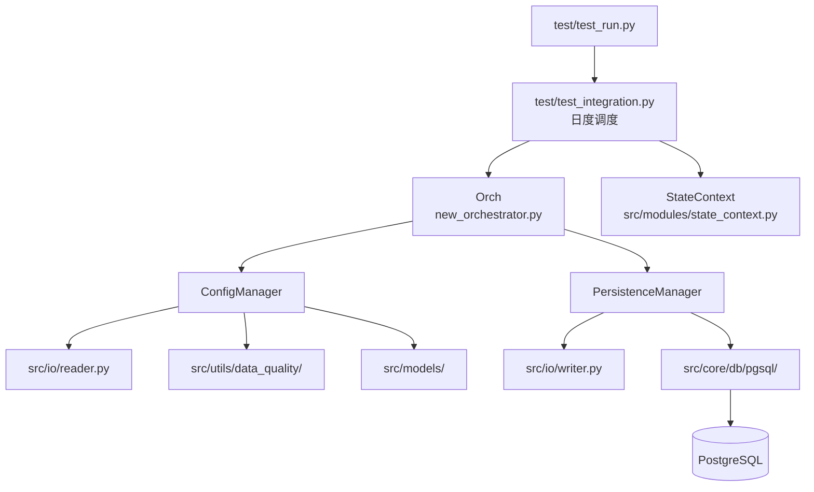
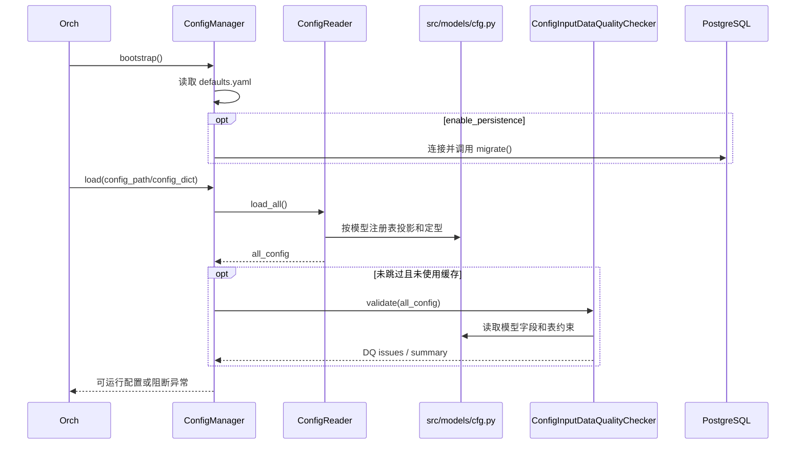

# ChainSight Core 详细说明（Refactor Preview）

## 文档信息

| 项 | 内容 |
|---|---|
| 维护者 | 林宏南 |
| 文档版本 | Preview v2.0 |
| 最后更新 | 2026-08-21 |
| 文档状态 | Preview，持续重构中 |
| 适用范围 | `src/core/` 与当前集成入口 |
| 目标读者 | 开发、测试、实施与运维人员 |

> **当前事实**：完整重构链路由 `test/test_run.py` 启动、`test/test_integration.py` 调度。Core 的当前运行协调器为 `src/core/orchestrator/new_orchestrator.py` 导出的 `Orch`，可变业务状态由 `src/modules/state_context.py` 持有。
>
> **legacy 边界**：`src/core/main_integration/`、`orchestrator_main.py` 及部分旧入口仍保留，用于兼容和回归。它们不是当前 Preview 集成链路的权威调度实现，不能将其中的 CSV 快照、旧 Orchestrator 状态归属或旧 CLI 行为直接当作现行事实。

---

## 1. Core 在重构架构中的位置



Core 在当前链路中负责运行横切能力：配置生命周期、运行身份、持久化、输出目录、schema 解析、种子和数据库基础设施。业务算法属于模块；库存、调拨、在途等可变状态属于 `StateContext`。

| 组件 | 核心职责 | 不负责 |
|---|---|---|
| `test/test_integration.py` | 日度顺序、结果合同校验、状态写回调用 | 领域算法和直接 DB 写入 |
| `Orch` | `run_id`、`config_name`、配置分发、协作者协调 | 可变业务状态 |
| `ConfigManager` | 配置读取、DQ、DB bootstrap、配置持久化 | 模块运行与状态持有 |
| `PersistenceManager` | 模块结果、状态 View、checkpoint、汇总写入 | 配置读取与 DQ |
| `StateContext` | 所有可变业务状态与动态 View | Core 的一部分以外的业务算法 |

---

## 2. 当前运行入口与调度

### 2.1 入口职责

`test/test_run.py` 是当前重构链路的运行/调试入口。它创建输出目录并将命令参数传给 `run_integrated_simulation()`，支持：

- `pandas` 或 `polars` 后端；
- `--test` / `--test-schema` 的数据库隔离；
- `--no-persist` 的内存运行；
- `--skip-dq` 的受控 DQ 跳过；
- `--verbose` 的模块内部耗时日志；
- `--performance-report` 与 `--run-mode` 的性能遥测。

### 2.2 日度流程

集成调度器在每个自然日执行：

```text
StateContext.day_start
  → M1 → M4 → M5 → M6 → M3
  → StateContext.day_end
  →（可选）原子持久化模块输出、状态和 checkpoint
```

模块顺序和结果合同定义在 `src/core/orchestrator/models.py`。M4 严格消费前一个自然日的 M3 结果，M5 的 Planning Facts 仅在当日 M5→M6→M3 链路内有效。

详细时序请参阅 [模块级时序图](module_sequence_diagrams.md)。

---

## 3. `orchestrator/`：运行协调而非业务状态

### 3.1 当前重构实现

| 文件 | 状态与职责 |
|---|---|
| `new_orchestrator.py` | **当前重构协调器**；定义 `Orchestrator`，对外别名为 `Orch` |
| `config_manager.py` | 配置、DQ、数据库连接与迁移、配置持久化 |
| `persistence_manager.py` | 日度模块输出、状态 View、checkpoint 和汇总持久化 |
| `models.py` | 模块执行顺序、结果合同、集成快照 View、`DeploymentUID` |

`Orch` 在创建时装配 `ConfigManager` 和 `PersistenceManager`。它拥有 `config_name`/`run_id`，向模块提供 `all_config`、系统参数和按模块 `schema` 过滤的数据，但不持有库存、在途或开放调拨。

### 3.2 legacy 兼容文件

`orchestrator_main.py`、`daily_ops.py`、`processors.py`、`views.py`、`persistence.py` 和 `inventory_log.py` 是旧状态型 Orchestrator 的组成部分，当前仍保留。新集成链路将相应业务状态职责迁移到 `StateContext`，因此新增功能不应优先写入这些旧处理器，除非修改目标明确是 legacy 回归链路。

### 3.3 配置与 DQ 生命周期



DQ 位于 `src/utils/data_quality/`。约束来源是 `src/models/cfg.py` 的 SQLAlchemy `Column.info` 和表元数据，包括非空、枚举、范围、日期字段、主键和表启用信息。DQ 只发现和记录问题，不承担业务数据转换或清洗；是否阻断运行由 `defaults.yaml` 的 `data_quality` 策略决定。

### 3.4 持久化与续跑

`PersistenceManager.batch_transaction()` 将一个自然日的模块输出、`StateContext` View、审计数据和 checkpoint 合并到同一事务。任一步异常会回滚，checkpoint 不会领先于完整状态。

续跑时 `Orch` 查找未完成运行、复用其 `run_id`；`StateContext.initialize()` 从持久化 View 恢复最后完整日状态，调度器从下一自然日继续运行。

---

## 4. Legacy 与兼容性 `src/core/` 包

### 4.1 `main_integration/`

该包包含历史主集成入口及共享辅助能力：

| 文件 | 当前定位 |
|---|---|
| `seed.py` | 当前重构 `Orch` 使用的模块随机种子设置能力 |
| `simulation_file.py` / `simulation_db.py` | legacy 文件/数据库主循环实现 |
| `cli.py`、`config_loader.py`、`production_runner.py`、`resume.py`、`runtime_state.py`、`memory_store.py`、`db_helpers.py` | legacy 或共享辅助实现，保留用于兼容、回归与逐步迁移 |

当前 Preview 集成调度不通过 `simulation_file.py` 或 `simulation_db.py` 执行完整日度循环。新增重构行为应优先落在 `test/test_integration.py`、`Orch`、`StateContext` 与模块重构入口中。

### 4.2 `run/`

`src/core/run/` 提供传统运行入口和目录/数据库辅助能力：

| 文件 | 职责 |
|---|---|
| `run_main.py` | 传统运行入口与参数分发 |
| `config_dir.py` | 从 Excel 路径解析项目化配置目录及 CSV 覆盖关系 |
| `output_dir.py` | 创建输出目录；当前 `test/test_run.py` 复用其 `_ensure_output_dir()` |
| `schema_resolver.py` | 按项目解析 PostgreSQL schema |
| `db_config.py` / `db_runner.py` | 传统数据库运行辅助 |
| `local_writer.py` / `utils.py` | 本地写入与通用辅助 |

`run/` 仍是可维护组件，但当前 refactor 完整链路以 `test/test_run.py` 为入口。后续交互开发完成前，不应将传统 CLI 描述为 Preview 链路的唯一或默认入口。

### 4.3 `db/pgsql/`

`src/core/db/pgsql/` 是当前集成持久化使用的 PostgreSQL `DB` 封装。`ConfigManager` 用它建立连接与执行迁移；`PersistenceManager` 经 `src/io/writer.py` 的 `DBWriter` 使用其 DataFrame/COPY 写入能力。

表模型和注册表在 `src/models/`，而 SQLAlchemy Engine/Session 基础能力在 `src/db/`。当前主写入路径仍是 `core/db/pgsql` 的 psycopg 封装，不应误认为已完全切换为 SQLAlchemy Session 写入。

### 4.4 `parallel_executor/`

该包提供通用并行执行工具：`ParallelExecutor`、`ParallelTaskResult` 和便捷函数。它可用于无共享写冲突的任务分组，但当前完整重构日度链路必须按 `M1 → M4 → M5 → M6 → M3` 串行推进，不能将这些模块直接并行化。

任何并行化改动须满足：任务之间没有共享状态写冲突，合并顺序确定，并在结果合同、`StateContext` 日末 View 和多日回归上验证一致性。

---

## 5. Core 维护规则

1. 不将业务状态重新写回 `Orch`；库存、开放调拨、在途、生产 backlog 和跨日模块状态归 `StateContext`。
2. 不绕开结果合同直接写数据库；持久化应经 `PersistenceManager`、注册表和 `DBWriter`。
3. 新配置字段要同步考虑 `src/models/cfg.py`、`ConfigReader`、模型驱动 DQ 和模块 `schema`。
4. 新增跨日状态要同时设计 View、日初/日末、持久化、恢复和多日回归。
5. checkpoint 只能在一个自然日的输出与状态完整提交后推进。
6. 旧 `main_integration` / 旧 Orchestrator 的修改需要标明是 legacy 兼容还是重构主链路变更。

## 6. 相关文档

- [重构架构总览](architecture.md)
- [模块级时序图](module_sequence_diagrams.md)
- [ChainSight 1.0 运行与维护手册](chainsight-1.0.md)