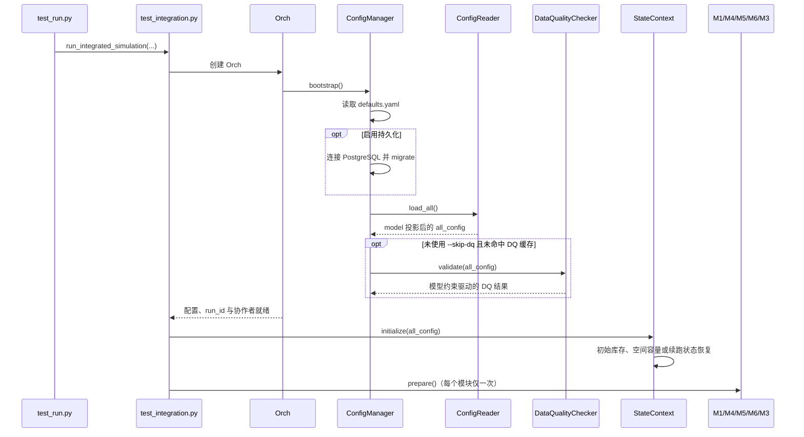
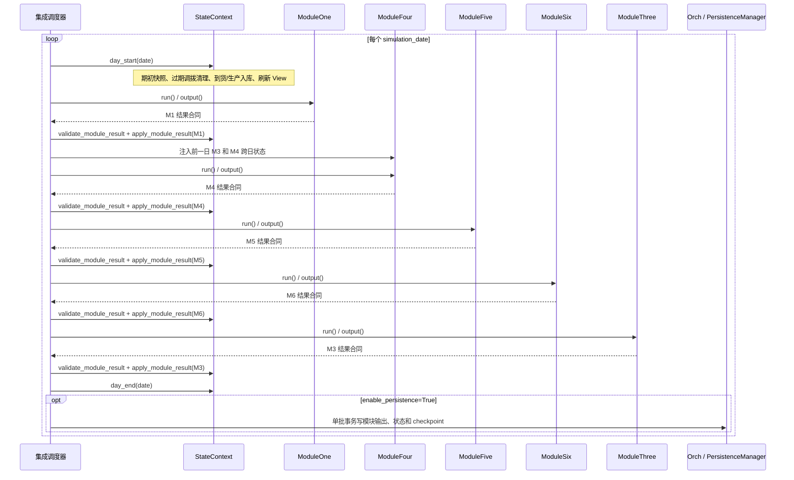
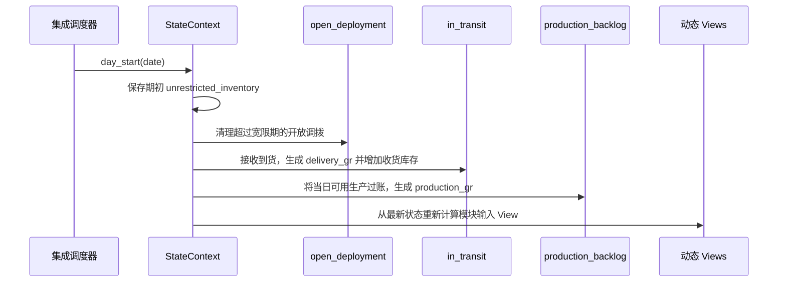
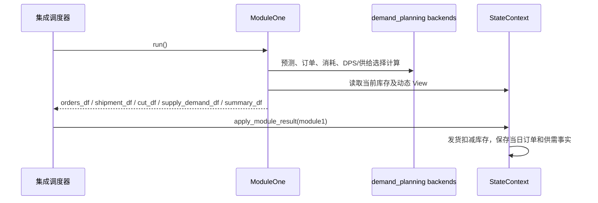
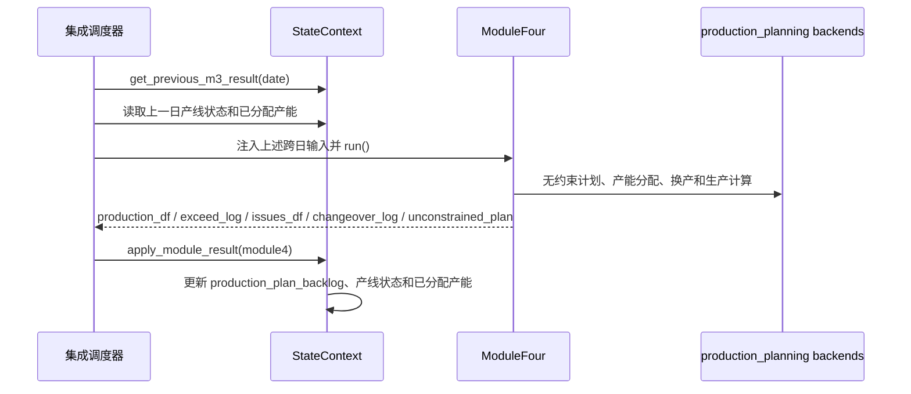
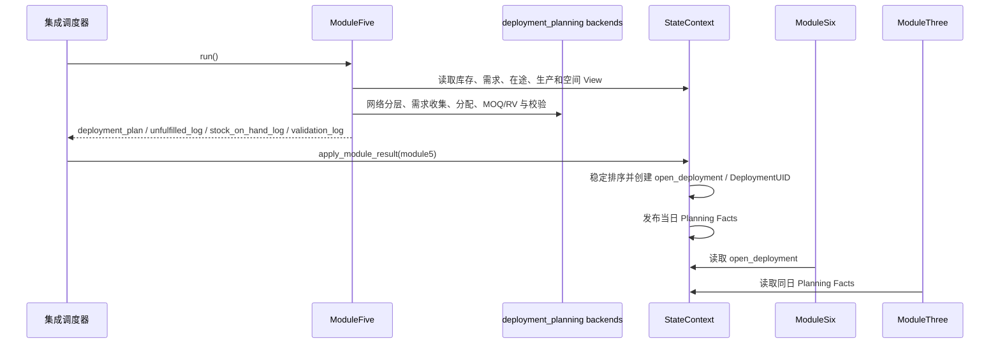
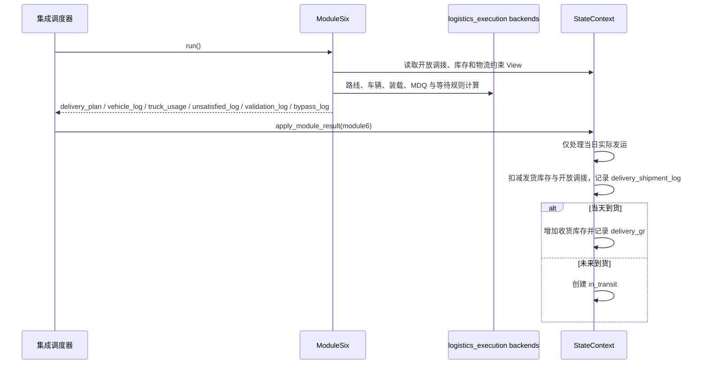
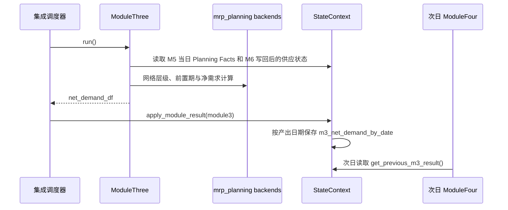
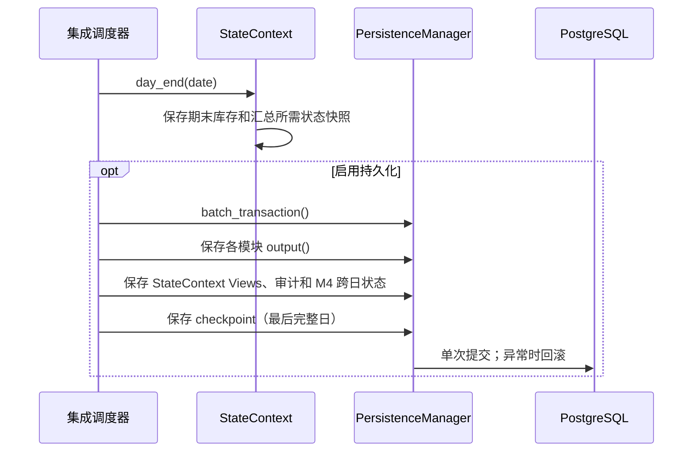

# ChainSight 模块级时序图（Refactor Preview）

## 文档信息

| 项 | 内容 |
|---|---|
| 维护者 | 林宏南 |
| 文档版本 | Preview v2.0 |
| 最后更新 | 2026-08-21 |
| 文档状态 | Preview，随重构链路持续更新 |
| 适用范围 | `test/test_run.py`、`test/test_integration.py`、`src/modules/` |

> **版本说明**：本文描述当前以 `StateContext` 为状态单一事实源的重构集成链路。legacy 的 `main_integration`、旧 `Orchestrator` 状态处理和 CSV 快照流程仍保留用于兼容与回归，但不是本文的当前运行事实。
>
> **当前入口**：完整链路由 `test/test_run.py` 启动，并调用 `test/test_integration.py` 的 `run_integrated_simulation()`。该入口支持测试 schema、内存运行、DQ 跳过、模块耗时日志和性能报告等调试参数。

---

## 1. 阅读说明

本文说明重构链路每天按什么顺序执行、模块如何通过结果合同写回状态，以及哪些数据可以跨日使用。模块内部算法实现位于各业务包的 `integration_refactor.py` 和 `backends.py`；本文不替代专项算法设计文档。

权威模块顺序定义在 `src/core/orchestrator/models.py`：

```text
day_start → M1 → M4 → M5 → M6 → M3 → day_end
```

---

## 2. 启动与初始化时序



### 2.1 初始化约束

- `ConfigReader` 按 `src/models/cfg.py` 的模型注册表投影配置字段；同名 CSV 可覆盖 Excel sheet。
- `ConfigInputDataQualityChecker` 从模型字段和表元数据中读取非空、枚举、范围、日期及主键约束，负责发现并记录问题；是否阻断由 `data_quality` 配置决定。
- `prepare()` 只用于静态配置、索引和预计算；模块的 `run()` 不应隐式重复执行 `prepare()`。

---

## 3. 每日总时序



每个模块完成后，调度器先校验输出合同，再调用 `StateContext.apply_module_result()` 统一写回。模块本身不应直接修改库存、在途或开放调拨容器。

---

## 4. 日初状态处理



日初完成后，M1 至 M3 读取到的是已处理到货、生产入库和过期调拨清理后的当日状态。

---

## 5. M1：需求与客户发货



M1 的订单、发货、削减和供需日志均是结果合同的一部分。`shipment_df` 的库存影响仅在状态层受控处理。

---

## 6. M4：生产与严格一日滞后



M4 只能消费前一个自然日 M3 的净需求。首日没有前一日 M3 结果时，状态层提供空合同；M4 产生的未来生产会保存在 backlog，待可用日到达后由后续 `day_start()` 入库。

---

## 7. M5：部署与当日 Planning Facts



Planning Facts 只为同日 M5→M6→M3 数据交接而存在；新一天的 `day_start()` 会清空它们，且它们不会替代可恢复的跨日状态。

---

## 8. M6：物流执行、在途与到货



M6 的 `ori_deployment_uid` 与车辆关联依赖 M5 写回时的稳定排序；该排序和业务 UID 是回归兼容性边界。

---

## 9. M3：净需求与次日反馈



这保证了同日 M3 能看到物流执行后的事实，同时 M4 仍保持严格一日滞后。

---

## 10. 日末、持久化与续跑



checkpoint 只表示已经完整提交的最后一个仿真日。续跑复用原 `run_id`，从该日期的下一天开始，并从已持久化 View 恢复 `StateContext`。

---

## 11. 调试与排障顺序

建议用 `test/test_run.py` 的 `--no-persist`、`--test`、`--test-schema`、`--skip-dq`、`--verbose` 和 `--performance-report` 组合定位问题，并按以下路径追踪：

```text
配置读取 / 模型驱动 DQ
  → 日初 View
  → 模块结果合同
  → StateContext 写回
  → 日末 View 和跨日状态
  → PostgreSQL 持久化与 checkpoint
```

## 12. 相关文档

- [重构架构总览](architecture.md)
- [ChainSight 1.0 运行与维护手册](chainsight-1.0.md)
- [Core 详细说明](core.md)