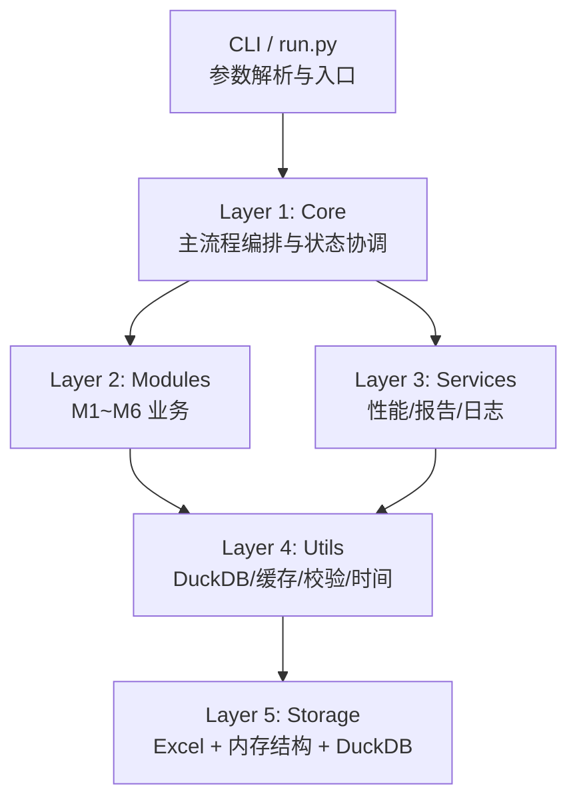
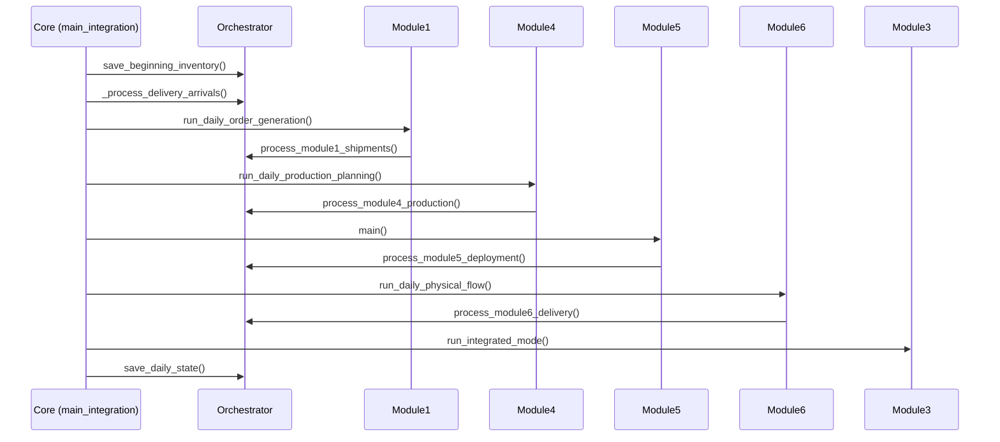
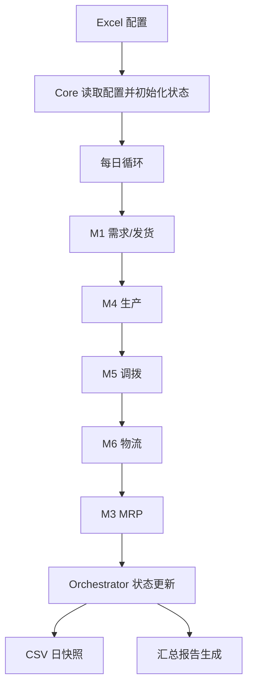
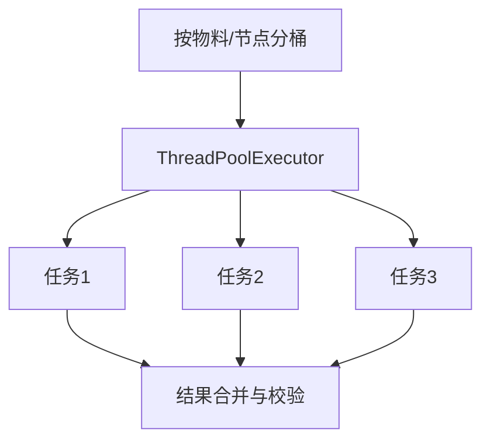
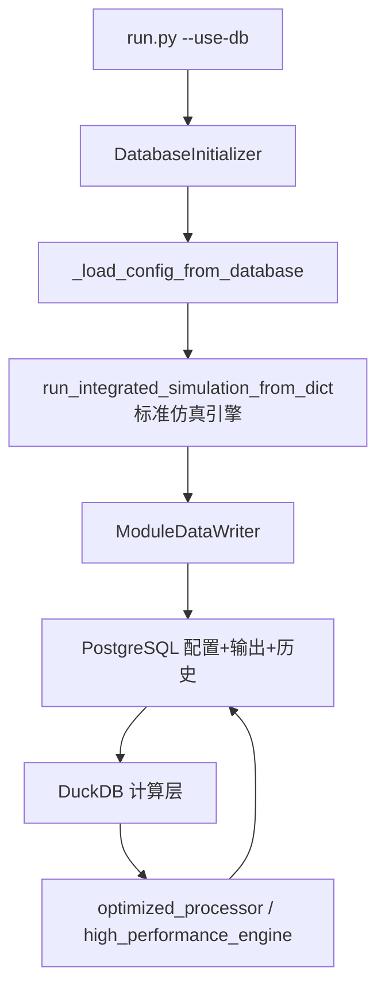
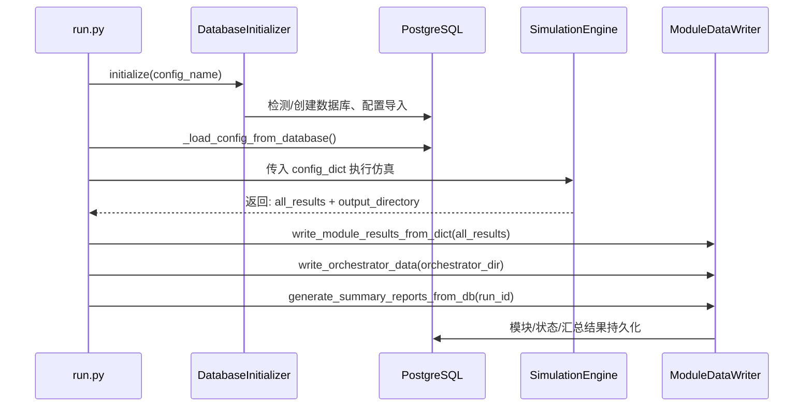
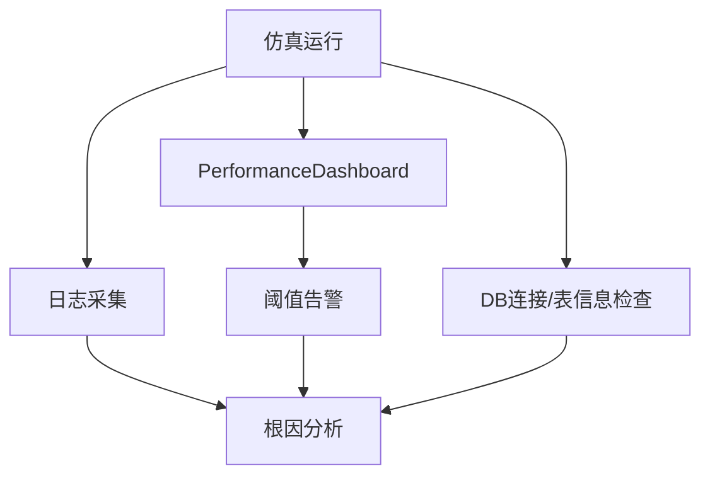
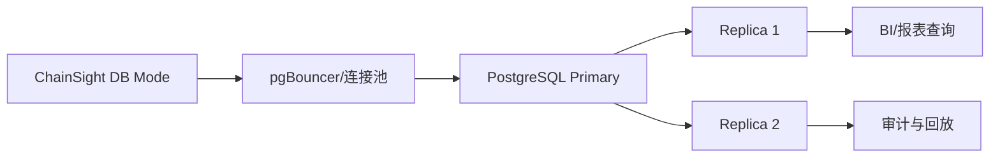

# ChainSight 架构设计文档（本地版 + 数据库版）

## 文档信息

| 项 | 内容 |
|---|---|
| 文档版本 | v3.2 |
| 最后更新 | 2026-04-10 |
| 编写人 | 陈显跃 |
| 适用代码库 | `src/`（本地版）+ `pgsql_db/`（数据库版） |
| 目标读者 | 架构师、后端开发、DBA、算法工程师、测试工程师、交付团队 |

> **第三阶段更新说明**（2026-04-10）：  
> `main_integration.py`、`orchestrator.py`、`run.py` 等单体文件已删除，当前 Core 层全部由包目录实现。  
> `module1.py`～`module6.py` 已删除，业务模块通过子包访问。  
> 以下架构描述中提及这些旧文件名的地方，应理解为对应的包目录（如 `src/core/main_integration/`）。

---

# 第一部分：本地版架构（src/）


| 项 | 内容 |
|---|---|
| 文档版本 | v3.0 |
| 最后更新 | 2026-03-05 |
| 适用代码库 | `src/`（本地文件模式） |
| 目标读者 | 架构师、后端开发、算法工程师、测试工程师、交付团队 |
| 关联文档 | `docs/00_文档编写指南和计划.md`、`README_CN.md` |

---

## 1. 架构概述

ChainSight 本地版是一个面向供应链计划仿真的日度离散执行系统。系统以“中央编排 + 模块化计算 + 工具化加速 + 多形态存储”为核心思想，支持从 Excel 配置启动完整仿真，输出跨模块结果和管理报表。

### 1.1 五层架构图



### 1.2 各层职责说明

| 层级 | 代表组件 | 核心职责 | 关键非功能特性 |
|---|---|---|---|
| CLI 层 | `src/core/run/` 包（`run_main.py`） | 参数解析、模式选择、入口调用 | 低耦合、无业务逻辑 |
| Core 层 | `src/core/main_integration/`、`src/core/orchestrator/`、`src/core/parallel_executor/` 三个包 | 日度主循环、跨模块编排、全局状态维护 | 可恢复、可追踪、可重放 |
| Modules 层 | `src/modules/*` + 五大子包 | 需求/生产/MRP/调拨/物流等业务算法 | 可替换、可扩展、可独立测试 |
| Services 层 | `performance_profiler.py`、`summary_report_generator.py`、`logger_config.py` | 诊断、报告、日志治理 | 透明观测、标准输出 |
| Utils 层 | `memory_data_store.py`、`duckdb_accelerator.py`、`simulation_cache.py` 等 | 性能加速、校验、缓存、时间管理 | 高吞吐、低延迟、线程安全 |
| Storage 层 | Excel 文件、内存字典/列表、DuckDB 内存库 | 配置输入、状态快照、过程与结果持久化 | 可审计、可恢复、格式兼容 |

### 1.3 架构设计原则

1. **编排与算法分离**：Core 负责“何时执行”，Module 负责“如何计算”。
2. **状态单一事实源（SSOT）**：`Orchestrator` 维护跨模块共享状态，避免重复账本。
3. **按日增量执行**：每个仿真日形成可独立核对的输入、处理、输出闭环。
4. **性能优先但不破坏可读性**：优先使用向量化、DuckDB、缓存；保留可解释执行轨迹。
5. **本地模式可迁移**：设计上保留与数据库版对齐的数据边界和接口语义。

---

## 2. 第1层：Core 核心编排层

Core 层是本地版架构的控制中枢，核心实现位于三个包：`src/core/main_integration/`、`src/core/orchestrator/`、`src/core/parallel_executor/`。

### 2.1 `main_integration/` 包：主流程编排

`run_integrated_simulation()` 是全局入口，承担以下职责：

- 读取并校验配置（时间范围、模块参数、场景参数）；
- 初始化 `Orchestrator` 与初始库存状态；
- 判断是否可断点续跑（读取 orchestrator 快照目录）；
- 按日驱动模块执行并回写状态；
- 仿真结束后触发一致性校验与汇总报告。

**代码示例 1：日度主循环（简化版）**

```python
def run_daily_cycle(orchestrator, current_date):
    orchestrator.save_beginning_inventory(current_date)
    orchestrator.cleanup_past_due_open_deployments(current_date)
    orchestrator._process_delivery_arrivals(current_date)

    load_current_date_production_gr(orchestrator, current_date)

    m1_result = M1.run_daily_order_generation(...)
    orchestrator.process_module1_shipments(m1_result, current_date)

    m4_result = run_module4_integrated(...)
    orchestrator.process_module4_production(m4_result, current_date)

    m5_result = M5.main(...)
    orchestrator.process_module5_deployment(m5_result, current_date)

    m6_result = M6.run_daily_physical_flow(...)
    orchestrator.process_module6_delivery(m6_result, current_date)

    M3.run_integrated_mode(...)

    orchestrator.save_ending_inventory(current_date)
    orchestrator.output_daily_inventory_summary(current_date)
    orchestrator.save_daily_state(current_date)
```

### 2.2 核心执行时序



### 2.3 `orchestrator/` 包：全局状态控制器

`Orchestrator` 采用“中央状态管理器”模型，维护库存、在途、开放调拨、历史流水、按日索引等关键对象。

| 状态域 | 核心字段 | 结构 | 作用 |
|---|---|---|---|
| 库存域 | `unrestricted_inventory` | `Dict[(material, location) -> float]` | 当前可用库存账本 |
| 调拨域 | `open_deployment` | `Dict[uid -> dict]` | 未完成调拨需求池 |
| 在途域 | `in_transit` | `Dict[transit_uid -> dict]` | 运输中订单跟踪 |
| 产能域 | `space_quota` | `Dict[(location, date) -> float]` | 站点/产线可用空间容量 |
| 生产历史 | `production_gr` | `List[dict]` + 日期索引 | 生产收货过账 |
| 交付历史 | `delivery_gr` | `List[dict]` + 日期索引 | 到货过账 |
| 发货历史 | `shipment_log`、`delivery_shipment_log` | `List[dict]` + 日期索引 | 客户发货与调拨发运记录 |

`DeploymentUID` 用于保证调拨记录可追踪、可回放、可幂等。

**代码示例 2：部署唯一键结构（简化版）**

```python
@dataclass(frozen=True)
class DeploymentUID:
    material: str
    sending: str
    receiving: str
    planned_deploy_date: str
    demand_element: str
    sequence: int = 0

    def to_string(self) -> str:
        return (
            f"{self.material}|{self.sending}|{self.receiving}|"
            f"{self.planned_deploy_date}|{self.demand_element}|{self.sequence}"
        )
```

### 2.4 `parallel_executor/` 包：并行执行机制

并行执行器封装了 `ThreadPoolExecutor`，用于承载“可并发且无共享写冲突”的任务。运行时可通过 `CHAINSIGHT_PARALLEL` 开关控制是否启用并发。

| 组件 | 说明 |
|---|---|
| `ParallelExecutor` | 提交任务、汇总结果、统一异常处理 |
| `ParallelTaskResult` | 任务名、状态、耗时、异常、返回值 |
| 环境开关 | `CHAINSIGHT_PARALLEL=true/false` |
| 适用场景 | 多物料分组计算、独立分区求解、并行预处理 |

**代码示例 3：并行任务提交（示意）**

```python
with ParallelExecutor(max_workers=4, enabled=True) as executor:
    futures = [
        executor.submit(f"bucket_{i}", run_bucket, bucket_df)
        for i, bucket_df in enumerate(buckets)
    ]
    results = executor.gather(futures)

for r in results:
    if not r.success:
        raise RuntimeError(f"task={r.task_name}, error={r.error}")
```

### 2.5 状态管理机制

Core 层状态管理遵循四个原则：

1. **单写入口**：模块结果统一由 `orchestrator.process_module*()` 写入状态；
2. **按日快照**：每日循环结束固化 10 类 CSV，支持断点恢复；
3. **事件留痕**：生产、交付、发货、库存变更均保留历史流水；
4. **后置核对**：全周期结束后通过 `InventoryBalanceChecker` 进行账平校验。

---

## 3. 第2层：Modules 业务模块层

业务语义上系统覆盖 M1~M6 六个模块，其中 **M2 规则能力以内嵌策略落地在 M1 子流程中**。`src/modules/` 目录中的公开入口以 M1、M3、M4、M5、M6 为主。

### 3.1 模块结构与入口函数

| 模块 | 包路径 | 入口函数 | 核心输出 |
|---|---|---|---|
| M1 需求与发货计划 | `src/modules/demand_planning/` | `run_daily_order_generation()` | 客户订单发货建议、需求日志 |
| M2 供给策略（内嵌） | M1 子流程 | `apply_supply_choice()` 等 | 源点选择、分配策略结果 |
| M3 MRP 计划 | `src/modules/mrp_planning/` | `run_integrated_mode()` | 分层补货需求、计划订单 |
| M4 生产排程 | `src/modules/production_planning/` | `run_daily_production_planning()` | 产线生产计划、换型信息 |
| M5 调拨规划 | `src/modules/deployment_planning/` | `main()` | 调拨建议、节点供需平衡结果 |
| M6 物流执行 | `src/modules/logistics_execution/` | `run_daily_physical_flow()` | 车辆装载、发运与到货结果 |

### 3.2 模块依赖关系


### 3.3 数据输入输出矩阵

| 模块 | 关键输入 | 关键输出 | 写回 Orchestrator |
|---|---|---|---|
| M1 | 当日需求、可用库存、供给策略、服务水平参数 | 客户发货记录、欠交记录、需求日志 | `shipment_log`、库存扣减 |
| M3 | BOM、前置期、MOQ/RV、当前库存、在途与开放需求 | 计划订单、补货建议 | 计划数据供后续日使用 |
| M4 | 产能、换型矩阵、生产优先级、缺料状态 | 生产计划、生产 GR | `production_gr`、库存增加 |
| M5 | 节点需求、网络关系、调拨约束、在途信息 | 调拨计划（open deployment） | `open_deployment`、调拨发运准备 |
| M6 | 调拨计划、运输参数、车辆容量、延迟分布 | 发运记录、到货记录、在途更新 | `in_transit`、`delivery_gr` |

### 3.4 执行顺序与同步机制

1. **固定顺序**：M1 -> M4 -> M5 -> M6 -> M3；
2. **同步点**：每个模块完成后必须调用对应 `process_module*()`；
3. **一致性约束**：模块只返回业务结果，不直接写全局状态；
4. **时间一致性**：所有模块通过统一日期上下文运行，避免跨日污染。

### 3.5 模块层设计收益

- 业务策略可独立迭代（例如更换调拨算法不影响 Core）；
- 模块可单测与回归（输入稳定、输出可比）；
- 支持按模块定位性能瓶颈（M5/M3 常见热点）；
- 便于迁移到数据库版或分布式执行框架。

---

## 4. 第3层：Services 业务服务层

Services 层为主流程提供“可观察性 + 可交付性 + 可诊断性”，不参与核心业务决策。

### 4.1 服务组件说明

| 服务 | 文件 | 主要职责 | 典型产物 |
|---|---|---|---|
| 性能分析服务 | `src/services/performance_profiler.py` | 采集函数级耗时与调用栈 | `.prof` / 文本统计报告 |
| 报告生成服务 | `src/services/summary_report_generator.py` | 汇总生成 8 类业务报告 | 订单履约、产能超限、换型、库存历史等 |
| 日志服务 | `src/utils/logger_config.py` | 控制台+文件双通道日志，重定向 print | 结构化日志、调试日志 |

### 4.2 性能分析服务

`PerformanceProfiler` 采用上下文管理器封装 `cProfile`，支持“开启即采样、关闭即输出”。

- 输出按 `cumulative` / `calls` / `time` 多维排序；
- 可使用 `@profile_function` 定位单函数热点；
- 适用于 M3/M5 等计算密集模块回归。

### 4.3 报告生成服务

`SummaryReportGenerator.generate_all_reports()` 在仿真结束后统一生成报告，避免主流程中断。

报告类型覆盖：

1. 订单发运切分报告（order_shipment_cut）
2. 产能超限报告（exceed_capacity）
3. 换型报告（changeover）
4. 调拨计划报告（deployment_plan）
5. 生产计划报告（production_plan）
6. 交付计划报告（delivery_plan）
7. 车辆使用报告（truck_usage）
8. 历史库存报告（historical_inventory）

### 4.4 日志服务

`DualLogger` 使用控制台 INFO + 文件 DEBUG 双通路模式，兼顾运行可读性和深度排障。

- `PrintRedirector` 捕获遗留 `print()` 输出，统一写入日志体系；
- 支持按模块前缀快速过滤；
- 配合日度快照可完成问题重放。

---

## 5. 第4层：Utils 优化工具层

Utils 层是本地版性能提升的关键。其核心目标是：减少 I/O、减少重复计算、减少 Python 循环、提升数据访问局部性。

### 5.1 关键工具总览

| 工具 | 文件 | 关键能力 | 性能价值 |
|---|---|---|---|
| DuckDB 加速器 | `src/utils/duckdb_accelerator.py` | 分组过滤、聚合、日期窗口查询 | 降低 pandas 循环开销 |
| 内存数据存储 | `src/utils/memory_data_store.py` | DuckDB `:memory:` 表存取 | 替代高频 Excel 临时读写 |
| 仿真缓存 | `src/utils/simulation_cache.py` | 网络索引、前置期缓存、安全库存索引 | 降低重复查表与重复 join |
| 配置校验器 | `src/utils/config_validator.py` | 全局+模块+跨模块一致性校验 | 提前发现脏配置、避免运行期失败 |
| 时间管理器 | `src/utils/time_manager.py` | 仿真日期统一推进与格式化 | 防止日期漂移和跨模块不一致 |

### 5.2 DuckDB 加速设计

`DuckDBAccelerator` 将常见 DataFrame 操作转为 DuckDB SQL 执行，适合中大规模数据（例如多物料-多节点-多日场景）。

- `batch_filter_by_material_location(df, pairs)`：批量过滤替代逐对循环；
- `aggregate_by_groups()`：统一聚合模板，减少重复代码；
- `filter_date_range()`：按时间窗口批量切片。

### 5.3 MemoryDataStore 设计

`MemoryDataStore` 为线程安全单例，底层连接 DuckDB 内存库，表命名规则为 `{module}_{sheet}_{yyyymmdd}`。

**代码示例 4：模块输出写入内存库（示意）**

```python
store = MemoryDataStore.get_instance()
store.enable(memory_limit="8GB", threads=8)

store.write_module_output(
    module="module5",
    sheet="deployment_plan",
    date_str="20260131",
    df=deployment_df,
)

cached_df = store.read_module_output(
    module="module5",
    sheet="deployment_plan",
    date_str="20260131",
)
```

根据工具内置基准，10K 行级别场景可实现数量级加速：写入约 50x、读取约 100~600x。

### 5.4 SimulationCache 设计

缓存对象聚焦“高频查找、低频更新”数据：

- 网络索引：`(material, location) -> sourcing`；
- PTF/LSK 索引：`(material, location) -> (ptf, lsk)`；
- 前置期缓存：`(sending, receiving) -> (pdt, gr, mct)`；
- 配置索引：MOQ/RV、安全库存等。

缓存初始化通常在仿真启动阶段完成，之后按需命中并统计 hit/miss，用于持续优化。

### 5.5 配置验证与时间管理

- `ConfigValidator.validate_all_configurations()`：统一调度 7 类校验（全局、M1~M6、跨模块）；
- `SimulationTimeManager`：提供 `get_current_date()`、`advance()`、`get_file_date_string()` 等时间 API；
- 两者共同保证“配置正确 + 时间一致”，降低运行中断概率。

---

## 6. 第5层：Storage 存储层

本地版采用“Excel 配置输入 + 内存状态承载 + DuckDB 计算中间层 + CSV 快照归档”的复合存储策略。

### 6.1 存储形态与用途

| 存储形态 | 典型位置 | 用途 | 读写特征 |
|---|---|---|---|
| Excel | 输入配置目录、输出报表目录 | 参数配置、业务结果交付 | 人工友好、随机读写成本高 |
| Python 内存结构 | `Orchestrator` 内部对象 | 仿真运行时状态 | 低延迟、进程内有效 |
| DuckDB 内存库 | `MemoryDataStore`、`DuckDBAccelerator` | 向量化分析与中间数据缓存 | 高吞吐、SQL 友好 |
| CSV 日快照 | `output/.../orchestrator/` | 审计、恢复、重放 | 成本低、可追踪 |

### 6.2 Excel 文件读写设计

Excel 在本地版承担“配置输入接口 + 报告输出接口”双角色：

- 对业务用户友好，便于维护主数据、参数和计划约束；
- 与历史流程兼容，降低项目切换成本；
- 通过工具层减少中间态 Excel 读写频率，避免 I/O 成为瓶颈。

### 6.3 DuckDB 关系型中间存储

DuckDB 在本地版不作为长期主库，而作为高性能计算引擎：

- 以内存模式承载临时表；
- 使用 SQL 批处理大规模过滤/聚合；
- 通过 Arrow/Pandas 快速桥接模块数据。

---

## 7. 数据流设计

### 7.1 端到端数据流图



### 7.2 日度循环数据阶段

| 阶段 | 输入 | 处理 | 输出 |
|---|---|---|---|
| 日初准备 | 前一日末状态、在途信息 | 到货入库、过期调拨清理 | 日初库存账本 |
| 需求与发货 | 客户需求、库存可用量 | 分配与扣减 | 发货记录、欠交记录 |
| 生产与调拨 | 产能约束、网络约束、节点需求 | 排程与调拨决策 | 生产 GR、开放调拨 |
| 物流执行 | 调拨指令、运输规则 | 发运、延迟采样、到货更新 | 在途更新、交付 GR |
| MRP收尾 | BOM、前置期、库存状态 | 补货与计划订单计算 | 次日计划需求 |
| 持久化 | 当日全量状态 | 快照、日志、报表 | CSV 与 Excel 输出 |

### 7.3 数据转换与标准化规则

| 字段 | 规则 | 示例 |
|---|---|---|
| `material` | 去除 `.0` 后缀并去空格 | `"1234.0" -> "1234"` |
| `location` | 纯数字左填充至 4 位 | `"123" -> "0123"` |
| `sending` | 与 `location` 一致 | `"5" -> "0005"` |
| `receiving` | 与 `location` 一致 | `"ABC1" -> "ABC1"` |

规则统一在数据读取与模块接口边界执行，避免同义主键导致的连接失败或重复统计。

---

## 8. 状态管理设计

状态管理设计目标是“可追踪、可恢复、可对账”。

### 8.1 库存状态管理

库存核算遵循统一平衡式：

`期末库存 = 期初库存 + 生产GR + 调拨到货GR - 客户发货 - 调拨发运`

`InventoryBalanceChecker` 在日度与周期级别执行校验，识别账差来源并输出诊断信息。

### 8.2 历史记录维护

系统保存四类核心历史：

1. 生产收货历史（`production_gr`）
2. 交付到货历史（`delivery_gr`）
3. 客户发货历史（`shipment_log`）
4. 调拨发运历史（`delivery_shipment_log`）

同时维护按日索引（`*_by_date`），将“全表扫描”降为“日期定点访问”。

### 8.3 快照与恢复机制


### 8.4 日快照文件清单

| 文件名模式 | 说明 |
|---|---|
| `unrestricted_inventory_YYYYMMDD.csv` | 可用库存快照 |
| `open_deployment_YYYYMMDD.csv` | 开放调拨快照 |
| `planning_intransit_YYYYMMDD.csv` | 在途调拨快照 |
| `space_quota_YYYYMMDD.csv` | 空间/容量快照 |
| `delivery_gr_YYYYMMDD.csv` | 交付收货历史 |
| `production_gr_YYYYMMDD.csv` | 生产收货历史 |
| `shipment_log_YYYYMMDD.csv` | 客户发货历史 |
| `delivery_shipment_log_YYYYMMDD.csv` | 调拨发运历史 |
| `inventory_change_log_YYYYMMDD.csv` | 库存变动流水 |
| `daily_logs_YYYYMMDD.csv` | 日志摘要 |

---

## 9. 性能设计

本地版性能设计聚焦三条主线：**计算加速、数据缓存、执行并行**。

### 9.1 DuckDB 内存模式原理

DuckDB 以内存执行列式算子，对过滤、聚合、排序等分析型操作具备显著优势：

- 列式访问降低不必要字段加载；
- 向量化执行减少 Python 解释器开销；
- SQL 计划优化提升复杂查询吞吐。

### 9.2 缓存策略

| 缓存类型 | 生命周期 | 更新策略 | 典型收益 |
|---|---|---|---|
| 配置索引缓存 | 场景级 | 启动构建、场景切换重建 | 减少重复 join/merge |
| 网络与前置期缓存 | 场景级 | 主数据变化时重建 | 降低路径查找开销 |
| 模块中间结果缓存 | 日级 | 每日覆写/追加 | 降低重复 I/O |
| 日期索引缓存 | 全周期 | 增量追加 | 历史访问 O(1) |

### 9.3 并行执行设计



并行任务必须满足两个条件：

1. 任务间无共享写冲突；
2. 合并阶段具备确定性（稳定排序、主键幂等）。

### 9.4 关键性能指标（参考基准）

| 指标 | 传统 Excel 路径 | 优化后路径 | 量级改进 |
|---|---|---|---|
| 10K 行写入 | ~800ms | ~16ms | 约 50x |
| 10K 行读取 | ~1200ms | ~2ms | 约 100~600x |
| 30天全流程仿真 | ~135min | ~38min | 约 3.5x |

> 注：具体性能随硬件、数据分布、并发配置而变化，建议在目标环境复测。

---

## 10. 扩展点和集成

### 10.1 如何添加新模块

推荐采用“模块内实现 + `src/modules` 门面 + Core 接口接入”三步法：

1. 在 `src/modules/<new_domain>/` 实现算法与数据结构；
2. 在对应子包（如 `src/modules/demand_planning/`、`production_planning/` 等）提供稳定入口函数；
3. 在 `main_integration/simulation_file.py` 新增执行点与 `orchestrator.process_moduleX_*()` 写回逻辑。

**代码示例 5：新增模块门面接口（示意）**

```python
def run_daily_new_module(
    current_date: str,
    orchestrator,
    config: dict,
) -> dict:
    """返回结构化结果，禁止直接修改全局状态。"""
    result = compute_new_logic(current_date, orchestrator, config)
    return {
        "date": current_date,
        "records": result,
        "metrics": {"count": len(result)},
    }
```

### 10.2 如何集成外部系统

集成建议采用“适配器层”模式，不直接侵入 Core/Modules：

- **输入集成**：ERP/WMS/TMS 主数据通过预处理转换为标准 Excel 或中间表；
- **输出集成**：报告和快照通过定时任务推送到数据仓库或消息总线；
- **控制集成**：运行参数由外部调度平台注入 CLI 参数。

### 10.3 如何定制算法

1. 在模块内部替换策略函数（如优先级函数、分配函数、延迟采样分布）；
2. 保持输入输出协议不变，避免影响 Core 编排；
3. 通过回归基准和库存平衡校验验证算法替换安全性。

### 10.4 架构边界声明

本文件覆盖 `src/` 本地版架构，不包含 `pgsql_db/` 的事务、连接池与数据库一致性细节。数据库版架构将单独在 `docs/architecture_db.md` 说明。

---

## 附录 A：关键文件索引

| 层级 | 路径 |
|---|---|
| Core | `src/core/main_integration/`（13 个文件，入口：`simulation_file.py`、`simulation_db.py`） |
| Core | `src/core/orchestrator/`（9 个文件，入口：`orchestrator_main.py`） |
| Core | `src/core/parallel_executor/`（4 个文件，入口：`parallel_executor_main.py`） |
| Core | `src/core/run/`（7 个文件，入口：`run_main.py`） |
| Modules | `src/modules/demand_planning/`、`mrp_planning/`、`production_planning/`、`deployment_planning/`、`logistics_execution/` 五个子包 |
| Services | `src/services/performance_profiler.py`、`src/services/summary_report_generator.py` |
| Utils | `src/utils/memory_data_store.py`、`src/utils/duckdb_accelerator.py`、`src/utils/simulation_cache.py`、`src/utils/config_validator.py`、`src/utils/time_manager.py`、`src/utils/defaults.py`、`src/utils/normalization.py` |
| Config | `config/defaults.yaml`（YAML 参数默认值） |
| Tools | `tools/regression_compare.py`（输出回归对比工具） |

## 附录 B：术语

| 术语 | 说明 |
|---|---|
| GR | Goods Receipt，收货过账 |
| MRP | Material Requirements Planning，物料需求计划 |
| MOQ | Minimum Order Quantity，最小起订量 |
| RV | Rounding Value，取整值 |
| PTF/LSK | 供应链计划中的关键策略参数 |
| SSOT | Single Source of Truth，单一事实源 |

---

# 第二部分：数据库版架构（pgsql_db/）


| 项 | 内容 |
|---|---|
| 文档版本 | v1.0 |
| 最后更新 | 2026-03-05 |
| 适用范围 | `python -m src.core.run --use-db` + `pgsql_db/` |
| 目标读者 | 架构师、后端工程师、DBA、算法工程师、运维团队 |
| 相关文档 | `docs/ARCHITECTURE.md`（本地版）、`docs/00_文档编写指南和计划.md` |

---

## 1. 架构概述

ChainSight 数据库版是在本地版仿真引擎基础上的“企业级数据持久化增强架构”。核心策略是：

1. 配置与输出统一落库 PostgreSQL，支持多场景并行管理；
2. DuckDB 作为高性能计算引擎，承担向量化计算与批处理；
3. 仿真主流程保持与本地版一致，保证业务结果口径稳定。

### 1.1 PostgreSQL + DuckDB 混合架构图



### 1.2 与本地版的核心差异

| 维度 | 本地版（`src/`） | 数据库版（`src + pgsql_db`） |
|---|---|---|
| 配置来源 | Excel 文件 | PostgreSQL `cfg_*` 表（带 `config_name`） |
| 输出落地 | 本地 CSV/XLSX | PostgreSQL `module*`/`orchestrator*`/`summary*` |
| 中间计算 | pandas + DuckDB内存 | pandas + DuckDB + PostgreSQL混合查询 |
| 场景隔离 | 目录隔离 | `run_id` + `config_name` + `sim_date` |
| 数据恢复 | 文件快照恢复 | 数据库查询回放 + 可选文件日志 |

### 1.3 架构边界

- **已实现主路径**：数据库读取配置 -> 标准仿真引擎执行 -> 数据写回 PostgreSQL；
- **可选增强路径**：`optimized_simulation.py`、`high_performance_engine.py`、`duckdb_integration.py` 提供高性能计算能力；
- **当前一致性策略**：数据库模式默认使用标准仿真引擎，优先保证与本地版结果一致性。

---

## 2. 数据库层设计

数据库层采用“统一结构表 + 元数据字段区分场景”的设计，不按配置文件复制一套物理表。

### 2.1 逻辑表域划分

| 表域 | 前缀/示例 | 作用 | 主过滤键 |
|---|---|---|---|
| 配置表域 | `cfg_global_network`、`cfg_m1_demandforecast` | 存储仿真输入配置 | `config_name`、`config_type` |
| 模块输出表域 | `module1_output_orderlog` 等 | 存储模块逐日明细输出 | `run_id`、`sim_date` |
| Orchestrator 状态表域 | `orchestrator_unrestricted_inventory` 等 | 存储跨模块全局状态轨迹 | `run_id`、`file_date`、`sim_date` |
| Summary 表域 | `summary_output_*` | 存储汇总报表结果 | `run_id`、时间区间 |

### 2.2 统一表命名与映射

`table_mapping.py` 定义了 Excel Sheet 到 PostgreSQL 表的统一映射：

- 配置表通过 `get_config_table_name()` 统一命名为 `cfg_*`；
- 输出表通过 `OUTPUT_TABLE_MAPPING` 映射到模块输出/状态/汇总表；
- 必需配置表（如 `global_network`、`m1_demandforecast`）用于运行前检查。

### 2.3 元数据字段设计

`DatabaseConnection.create_table_from_df()` 在写入时统一追加元数据列：

| 字段 | 来源 | 用途 |
|---|---|---|
| `config_name` | 配置导入阶段 | 区分 BC/OC/不同场景 |
| `config_type` | `ExcelImporter` 推导 | 快速筛选配置类别（BC/OC/OTHER） |
| `db_write_time` | 写入时自动追加 | 审计与追踪 |
| `run_id` | 运行写入阶段 | 区分不同仿真批次 |
| `sim_date` / `file_date` | 模块与Orchestrator写入阶段 | 支持日级查询与回放 |

### 2.4 索引策略

数据库层实现了自动索引创建策略（字段级启发式）：

- BTREE：`material`、`location`、`sending`、`receiving`、`date`、`simulation_date` 等；
- HASH：`run_id`（等值过滤）。

建议在生产环境补充复合索引：

1. `(run_id, sim_date, material, location)` 用于模块逐日分析；
2. `(config_name, material, location)` 用于配置筛选与回归比对；
3. `(run_id, file_date)` 用于 Orchestrator 快照回放。

### 2.5 分区设计

当前实现以逻辑键（`run_id`、`sim_date`）完成“软分区”。面向大规模生产推荐升级为 PostgreSQL 原生分区：

| 场景 | 推荐分区策略 | 说明 |
|---|---|---|
| 高频写入模块输出 | `LIST(run_id)` + 子分区 `RANGE(sim_date)` | 保证单批次运行隔离，提升清理效率 |
| 历史汇总表 | `RANGE(month(sim_date))` | 降低长期归档成本 |
| 配置表 | 非分区或按 `config_type` 轻分区 | 配置体量通常较小 |

### 2.6 写入性能考虑

`db_connection.py` 的写入路径以 COPY 为核心：

1. DataFrame 类型对齐（TEXT/DOUBLE/BIGINT/TIMESTAMP）；
2. `COPY ... FROM STDIN` 批量写入；
3. 单事务提交减少频繁 fsync；
4. 表结构不兼容时自动补列（兼容新增字段）。

---

## 3. 连接和会话管理

### 3.1 连接生命周期

`DatabaseConnection` 使用延迟连接模式：

- 初始化仅保存参数，不立即创建连接；
- 首次访问时 `connect()` 建立连接；
- 连接由 `close()` 明确关闭；
- `DatabaseInitializer` 统一负责启动阶段的数据库存在性检查与自动创建。

### 3.2 会话与事务模型

`get_cursor(commit=True)` 提供统一事务边界：

- 成功路径自动 `commit`；
- 异常路径自动 `rollback`；
- `commit=False` 用于纯查询或外层事务控制。

**代码示例 1：统一游标事务边界（简化）**

```python
with db.get_cursor(commit=True) as cursor:
    cursor.execute("INSERT INTO ...", params)

with db.get_cursor(commit=False) as cursor:
    cursor.execute("SELECT * FROM ...")
    rows = cursor.fetchall()
```

### 3.3 COPY 写入事务管理

批量写入使用 `conn.transaction()` 包裹，确保“整批成功或整批回滚”。

**代码示例 2：COPY 批量写入（简化）**

```python
copy_sql = 'COPY "module1_output_orderlog" (material, location, qty) FROM STDIN'
with conn.transaction():
    with conn.cursor() as cursor:
        with cursor.copy(copy_sql) as cp:
            for row in records:
                cp.write_row(row)
```

### 3.4 隔离级别与并发控制

| 事务场景 | 当前行为 | 建议隔离级别 |
|---|---|---|
| 配置读取 | 事务内读取 | `READ COMMITTED` |
| 模块结果批量写入 | 单事务 COPY | `READ COMMITTED`（高吞吐） |
| 关键比对/审计查询 | 一致性读取 | `REPEATABLE READ` |
| 跨批次运维清理 | 按 `run_id` 删除 | `READ COMMITTED` + 明确过滤 |

并发控制核心依赖：

1. `run_id` 作为批次隔离键；
2. `truncate_output_tables(run_id=...)` 仅清理目标运行数据；
3. 表结构自动补齐，降低并发版本差异导致的写入失败。

### 3.5 连接池扩展建议

当前实现为单连接模式。高并发部署建议接入 `psycopg_pool`：

- 读写分离（只读查询池 + 写入池）；
- 池大小按 CPU 核数与并行任务比例设置；
- 引入超时、重试和连接健康探测。

---

## 4. 数据同步机制

数据库版同步机制覆盖三条路径：**Excel->PostgreSQL 配置同步、内存结果->PostgreSQL 输出同步、DuckDB->PostgreSQL 计算结果同步**。

### 4.1 配置同步：Excel -> PostgreSQL

启动时由 `DatabaseInitializer.initialize()` 执行：

1. 检测数据库是否存在，不存在则自动创建；
2. 检测目标 `config_name` 是否已入库；
3. 若缺失，使用 `ExcelImporter.import_excel_file()` 导入；
4. 所有配置进入统一 `cfg_*` 表，并带 `config_name/config_type`。

### 4.2 运行时主同步链路



### 4.3 内存结果同步：DataFrame -> PostgreSQL

`ModuleDataWriter.write_module_results_from_dict()` 将内存中的每日模块结果直接落库：

- 自动映射模块输出键到目标表名；
- 自动补充 `sim_date` 与 `run_id`；
- 空 DataFrame 也创建表结构，保证下游查询稳定。

`write_orchestrator_data()` 则从 `orchestrator/*.csv` 合并写入状态表，并补充 `file_date/sim_date/run_id`。

### 4.4 DuckDB 结果同步：DuckDB -> PostgreSQL

两种典型模式：

1. `OptimizedDataProcessor.attach_postgres()`：DuckDB 直接附加 PostgreSQL，减少中间复制；
2. `DuckDBProcessor.DataTransfer`：DuckDB SQL 处理后 DataFrame 回写 PostgreSQL。

### 4.5 增量同步机制

`incremental_processor.py` 提供变化检测与增量计算基础：

- 通过主键哈希识别新增/修改/删除；
- 仅重算受影响的物料-地点组合；
- 支持检查点（Parquet）保存与恢复。

该机制适用于高频重跑场景，可显著减少重复计算成本。

---

## 5. 高性能计算层

数据库版的高性能层由 DuckDB 驱动，强调“向量化 + 批处理 + 混合查询 + 可回退”。

### 5.1 组件职责

| 组件 | 文件 | 角色 |
|---|---|---|
| 计算核心 | `high_performance_engine.py` | 整合批量计算、增量计算、并行执行 |
| 数据处理器 | `optimized_processor.py` | DuckDB 向量化 SQL、索引缓存、PostgreSQL attach |
| 模块引擎 | `module_engine.py` | 将模块热点计算改为批量向量化 |
| 集成桥接 | `duckdb_integration.py` | DuckDB/Pandas 双实现切换与回退 |
| 优化运行器 | `optimized_simulation.py` | 高性能仿真包装与性能统计 |

### 5.2 高性能计算流程


### 5.3 核心优化手段

1. **预建索引**：在仿真启动和日切阶段构建 `network/leadtime/deploy_config` 索引；
2. **向量化计算**：净需求、MOQ/RV、优先级分配采用 SQL 批量处理；
3. **增量重算**：仅对变化键集合重算，避免全量扫描；
4. **并行执行**：`ThreadPoolExecutor`/`ProcessPoolExecutor` 支持批任务并发。

### 5.4 回退与稳定性

`with_duckdb_fallback()` 装饰器支持自动降级：DuckDB 出错时可回退到 pandas 实现，确保仿真不中断。

**代码示例 3：DuckDB 自动回退（简化）**

```python
@with_duckdb_fallback("net_demand")
def calc_net_demand(df, _use_duckdb=False):
    if _use_duckdb:
        return calc_with_duckdb(df)
    return calc_with_pandas(df)
```

### 5.5 与标准仿真引擎的关系

数据库模式默认仍走 `run_integrated_simulation_from_dict`，保持与文件模式相同业务逻辑路径。高性能引擎用于可控场景的性能增强和实验性优化，不直接替代主口径执行链路。

---

## 6. 数据一致性保证

### 6.1 ACID 与事务边界

- PostgreSQL 提供原生 ACID 保障；
- 写入通过上下文事务管理，失败自动回滚；
- COPY 批量写入在单事务中完成，避免部分成功状态。

### 6.2 结构一致性

`create_table_from_df()` 提供结构治理能力：

1. 动态类型映射（标识符优先 TEXT）；
2. 表结构兼容性检查；
3. 缺失列自动 `ALTER TABLE ADD COLUMN`；
4. 空表可先建结构再写数据。

### 6.3 业务一致性控制

| 控制点 | 实现机制 | 目标 |
|---|---|---|
| 配置隔离 | `config_name/config_type` | 多场景共库不串数 |
| 运行隔离 | `run_id` | 多批次并行分析可追踪 |
| 时间隔离 | `sim_date/file_date` | 日度回放与同比分析 |
| 库存对账 | `InventoryBalanceChecker`（主流程后置校验） | 保证库存平衡关系成立 |
| 配置校验 | `ConfigValidator` | 运行前拦截不合法配置 |

### 6.4 错误恢复策略

1. 单表写入失败不影响数据库可用性；
2. 通过 `run_id` 可执行重写和回放；
3. 通过 `db_write_time` 可进行时序审计；
4. 可结合 Orchestrator 状态表重建任意运行日状态。

---

## 7. 监控和诊断

### 7.1 性能监控仪表盘

`performance_dashboard.py` 提供模块级和日级监控：

- 模块调用次数、总耗时、均值、错误率；
- 日度总耗时、处理记录数、吞吐；
- 阈值告警（warning/critical）。

### 7.2 运行健康检查

| 检查项 | 方法 | 输出 |
|---|---|---|
| 数据库连通性 | `test_connection()` | 连接状态、版本、连接时延 |
| 库存表健康 | `get_table_info()` | 列结构、行数、空值风险 |
| 可用配置检查 | `get_available_configs()` | 可运行配置清单 |
| 写入结果审计 | `ModuleDataWriter.print_summary()` | 已写入表和行数 |

### 7.3 性能对比诊断

`duckdb_integration.py` 提供 A/B 对比工具：

1. `performance_comparison()`：单次运行统计；
2. `run_ab_comparison()`：多轮测试均值/方差/加速比。

### 7.4 诊断链路图



### 7.5 生产环境建议

- 启用 PostgreSQL `pg_stat_statements` 跟踪慢 SQL；
- 建立 `run_id` 维度的运行 SLA 看板；
- 对关键表设置写入延迟与行数突变告警；
- 保留 DB 日志与应用日志的统一时间戳标准。

---

## 8. 扩展和集群

### 8.1 分布式扩展路径

1. **计算扩展**：将模块计算任务拆分为多 Worker（队列驱动）；
2. **存储扩展**：对输出大表做分区+归档，冷热分层；
3. **查询扩展**：按分析负载增加只读副本；
4. **管道扩展**：将 `ModuleDataWriter` 写入改为异步批处理。

### 8.2 高可用参考架构



### 8.3 落地建议

| 阶段 | 目标 | 关键动作 |
|---|---|---|
| Phase A | 单机稳定 | 完成索引、备份、监控、慢查询治理 |
| Phase B | 中等并发 | 引入连接池、读写分离、分区表 |
| Phase C | 企业级 | 多副本高可用、任务队列、自动故障转移 |

---

## 附录：关键文件索引

| 目录 | 文件 |
|---|---|
| 入口编排 | `src/core/run/`（包入口：`run_main.py`） |
| DB连接与写入 | `pgsql_db/db_connection.py`、`pgsql_db/module_data_writer.py` |
| 初始化与导入 | `pgsql_db/db_initializer.py`、`pgsql_db/excel_importer.py` |
| 映射与模式 | `pgsql_db/table_mapping.py`、`pgsql_db/table_schemas.py` |
| 高性能计算 | `pgsql_db/optimized_processor.py`、`pgsql_db/high_performance_engine.py`、`pgsql_db/duckdb_integration.py` |
| 监控诊断 | `pgsql_db/performance_dashboard.py` |

---

# 第三部分：版本对比与迁移指南

## 3.1 架构对比表

| 维度 | 本地版（src/） | 数据库版（src + pgsql_db） |
|---|---|---|
| 配置来源 | Excel 文件 | PostgreSQL `cfg_*` 表（带 `config_name`） |
| 输出落地 | 本地 CSV/XLSX | PostgreSQL `module*`/`orchestrator*`/`summary*` |
| 中间计算 | pandas + DuckDB 内存 | pandas + DuckDB + PostgreSQL 混合查询 |
| 场景隔离 | 目录隔离 | `run_id` + `config_name` + `sim_date` |
| 数据恢复 | 文件快照恢复 | 数据库查询回放 + 可选文件日志 |
| 并发能力 | 单进程仿真 | 支持 PostgreSQL 连接池扩展 |
| 扩展性 | 受限于本地磁盘 | 支持分布式数据库扩展 |
| 适用场景 | 快速原型、单用户仿真 | 多场景并行、企业级数据管理 |

## 3.2 共同设计原则

1. **编排与算法分离**：Core 负责"何时执行"，Module 负责"如何计算"。
2. **状态单一事实源（SSOT）**：`Orchestrator` 或数据库表维护跨模块共享状态。
3. **按日增量执行**：每个仿真日形成可独立核对的输入、处理、输出闭环。
4. **性能优先但不破坏可读性**：优先使用向量化、DuckDB、缓存。
5. **API 接口对齐**：本地版与数据库版的模块接口保持兼容。

## 3.3 迁移指南（本地版 → 数据库版）

1. **配置迁移**：使用 `DatabaseInitializer.initialize()` 导入 Excel 配置到 PostgreSQL。
2. **接口迁移**：保持 `run_integrated_simulation_from_dict()` 调用不变，仅改变数据来源。
3. **输出迁移**：从 CSV 输出改为数据库写入（`ModuleDataWriter.write_module_results_from_dict()`）。
4. **验证迁移**：对比本地版与数据库版的关键输出（订单、生产、调拨、库存）。
5. **回滚准备**：保留本地版运行日志和快照，必要时可快速回退。

---

# 附录

## 附录 A：关键文件索引

### 本地版文件索引

| 层级 | 路径 |
|---|---|
| Core | `src/core/main_integration/`（13 个文件，入口：`simulation_file.py`、`simulation_db.py`） |
| Core | `src/core/orchestrator/`（9 个文件，入口：`orchestrator_main.py`） |
| Core | `src/core/parallel_executor/`（4 个文件，入口：`parallel_executor_main.py`） |
| Core | `src/core/run/`（7 个文件，入口：`run_main.py`） |
| Modules | `src/modules/demand_planning/`、`mrp_planning/`、`production_planning/`、`deployment_planning/`、`logistics_execution/` 五个子包 |
| Services | `src/services/performance_profiler.py`、`src/services/summary_report_generator.py` |
| Utils | `src/utils/memory_data_store.py`、`src/utils/duckdb_accelerator.py`、`src/utils/simulation_cache.py`、`src/utils/config_validator.py`、`src/utils/time_manager.py`、`src/utils/defaults.py`、`src/utils/normalization.py` |
| Config | `config/defaults.yaml`（YAML 参数默认值） |
| Tools | `tools/regression_compare.py`（输出回归对比工具） |

### 数据库版文件索引

| 目录 | 文件 |
|---|---|
| 入口编排 | `src/core/run/`（包入口：`run_main.py`） |
| DB连接与写入 | `pgsql_db/db_connection.py`、`pgsql_db/module_data_writer.py` |
| 初始化与导入 | `pgsql_db/db_initializer.py`、`pgsql_db/excel_importer.py` |
| 映射与模式 | `pgsql_db/table_mapping.py`、`pgsql_db/table_schemas.py` |
| 高性能计算 | `pgsql_db/optimized_processor.py`、`pgsql_db/high_performance_engine.py`、`pgsql_db/duckdb_integration.py` |
| 监控诊断 | `pgsql_db/performance_dashboard.py` |

## 附录 B：术语

| 术语 | 说明 |
|---|---|
| GR | Goods Receipt，收货过账 |
| MRP | Material Requirements Planning，物料需求计划 |
| MOQ | Minimum Order Quantity，最小起订量 |
| RV | Rounding Value，取整值 |
| PTF/LSK | 供应链计划中的关键策略参数 |
| SSOT | Single Source of Truth，单一事实源 |
| run_id | 数据库版本中区分不同仿真批次的唯一标识 |
| config_name | 数据库版本中区分不同场景配置的标识 |
| sim_date | 仿真日期，用于数据库中的日级查询 |
