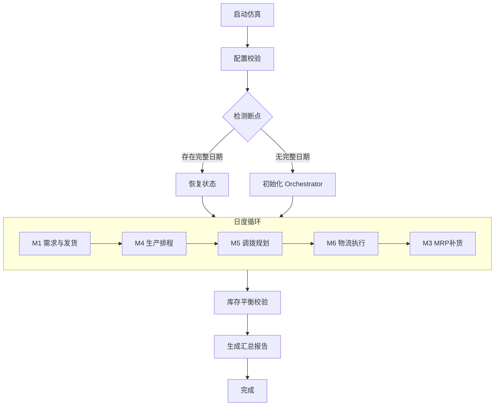
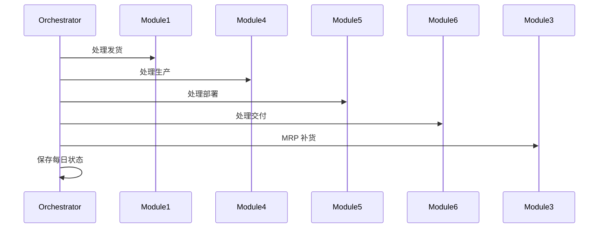

# src/core 模块详细文档

## 文档信息

| 项 | 内容 |
|---|---|
| 文档版本 | v1.2 |
| 最后更新 | 2026-04-10 |
| 编写人 | 陈显跃 |
| 适用范围 | `src/core/` 目录 |
| 目标读者 | 架构师、后端开发、测试工程师 |

> **第三阶段更新说明**（2026-04-10）：  
> `src/core/main_integration.py`、`src/core/orchestrator.py`、`src/core/run.py` 等单体文件已删除。  
> 当前权威实现均在对应的 **包目录** 中：`src/core/run/`、`src/core/main_integration/`、`src/core/orchestrator/`、`src/core/parallel_executor/`。  
> 以下内容描述的是各包的整体职责和内部文件，不再指向已删除的单体文件。

---

## 目录

1. [main_integration 包](#1-main_integration-包) — 主集成执行（13 个文件）
2. [orchestrator 包](#2-orchestrator-包) — 编排器（9 个文件）
3. [parallel_executor 包](#3-parallel_executor-包) — 并行执行框架（4 个文件）
4. [run 包](#4-run-包) — 运行分发（7 个文件）

## 维护说明补充

自 2026-03-10 起，`src/core` 重构代码的交接口径补充了统一的全中文模块/函数注释规范，适用于 `src/core/` 目录下的主入口文件与拆分子包（如 `run/`、`orchestrator/`、`main_integration/`）。本次补充遵循以下约定：

- 仅补充或翻译注释与 docstring，不调整任何业务逻辑、参数口径与运行顺序。
- `ChainSight_Dev` 目录继续作为结果回归基线，不要求同步添加中文注释。
- 交接时优先阅读模块级中文 docstring，再结合本文件的函数级说明理解调用链。
- 若后续新增拆分文件，需保持“模块职责 + 输入输出 + 调用位置”三段式中文注释风格，避免再次出现英文注释与中文注释混用。

---

## 1. main_integration 包

### 1.1 模块概述

**包路径**: `src/core/main_integration/`（原 `src/core/main_integration.py` 单体文件已拆分为 13 个文件）

**包内文件一览**（13 个）：

| 文件 | 职责 |
|---|---|
| `__init__.py` | 公共导出：`run_integrated_simulation`、`run_module4_integrated` 等核心入口 |
| `cli.py` | 命令行参数解析与调用入口 |
| `config_loader.py` | Excel 配置加载与校验、标识符标准化 |
| `db_helpers.py` | 数据库模式辅助函数 |
| `memory_store.py` | 内存数据存取辅助 |
| `normalize.py` | `_normalize_location/material/sending/receiving/identifiers` 标识符规范化 |
| `production_integration.py` | `run_module4_integrated` 核心实现（集成模式调用 M4） |
| `production_runner.py` | Module4 生产运行辅助（原 `module4_runner.py`） |
| `resume.py` | 断点续跑：`detect_last_complete_date`、`restore_orchestrator_state`、`check_resume_capability` |
| `runtime_state.py` | 运行时状态维护 |
| `seed.py` | `load_global_seed` 统一读取随机种子 |
| `simulation_db.py` | 数据库模式仿真主流程 |
| `simulation_file.py` | 本地文件模式仿真主流程（`run_integrated_simulation`） |

**主要职责**:
- 作为供应链仿真的主集成执行脚本
- 统一调度 Module1/3/4/5/6
- 通过 Orchestrator 在日度粒度上串联生产、部署与物流流程
- 实现端到端的数据流转与状态维护

**核心功能点**:
1. **断点续跑**: 自动检测最后完整日期、支持状态恢复并继续运行，避免重复计算与中断损失
2. **预验证与加载**: 在仿真前运行配置校验，统一读取并标准化配置表的标识符字段，同时对 M4 的换产配置进行校验与去重
3. **模块序列执行**: 按日循环依次执行 M1→M4→M5→M6→M3，各模块间立即更新库存与状态以确保数据一致性
4. **状态管理与输出**: 在每日开始/结束阶段保存库存快照、输出每日汇总与详细日志，最终生成汇总报告与库存一致性验证
5. **随机性控制**: 统一读取并设置全局随机种子，保证仿真可复现

---

### 1.2 主要函数详解

#### 1.2.1 `detect_last_complete_date()`

**功能**: 检测最后一个完整处理的日期

**函数签名**:
```python
def detect_last_complete_date(
    output_base_dir: str,
    start_date: str,
    end_date: str
) -> str
```

**参数**:

| 参数名 | 类型 | 必填 | 说明 |
|---|---|---|---|
| `output_base_dir` | `str` | 是 | 输出基础目录 |
| `start_date` | `str` | 是 | 原始开始日期（YYYY-MM-DD） |
| `end_date` | `str` | 是 | 原始结束日期（YYYY-MM-DD） |

**返回值**:
- `str`: 最后完整处理的日期（YYYY-MM-DD）；若未找到完整日期返回 `None`

**输入数据**:
- `orchestrator/` 目录下以日期命名的 CSV 文件（每日库存与日志等）

**必需文件清单**（10个关键文件）:
```python
required_files = [
    f"unrestricted_inventory_{date_str}.csv",      # 可用库存快照
    f"open_deployment_{date_str}.csv",           # 开放调拨快照
    f"planning_intransit_{date_str}.csv",        # 在途调拨快照
    f"space_quota_{date_str}.csv",               # 空间/容量快照
    f"delivery_gr_{date_str}.csv",               # 交付收货历史
    f"production_gr_{date_str}.csv",             # 生产收货历史
    f"shipment_log_{date_str}.csv",              # 客户发货历史
    f"delivery_shipment_log_{date_str}.csv",       # 调拨发运历史
    f"inventory_change_log_{date_str}.csv",        # 库存变动流水
    f"daily_logs_{date_str}.csv",                # 日志摘要
]
```

**处理逻辑**:
1. 按日期遍历并检查必需文件是否存在且可解析
2. 若全部存在则记录为最后完整日期并继续
3. 遇到缺失或异常则停止并返回当前记录

**使用示例**:
```python
last_date = detect_last_complete_date(
    output_base_dir="./outputs/simulation",
    start_date="2025-01-01",
    end_date="2025-01-31"
)
if last_date:
    print(f"可从 {last_date} 继续运行")
```

---

#### 1.2.2 `restore_orchestrator_state()`

**功能**: 从指定日期的状态文件恢复 Orchestrator 状态

**函数签名**:
```python
def restore_orchestrator_state(
    orchestrator: Orchestrator,
    restore_date: str,
    output_base_dir: str
) -> None
```

**参数**:

| 参数名 | 类型 | 必填 | 说明 |
|---|---|---|---|
| `orchestrator` | `Orchestrator` | 是 | Orchestrator 实例 |
| `restore_date` | `str` | 是 | 恢复日期 (YYYY-MM-DD) |
| `output_base_dir` | `str` | 是 | 输出基础目录 |

**返回值**:
- `None`: 无返回值（直接修改 orchestrator 对象）

**输入数据**:
- `orchestrator/` 目录下以 `restore_date` 为基准的多类 CSV 文件（库存/在途/调拨/空间/日志等）

**恢复的状态对象**（7类）:

| 状态对象 | 数据结构 | 说明 |
|---|---|---|
| `unrestricted_inventory` | `Dict[(material, location) -> float]` | 可用库存账本 |
| `open_deployment` | `Dict[uid -> dict]` | 未完成调拨需求池 |
| `in_transit` | `Dict[transit_uid -> dict]` | 运输中订单跟踪 |
| `space_quota` | `Dict[(location) -> {'used': float, 'total': float}]` | 站点/产线可用空间容量 |
| `production_plan_backlog` | `List[dict]` | 生产收货过账（含未来生产） |
| `production_gr` | `List[dict]` | 交付收货历史 |
| `delivery_gr` | `List[dict]` | 调拨到货历史 |
| `shipment_log` | `List[dict]` | 客户发货历史 |
| `delivery_shipment_log` | `List[dict]` | 调拨发运历史 |
| `inventory_change_log` | `List[dict]` | 库存变动流水 |
| `daily_logs` | `List[dict]` | 日志摘要 |

**处理步骤**:
1. 恢复无限制库存（按 `(material, location)` 键重建字典）
2. 恢复在途库存（必须重建为以 `transit_uid` 为键的 `in_transit` 字典）
3. 恢复开放调拨（必须是以 `ori_deployment_uid` 为键的字典）
4. 恢复空间配额（按 `location` 键）
5. 恢复生产计划 backlog（含未来生产）
6. 恢复历史日志（近期的部分，默认回溯 14 天）
7. 重建按日期索引的字典（`*_by_date` 字典，用于 O(1) 查询优化）
8. 设置当前日期为恢复日期

**使用示例**:
```python
orchestrator = create_orchestrator("2025-01-01", "./outputs")
restore_orchestrator_state(orchestrator, "2025-01-15", "./outputs")
print(f"当前日期: {orchestrator.current_date}")
```

---

#### 1.2.3 `check_resume_capability()`

**功能**: 检查是否可以续跑，返回续跑信息

**函数签名**:
```python
def check_resume_capability(
    output_base_dir: str,
    start_date: str,
    end_date: str
) -> dict
```

**参数**:

| 参数名 | 类型 | 必填 | 说明 |
|---|---|---|---|
| `output_base_dir` | `str` | 是 | 输出基础目录 |
| `start_date` | `str` | 是 | 仿真开始日期（YYYY-MM-DD） |
| `end_date` | `str` | 是 | 仿真结束日期（YYYY-MM-DD） |

**返回值**:
```python
{
    'can_resume': bool,           # 是否可以续跑
    'last_complete_date': str,  # 最后完整处理的日期
    'resume_from_date': str,   # 续跑起始日期
    'days_completed': int,       # 已完成天数
    'days_remaining': int,         # 剩余天数
    'already_completed': bool   # 是否已全部完成
}
```

**使用示例**:
```python
resume_info = check_resume_capability(
    output_base_dir="./outputs/simulation",
    start_date="2025-01-01",
    end_date="2025-01-31"
)

if resume_info['can_resume']:
    print(f"可从 {resume_info['resume_from_date']} 继续运行")
    print(f"剩余天数: {resume_info['days_remaining']}")
else:
    print("将从头开始运行")
```

---

#### 1.2.4 标识符标准化函数

##### `_normalize_location(location_str) -> str`

**功能**: 标准化地点编号

**处理逻辑**:
- 若为纯数字字符串则左侧补零至 4 位（如 `"123"` → `"0123"`）
- 非数字（如 `"A888"`）保持原样
- 空值返回空串

##### `_normalize_material(material_str) -> str`

**功能**: 标准化物料编码

**处理逻辑**:
- 将数值型/带小数的物料转换为无小数整数字符串（如 `"80813644.0"` → `"80813644"`）
- 空/None/NAN 返回空串
- 其余去除首尾空格

##### `_normalize_sending(sending_str) -> str`

**功能**: 标准化发送地编号

**处理逻辑**: 同 `_normalize_location()`

##### `_normalize_receiving(receiving_str) -> str`

**功能**: 标准化接收地编号

**处理逻辑**: 同 `_normalize_location()`

##### `_normalize_identifiers(df: pd.DataFrame) -> pd.DataFrame`

**功能**: DataFrame 级标识符标准化

**处理逻辑**:
- 统一将多个标识符列转换为字符串并进行必要的格式化（地点补零、物料去小数等）
- 确保跨模块数据类型一致

**标识符列清单**:
```python
identifier_cols = [
    'material',      # 物料编码
    'location',      # 地点编号
    'sending',       # 发送地
    'receiving',     # 接收地
    'sourcing',      # 供应地
    'dps_location',  # DPS 地点
    'from_material',  # 来源物料
    'to_material',    # 目标物料
    'line',          # 产线
    'delegate_line',  # 委托产线
    'changeover_id'   # 换型ID
]
```

---

#### 1.2.5 `run_module4_integrated()`

**功能**: 集成模式运行 Module4 生产计划（直接用 config_dict）

**函数签名**:
```python
def run_module4_integrated(
    config_dict: dict,
    module3_output_dir: str,
    simulation_date: pd.Timestamp,
    simulation_start: pd.Timestamp,
    output_dir: str,
    skip_file_output: bool = False,
    module3_result: Optional[Dict[str, Any]] = None
) -> pd.DataFrame
```

**参数**:

| 参数名 | 类型 | 必填 | 说明 |
|---|---|---|---|
| `config_dict` | `dict` | 是 | 配置数据字典（包含 M4 所需表） |
| `module3_output_dir` | `str` | 是 | Module3 输出目录，用于读取日度净需求 |
| `simulation_date` | `pd.Timestamp` | 是 | 当前仿真日期 |
| `simulation_start` | `pd.Timestamp` | 是 | 仿真开始日期 |
| `output_dir` | `str` | 是 | 输出目录，用于写每日 M4 输出 |
| `skip_file_output` | `bool` | 否 | 是否跳过写入 Excel 文件（数据库模式使用） |
| `module3_result` | `Optional[Dict]` | 否 | Module3 运行结果（内存数据），包含 net_demand_df |

**返回值**:
```python
{
    'production_df': pd.DataFrame,       # 生产计划数据（含 available_date 等）
    'exceed_log': pd.DataFrame,       # 产能超限日志
    'issues_df': pd.DataFrame,          # 问题日志
    'changeover_log': pd.DataFrame        # 换型日志
}
```

**必需的 M4 配置表**:
```python
required_m4_configs = [
    'M4_MaterialLocationLineCfg',    # 物料-产线配置
    'M4_LineCapacity',                 # 产线产能配置
    'M4_ChangeoverMatrix',           # 换型矩阵
    'M4_ChangeoverDefinition',        # 换型定义
    'M4_ProductionReliability'          # 生产可靠性配置
]
```

**处理逻辑**:
1. 验证必需的 Module4 配置数据
2. 优先从 `module3_result` 内存获取净需求，否则从文件读取
3. 标准化 material 字段（移除 `.0` 后缀）
4. 构建无约束计划
5. 处理换型与产能分配
6. 仿真生产可靠性
7. 提取并保存当天产线状态供下一天使用
8. 提取并保存当天分配的产能供后续仿真日期使用
9. 去重问题记录

---

#### 1.2.6 `load_current_date_production_gr()`

**功能**: 加载历史 M4 生产计划并筛选当日入库

**函数签名**:
```python
def load_current_date_production_gr(
    module4_output_dir: str,
    current_date: pd.Timestamp,
    start_date: pd.Timestamp
) -> pd.DataFrame
```

**参数**:

| 参数名 | 类型 | 必填 | 说明 |
|---|---|---|---|
| `module4_output_dir` | `str` | 是 | Module4 输出目录 |
| `current_date` | `pd.Timestamp` | 是 | 当前日期 |
| `start_date` | `pd.Timestamp` | 是 | 仿真开始日期 |

**返回值**:
- `pd.DataFrame`: 当日应该入库的生产计划

**输出列**:
```python
['material', 'location', 'line', 'simulation_date', 'available_date', 'produced_qty']
```

---

#### 1.2.7 `load_global_seed()`

**功能**: 统一从 Global_Seed 读取随机种子

**函数签名**:
```python
def load_global_seed(config_dict: dict) -> int
```

**参数**:

| 参数名 | 类型 | 必填 | 说明 |
|---|---|---|---|
| `config_dict` | `dict` | 是 | 配置数据字典 |

**返回值**:
- `int`: 随机种子值，默认 42

**处理逻辑**:
- 按优先级读取标准列 `seed`
- 兼容旧格式（第一列第一行）
- 若不存在则返回默认值 42

---

### 1.3 数据流图



---

## 2. orchestrator 包

### 2.1 模块概述

**包路径**: `src/core/orchestrator/`（原 `src/core/orchestrator.py` 单体文件已拆分为 9 个文件）

**包内文件一览**（9 个）：

| 文件 | 职责 |
|---|---|
| `__init__.py` | 对外导出 `Orchestrator`、`DeploymentUID` 及其他公共符号 |
| `models.py` | `DeploymentUID` 等数据类定义 |
| `normalize.py` | Orchestrator 内部的标识符规范化辅助 |
| `orchestrator_main.py` | `Orchestrator` 主类、初始化与公共 API |
| `processors.py` | `process_module1_shipments/4_production/5_deployment/6_delivery` 等按模块的状态写入 |
| `views.py` | `get_unrestricted_inventory_view` 等各类视图方法 |
| `daily_ops.py` | 日级运算：到货处理、过期调拨清理、日初日末操作 |
| `inventory_log.py` | 库存变动流水日志 |
| `persistence.py` | 每日 CSV 快照与历史日志持久化（`save_daily_state` 等） |

**主要职责**:
- 供应链计划的中心状态管理与协调枢纽
- 实物库存跟踪（非限制库存）
- 开放调拨管理（等待发运的调拨计划）
- 在途库存跟踪（已发运但尚未交付）
- 生产 GR 跟踪（生产入库）
- 交付 GR 跟踪（收货入库）
- 空间容量管理
- 状态持久化与审计日志

**核心状态对象**:

| 状态域 | 核心字段 | 数据结构 | 作用 |
|---|---|---|---|
| 库存域 | `unrestricted_inventory` | `Dict[(material, location) -> int]` | 当前可用库存账本 |
| 调拨域 | `open_deployment` | `Dict[str, dict]` | 未完成调拨需求池 |
| 在途域 | `in_transit` | `Dict[str, dict]` | 运输中订单跟踪 |
| 产能域 | `space_quota` | `pd.DataFrame` | 站点/产线可用空间容量 |
| 生产历史 | `production_gr` | `List[dict]` + 按日期索引 | 生产收货过账 |
| 交付历史 | `delivery_gr` | `List[dict]` + 按日期索引 | 调拨到货历史 |
| 发货历史 | `shipment_log` | `List[dict]` + 按日期索引 | 客户发货与调拨发运记录 |
| 生产计划 | `production_plan_backlog` | `List[dict]` | 存所有已确认生产(含未来) |
| 发运日志 | `delivery_shipment_log` | `List[dict]` | 站点间发运日志 |

---

### 2.2 核心类：DeploymentUID

**功能**: 用于部署跟踪的唯一标识符

**类定义**:
```python
@dataclass
class DeploymentUID:
    material: str                     # 物料编码
    sending: str                      # 发送地编号
    receiving: str                     # 接收地编号
    planned_deploy_date: str            # 计划部署日期 (YYYY-MM-DD)
    demand_element: str                 # 需求元素标识
    sequence: int = 0                # 自增序号，保证唯一性
```

**方法**:

#### `to_string() -> str`
**功能**: 转换为字符串表示以便跟踪

**返回格式**:
```
"{material}|{sending}|{receiving}|{planned_deploy_date}|{demand_element}|{sequence:06d}"
```

#### `from_string(uid_str: str) -> DeploymentUID` (classmethod)
**功能**: 从字符串表示解析

**参数**:
- `uid_str`: 字符串格式的 UID

**返回值**:
- `DeploymentUID`: 解析后的对象

**使用示例**:
```python
# 创建 UID
uid = DeploymentUID(
    material="80813644",
    sending="0001",
    receiving="0816",
    planned_deploy_date="2025-01-15",
    demand_element="CUST001"
)
uid_str = uid.to_string()
# 输出: "80813644|0001|0816|2025-01-15|CUST001|000001"

# 解析回 UID
restored_uid = DeploymentUID.from_string(uid_str)
```

---

### 2.3 核心类：Orchestrator

#### 2.3.1 `__init__()`

**功能**: 初始化编排器

**函数签名**:
```python
def __init__(
    self,
    start_date: str,
    output_dir: str = "./orchestrator_output"
)
```

**参数**:

| 参数名 | 类型 | 必填 | 说明 |
|---|---|---|---|
| `start_date` | `str` | 是 | 仿真开始日期（YYYY-MM-DD） |
| `output_dir` | `str` | 否 | 持久化存储目录 |

**初始化的状态对象**:
1. **核心状态字典**: 库存、调拨、在途、空间配额、历史日志
2. **日期索引字典**: 用于 O(1) 查询优化的按日期索引
3. **生产计划 backlog**: 存储所有已确认生产（含未来）
4. **UID 序列计数器**: 用于生成唯一调拨标识
5. **过期清理宽限天数**: 默认 100 天（可运行时修改）
6. **审计日志列表**: 每日操作日志
7. **期初和期末库存存储**: 用于库存平衡检查
8. **发运出库日志**: Module6 的发运日志
9. **上次清理日期**: 记录当天是否已执行过清理

---

#### 2.3.2 `initialize_inventory(initial_inventory_df: pd.DataFrame)`

**功能**: 从 M1_InitialInventory 配置初始化实物库存

**函数签名**:
```python
def initialize_inventory(
    self,
    initial_inventory_df: pd.DataFrame
) -> None
```

**参数**:

| 参数名 | 类型 | 必填 | 说明 |
|---|---|---|---|
| `initial_inventory_df` | `pd.DataFrame` | 是 | 含列 [material, location, quantity] 的 DataFrame |

**处理逻辑**:
1. 标识符字段为字符串格式
2. 使用迭代元组（性能优化）构建 `(material, location)` 键
3. 转换数量为 int
4. 保存初始库存副本

**使用示例**:
```python
initial_inv_df = pd.DataFrame({
    'material': ['80813644', '80813645'],
    'location': ['0001', '0002'],
    'quantity': [100, 50]
})
orchestrator.initialize_inventory(initial_inv_df)
```

---

#### 2.3.3 `set_space_capacity(space_capacity_df: pd.DataFrame)`

**功能**: 从 Global_SpaceCapacity 配置设置空间容量

**函数签名**:
```python
def set_space_capacity(
    self,
    space_capacity_df: pd.DataFrame
) -> None
```

**参数**:

| 参数名 | 类型 | 必填 | 说明 |
|---|---|---|---|
| `space_capacity_df` | `pd.DataFrame` | 是 | 含列 [location, eff_from, eff_to, capacity] 的 DataFrame |

**处理逻辑**:
1. 标识符字段为字符串格式
2. 转换日期字段为 datetime 类型
3. 保存到 `space_quota` 属性

---

#### 2.3.4 状态查询方法

##### `get_unrestricted_inventory_view(date: str) -> pd.DataFrame`

**功能**: 获取指定日期的可用库存视图

**返回列**: `[date, material, location, quantity]`

**使用示例**:
```python
inventory_df = orchestrator.get_unrestricted_inventory_view("2025-01-15")
```

##### `get_current_unrestricted_inventory() -> Dict[Tuple[str, str], int]`

**功能**: 获取当前库存字典

**返回值**:
```python
{
    (material, location): quantity
}
```

##### `get_planning_intransit_view(date: str) -> pd.DataFrame`

**功能**: 获取指定日期的在途调拨视图

**返回列**: `[transit_uid, date, material, sending, receiving, actual_ship_date, actual_delivery_date, quantity, ori_deployment_uid, vehicle_uid]`

##### `get_open_deployment_view(date: str) -> pd.DataFrame`

**功能**: 获取指定日期的开放调拨视图

**返回列**: `[material, sending, receiving, planned_deployment_date, deployed_qty, demand_element, ori_deployment_uid]`

##### `get_space_quota_view(date: str) -> pd.DataFrame`

**功能**: 计算指定日期的可用空间额度

**计算公式**:
```
capacity - unrestricted_inventory（仿真日开始时）
```

**返回列**: `[receiving, date, max_qty]`

##### `get_production_plan_backlog_view(date: str) -> pd.DataFrame`

**功能**: 获取生产计划 backlog（含未来生产），用于持久化

**返回列**: `[material, location, available_date, quantity]`

---

#### 2.3.5 模块处理方法

##### `process_module1_shipments(shipment_df: pd.DataFrame, date: str)`

**功能**: 处理指定日期的 Module1 发货数据

**处理逻辑**:
1. 筛选当日发货记录
2. 更新非限制库存（使用标准化标识符）
3. 记录发货日志
4. 加入 O(1) 索引查询优化

##### `process_module4_production(production_df: pd.DataFrame, date: str)`

**功能**: 处理指定日期的 Module4 生产数据

**处理逻辑**:
1. **阶段 A**: 缓存当日 GR 的生产计划到 backlog 中，供 M3 查询未来生产计划使用
2. **阶段 B**: 原有逻辑——只对"今天到货"的进行 GR 入库
3. 筛选当日生产记录（`available_date == date`）
4. 更新非限制库存
5. 记录生产 GR
6. 加入 O(1) 索引

##### `process_module5_deployment(deployment_df: pd.DataFrame, date: str)`

**功能**: 处理 Module5 部署计划并更新开放调拨

**处理逻辑**:
1. 为保证在相同配置和随机种子下 `ori_deployment_uid` 可复现，在生成 UID 之前对部署计划做一次稳定排序
2. 生成唯一 UID（使用 `DeploymentUID` 类）
3. 将新的部署计划加入开放调拨
4. 记录日志

##### `process_module6_delivery(delivery_df: pd.DataFrame, date: str)`

**功能**: 处理 Module6 交付计划并更新状态

**处理逻辑**:
1. 添加调试信息：显示输入数据的详细信息
2. 处理每条交付记录
3. 只处理当天发运的货物（`actual_ship_date == current_date`）
4. 减少开放调拨数量
5. 减少发货地非限制库存
6. 记录发运出库日志（`delivery_shipment_log`）
7. 判断处理逻辑：基于 `delivery_date` 是否为未来日期
8. **当天交付**: 创建 delivery GR 并立即更新库存
9. **未来交付**: 创建在途记录
10. 使用 `ori_deployment_uid + vehicle_uid` 作为唯一键，完美支持多车情况

---

#### 2.3.6 每日执行方法

##### `run_daily_processing(date, shipment_df, production_df, deployment_df, delivery_df, grace_days)`

**功能**: Execute daily processing in correct order: M1 → M4 → M5 → M6

**执行顺序**:


**参数**:

| 参数名 | 类型 | 必填 | 说明 |
|---|---|---|---|
| `date` | `str` | 是 | 仿真日期（YYYY-MM-DD） |
| `shipment_df` | `pd.DataFrame` | 否 | Module1 发货数据 |
| `production_df` | `pd.DataFrame` | 否 | Module4 生产数据 |
| `deployment_df` | `pd.DataFrame` | 否 | Module5 部署数据 |
| `delivery_df` | `pd.DataFrame` | 否 | Module6 交付数据 |
| `grace_days` | `int` | 否 | 清理宽限天数，默认使用全局设置 |

**处理步骤**:
1. 仅在每日跑批开头清理一次（若未传则使用全局 `cleanup_grace_days`）
2. 在每日开始时检查到货
3. 按顺序处理各模块
4. 保存每日状态
5. 记录完成日志

---

#### 2.3.7 辅助方法

##### `_process_delivery_arrivals(date: str)`

**功能**: 处理当天到达的在途交付

**处理逻辑**:
1. 筛选当日到期的在途记录
2. 增加收货地库存
3. 记录 delivery GR（改进的去重检查）
4. 改进的重复检查：使用 `ori_deployment_uid + vehicle_uid` 作为唯一键
5. 完成后删除在途记录

##### `cleanup_past_due_open_deployments(date, grace_days, write_audit)`

**功能**: 清理过期的 open deployment，并输出审计文件

**清理规则**:
```
planned_deployment_date < (date - grace_days)
```

**返回值**:
```python
pd.DataFrame: 被清理掉的记录明细（用于链路追溯）
```

**输出列**:
```python
[
    'cleanup_date',      # 清理日期
    'grace_days',        # 宽限天数
    'ori_deployment_uid',  # 原始部署UID
    'material',           # 物料
    'sending',            # 发送地
    'receiving',          # 接收地
    'planned_deployment_date',  # 计划部署日期
    'remaining_qty',      # 剩余数量
    'demand_element',     # 需求元素
    'creation_date',      # 创建日期
    'reason'             # 清理原因
]
```

##### `save_daily_state(date: str)`

**功能**: 将每日状态保存到持久化存储

**保存的文件**:
```python
# 1. 可用库存视图
unrestricted_inventory_{date_str}.csv

# 2. 开放调拨视图
open_deployment_{date_str}.csv

# 3. 在途调拨视图
planning_intransit_{date_str}.csv

# 4. 空间配额视图
space_quota_{date_str}.csv

# 5. 生产计划 backlog
production_plan_backlog_{date_str}.csv

# 6. 历史日志（多天）
shipment_log_{scan_date_str}.csv
production_gr_{scan_date_str}.csv
delivery_gr_{scan_date_str}.csv
delivery_shipment_log_{scan_date_str}.csv
inventory_change_log_{scan_date_str}.csv

# 7. 日志摘要
daily_logs_{date_str}.csv
```

---

#### 2.3.8 辅助方法

##### `_safe_convert_to_int(value)`

**功能**: Safely convert pandas Series or scalar to integer

**处理逻辑**:
- 如果是 pandas Series，取第一个值
- 如果是 Series 且有多个值，取第一个并发出警告
- 处理 None 或 NaN
- 转换为 int

##### `set_past_due_cleanup_grace_days(days: int)`

**功能**: 设置 open deployment 过期清理的全局宽限天数

**默认值**: 100 天

---

## 3. parallel_executor 包

### 3.1 模块概述

**包路径**: `src/core/parallel_executor/`（原单体 `parallel_executor.py` 已拆分为 4 个文件）

**包内文件一览**（4 个）：

| 文件 | 职责 |
|---|---|
| `__init__.py` | 对外导出 `ParallelExecutor`、`ParallelTaskResult`、`run_parallel_modules` 等 |
| `models.py` | `ParallelTaskResult` dataclass 定义 |
| `parallel_executor_main.py` | `ParallelExecutor` 主类与核心执行逻辑 |
| `convenience.py` | `run_parallel_modules` 等便捷封装函数 |

**主要职责**:
- 并行执行框架 - Phase 5 性能优化
- 实现同层模块并行执行（M1 ∥ M4 ∥ M5）
- 提供线程池管理和结果收集
- 处理错误传播和状态同步
- 保持功能兼容性（可通过环境变量切换到串行模式）

**设计目标**:
- 使用 `ThreadPoolExecutor` 用于 I/O 密集型任务
- 同步点用于状态一致性保证

---

### 3.2 核心类：ParallelTaskResult

**功能**: 并行任务执行结果

**类定义**:
```python
@dataclass
class ParallelTaskResult:
    task_name: str                   # 任务名称
    status: str                     # 'success' | 'error' | 'timeout'
    result: Any = None               # 执行结果
    error: Optional[Exception] = None  # 错误对象
    start_time: Optional[datetime] = None   # 开始时间
    end_time: Optional[datetime] = None     # 结束时间
```

**属性**:

#### `elapsed_time -> float`

**功能**: 返回执行耗时（秒）

**计算公式**:
```python
if self.start_time and self.end_time:
    return (self.end_time - self.start_time).total_seconds()
```

---

### 3.3 核心类：ParallelExecutor

#### 3.3.1 `__init__(max_workers, enable_parallel)`

**功能**: 初始化并行执行器

**函数签名**:
```python
def __init__(
    self,
    max_workers: int = 3,
    enable_parallel: Optional[bool] = None
)
```

**参数**:

| 参数名 | 类型 | 必填 | 说明 |
|---|---|---|---|
| `max_workers` | `int` | 否 | 最大线程数（默认 3） |
| `enable_parallel` | `bool` | 否 | 是否启用并行（默认 True，可通过 `CHAINSIGHT_PARALLEL` 环境变量覆盖） |

**初始化逻辑**:
1. 允许通过环境变量覆盖
2. 设置最大线程数
3. 初始化 `ThreadPoolExecutor`

---

#### 3.3.2 `run_parallel_stage(tasks)`

**功能**: 并行执行一组任务

**函数签名**:
```python
def run_parallel_stage(
    self,
    tasks: List[Tuple[str, Callable[[], Any]]]
) -> Tuple[Dict[str, ParallelTaskResult], bool]
```

**参数**:

| 参数名 | 类型 | 必填 | 说明 |
|---|---|---|---|
| `tasks` | `List[Tuple[str, Callable]]` | 是 | 任务列表，每项为 `(任务名称, 可调用函数)` |

**返回值**:
```python
(
    results: Dict[str, ParallelTaskResult],  # 结果字典：{任务名 → ParallelTaskResult}
    all_success: bool                  # 是否全部成功
)
```

**处理逻辑**:
1. **串行模式**: 依次执行每个任务（当 `enable_parallel=False`）
2. **并行模式**:
   - 并行提交任务到线程池
   - 收集结果（按完成顺序）
   - 处理异常并记录耗时

**使用示例**:
```python
executor = ParallelExecutor(max_workers=3, enable_parallel=True)
results, all_success = executor.run_parallel_stage(tasks=[
    ('Module1', lambda: module1.run(...)),
    ('Module4', lambda: module4.run(...)),
    ('Module5', lambda: module5.run(...)),
])
```

---

#### 3.3.3 `_run_single_task(task_name, task_fn)`

**功能**: 运行单个任务

**参数**:

| 参数名 | 类型 | 必填 | 说明 |
|---|---|---|---|
| `task_name` | `str` | 是 | 任务名称 |
| `task_fn` | `Callable` | 是 | 可调用函数 |

**处理逻辑**:
1. 包装任务执行
2. 捕获异常
3. 记录耗时

---

#### 3.3.4 `_print_results(results, parallel)`

**功能**: 打印执行结果统计

**输出信息**:
- 任务执行结果（成功/失败/超时）
- 成功/失败数量统计
- 总耗时统计
- 并行模式下的最大耗时

---

#### 3.3.5 `get_results_dict(results)`

**功能**: 从结果中提取实际数据

**返回值**:
```python
{
    task_name: result
    for task_name, result in results.items()
        if result.status == 'success'
}
```

**用途**: 用于后续处理

---

#### 3.3.6 `close()`

**功能**: 关闭线程池

---

#### 3.3.7 `run_parallel_modules()`

**功能**: 并行运行三个模块（M1 ∥ M4 ∥ M5）

**函数签名**:
```python
def run_parallel_modules(
    m1_fn: Callable[[], Any],
    m4_fn: Callable[[], Any],
    m5_fn: Callable[[], Any],
    max_workers: int = 3,
    enable_parallel: Optional[bool] = None
) -> Tuple[Any, Any, Any, bool]
```

**参数**:

| 参数名 | 类型 | 必填 | 说明 |
|---|---|---|---|
| `m1_fn` | `Callable` | 是 | Module1 可调用函数 |
| `m4_fn` | `Callable` | 是 | Module4 可调用函数 |
| `m5_fn` | `Callable` | 是 | Module5 可调用函数 |
| `max_workers` | `int` | 否 | 最大线程数 |
| `enable_parallel` | `bool` | 否 | 是否启用并行 |

**返回值**:
```python
(
    m1_result,     # Module1 结果
    m4_result,     # Module4 结果
    m5_result,     # Module5 结果
    all_success     # 是否全部成功
)
```

**使用示例**:
```python
m1_result, m4_result, m5_result, success = run_parallel_modules(
    m1_fn=lambda: module1.run_daily_order_generation(...),
    m4_fn=lambda: run_module4_integrated(...),
    m5_fn=lambda: module5.main(...),
)
```

---

## 4. run 包

### 4.1 模块概述

**包路径**: `src/core/run/`（原 `src/core/run.py` 单体文件已拆分为 7 个文件）

**包内文件一览**（7 个）：

| 文件 | 职责 |
|---|---|
| `__init__.py` | 对外导出 `main`、`run_local`、`run_db` 等入口 |
| `run_main.py` | 总入口：参数解析、模式分发（本地/数据库） |
| `local_writer.py` | 本地模式下的输出写入与工件归档 |
| `db_config.py` | 数据库模式配置加载与连接 |
| `db_runner.py` | 数据库模式运行流程（调用 `main_integration/simulation_db.py`） |
| `output_dir.py` | 输出目录准备、清理与重建 |
| `utils.py` | 公共工具函数 |

### 4.2 核心职责

1. **参数解析**：读取 CLI 参数或调用方传入的配置字典
2. **模式分发**：根据 `--use-db` 选择本地模式或数据库模式
3. **输出目录准备**：按日期/场景创建输出目录
4. **统一入口**：供 `main.py` / CLI / 测试脚本调用

---

## 附录：相关文档

- [ARCHITECTURE.md](ARCHITECTURE.md) - 完整架构设计文档
- [API.md](API.md) - API 接口文档
- [CLEANUP_AND_IMPROVEMENTS.md](CLEANUP_AND_IMPROVEMENTS.md) - 第三阶段清理与改进记录

---
