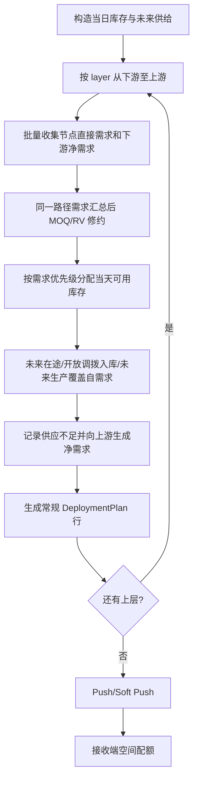

# M5 旧实现逻辑基线与重写边界

> **目的**：这是对旧 M5 的行为审计，不是重构设计，也不复用旧代码。后续 `ModuleFive` 的实现必须以本文件列出的业务规则、输入口径和输出口径为基线，再用一个新的 pandas 数据流重新实现。
>
> **审计范围**：`main.py`、`demand_collector.py`、`inventory.py`、`allocation.py`、`push_allocation.py`、`validation.py`、`cache_utils.py`，以及它们引用的共享工具。旧模块的并行、缓存、DuckDB、异常吞没和 helper 分层均视为实现细节，而非新实现的可继承结构。

## 1. 旧 M5 的业务目标

对于每个仿真日和每个物料网络，M5 从下游向上游处理需求：

1. 收集节点在补货窗口内的需求；
2. 优先使用发送端当天真实可用库存；
3. 以未来在途、未完成调拨入库、未来生产覆盖**节点自需求**的剩余缺口；
4. 未覆盖缺口记录为 `UnfulfilledLog`，并作为净需求上推至上游；
5. 对上游的跨节点净需求应用 MOQ/RV；
6. 在所有常规需求处理后，按 Push / Soft Push 规则下推余货；
7. 最后按接收端日配额削减实际部署量。

旧代码里的 `up_gap_buffer` 名称具有误导性：它实际保存的是**下游未满足需求向上游传递的净需求**，不是“上游 gap”。

## 2. 输入、状态与输出契约

### 2.1 静态配置

| 表 | 旧逻辑中的用途 |
|---|---|
| `Global_Network` | 每物料的 `sourcing -> location` 网络、有效期、节点类型；构建处理层级和查询上游/下游。 |
| `Global_LeadTime` | 路径 `(sending, receiving)` 的 `PDT`、`GR`、`MCT`。 |
| `M4_MaterialLocationLineCfg` | 物料-地点级 `PTF`、`LSK`，参与 Plant 路径提前期。 |
| `M5_DeployConfig` | 物料-发送端或物料-发送端-接收端的 `MOQ`、`RV`；旧实现还读取 `lsk/day`，但主需求规划不使用 `day`。 |
| `M5_PushPullModel` | 物料-发送端的模式：`push`、`soft push`、`pull`。 |
| `M3_SafetyStock` | 窗口末日安全库存需求、Push 接收端目标、Soft Push 发送端保留量。 |
| `M5_SupplyDemandLog` | SDL/forecast 等直接需求。 |
| `Global_DemandPriority` | `demand_element -> priority`，数字小者优先。 |
| `ReceivingSpace` | `(receiving, date)` 的最大接收量。 |

### 2.2 当日动态输入

| 输入 | 旧逻辑口径 |
|---|---|
| `InventoryLog` | 当日 `(material, location)` 期初库存。旧逻辑要求同日同物料地点不能重复。 |
| `InTransit` | 当日到货计入库存，未来到货仅用于 pipeline 覆盖；以 `actual_delivery_date` 优先，否则 `available_date`。 |
| `DeliveryGR` | 当日收货，计入接收端库存。 |
| `ProductionPlan` / M4 GR | 当日可用生产计入库存；未来生产仅用于 pipeline 覆盖。 |
| M1 `TodayShipment` | 最终库存日志会扣除；但旧 `dynamic_soh` 分配口径没有扣除，详见第 8 节。 |
| `OpenDeployment` | 跨节点发送端量从可用库存扣除；跨节点接收端量作为 pipeline inbound 使用。 |
| M1 `OrderLog` | `AO`、`normal` 等订单需求，窗口内收集。 |

### 2.3 输出字段的语义

| 输出 | 语义 |
|---|---|
| `planned_qty` | MOQ/RV 修约后的需求量。 |
| `deployed_qty_invCon` | 发送端库存约束下的初始分配量，尚未应用接收端配额。 |
| `deploy_qty_with_plan_order` | 未来供给覆盖量；名称中的 `plan_order` 与订单无关。 |
| `deployed_qty` | 接收端空间配额裁剪后的最终实际部署量。 |
| `unfulfilled_qty` | 供应不足或空间不足的未满足量。 |
| `StockOnHandLog.ending_soh` | 旧实现按库存约束分配量计算的期末库存，未使用最终配额裁剪后的 `deployed_qty`。这是一项待确认的旧行为。 |

## 3. 网络、层级与提前期规则

### 3.1 每物料独立网络

网络不能跨物料共享层级。对每个物料，旧逻辑从无上游的根节点开始 BFS：根节点为第 0 层，沿 `sourcing -> location` 下游递增。处理顺序为层级降序，即从最下游向上游。

若网络有环或没有根节点，旧逻辑会把未分配节点塞到当前最大层级加一；该行为不是可靠的网络校验，而是容错残留。配置验证仅记录“同一 `(material, location)` 有多个 sourcing”，不会阻断运行。

### 3.2 活动网络

一条网络行仅在 $eff\_from \le simulation\_date \le eff\_to$ 时有效。对节点 `(material, location)`，活动行的 `sourcing` 是其上游；反向筛选 `sourcing == sending` 得到下游。

### 3.3 路径提前期

对路径 $s \rightarrow r$：

- 发送端为 DC：

$$LT = \max(1, PDT + GR)$$

- 发送端为 Plant：

$$LT = \max(1, \max(MCT, PDT + GR) + PTF_{material,s} + LSK_{material,s} - 1)$$

发送端类型优先取活动 Network 行的 `location_type`；没有该行时，层级为 0 的节点按 Plant，其他按 DC。

该公式在旧代码中被用于两个不同目的，必须在重写时明确分开：

1. **需求窗口长度**：节点从当天起向后收集至 `simulation_date + LT` 的直接需求；
2. **跨节点计划到货日**：上游向下游的计划行使用该路径的 `LT`，到货日为需求的 `requirement_date`。

根节点没有上游时，旧逻辑用该发送端所有 LeadTime 行的最大 `MCT/PDT/GR` 推导窗口长度，但给其直接需求行设置 `leadtime = 0`。这是“窗口 horizon”和“计划行 leadtime”混用的历史表现，重写时必须保留结果口径而非复用字段含义。

## 4. 一日常规 Pull 规划流程

### 4.1 期初与当日库存视图

旧实现同时构造两套库存口径：

- **预测库存 `projected_soh`**：

$$SOH_{projected}=beginning+today\_intransit+delivery\_gr+today\_production+future\_production-today\_shipment-open\_deployment$$

主要用于 Push / Soft Push 的接收端库存基线。

- **真实可用库存 `dynamic_soh`**：

$$SOH_{available}=beginning+delivery\_gr+today\_production-open\_deployment$$

用于常规库存分配与 Push 发送端余货。`today_shipment` 和 `open_deployment_inbound` 虽传入函数却没有参与该公式。

### 4.2 节点需求的四个来源

对节点 `(material, location)`，以 $[simulation\_date, horizon\_end]$ 为闭区间：

1. **SDL**：窗口内每条 `SupplyDemandLog` 记录直接变为需求行；
2. **安全库存**：只取 `horizon_end` 当天的安全库存并汇总为一条 `demand_element='safety'`；
3. **订单**：窗口内的 `OrderLog` 行，`demand_element=demand_type`；
4. **下游净需求**：本日已处理下游节点的供应缺口。

直接需求的接收端为本节点；下游净需求的实际接收端由 `from_location` 表示，即产生缺口的下游节点。前者是“节点自需求”，后者是“上游给下游供货”的跨节点需求。

### 4.3 MOQ/RV

对同一 `(material, sending=当前节点, receiving=实际接收端)` 的需求行先汇总，再修约：

- 自环需求：不修约；
- 跨节点需求：

$$Q' = \begin{cases}
MOQ, & 0 < Q < MOQ\\
\lceil Q / RV \rceil \cdot RV, & Q \ge MOQ\\
0, & Q = 0
\end{cases}$$

旧实现用最大余数法将组总量 $Q'$ 再分摊回行。其并列顺序依赖输入行顺序；新实现应把稳定排序键写清楚。

### 4.4 当天库存的优先级分配

先按 `DemandPriority` 数字升序处理。库存足够时，该优先级组全量满足；库存不足时，仅该优先级组按调整后数量比例分配并向下取整，后续优先级为 0。

旧实现不会把向下取整留下的余数再分配给任何行。因此该规则不是“最大化库存利用”，而是“比例下取整”。重写前需要确认这是业务规则还是历史损失。

### 4.5 Pipeline 覆盖

仅对**节点自需求**（实际接收端等于当前节点）进行三类未来供给覆盖：

1. 未来在途；
2. 开放调拨的未来入库；
3. 未来生产。

每一供给池仅覆盖库存分配后的剩余缺口，并按优先级排序后按缺口比例向下取整分配。该覆盖量写入 `deploy_qty_with_plan_order` 及三个来源字段；它不是当天发货，因此不能变成 `deployed_qty`。

### 4.6 缺口上推与常规计划行

对每行：

$$gap = planned\_qty - deployed\_qty\_invCon - pipeline\_cover$$

若 $gap > 0$：

- 在 `UnfulfilledLog` 增加 `reason='supply shortage'`；
- 若当前节点有上游，则生成一条上游净需求：
  - `demand_element = 'net demand for ' + 原需求元素`；
  - `planned_qty = gap`；
  - `from_location = 当前节点`；
  - `orig_location` 保留最初需求点；
  - `requirement_date` 继承原需求日期。

下一层的上游节点将此行识别为跨节点需求，应用该上游到当前节点路径的 MOQ/RV，再尝试用上游库存满足。

所有需求行（即使未满足）都会产生常规 `DeploymentPlan` 行。自需求行的 `planned_delivery_date=date`、`leadtime=0`；跨节点行的计划到货日为其 `requirement_date`，提前期使用实际发送端到实际接收端路径公式。

## 5. Push / Soft Push 规则

Push 不是普通 pull 需求的补充行，而是一个在常规需求处理结束后才执行的独立策略。

对已有常规计划行出现过的 `(material, sending)`：

1. 若该发送端当天有任何未满足的非 push 行，则跳过 Push；
2. 仅配置 `push` 或 `soft push` 的节点参与；`pull` 不参与；
3. 发送端余货为：

$$available = \max(0, dynamic\_soh - \sum deployed\_qty\_invCon_{non-push})$$

4. Soft Push 额外保留发送端**当天**安全库存；Push 不保留；
5. 找到所有直接下游，计算每个下游的到货日和该到货日安全库存 $SS_r$；
6. 以 `projected_soh` 为接收端库存基线，扣除到货日前的 AO、normal、forecast 承诺消耗及到货日 safety；
7. 在默认挡位 `[1.2, 1.5, 2.0, 2.5, 3.0]` 中选择最高可行 $L$：

$$need_r=\max(0, L\cdot SS_r - PI_r)$$

$$\sum_r need_r \le available$$

8. 按 $available \cdot need_r / \sum need_r$ 向下取整生成 Push 行；之后仍受接收端空间配额裁剪。

该策略存在两个历史边界：没有常规计划行的发送端不会被纳入 Push；比例下取整的余货不会被再次分配。

## 6. 接收端空间配额

空间配额在所有常规和 Push 行生成之后统一执行。

- 自需求行：直接令 `deployed_qty = deployed_qty_invCon`，`quota = infinity`；
- 跨节点行：按 `(receiving, date)` 分组并使用 `max_qty`；
- 总初始分配不超过配额：全部通过；
- 超配：按需求优先级升序，完整满足高优先级；发生部分满足的优先级按 `deployed_qty_invCon` 比例向下取整；
- 被空间裁剪的差额新增 `reason='space constraint'` 的 `UnfulfilledLog` 行。

因此，空间约束不会重新触发上游补货，也不会回写普通需求 gap；它只改变最终 `deployed_qty`。

## 7. 验证与跨日状态

### 7.1 旧验证

旧验证只记录问题，不修改配置或中止运行：

- 同一物料地点多 sourcing；
- Network 路径缺 LeadTime；
- DeployConfig 缺 PushPullModel；
- 直接需求和订单出现但无 DemandPriority 时自动追加默认优先级：`AO=1`、`normal=2`、其他=9；
- 输出后检查总部署量是否超过 `ShipmentLog` 总量的 101%。

最后一项与普通分配的库存口径无直接耦合，且集成路径常把 `ShipmentLog` 设为空，因此经常不生效。

### 7.2 跨日状态

独立旧入口在内存中维护 `soh_dict`。每一天结束后：

$$ending=beginning+production+intransit+delivery\_gr-today\_shipment-deployed\_qty\_invCon$$

新集成架构应由 `StateContext` 保存跨日状态：M5 只生成结果，调用方用最终 `deployed_qty` 写回开放调拨。`prepare()` 只能接收 `Orch` 注入的静态配置，不能重走旧 `load_config/load_integrated_config`。

## 8. 已确认的旧实现问题：必须先定策略再重写

以下内容是旧代码可观察到的行为，不应在没有明确策略的情况下被“顺便修复”。每一条都需要在旧新对比中单独覆盖。

| 编号 | 旧行为 / 问题 | 影响 |
|---|---|---|
| L1 | `dynamic_soh` 不扣 M1 当日 shipment，尽管参数传入。 | 常规部署可能使用已经发出的库存；库存日志却会扣 shipment。 |
| L2 | 期初库存初始化使用“全部物料 × 全部地点”的笛卡尔积，而非真实物料-地点组合。 | 产生无业务关系的零库存键，影响日志规模与部分聚合。 |
| L3 | pipeline 三池分配将已用未来在途量从开放调拨入库池扣除，又将已用开放调拨量从未来生产池扣除。 | 彼此独立的供给池被错误耦合；当前 helper 的行为需逐例锁定。 |
| L4 | 优先级分配、pipeline、Push 和空间配额均使用向下取整但不回收余数。 | 有库存/配额却可能留有未分配余量。 |
| L5 | 空间配额在库存日志生成之后执行。 | `StockOnHandLog` 以 `deployed_qty_invCon` 扣库存，而 StateContext 以最终 `deployed_qty` 建未来在途，两个口径可能不一致。 |
| L6 | Push 的候选发送端仅来自已有常规计划行。 | 没有普通需求行的 Push 节点不会下推。 |
| L7 | 网络活动缓存实际每次遍历全部缓存项；并行分支捕获并吞掉异常。 | 性能不可预测，错误会静默变成空需求。 |
| L8 | 层内 `set` 遍历与线程 `as_completed()` 改变等价行顺序。 | MOQ/RV 并列回分和输出可能不稳定。 |
| L9 | `shipment_qty_limit` 参数被传递但 MOQ/RV 函数明确不使用。 | 名称表达的业务约束未实现。 |
| L10 | LeadTime 缺失在不同位置会记录验证、回退到默认值或直接把 horizon 设为 1。 | 缺失配置的行为不一致。 |

## 9. 对新实现的最低要求（尚未开始编码）

重写前先为每个规则建立输入、计算、输出断言。新实现应只有以下层次：

1. **准备阶段**：从 `Orch` 注入的表构建不可变、规范化的 pandas 网络与路径参数表；
2. **日运行阶段**：将 StateContext 与 M1/M4 输入归一为 DataFrame；
3. **纯 pandas 规划内核**：批量生成需求、确定性执行必需的层级状态传播、批量分配、生成输出；
4. **输出适配**：仅将最终计划交给 StateContext。

新规划内核不得导入或调用旧 M5 的 `allocation`、`cache_utils`、`demand_collector`、`inventory`、`push_allocation`、`validation`，也不得调用旧 `utils` 中为旧 M5 包装的业务 helper。所有行为必须由新模块自身的数据模型和明确的测试定义。

在旧新对比明确前，不擅自把 L1--L10 改成“正确”行为；需要先对每项标注为“保留兼容”或“有版本化地修复”。

## 10. 与 ChainSight-RCCP `part2/allocation.py` 的对比

审阅对象是外部文件 `ChainSight-RCCP/src/module/part2/allocation.py`。它是一个清晰的“树网络补货分配器”，可以作为**新的 pandas 内核架构参考**，但与旧 M5 的业务规则相似度约为 **40%**，不足以直接替换或按其输出语义改写。

### 10.1 相同的核心思想

| RCCP 分配器 | 旧 M5 对应概念 | 可借鉴程度 |
|---|---|---|
| `validate_and_layer_network()` 后构建分层网络 | M5 按物料的 Network 层级 | 高：新 M5 可采用一次性规范化边表和确定性层级。 |
| `_roll_up_child_requirements()` 从叶到根汇总需求 | M5 将下游缺口变为上游净需求 | 高：可将 list/dict 的 `up_gap_buffer` 改为规范化的 gap DataFrame。 |
| `_simulate_layered_dispatch()` 用单一 ledger 从根到叶分配 | M5 上游节点对跨节点净需求做库存分配 | 中：可借鉴“显式库存账本”，但 M5 有自需求、pipeline 和优先级。 |
| `_water_fill_coverage_days()` 以纯 numpy/pandas 计算一个分配块 | M5 优先级内的部分满足/空间裁剪/Push 分摊 | 中：可借鉴批量分配的写法，不能替换 M5 的优先级规则。 |
| 先构造需求事实表，再生成 transfer 事实表 | M5 应重写为 `demand -> allocation -> plan` 数据流 | 高：这是新实现最值得复用的分层方式。 |
| `kind='stable'` 的明确排序 | M5 需要确定性 MOQ/RV 回分与输出 | 高。 |

### 10.2 不能直接复用的关键差异

| 维度 | RCCP | 旧 M5 | 结论 |
|---|---|---|---|
| 时间粒度 | 年/周，单次补货窗口 | 日，且由 StateContext 持久化跨日状态 | 不能直接调用。 |
| 需求模型 | 当前周/未来周 forecast，按 coverage days 推目标/上限 | SDL、AO/normal 订单、安全库存、下游净需求，均保留需求元素和优先级 | 需求事实表必须重建。 |
| 补货策略 | 水位（target/max days）平衡 | Pull + MOQ/RV + priority + pipeline + Push/Soft Push | 核心分配规则不同。 |
| 库存来源 | inventory；`production` 参数当前未参与分配 | 期初、GR、当天在途、当天生产、未来在途、开放调拨、未来生产、M1 shipment | 供给账本不同。 |
| 网络 | 可构造 WH balance edge、Plant/ESS candidate source | 每物料单 sourcing，带有效期、location type、PTF/LSK 路径提前期 | 网络约束不同。 |
| 约束 | coverage cap 与 route ETA | MOQ/RV、需求优先级、接收端日配额、push 阻断条件 | 不能复用 `_water_fill_coverage_days()` 作为 M5 的业务策略。 |
| 输出 | 周度 transfer plan 与 node demand | 日度 DeploymentPlan、UnfulfilledLog、SOH、Validation | 输出契约不同。 |

### 10.3 结论

RCCP 文件不应被复制或作为 M5 的直接依赖；否则会丢失 M5 的订单优先级、MOQ/RV、pipeline、Push/Soft Push、接收空间和跨日状态语义。

后续 M5 可参考其**组织方式**：先构造规范化的节点/边/需求/库存账本 DataFrame，再在必需的层级顺序上处理状态传播，最后批量产生计划。这是架构参考，不是算法复用。新的 M5 仍需独立实现 M5 的业务规则。

### 10.4 M5 应采用的自底向上 gap 汇总骨架

这里应直接借鉴 RCCP `_roll_up_child_requirements()` 的 **DataFrame 汇总模式**，而不是旧 M5 的 `dict[(material, location)] -> list[dict]` 与逐行 append。

两者的关键差别是：RCCP 可在分配前把子节点总需求一次性汇总；M5 上推的必须是子节点经库存、pipeline 覆盖和 MOQ/RV 计算后的**残余 gap**。因此 M5 不能在日初一次性 roll-up，而应对每个层级执行以下固定数据流：

1. 以节点直接需求和上一轮 `gap_frame` 合并，形成当前层的 `demand_frame`；
2. 在当前层批量执行路径级 MOQ/RV、需求优先级库存分配和自需求 pipeline 覆盖；
3. 计算 $residual = planned - inventory\_allocation - pipeline\_cover$；
4. 将 $residual > 0$ 的跨层部分与活动网络边表连接，把 `sending/parent_node` 改为上游节点；
5. 按 `(material, parent_node, child_node, orig_location, requirement_date, demand_element)` 稳定聚合，得到下一层的 `gap_frame`；
6. 层级递减，直到根节点；常规计划和未满足日志在同一套事实表中累积。

这样既保留 M5“缺口必须先经过下游本地可用供给后才上推”的语义，也能像 RCCP 一样将每层 gap 传播收敛成一次 `groupby + merge`，消除旧实现中的 `up_gap_buffer`、`collect_node_demands()` 和逐节点 list 拼接。
