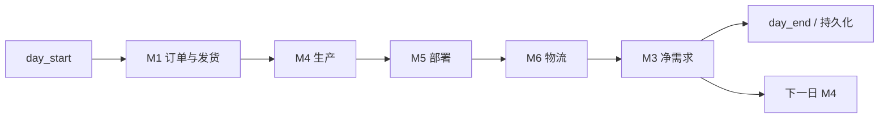

# ChainSight 模块规格说明（Refactor Preview）

## 文档信息

| 项 | 内容 |
|---|---|
| 维护者 | 林宏南 |
| 文档版本 | Preview v2.0 |
| 最后更新 | 2026-08-21 |
| 文档状态 | Preview，持续重构中 |
| 适用范围 | `src/modules/` 与当前集成重构链路 |
| 目标读者 | 算法、后端、测试与技术支持人员 |

> **范围说明**：当前系统不再区分“本地版”和“数据库版”两套模块规格。当前重构链路由 `test/test_run.py` 启动，使用 `Orch`、`StateContext` 和 PostgreSQL 持久化；传入 `--no-persist` 时仅关闭数据库连接与写入，不产生独立的本地版业务链路。
>
> **重构边界**：本文描述五个业务模块的 `integration_refactor.py` 门面与 `backends.py` 后端适配。历史 `integration.py`、`main.py`、旧文件输出接口和 legacy 代码仍为兼容/回归保留，不是当前模块集成合同的权威来源。

---

## 1. 模块架构与统一协议

### 1.1 业务模块总览

ChainSight 公开业务模块为 M1、M3、M4、M5、M6；M2 的 DPS 与供给选择策略内嵌于 M1。

| 模块 | 包路径 | 当前重构门面 | 核心职责 |
|---|---|---|---|
| M1 | `src/modules/demand_planning/` | `ModuleOne` | 需求展开、订单、客户发货、削减与供需日志 |
| M2（内嵌） | M1 子流程 | M1 backend 策略步骤 | DPS 地点拆分与供给选择 |
| M4 | `src/modules/production_planning/` | `ModuleFour` | 无约束生产、产能分配、换产与生产计划 |
| M5 | `src/modules/deployment_planning/` | `ModuleFive` | 网络部署、调拨、优先级、MOQ/RV 与供需平衡 |
| M6 | `src/modules/logistics_execution/` | `ModuleSix` | 车辆/装载、发运、在途、到货与物流规则 |
| M3 | `src/modules/mrp_planning/` | `ModuleThree` | 分层净需求，向下一日 M4 提供反馈 |

### 1.2 通用模块生命周期

所有重构门面继承 `src/modules/module.py` 的 `Module`，遵循一致生命周期：

```python
module.prepare()  # 启动期一次：静态配置、索引和预计算
module.run()      # 每个仿真日一次：读取当前 StateContext View 并计算
result = module.output()  # 返回 pandas DataFrame 组成的结果合同
```

| 阶段 | 责任 |
|---|---|
| `prepare()` | 通过 `Orch.load_datas()` 注入 `schema` 所需静态配置；不得依赖当日状态。 |
| `run()` | 读取 `StateContext` 的动态 View 或受控 getter，完成当日业务计算。 |
| `output()` | 返回字典；所有合同字段必须是 pandas `DataFrame`。 |
| 状态写回 | 集成调度器校验结果后调用 `StateContext.apply_module_result()`；模块不直接突变库存、在途或开放调拨。 |

门面通过各业务包的 `backends.py` 选择 pandas 或 polars 后端。两种后端必须维持同一生命周期、输入语义和结果合同。

### 1.3 执行顺序与状态边界



1. M4 严格消费前一个自然日的 M3 结果；首日使用空净需求合同。
2. M5 发布的 Planning Facts 只在当日 M5→M6→M3 交接中有效，不能作为跨日状态或续跑恢复数据。
3. 每个模块输出均先通过 `validate_module_result()` 校验，再统一写回 `StateContext`。
4. 模块完成后产生的状态由日末事务与 checkpoint 一起持久化；未启用持久化时仅保留内存运行结果。

---

## 2. 统一输入、输出与持久化合同

### 2.1 配置输入

配置由 `ConfigReader` 根据 `src/models/cfg.py` 的模型注册表读取并投影，随后由 `Orch` 依据模块类的 `schema` 分发到 `module.datas`。数据质量检测同样使用模型字段/表约束，确保配置读取、DQ 和数据库结构使用同一事实源。

模块不应绕过 `Orch` 自行读取 Excel 或直接访问配置表。新增配置字段时必须同步更新：

1. `src/models/cfg.py` 的模型和元数据；
2. 需要该字段的模块 `schema`；
3. 模块 backend 的计算逻辑；
4. DQ 规则与相关测试。

### 2.2 集成结果合同

| 模块 | 必需输出 DataFrame |
|---|---|
| M1 | `orders_df`、`shipment_df`、`cut_df`、`supply_demand_df`、`summary_df` |
| M4 | `production_df`、`exceed_log`、`issues_df`、`changeover_log`、`unconstrained_plan` |
| M5 | `deployment_plan`、`unfulfilled_log`、`stock_on_hand_log`、`validation_log` |
| M6 | `delivery_plan`、`vehicle_log`、`truck_usage`、`unsatisfied_log`、`validation_log`、`bypass_log` |
| M3 | `net_demand_df` |

结果合同的权威定义位于 `src/core/orchestrator/models.py`。DataFrame 的业务列由各模块输出和对应 `src/models/` 注册表确定；文档不将 legacy Excel 列顺序或历史文件名视为当前契约。

### 2.3 状态写回矩阵

| 模块 | 状态写回 | 下游影响 |
|---|---|---|
| M1 | 客户发货扣减库存；保存按日订单与供需事实 | M4/M5/M3 的当日需求上下文 |
| M4 | 保存生产 backlog、生产收货、产线状态和已分配产能 | M5/M3 供给视图；后续日 M4 连续性 |
| M5 | 创建可执行开放调拨；发布当日 Planning Facts | M6 发运输入；M3 当日网络规划输入 |
| M6 | 扣减发货库存与开放调拨；写在途、到货及发运日志 | M3 当日供给视图；后续日到货 |
| M3 | 按日期保存净需求 | 下一自然日 M4 输入 |

---

## 3. M1：需求规划与 M2 内嵌策略

### 3.1 重构门面与配置

`demand_planning/integration_refactor.py` 的 `ModuleOne` 实现 M1 生命周期。关键配置包含需求预测、预测误差、订单日历、AO 规则、DPS 和供给选择规则。

| 配置表 | 业务作用 |
|---|---|
| `M1_DemandForecast` | 周度需求预测 |
| `M1_ForecastError` | 订单扰动/误差参数 |
| `M1_OrderCalendar` | 下单日规则 |
| `M1_AOConfig` | AO 提前期与占比 |
| `M1_DPSConfig` | DPS 地点拆分 |
| `M1_SupplyChoiceConfig` | 供给选择调整 |

### 3.2 处理与输出

M1 在静态准备阶段构建预测与订单计算所需状态；每日计算按当前日期生成订单，依据 `StateContext` 当前库存生成发货/削减，并构造供需日志。

| 输出 | 用途 |
|---|---|
| `orders_df` | 当日及累计订单事实；供调度、归档和后续模块使用 |
| `shipment_df` | 客户发货；由状态层扣减库存 |
| `cut_df` | 未满足/削减记录 |
| `supply_demand_df` | M5 与 M3 的需求输入 |
| `summary_df` | M1 汇总统计 |

M1 的随机/提前订单准备状态支持续跑快照恢复，避免中断后重新采样造成不一致。

### 3.3 维护约束

- M2 策略应在 M1 backend 中扩展，保持 M1 结果合同不变。
- `material`、`location` 等标识符必须经统一归一化。
- 发货的库存扣减只能由 `StateContext` 在 M1 结果校验后执行。

---

## 4. M4：生产计划

### 4.1 重构门面与配置

`production_planning/integration_refactor.py` 的 `ModuleFour` 负责生产计划。它使用 M4 物料-地点-产线、产线能力、换产矩阵、换产定义和生产可靠性配置。

| 配置表 | 业务作用 |
|---|---|
| `M4_MaterialLocationLineCfg` | 物料、地点、产线、生产速率、批量和计划参数 |
| `M4_LineCapacity` | 日产能约束 |
| `M4_ChangeoverMatrix` | 物料/产线换产映射 |
| `M4_ChangeoverDefinition` | 换产时间、成本和损失定义 |
| `M4_ProductionReliability` | 生产可靠性参数 |

### 4.2 处理与输出

M4 读取前一日 M3 的 `net_demand_df`，按 layer 0 需求构建无约束计划，执行产能分配、换产和生产可靠性计算。

| 输出 | 用途 |
|---|---|
| `production_df` | 生产计划及可用日期，写入生产 backlog/收货处理 |
| `exceed_log` | 产能超限审计 |
| `issues_df` | 计划与配置问题记录 |
| `changeover_log` | 换产记录 |
| `unconstrained_plan` | 无约束计划审计与回归 |

状态层保存 M4 产线状态和已分配产能，以保持跨日换产连续性及避免重复分配。生产库存增加遵循计划可用日，由 `day_start()` 处理，而不是由 M4 直接修改可用库存。

### 4.3 维护约束

- 不能将当日 M3 输出供当日 M4 使用。
- 换产、产能分配和生产计划的跨日字段修改后必须做多日回归。
- M4 的输入/输出优先走内存结果与 `StateContext`，不依赖每日 Excel 中间文件。

---

## 5. M5：部署规划

### 5.1 重构门面与配置

`deployment_planning/integration_refactor.py` 的 `ModuleFive` 将静态准备与每日运行分离，`run()` 不会隐式执行 `prepare()`。

| 配置表 | 业务作用 |
|---|---|
| `Global_Network` | 有效网络与来源关系 |
| `Global_LeadTime` | 路线前置期 |
| `Global_DemandPriority` | 需求元素优先级 |
| `M3_SafetyStock` | 安全库存需求 |
| `M5_PushPullModel` | Push/Pull 模式 |
| `M5_DeployConfig` | 部署参数（含 MOQ/RV 等业务配置） |
| `M5_SupplyDemandLog` | 供需日志配置/输入 |
| `M4_MaterialLocationLineCfg` | 生产地点参数补充 |

### 5.2 处理与输出

M5 基于当前库存、订单/供需、在途、生产和空间约束，构建当日活动网络、路线参数、节点规划窗口和直接需求，执行分层部署与供给分配。

| 输出 | 用途 |
|---|---|
| `deployment_plan` | 可执行调拨建议；状态层据此创建开放调拨 |
| `unfulfilled_log` | 未满足需求追踪 |
| `stock_on_hand_log` | 部署计算库存轨迹 |
| `validation_log` | 网络、约束和计划校验结果 |

状态层在写入开放调拨前进行稳定排序，并根据物料、发送地、接收地、计划日期、需求元素和数量生成 `DeploymentUID`。同一日还会发布供 M3 使用的 Planning Facts。

### 5.3 维护约束

- 排序规则、`ori_deployment_uid` 和数量字段属于 M5→M6 兼容边界。
- Planning Facts 不持久化为跨日状态；不能用它替代开放调拨、库存或在途记录。
- 新分配策略应在 backend 中实现，并保持 `deployment_plan` 合同与状态处理语义稳定。

---

## 6. M6：物流执行

### 6.1 重构门面与配置

`logistics_execution/integration_refactor.py` 的 `ModuleSix` 只负责静态物流配置准备和当日物流计算；发运结果由外层 `StateContext.apply_module_result()` 写回。

| 配置表 | 业务作用 |
|---|---|
| `M6_TruckReleaseCon` | 发车触发条件 |
| `M6_TruckCapacityPlan` | 路线-车型容量计划 |
| `M6_TruckTypeSpecs` | 车型规格 |
| `M6_MaterialMD` | 物料物流主数据 |
| `M6_DeliveryDelayDistribution` | 路线到货延迟分布 |
| `M6_MDQBypassRules` | MDQ 旁路规则 |
| `Global_DemandPriority` | 需求优先级 |
| `Global_LeadTime` | 路线前置期 |

### 6.2 处理与输出

M6 从 `StateContext` 获取开放调拨、可用库存和物流约束，执行线路、车辆、装载、MDQ、旁路和延迟逻辑。

| 输出 | 用途 |
|---|---|
| `delivery_plan` | 实际交付/发运计划；状态层据此处理库存、在途和收货 |
| `vehicle_log` | 车辆装载明细 |
| `truck_usage` | 车辆/车型使用统计 |
| `unsatisfied_log` | 未满足物流需求 |
| `validation_log` | 物流约束校验 |
| `bypass_log` | MDQ 旁路规则命中审计 |

状态层仅处理实际发运日等于当前日期的交付：扣减发货库存与开放调拨，记录调拨发运；当天到货写入 `delivery_gr`，未来到货转为 `in_transit`。

### 6.3 维护约束

- `ModuleSix.run()` 必须在 `prepare()` 后运行。
- 模块不直接突变 `StateContext`；`delivery_plan` 的写回由调度器统一处理。
- 延迟随机性必须由配置/注入的种子控制；调整 UID 或车辆键时须进行多日 M5/M6 回归。

---

## 7. M3：MRP 净需求

### 7.1 重构门面与配置

`mrp_planning/integration_refactor.py` 的 `ModuleThree` 消费 M5 发布的同日 Planning Facts，以及 M6 写回后的供给状态。

| 配置表 | 业务作用 |
|---|---|
| `M3_SafetyStock` | 安全库存需求 |
| `Global_Network` | 网络层级与来源关系 |
| `Global_LeadTime` | 前置期参数 |
| `M4_MaterialLocationLineCfg` | 生产地点参数 |
| `M5_DeployConfig` | 部署参数补充 |

### 7.2 处理与输出

M3 在当日物流执行后计算网络分层净需求，结果为：

| 输出 | 用途 |
|---|---|
| `net_demand_df` | 按日期存入 `m3_net_demand_by_date`，仅供下一日 M4 使用 |

M3 可通过 backend 在 pandas/polars 下计算，但 `output()` 返回的合同保持 pandas `DataFrame`，以便统一状态写回、持久化和回归比较。

### 7.3 维护约束

- M3 只能读取当日有效的 Planning Facts；新一天必须由 M5 重新发布。
- M3 结果的日期索引与 M4 的一日滞后是跨日兼容性边界。
- 修改网络分层、前置期或净需求逻辑后，必须验证后续日 M4 输入与库存平衡。

---

## 8. 测试、诊断与性能

### 8.1 验证层级

```text
模型驱动配置读取与 DQ
  → 模块 prepare/run/output
  → 模块结果合同
  → StateContext 写回
  → 日末 View 与跨日状态
  → PostgreSQL 持久化、checkpoint 与续跑
```

每次算法或接口变更至少应覆盖：模块合同测试、单日集成、多日状态流转，以及启用持久化时的事务/续跑路径。

### 8.2 性能原则

1. 静态配置、索引与预计算放入 `prepare()`，避免日度重复构建。
2. 保持 `backends.py` 的 pandas/polars 语义一致；性能优化不能绕过结果合同。
3. 优先减少重复 View 构建、DataFrame 转换和明细级跨日扫描。
4. 使用 `test/test_run.py --performance-report` 记录实际阶段耗时；性能结论以目标配置、日期范围和后端为准。

### 8.3 常见排障入口

| 现象 | 优先检查 |
|---|---|
| M1 发货/削减异常 | 当日库存 View、订单日历、DPS/供给选择、`shipment_df` |
| M4 生产连续性异常 | 前日 M3、M4 产线状态、已分配产能和 `production_plan_backlog` |
| M5/M6 单据关联异常 | M5 稳定排序、`ori_deployment_uid`、`deployment_plan` 与 `delivery_plan` |
| M6 到货或库存异常 | 实际发运日、到货日期、`in_transit`、`delivery_gr` |
| 次日生产偏差 | M3 结果日期和 M4 的前一日读取逻辑 |

---

## 9. 模块维护规则

1. 新模块或新结果必须更新 `MODULE_RESULT_DATAFRAMES`、状态写回、持久化注册表和集成测试。
2. 模块可以返回辅助数据，但不得删除、替换或将合同 DataFrame 改为其他类型。
3. 任何直接修改 `StateContext` 的需求必须通过明确的受控接口设计，不得在 backend 中隐式修改业务状态。
4. 新增跨日状态必须覆盖初始化、View、日初/日末、持久化、恢复和多日回归。
5. 修改日期逻辑、稳定排序、业务 UID 或随机种子后，必须执行多日回归。

## 10. 相关文档

- [重构架构总览](../architecture/architecture.md)
- [模块级时序图](../architecture/module_sequence_diagrams.md)
- [Core 详细说明](../architecture/core.md)
- [ChainSight 1.0 运行与维护手册](../architecture/chainsight-1.0.md)