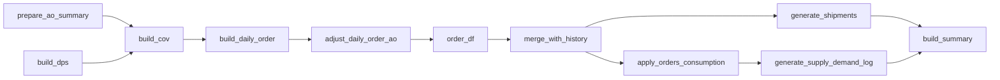
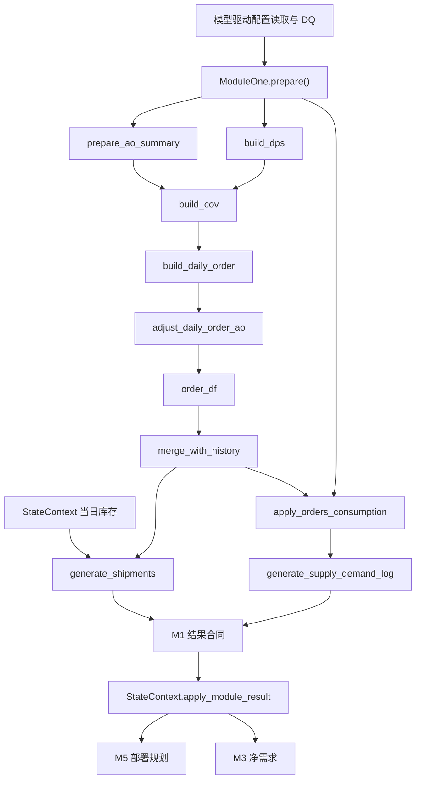

# `src/modules/demand_planning` 模块详细文档（Refactor Preview）

## 文档信息

| 项 | 内容 |
|---|---|
| 维护者 | 林宏南 |
| 文档版本 | Preview v2.0 |
| 最后更新 | 2026-08-21 |
| 文档状态 | Preview，随重构实现更新 |
| 适用范围 | `src/modules/demand_planning/` 当前重构链路 |
| 目标读者 | 算法工程师、测试工程师、业务分析师 |

> **当前实现**：本文以 `integration_refactor.py` 的 `ModuleOne` 和 `backends.py` 为事实源。M1 由 `test/test_integration.py` 创建和调度，通过 `Orch` 读取模型驱动的配置，通过 `StateContext` 消费当日状态并由状态层写回发货影响。
>
> **legacy 文档**：原有基于 `integration.py`、文件输出和旧入口的说明已迁移至 [m1_legacy_demand_planning.md](m1_legacy_demand_planning.md)。legacy 实现仅用于兼容和回归，不是当前 Preview 主链路的权威逻辑。

---

## 目录

1. [模块概述](#1-模块概述)
2. [主要文件说明](#2-主要文件说明)
3. [核心函数详解](#3-核心函数详解)
4. [辅助函数说明](#4-辅助函数说明)
5. [数据流](#5-数据流)

---

## 1. 模块概述

**模块路径**：`src/modules/demand_planning/`

**当前重构门面**：`integration_refactor.py` 中的 `ModuleOne`

**主要职责**：

- 将周度预测按业务规则展开为日度需求；
- 应用 AO、DPS 和供给选择策略；
- 生成订单，并在当日可用库存约束下计算发货与削减；
- 生成供需日志，作为 M5 与 M3 的规划输入；
- 返回统一 pandas DataFrame 结果合同，供 `StateContext` 写回和持久化。

**核心功能点**：

1. **一次性预测准备**：在 `prepare()` 构建 AO 汇总、DPS/供给选择后的周度事实和日度预测基础数据；
2. **日度订单生成**：在 `run()` 合并历史有效订单，按当前日期生成当日订单；
3. **库存约束发货**：使用当日 `StateContext` 库存事实计算发货与削减；
4. **M2 内嵌策略**：DPS 与 Supply Choice 属于 M1 流程，不作为独立日度模块调度；
5. **状态外置写回**：M1 只返回结果，发货扣库存由 `StateContext.apply_module_result("module1", ...)` 统一执行；
6. **后端适配**：pandas/polars 的计算差异封装在 `backends.py`，对外合同保持一致。

---

## 2. 主要文件说明

| 文件名 | 当前定位 | 核心功能 |
|---|---|---|
| `integration_refactor.py` | **当前重构门面** | `ModuleOne` 生命周期、结果合同与兼容入口 |
| `backends.py` | **当前后端实现** | `_PandasBackend` / `_PolarsBackend`，封装订单、发货和供需计算 |

当前文档只描述这两个重构文件。模块不自行读取 Excel，也不将日度结果写入 Excel；静态数据通过 `Orch.load_datas()` 按模块 `schema` 注入，配置字段同时受 `src/models/cfg.py` 和模型驱动 DQ 约束。

---

## 3. 核心函数详解

### 3.1 `integration_refactor.py`：`ModuleOne`

#### 3.1.1 配置 schema

`ModuleOne.schema` 声明 M1 在当前集成链路所需的配置表和关键字段：

| 配置表 | 关键字段 | 用途 |
|---|---|---|
| `M1_DemandForecast` | `material, location, week, quantity` | 周度需求预测 |
| `M1_ForecastError` | `material, location, order_type, error_std_percent` | 订单扰动参数 |
| `M1_OrderCalendar` | `date, order_day_flag` | 下单日规则 |
| `M1_AOConfig` | `material, location, advance_days, ao_percent` | AO 订单规则 |
| `M1_DPSConfig` | `material, location, dps_location, dps_percent` | DPS 地点拆分 |
| `M1_SupplyChoiceConfig` | `material, location, week, adjust_quantity` | 供给选择调整 |

#### 3.1.2 `prepare()`：一次性静态准备

`prepare()` 在仿真开始时由调度器调用一次，完成以下步骤：

主要产物包括：

- `order_df`：经 AO 和误差规则处理后的订单基础数据；
- `daily_detail`：订单流的日度预测；
- `daily_detail_sc`：供需消耗流的日度预测；
- `order_cal`：订单日历。

续跑时，若持久化层存在 M1 快照，`prepare()` 恢复这些准备状态而不重新随机采样，保证中断前后的订单口径一致。

#### 3.1.3 `run()`：当日订单、发货与供需

`run()` 每个仿真日执行一次：

1. 合并历史有效订单与当日新建订单；
2. 校验订单的日期、物料、地点、数量和提前期字段；
3. 根据当前 `StateContext` 库存视图计算客户发货与削减；
4. 对当日订单执行预测消耗，生成供需日志；
5. 生成 M1 汇总数据；
6. 将所有结果统一转换为 pandas DataFrame。

发货量满足库存上限关系：

$$
shipped = \min(ordered, available\_inventory)
$$

$$
cut = ordered - shipped
$$

M1 计算阶段不直接扣减库存；集成调度器在校验 `shipment_df` 后调用状态层统一扣减，避免模块内重复写状态。

#### 3.1.4 `output()`：结果合同与归一化

`output()` 返回当前运行结果，并对 `shipment_df` 进行最终标识符归一化，使下游状态层可以直接消费。必须提供：

| 输出 | 作用 |
|---|---|
| `orders_df` | 累计有效订单，用于 M5 及后续日期消费 |
| `shipment_df` | 当日客户发货；状态层据此扣减库存并记录发货日志 |
| `cut_df` | 当日削减/未满足记录 |
| `supply_demand_df` | 供需日志，供 M5 与 M3 使用 |
| `summary_df` | M1 汇总统计 |

门面还可返回 `orders_to_persist`（仅当日新建订单）和 `all_orders_for_next_day` 等辅助数据。`orders_to_persist` 用于防止将未到期的历史订单重复写入持久化层，不替代 `orders_df` 的内存业务语义。

#### 3.1.5 空结果与错误边界

若 M1 运行异常，`_empty_result()` 仍返回包含全部合同 key 的空 DataFrame 字典。调用方应将异常日志与输入 View 一起诊断；不应以缺失 key 的方式跳过模块合同。

### 3.2 `backends.py`：pandas 与 polars 实现

`ModuleOne` 将具体计算委托给 `_PandasBackend` 或 `_PolarsBackend`。两套后端使用相同的方法签名和业务步骤，区别只在 DataFrame 计算实现。

#### 3.2.1 `prepare_ao_summary()`

**功能**：整理 AO 配置，生成订单类型拆分规则。

**输入**：`M1_AOConfig`，关键字段为 `material`、`location`、`advance_days`、`ao_percent`。

**处理逻辑**：

1. 按物料、地点、提前期和 AO 占比去重；
2. 按 `(material, location)` 汇总 AO 占比；
3. 构造 AO 类型记录；
4. 计算 normal 类型占比：$normal = 1 - clip(AO, 0, 1)$；
5. 过滤 normal 占比为零的记录。

**返回值**：AO 明细配置和按物料地点汇总的 AO/normal 占比表。前者用于 AO 日期前移，后者用于预测数量拆分。

#### 3.2.2 `build_dps()`

**功能**：应用 DPS 和 Supply Choice，构建订单流与供需消耗流的周度需求。

**输入**：周度预测、`M1_DPSConfig`、`M1_SupplyChoiceConfig`。

**处理逻辑**：

1. 将 DPS 比例转换为“原地点保留比例 + DPS 地点比例”两条映射；
2. 按周、物料、地点聚合原始预测，计算 `week_start` 和月份；
3. 将预测与 DPS 映射关联，计算拆分后的 `quantity_percentage`；
4. 以该数量构造订单流 `quantity_total`；
5. 若存在 Supply Choice 配置，则按周、物料、地点关联 `adjust_quantity`，得到供需消耗流数量；否则消耗流与订单流相同。

**返回值**：`demand_forecast_total`（订单流）和 `demand_forecast_total_sc`（供需消耗流）。

#### 3.2.3 `build_cov()`

**功能**：将 DPS 后预测拆为 AO/normal，并施加可复现的预测误差扰动。

**输入**：订单流周度需求、AO/normal 占比、`M1_ForecastError`。

**处理逻辑**：

1. 按物料、地点关联 AO/normal 占比；没有配置时按 normal、100% 处理；
2. 计算每类订单的 `split_quantity`；
3. 按误差百分比计算绝对标准差，生成非负整数的随机 `cov_quantity_raw`；
4. 对每个 `(material, location, month, order_type)` 分组计算救援比例；
5. 使用救援比例缩放扰动结果，使组内 `cov_quantity` 合计恢复到原拆分数量口径。

**返回值**：含 `cov_quantity`、`order_type`、月份和误差计算字段的订单流预测。

> 随机采样由运行配置注入的模块种子控制。续跑时应使用 M1 快照恢复 prepare 结果，而非重新采样。

#### 3.2.4 `build_daily_order()`

**功能**：将周度数量按订单日规则拆分为日度数量。

**输入**：周度需求流、`M1_OrderCalendar` 和待拆分数量列（例如 `quantity_total` 或 `cov_quantity`）。

**处理逻辑**：

1. 为每个周起始日生成连续 7 个 `simulation_date`；
2. 关联订单日历中的 `order_day_flag`；未匹配时使用默认订单日；
3. 统计每周有效订单日数量 `flag_count`；
4. 将周度整数数量除以 `flag_count` 得到基础数量；
5. 将余数按日期顺序前置分配到有效订单日。

**返回值**：带 `simulation_date`、订单日标记和日度 `quantity` 的预测明细。该规则保证周度数量在可下单日之间以整数形式守恒。

#### 3.2.5 `adjust_daily_order_ao()`

**功能**：应用 AO 明细比例和提前期，将日度预测转换为订单基础表。

**输入**：日度订单流和 AO 明细配置。

**处理逻辑**：

1. 按物料、地点和订单类型关联 AO 明细；
2. 将日度数量按明细 `percent / ao_percent` 分配；
3. 使用 `advance_days` 调整订单需求日期；
4. 将内部 `order_type` 重命名为对外 `demand_type`。

**返回值**：`order_df`。它保存所有可在后续自然日筛选的订单基础记录。

#### 3.2.6 `merge_with_history()`

**功能**：从订单基础表分离当天新建订单和当天仍有效的累计订单。

**输入**：`order_df` 和当前仿真日期。

**处理逻辑**：

1. 筛选 `simulation_date == 当前日期` 的 `today_orders`；
2. 在完整订单表中保留“创建日期不晚于当前日期，且需求日期不早于当前日期”的记录；
3. 按日期、物料、地点、需求类型、创建日期、提前期和数量去重；
4. 归一化业务标识符，并保证必要的 `simulation_date` 字段存在。

**返回值**：`all_orders`（供发货与下游使用）和 `today_orders`（供当日持久化与预测消耗）。

#### 3.2.7 `generate_shipments()`

**功能**：在有效订单日基于当前可用库存计算客户发货与削减。

**输入**：有效订单、当前仿真日期、由 `StateContext` 提供的库存事实和日度预测明细。

**处理逻辑**：

1. 读取当日 `order_day_flag`；非订单日直接返回空结果；
2. 调用库存约束发货逻辑，将订单与当前库存匹配；
3. 计算实际发货和未满足数量；
4. 清除旧逻辑生成、但仅用于内部占位的零数量 cut 记录。

**返回值**：`shipment_df` 和 `cut_df`。

> 本函数不修改库存。`StateContext` 在模块输出合同校验后，根据 `shipment_df` 统一扣减库存并记录发货日志。

#### 3.2.8 `apply_orders_consumption()`

**功能**：使用当日新建订单消耗供需消耗流中的预测数量。

**输入**：`daily_detail_sc` 和 `today_orders`。

**处理逻辑**：

1. 对预测和订单执行物料、地点等标识符归一化；
2. 按 `(material, location, date)` 建立预测行索引；
3. 分别排序 AO 与 normal 订单，保证消耗顺序稳定；
4. 对每笔订单依次尝试订单日、前两日和后续三日的既定偏移窗口；
5. 从对应预测数量中扣减可消耗部分，直至订单数量耗尽或没有可用预测。

**返回值**：数量已扣减的 `consumed_forecast`。

#### 3.2.9 `generate_supply_demand_log()`

**功能**：从订单消耗后的预测中生成供 M5 和 M3 使用的未来需求日志。

**输入**：消耗前/后的预测明细、当前仿真日期。

**处理逻辑**：

1. 过滤当前日期之后、且不超过 `M1_FUTURE_CUTOFF_DAYS` 的未来记录；
2. 按 `date`、`material`、`location` 聚合剩余数量；
3. 标记 `demand_element = "forecast"`；
4. 归一化业务标识符并保留标准输出列。

**返回值**：`supply_demand_df`。

#### 3.2.10 `build_summary()`

**功能**：构造 M1 当日汇总统计。

**输入**：订单、发货、削减和供需日志 DataFrame。

**处理逻辑**：统计订单、发货、削减处理和供需日志的记录数，并保留结果关联日期。历史口径中 `Total_Cuts` 按发货计算粒度统计，即使 `cut_df` 只保留真实短缺行也不改变该汇总定义。

**返回值**：单行 `summary_df`。

上述步骤的关键数据关系如下：

Polars 后端使用原生表达式处理标识符与数值转换，避免逐元素 Python 映射；最终仍转换为 pandas DataFrame 以满足集成结果合同。

### 3.3 `run_daily_order_generation()`：兼容入口

`integration_refactor.py` 保留 `run_daily_order_generation()` 兼容函数。它创建 `ModuleOne`，按需调用 `prepare()` 和 `run()` 后返回 `output()`。当前完整链路直接复用已创建的 `ModuleOne` 实例并在循环前完成一次 `prepare()`，因此不应在日度循环中反复通过兼容入口创建新实例。

---

## 4. 辅助函数说明

### 4.1 `validate_data()`：结果数据安全校验

`ModuleOne.validate_data()` 复用模块公共校验能力；Polars 后端提供对应适配。

**功能**：检查结果 DataFrame 是否具有必需字段，并将数量、提前期等数值字段安全转换为可计算值。

**当前使用位置**：

| 数据集 | 必需字段 | 典型数值字段 |
|---|---|---|
| `orders_df` | `date, material, location` | `quantity, advance_days` |
| `shipment_df` | `date, material, location` | `quantity` |
| `supply_demand_df` | `date, material, location` | `quantity` |

缺失必需字段会触发错误；数值中无法转换、NaN 或无穷值会按公共校验策略记录并安全处理。该校验是 M1 结果进入 `StateContext` 前的最后一道模块内防线。

### 4.2 `get_order_day_flag()`：订单日开关

**功能**：从 `M1_OrderCalendar` 查询当前仿真日的 `order_day_flag`。

**作用**：只有订单日才会执行客户发货计算；非订单日 `generate_shipments()` 返回空发货和削减结果。该开关由 M1 设置在当前状态上下文兼容属性上，供发货计算使用。

### 4.3 `_apply_fast_consumption()`：快速订单消耗

该函数位于 `ModuleOne` 门面，用于支持 backend 的预测消耗过程。

**功能**：根据预建的 `(material, location, date)` 索引，逐订单扣减预测数量，避免对每笔订单重复扫描完整预测表。

**关键规则**：

1. 跳过空、非正数量或无法解析日期的订单；
2. 在固定日期偏移顺序中查询候选预测行；
3. 每次扣减不超过当前订单剩余量和预测可用量；
4. 订单或候选预测耗尽后立即停止循环。

该函数不改变订单表，只更新供需消耗流的数量数组，最终由 backend 写回 `consumed_forecast`。

### 4.4 标识符归一化

当前重构门面使用 `src/utils/normalization.py` 的统一逻辑，并在 `output()` 对 `shipment_df` 再次兜底归一化。

| 字段 | 规范化规则 |
|---|---|
| `material` | 去除数值型编码的 `.0` 后缀，移除首尾空白 |
| `location` / `dps_location` | 纯数字地点左补零至 4 位 |
| `sending` / `receiving` / `sourcing` | 与地点使用一致的业务键规范 |

归一化是订单、库存、发货与下游 M5/M3 关联成功的前提。不得在不同 backend 中引入不一致的键处理逻辑。

### 4.5 `_empty_result()`：失败时的合同保持

**功能**：当 M1 计算异常时，返回包含 `orders_df`、`shipment_df`、`cut_df`、`supply_demand_df` 和 `summary_df` 等完整 key 的空结果。

**作用**：避免模块失败时因缺少结果字段而掩盖原始错误；集成调度器仍可按统一合同定位失败阶段。

---

## 5. 数据流

**数据输入**：

1. 模型驱动读取并完成 DQ 的 M1 预测、日历、AO、DPS 和供给选择配置；
2. 当前仿真日期和模块随机种子；
3. `StateContext` 提供的当日库存事实；
4. 续跑时持久化的 M1 prepare 快照。

**数据输出**：

| 输出 | 状态/下游用途 |
|---|---|
| `orders_df` | 保存当日订单事实，供 M5 和后续日 M1 使用 |
| `orders_to_persist` | 仅持久化当日新建订单，避免历史订单重复落库 |
| `shipment_df` | 状态层扣减库存并记录客户发货 |
| `cut_df` | 未满足订单审计与汇总 |
| `supply_demand_df` | M5/M3 的未来需求输入 |
| `summary_df` | M1 日度汇总 |

**状态边界**：M1 只计算和返回业务结果；库存、发货日志、按日订单/供需事实的持久状态均由 `StateContext` 在结果合同校验后统一维护。

---

## 附录：相关文档

- [模块总览](modules.md)
- [模块级时序图](../architecture/module_sequence_diagrams.md)
- [重构架构总览](../architecture/architecture.md)
- [Legacy M1 需求规划文档](m1_legacy_demand_planning.md)

