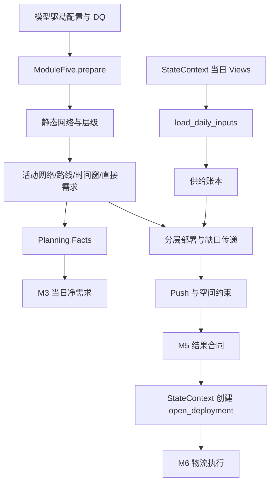

# `src/modules/deployment_planning` 模块详细文档（Refactor Preview）

## 文档信息

| 项 | 内容 |
|---|---|
| 维护者 | 林宏南 |
| 文档版本 | Preview v2.0 |
| 最后更新 | 2026-08-21 |
| 文档状态 | Preview，随重构实现更新 |
| 适用范围 | `src/modules/deployment_planning/` 当前重构链路 |
| 目标读者 | 算法工程师、测试工程师、业务分析师 |

> **当前实现**：本文以 `integration_refactor.py` 的 `ModuleFive` 和 `backends.py` 为事实源。M5 由集成调度器在 M4 后、M6 前运行；它读取 `StateContext` 当日 View，返回结果合同，由状态层统一创建开放调拨。
>
> **边界**：不存在独立的本地版模块路径；`--no-persist` 仅关闭数据库持久化。模块不自行读写 Excel、CSV 或 PostgreSQL；旧 `main.py` 等文件不构成当前主路径。

---

## 目录

1. [模块概述](#1-模块概述)
2. [主要文件说明](#2-主要文件说明)
3. [核心函数详解](#3-核心函数详解)
4. [辅助函数说明](#4-辅助函数说明)
5. [数据流](#5-数据流)

---

## 1. 模块概述

**模块路径**：`src/modules/deployment_planning/`

**当前重构门面**：`integration_refactor.py` 中的 `ModuleFive`

M5 在活动供应网络内执行逐日部署规划：收集直接需求和上游缺口，按优先级、MOQ/RV、未来供给与空间限制分配库存，生成调拨建议和未满足记录。

**核心功能点**：

1. 在 `prepare()` 中一次性标准化静态网络并构建网络层级；
2. 在 `run()` 中读取库存、在途、收货、生产、订单、供需和空间等当日事实；
3. 发布仅供当日 M3 消费的 Planning Facts；
4. 按层级分配可用库存和未来供给，传递未满足缺口；
5. 追加 Push/Soft-Push 补货并应用接收地空间约束；
6. 返回部署、未满足、SOH 和校验合同，由 `StateContext` 写回开放调拨。

---

## 2. 主要文件说明

| 文件名 | 当前定位 | 核心功能 |
|---|---|---|
| `integration_refactor.py` | **当前重构门面** | `ModuleFive` 生命周期、Static/Daily 编排、Planning Facts 发布与结果合同 |
| `backends.py` | **当前后端实现** | `_PandasBackend` / `_PolarsBackend`，网络、供给账本、分层分配、Push、空间约束和结果生成 |

配置通过 `Orch.load_datas()` 按 `ModuleFive.schema` 注入。模型驱动 DQ 与 `src/models/cfg.py` 负责字段约束；M5 不自行加载配置文件。

---

## 3. 核心函数详解

### 3.1 `integration_refactor.py`：`ModuleFive`

#### 3.1.1 配置 schema

| 配置表 | 作用 |
|---|---|
| `Global_Network` | 有效网络、节点和来源关系 |
| `Global_LeadTime` | 路线 PDT/GR/MCT 前置期 |
| `Global_DemandPriority` | 需求元素优先级 |
| `M3_SafetyStock` | 安全库存需求 |
| `M5_PushPullModel` | Push/Soft-Push 模式 |
| `M5_DeployConfig` | 路线部署 MOQ/RV 等参数 |
| `M5_SupplyDemandLog` | 静态供需日志回退来源 |
| `M4_MaterialLocationLineCfg` | 路线 PTF/LSK 参数补充 |

#### 3.1.2 `prepare()`：静态网络准备

**功能**：加载配置、规范化静态表、验证网络并建立层级索引。

**处理步骤**：

1. `load_static_data()` 通过 `Orch.load_datas()` 获取 schema 配置；
2. `normalise_static_config()` 标准化静态表和 LeadTime 列；
3. `validate_static_network()` 检查网络的物料、地点和来源字段；
4. `build_network_layers()` 为 `(material, location)` 构建层级；
5. `store_static_state()` 缓存静态配置、层级映射和按层处理顺序。

**返回/状态**：不生成日度结果；静态状态仅存于 backend，且 `run()` 不会隐式重复调用 `prepare()`。

#### 3.1.3 `load_daily_inputs()`：读取当日状态 View

**功能**：将 `StateContext` 动态事实与静态配置拼成当日计算输入。

**输入 View**：期初库存、客户发货、当日生产、交付收货、在途、开放调拨、空间配额，以及 M1 的按日订单和供需事实。

**关键语义**：当日存在 M1 供需日志时优先使用它；没有时才使用静态 `M5_SupplyDemandLog`。开放调拨优先读取聚合供给 View，以避免 UID 明细跨日增长拖慢规划。

#### 3.1.4 `build_active_network()`、`build_route_parameters()` 与规划窗口

**功能**：从有效期覆盖当前日期的网络关系构建活动网络、路线参数和节点时间窗。

**处理逻辑**：

1. `build_active_network()` 按 `eff_from/eff_to` 过滤可用网络；
2. `validate_config()` 构建需求元素优先级并记录配置问题；
3. `build_route_parameters()` 合并 LeadTime、PTF/LSK 和 DeployConfig，计算路线 lead time、MOQ、RV；
4. `build_node_horizon()` 为各节点定义可参与当日规划的需求窗口；
5. `build_direct_demand()` 收集订单、供需、安全库存等直接需求。

**返回**：活动网络、路线事实、节点时间窗和直接需求。它们既服务 M5 分层分配，也构成 M5→M3 的规划事实。

#### 3.1.5 `publish_planning_facts()`：同日 M5→M3 交接

**功能**：将活动网络、路线、节点时间窗、直接需求、层级映射写入 `StateContext` 的临时 Planning Facts。

**边界**：Planning Facts 仅在当前日 `M5 → M6 → M3` 有效；下一次 `day_start()` 会清空它们，不能作为跨日状态、checkpoint 恢复数据或持久化替代品。

#### 3.1.6 `build_supply_ledger()` 与 `build_layer_plan()`

**功能**：构造可用库存、未来供给池和按网络层级的部署计划。

**处理步骤**：

1. `build_supply_ledger()` 汇总库存、当天收货/生产、在途、开放调拨、未来生产与客户发货；
2. `build_layer_plan()` 从下游层向上游层处理直接需求和传入 gap；
3. 先按需求优先级分配现有库存，再使用在途、开放调拨入库和未来生产等供给池；
4. 对未满足数量记录 `unfulfilled_log`，并以行粒度创建上游 gap；
5. 使用 MOQ/RV 将规划数量按路线业务规则取整。

**返回**：常规 `deployment_plan`、直接需求与未满足记录。

#### 3.1.7 `build_push_plan()` 与 `apply_space_constraints()`

**功能**：补充 Push/Soft-Push 调拨，并按接收地空间限制二次削减。

**处理逻辑**：

- `build_push_plan()` 仅在常规需求已满足且配置为 push/soft push 时使用剩余库存；Soft-Push 会保留发送端安全库存。
- `apply_space_constraints()` 按接收地、日期和需求优先级顺序消耗 `max_qty`；被空间限制削减的数量追加为未满足记录。

**返回**：最终部署计划和空间约束导致的未满足记录。

#### 3.1.8 `finalise_result()`：结果合同

**功能**：稳定排序并返回以下 pandas DataFrame：

| 输出 | 含义 |
|---|---|
| `deployment_plan` | 部署建议，包含发送地、接收地、计划数量、路线日期和需求元素 |
| `unfulfilled_log` | 供给或空间不足的未满足记录 |
| `stock_on_hand_log` | 当日 SOH 轨迹 |
| `validation_log` | 网络/配置校验信息 |

### 3.2 `backends.py`：pandas 与 polars 实现

Pandas 和 Polars 后端使用相同的业务步骤：静态配置标准化、活动网络、供给账本、层级分配、Push、空间约束和结果收尾。Polars 可加速表操作，但最终合同仍转换为 pandas DataFrame。

### 3.3 状态写回

调度器校验 M5 合同后调用 `StateContext.apply_module_result("module5", result, date)`。状态层对可执行跨节点部署稳定排序，并生成 `DeploymentUID` / `ori_deployment_uid` 后写入 `open_deployment`。

排序、数量字段和 UID 序列是 M5→M6 单据关联的兼容性边界；模块 backend 不得直接修改开放调拨或库存。

---

## 4. 辅助函数说明

### 4.1 `round_routes()` 与优先级分配

`round_routes()` 将需求按路线 MOQ/RV 取整；`allocate_priority()` 以物料和发送节点为库存池，先满足高优先级需求，同优先级不足时按既定比例规则分配。排序必须稳定，避免相同输入产生不同调拨 UID。

### 4.2 `allocate_pipeline()` 与 `next_gap()`

`allocate_pipeline()` 使用未来在途、开放调拨入库和未来生产等供给池补充常规库存分配。`next_gap()` 将仍未满足的需求逐行传递至上游节点；行粒度不可随意合并，否则会改变后续 MOQ/RV、优先级与计划数量。

### 4.3 空结果

`empty_result()` 保持四个结果 DataFrame key 存在。模块异常或无需求时，合同结构仍应完整，以便集成调度器统一处理。

---

## 5. 数据流

**状态边界**：M5 计算部署建议和同日 Planning Facts；开放调拨、UID、库存与跨日状态只由 `StateContext` 在结果合同校验后维护。

---

## 附录：相关文档

- [模块总览](modules.md)
- [模块级时序图](../architecture/module_sequence_diagrams.md)
- [重构架构总览](../architecture/architecture.md)