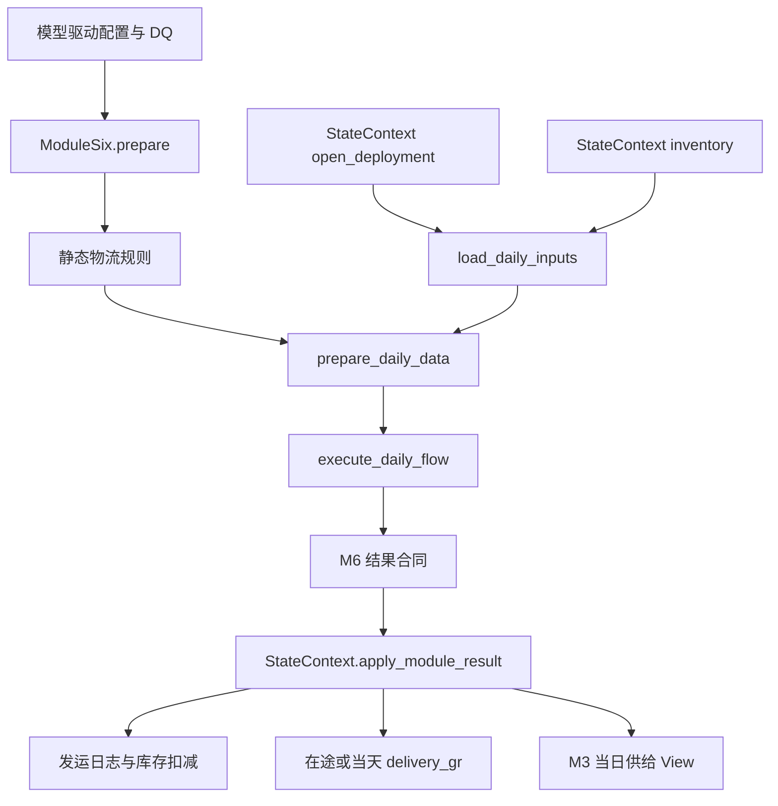

# `src/modules/logistics_execution` 模块详细文档（Refactor Preview）

## 文档信息

| 项 | 内容 |
|---|---|
| 维护者 | 林宏南 |
| 文档版本 | Preview v2.0 |
| 最后更新 | 2026-08-21 |
| 文档状态 | Preview，随重构实现更新 |
| 适用范围 | `src/modules/logistics_execution/` 当前重构链路 |
| 目标读者 | 算法工程师、测试工程师、业务分析师 |

> **当前实现**：本文以 `integration_refactor.py` 的 `ModuleSix` 和 `backends.py` 为事实源。M6 在 M5 后、M3 前执行；它读取 `StateContext` 的开放调拨和库存 View，计算物流结果，但不直接变更业务状态。
>
> **边界**：不存在独立本地版模块路径；`--no-persist` 仅禁用持久化。模块不自行读写 Excel、CSV 或 PostgreSQL；旧 `main.py` 和旧文件输出接口不构成当前主路径。

---

## 目录

1. [模块概述](#1-模块概述)
2. [主要文件说明](#2-主要文件说明)
3. [核心函数详解](#3-核心函数详解)
4. [辅助函数说明](#4-辅助函数说明)
5. [数据流](#5-数据流)

---

## 1. 模块概述

**模块路径**：`src/modules/logistics_execution/`

**当前重构门面**：`integration_refactor.py` 中的 `ModuleSix`

M6 将 M5 创建的开放调拨转化为车辆、发运、到货日期、未满足物流需求和校验记录。M6 负责计算“可执行什么物流动作”；`StateContext` 负责将实际发运写入库存、开放调拨、在途和收货状态。

**核心功能点**：

1. 在 `prepare()` 中加载、规范化和校验静态物流配置；
2. 读取当日开放调拨和可用库存；
3. 预处理优先级、物料转换、车辆规格和调拨 UID；
4. 执行路线、车型、MDQ、旁路、装载与延迟计算；
5. 输出交付、车辆、车型使用、未满足、校验和旁路记录；
6. 由状态层统一处理实际发运、在途和到货。

---

## 2. 主要文件说明

| 文件名 | 当前定位 | 核心功能 |
|---|---|---|
| `integration_refactor.py` | **当前重构门面** | `ModuleSix` 生命周期、后端委托和结果合同 |
| `backends.py` | **当前后端实现** | `_PandasBackend` / `_PolarsBackend`，物流配置、调拨预处理、模拟执行和结果生成 |

静态配置由 `Orch.load_datas()` 注入；动态开放调拨和库存从 `StateContext` 读取。模块不直接操作数据库，也不应自行变更 `StateContext` 容器。

---

## 3. 核心函数详解

### 3.1 `integration_refactor.py`：`ModuleSix`

#### 3.1.1 配置 schema

| 配置表 | 业务作用 |
|---|---|
| `M6_TruckReleaseCon` | 路线/车型的发车触发参数 WFR/VFR |
| `M6_TruckCapacityPlan` | 日期和路线可用车型/容量计划 |
| `M6_TruckTypeSpecs` | 车型重量、体积等规格 |
| `M6_MaterialMD` | 物料需求单位到重量/体积的换算 |
| `M6_DeliveryDelayDistribution` | 路线延迟分布 |
| `M6_MDQBypassRules` | MDQ 旁路规则 |
| `Global_DemandPriority` | 需求元素优先级 |
| `Global_LeadTime` | 路线前置期 |

#### 3.1.2 `prepare()`：静态物流准备

**功能**：一次性加载、规范化、验证并缓存静态物流配置。

**处理步骤**：

1. `load_static_data()` 通过 `Orch.load_datas()` 获取 schema 配置；
2. `normalise_static_config()` 规范化标识符，将读取层可能小写化的 `wfr/vfr`、`pdt/gr/otd` 恢复为业务列名，并解析日期列；
3. `validate_static_config()` 检查必需物流配置集合；
4. `store_static_state()` 缓存静态表。

`prepare()` 不读取每日开放调拨，不变更库存，且 `run()` 不会隐式调用它。

#### 3.1.3 `load_daily_inputs()`：读取当日调拨与库存

**功能**：从 `StateContext` 获取当前开放调拨与可用库存 View。

**输入**：`get_open_deployment_view()`、`get_unrestricted_inventory_view()`。

**返回值**：标准化后的 `DeploymentPlan` 与 `Inventory`。M6 不直接读取 M5 的内存结果字典，确保其输入是状态层已确认的可执行开放调拨。

#### 3.1.4 `prepare_daily_data()`：调拨和物流参数预处理

**功能**：将当日 View 和静态配置转换为物流模拟所需的运行参数与准备数据。

**处理步骤**：

1. 校验开放调拨、车型触发配置及车辆规格；
2. 构建需求优先级、物料重量/体积和车型规格映射；
3. 对缺少物料主数据的记录写入校验日志，并使用默认单位换算；
4. 按计划发运日、路线、物料和需求元素稳定排序调拨；
5. 为缺少 UID 的记录生成临时 UID，并处理重复 `ori_deployment_uid`；
6. 构建当日车型容量映射和可用库存字典；
7. 形成包含等待天数、随机种子和单日日期范围的运行参数。

**返回值**：`run_params` 和 `prepared_data`。后者包含准备后的调拨、路线规则、延迟分布、旁路规则、容量与校验日志。

#### 3.1.5 `execute_daily_flow()`：物流模拟

**功能**：执行当前日路线、车型和车辆装载状态机。

**处理逻辑**：

1. 使用注入的随机种子，确保延迟采样可复现；
2. 将 StateContext 库存包装为只包含必要接口的运行适配器；
3. 根据路由、容量、MDQ 触发阈值、旁路规则和等待限制执行物流模拟；
4. 生成车辆、发运、未满足和旁路事件。

**返回值**：由物流模拟循环产生的原始结果集合。顺序敏感的车辆装载在稳定排序后的记录上运行，不应随意改变 UID 或记录顺序。

#### 3.1.6 `finalise_result()`：结果合同

**功能**：将模拟结果整理为统一 pandas DataFrame 合同。

| 输出 | 含义 |
|---|---|
| `delivery_plan` | 计划/实际交付与发运明细 |
| `vehicle_log` | 车辆装载日志 |
| `truck_usage` | 车型使用统计 |
| `unsatisfied_log` | MDQ、容量或等待导致的未满足需求 |
| `validation_log` | 配置和输入数据校验日志 |
| `bypass_log` | MDQ 旁路规则命中日志 |

### 3.2 `backends.py`：pandas 与 polars 实现

两套 backend 提供相同的静态配置、日度预处理、物流执行和结果收尾步骤。Polars 用于表驱动规范化、映射、过滤、排序和容量索引；车辆装载仍是顺序敏感状态机，因此遵循相同业务顺序。最终合同保持 pandas DataFrame。

### 3.3 状态写回

调度器校验 M6 合同后调用 `StateContext.apply_module_result("module6", result, date)`：

1. 只处理实际发运日等于当前日期的交付；
2. 扣减发送地库存和对应开放调拨；
3. 记录 `delivery_shipment_log`；
4. 当天到货则增加接收地库存并写入 `delivery_gr`；
5. 未来到货则创建 `in_transit` 记录。

M6 本身不直接扣库存，也不直接减少开放调拨。`ori_deployment_uid` 与 `vehicle_uid` 是关联、去重和回归的兼容性键。

---

## 4. 辅助函数说明

### 4.1 `_prepare_deployment_plan()` 与 `_handle_uid_duplicates()`

前者按业务键稳定排序、补齐 UID、映射优先级并初始化等待天数；后者检测重复 `ori_deployment_uid`，将问题写入 `validation_log` 后保留首条记录。M5 的稳定 UID 规则与 M6 的车辆关联必须共同维护。

### 4.2 物料、优先级和车型映射

`_build_priority_map()`、`_build_material_map()` 和 `_build_spec_map()` 构造快速查询映射。缺失物料元数据时 `_process_material_metadata()` 记录告警并使用重量/体积 $1.0$ 的默认值，保证运行结果仍符合合同。

### 4.3 空结果

`empty_result()` 为全部六个结果 DataFrame 建立空结构。无开放调拨不属于异常，仍应返回完整合同。

---

## 5. 数据流

**状态边界**：M6 仅生成物流计算结果；库存、开放调拨、在途和收货都由状态层在合同校验后写回。

---

## 附录：相关文档

- [模块总览](modules.md)
- [模块级时序图](../architecture/module_sequence_diagrams.md)
- [重构架构总览](../architecture/architecture.md)