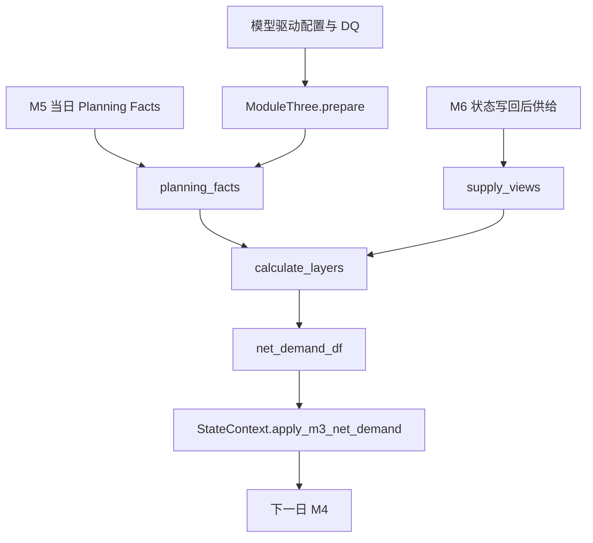

# `src/modules/mrp_planning` 模块详细文档（Refactor Preview）

## 文档信息

| 项 | 内容 |
|---|---|
| 维护者 | 林宏南 |
| 文档版本 | Preview v2.0 |
| 最后更新 | 2026-08-21 |
| 文档状态 | Preview，随重构实现更新 |
| 适用范围 | `src/modules/mrp_planning/` 当前重构链路 |
| 目标读者 | 算法工程师、测试工程师、业务分析师 |

> **当前实现**：本文以 `integration_refactor.py` 的 `ModuleThree` 和 `backends.py` 为事实源。M3 在 M6 写回状态后执行，消费 M5 同日发布的 Planning Facts 和当前供给 View，输出仅供下一自然日 M4 使用的净需求。
>
> **边界**：不存在独立本地版模块路径；`--no-persist` 仅关闭持久化。模块不自行读取每日 Excel/CSV 结果，也不直接写数据库；旧 `integration.py` 等文件不构成当前主路径。

---

## 目录

1. [模块概述](#1-模块概述)
2. [主要文件说明](#2-主要文件说明)
3. [核心函数详解](#3-核心函数详解)
4. [辅助函数说明](#4-辅助函数说明)
5. [数据流](#5-数据流)

---

## 1. 模块概述

**模块路径**：`src/modules/mrp_planning/`

**当前重构门面**：`integration_refactor.py` 中的 `ModuleThree`

M3 对 M5 当日活动网络执行分层净需求计算。它将 AO、预测和安全库存需求与库存、在途、收货、生产、客户发货、调拨发运和开放调拨供给进行平衡，形成按物料、地点和层级组织的缺口记录。

**核心功能点**：

1. `prepare()` 一次性加载静态安全库存、网络、前置期和生产/部署参数；
2. `run()` 获取版本化 Planning Facts，并读取 M6 写回后的供给 View；
3. 从下游层向上游层计算 AO、FC、SS 三类缺口；
4. 按路线 MOQ/RV 将总缺口拆分并传递至上游；
5. 将 `net_demand_df` 通过受控接口保存，以供下一自然日 M4 使用。

---

## 2. 主要文件说明

| 文件名 | 当前定位 | 核心功能 |
|---|---|---|
| `integration_refactor.py` | **当前重构门面** | `ModuleThree` 生命周期、StateContext 读取与净需求写回 |
| `backends.py` | **当前后端实现** | `_PandasBackend` / `_PolarsBackend`，Planning Facts、供给 View、分层缺口和结果合同 |

静态配置由 `Orch.load_datas()` 按 schema 注入；动态网络与直接需求来自 M5 当日 Planning Facts，不依赖模块文件输出。

---

## 3. 核心函数详解

### 3.1 `integration_refactor.py`：`ModuleThree`

#### 3.1.1 配置 schema

| 配置表 | 作用 |
|---|---|
| `M3_SafetyStock` | 安全库存需求 |
| `Global_Network` | 网络和来源关系 |
| `Global_LeadTime` | 路线前置期 |
| `M4_MaterialLocationLineCfg` | 根节点 PTF/LSK 规划窗口参数 |
| `M5_DeployConfig` | 路线 MOQ/RV 参数补充 |

#### 3.1.2 `prepare()`：静态 MRP 准备

**功能**：加载并规范化 M3 所需静态配置。

**处理步骤**：

1. 通过 `Orch.load_datas()` 获取 schema 配置；
2. `normalise_static_config()` 统一业务标识符、日期和 LeadTime 列名；
3. `store_static_state()` 缓存静态配置；
4. 标记模块已准备。

Planning Facts 是 M5 每日运行后产生的动态数据，因此不在 `prepare()` 中读取。

#### 3.1.3 `run()`：当日分层净需求

**功能**：消费同日 M5 Planning Facts 和 M6 后供给状态，计算净需求。

**处理步骤**：

1. 从 `StateContext.get_planning_facts(day)` 获取 M5 发布的版本化事实；
2. 使用 `planning_facts()` 校验版本、规范化 DataFrame，并补齐根节点 horizon 与安全库存直接需求；
3. 使用 `supply_views()` 获取日初库存、在途、交付收货、生产、开放调拨、客户发货和调拨发运 View；
4. 调用 `calculate_layers()` 由下游层向上游层计算缺口；
5. 调用 `finalise_result()` 生成 `net_demand_df`；
6. 通过 `StateContext.apply_m3_net_demand()` 按当前结果日期保存净需求。

**重要时序**：M3 可看到 M6 已写回的当日发运、在途与到货状态；但 M3 结果不得被当日 M4 消费，M4 只读取前一日结果。

#### 3.1.4 `output()`：结果合同

M3 输出合同为：

| 输出 | 含义 |
|---|---|
| `net_demand_df` | 按物料、地点、需求日期、需求元素和层级组织的净需求 |

backend 也维护 `net_demand_count` 统计；但集成合同要求 `net_demand_df` 为 pandas DataFrame。

### 3.2 `backends.py`：pandas 与 polars 实现

#### 3.2.1 `normalise_static_config()` 与 `store_static_state()`

**功能**：标准化 M3 schema 表，并将其缓存到 backend。

**关键逻辑**：日期字段按日归一；`Global_LeadTime` 的读取列名被转换为规范业务名；静态模型不保存每日库存或 Planning Facts。

#### 3.2.2 `planning_facts()`：M5 同日规划事实适配

**功能**：验证并适配 M5 发布的 Planning Facts。

**处理逻辑**：

1. 检查 Planning Facts 版本；不支持的版本立即失败；
2. 规范化活动网络、路线、节点时间窗和直接需求；
3. 对无上游根节点，以 LeadTime 与 M4 PTF/LSK 重建根节点规划窗口；
4. 保留 M5 的非安全库存直接需求，并从 M3 静态安全库存表重新构建安全库存需求。

**返回值**：可用于 M3 计算的网络、路线、时间窗、直接需求、层级和日期事实。

#### 3.2.3 `supply_views()`：供给事实组装

**功能**：从 `StateContext` 读取净需求平衡所需的当前事实。

| View | 供给平衡角色 |
|---|---|
| `beginning_inventory` | 日初可用库存 |
| `planning_intransit` / `delivery_gr` | 在途与到货供给 |
| `all_production` | 当日/未来生产供给 |
| `open_deployment` | 已开放调拨的出库占用及未来入库 |
| `shipment_log` | 客户发货消耗 |
| `delivery_shipment_log` | 调拨发运消耗 |

M3 优先读取日期粒度的开放调拨聚合 View，避免逐 UID 扫描，同时保留“未来接收地入库、发送地出库占用”的业务语义。

#### 3.2.4 `calculate_layers()`：分层净需求计算

**功能**：从下游层向上游层计算 AO、FC、SS 缺口并传递上游需求。

**处理步骤**：

1. 将直接需求按 `(material, node)` 聚合为 AO、FC、SS 三类；
2. 建立节点可用供给账本：库存、在途、收货、生产减去客户/调拨发货及开放调拨出库；
3. 对每层节点按 AO → FC → SS 的优先顺序消耗可用供给；
4. 对每种剩余缺口生成负数量净需求记录；
5. 若节点有上游来源，则按对应路线 MOQ/RV 对总缺口取整，并用最大余数法分配到 AO/FC/SS 后传递给上游；
6. 重复直到所有层处理完成。

**输出字段**：`material`、`location`、`requirement_date`、`quantity`、`demand_element`、`layer`、`simulation_date`、`horizon_days`。

#### 3.2.5 `finalise_result()`：稳定合同输出

**功能**：按业务键聚合净需求并稳定排序，返回 `net_demand_df` 与行数统计。没有缺口时返回包含标准列的空 DataFrame 合同。

---

## 4. 辅助函数说明

### 4.1 可用供给平衡

节点可用供给遵循：

$$
available = BI + InTransit + DeliveryGR + Production - Shipment - DeliveryShipment - OpenDeploymentOut + FutureOpenDeploymentIn
$$

开放调拨接收地只有在计划日期晚于当前日时作为未来入库加入；这避免将已占用的调拨数量重复视为可用库存。

### 4.2 MOQ/RV 与最大余数分配

上游总缺口先按路线 MOQ/RV 处理，再通过最大余数法在 AO、FC、SS 间分配，确保整数需求既符合路线批量约束，又尽量保留需求类别比例。

### 4.3 空结果与兼容性

`empty_result()` 返回标准空 `net_demand_df`。Planning Facts 版本、需求元素分类、层级顺序、MOQ/RV 和 M3 结果日期均属于兼容性边界，修改后必须执行多日 M3→M4 回归。

---

## 5. 数据流

**状态边界**：Planning Facts 只在当前日 M5→M3 有效；`net_demand_df` 按当日保存后，只由下一日 M4 读取。

---

## 附录：相关文档

- [模块总览](modules.md)
- [模块级时序图](../architecture/module_sequence_diagrams.md)
- [重构架构总览](../architecture/architecture.md)