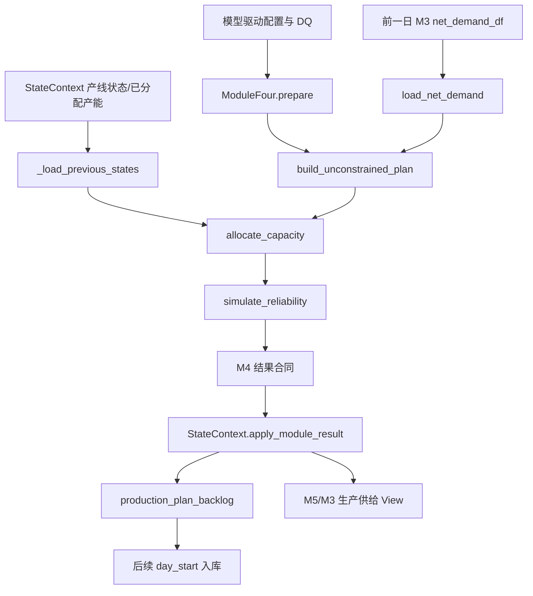

# `src/modules/production_planning` 模块详细文档（Refactor Preview）

## 文档信息

| 项 | 内容 |
|---|---|
| 维护者 | 林宏南 |
| 文档版本 | Preview v2.0 |
| 最后更新 | 2026-08-21 |
| 文档状态 | Preview，随重构实现更新 |
| 适用范围 | `src/modules/production_planning/` 当前重构链路 |
| 目标读者 | 算法工程师、测试工程师、业务分析师 |

> **当前实现**：本文以 `integration_refactor.py` 的 `ModuleFour` 和 `backends.py` 为事实源。M4 由集成调度器在 M1 后、M5 前运行，严格读取前一自然日 M3 结果；产线状态与已分配产能由 `StateContext` 注入和保存。
>
> **边界**：不存在独立本地版模块路径；`--no-persist` 仅关闭持久化。模块不自行写 Excel、CSV 或 PostgreSQL；旧 `main.py`、JSON 状态文件和文件读取入口不构成当前主路径。

---

## 目录

1. [模块概述](#1-模块概述)
2. [主要文件说明](#2-主要文件说明)
3. [核心函数详解](#3-核心函数详解)
4. [辅助函数说明](#4-辅助函数说明)
5. [数据流](#5-数据流)

---

## 1. 模块概述

**模块路径**：`src/modules/production_planning/`

**当前重构门面**：`integration_refactor.py` 中的 `ModuleFour`

M4 将前一日 M3 的 layer 0 净需求转化为受批量、产线能力、换产和可靠性约束的生产计划。计划产生后先写入生产 backlog；当 `available_date` 到达时，由后续 `StateContext.day_start()` 统一入库。

**核心功能点**：

1. 一次性准备物料-产线、产能、换产和可靠性查找表；
2. 严格读取前一日 M3 的 layer 0 净需求；
3. 按 PTF/LSK 审查周期和批量规则构建无约束计划；
4. 在逐日产能与跨日换产约束下分配生产；
5. 按产线可靠性模拟实际产出，并计算换产指标；
6. 提取产线状态与已分配产能，供 `StateContext` 维护跨日连续性。

---

## 2. 主要文件说明

| 文件名 | 当前定位 | 核心功能 |
|---|---|---|
| `integration_refactor.py` | **当前重构门面** | `ModuleFour` 生命周期、前日 M3 输入、结果合同与跨日辅助状态 |
| `backends.py` | **当前后端实现** | `_PandasBackend` / `_PolarsBackend`，无约束计划、产能/换产分配、可靠性和状态提取 |

静态配置由 `Orch.load_datas()` 注入；前日 M3、产线状态和历史已分配产能由集成调度器从 `StateContext` 注入。模块不读取每日上游文件。

---

## 3. 核心函数详解

### 3.1 `integration_refactor.py`：`ModuleFour`

#### 3.1.1 配置 schema

| 配置表 | 业务作用 |
|---|---|
| `M4_MaterialLocationLineCfg` | 物料、地点、产线、生产速率、批量、PTF、LSK、审查日与 MCT |
| `M4_LineCapacity` | 产线每日能力 |
| `M4_ChangeoverMatrix` | 物料换产类型映射 |
| `M4_ChangeoverDefinition` | 换产时间、成本和 MU 损失 |
| `M4_ProductionReliability` | 产线可靠性参数 |

#### 3.1.2 `prepare()`：分配器静态准备

**功能**：一次性加载配置、转换标识符并建立产能分配器的静态查找结构。

**处理步骤**：

1. 通过 `Orch.load_datas()` 获取 M4 schema 配置；
2. `_cast_datas_identifiers()` 将声明为字符串的业务键转换并进行地点规范化；
3. `_prepare_allocator_inputs()` 构建物料-地点-产线、生产速率、MCT、换产定义、换产矩阵和初始产能映射。

`prepare()` 不读取当日 M3，也不加载跨日运行状态；这些操作只在 `run()` 中发生。

#### 3.1.3 `load_net_demand()`：读取前一日 M3

**功能**：以优先级 `module3_result` → 显式内存 DataFrame → 兼容文件路径读取净需求，并统一预处理。

**处理逻辑**：

1. 集成主路径由调度器注入 `StateContext.get_previous_m3_result()`；
2. 筛选 `layer == 0`；
3. 将数量转为绝对值；
4. 将物料、地点转为字符串，需求日期转为日期类型。

**关键约束**：当前 M4 不得读取同日 M3，首日使用状态层提供的空合同。

#### 3.1.4 `build_unconstrained_plan()`：无约束计划

**功能**：将 layer 0 净需求与物料-地点-产线配置关联，形成按计划窗口和批量规则处理的无约束生产计划。

计划窗口为：

$$
window_{start} = simulation\_date + PTF
$$

$$
window_{end} = simulation\_date + PTF + LSK - 1
$$

门面使用 `is_offset_review_day()` 判断每条配置是否落在其审查周期；换产序列首件优先原始数量最大项，后续优先换产时间最短项并以数量决胜。

**返回值**：`unconstrained_plan`，包含物料、地点、产线、计划日期和无约束数量。

#### 3.1.5 `_load_previous_states()` 与 `_reset_capacity_map()`

**功能**：为当前日分配恢复跨日状态并隔离当日可变产能。

| 函数 | 作用 |
|---|---|
| `_load_previous_states()` | 使用调度器注入的前日产线状态和历史已分配产能；没有注入时使用空状态。 |
| `_reset_capacity_map()` | 从静态产能配置重新建立当前日可用容量映射，避免前日内存残留污染。 |

产线状态、已分配产能和容量映射不是旧文件状态；当前主路径由 `StateContext` 管理、持久化和恢复。

#### 3.1.6 `allocate_capacity()`：受限产能与换产分配

**功能**：在产线、地点和日期粒度上对无约束计划分配可用能力。

**处理步骤**：

1. 按产线处理已排序批次；
2. 初始化或恢复该产线前一日状态；
3. 查询换产类型和剩余换产时间；
4. 在每个计划日先扣除历史已分配产能，再消耗换产时间；
5. 使用剩余能力与生产速率计算可生产数量；
6. 在窗口结束仍未满足的数量写入 `exceed_log`。

**返回值**：受限计划 `plan_log` 与 `exceed_log`。

#### 3.1.7 `simulate_reliability()` 与 `calc_changeover_metrics()`

| 函数 | 功能 |
|---|---|
| `simulate_reliability()` | 按产线可靠性对受限计划模拟实际 `produced_qty`；随机顺序与模块种子是可复现性边界。 |
| `calc_changeover_metrics()` | 汇总换产次数、时间、成本和 MU 损失，生成 `changeover_log`。 |

可靠性采样前不得为展示目的改变计划行顺序，否则相同种子会得到不同结果。

#### 3.1.8 `extract_allocated_capacity()` 与 `extract_line_states()`

**功能**：从当日计划提取下一日计算所需的跨日辅助状态。

| 函数 | 产物 | 后续用途 |
|---|---|---|
| `extract_allocated_capacity()` | `(location, line, date)` 粒度的已消耗产能 | 后续日避免重复占用产能 |
| `extract_line_states()` | 每条产线的最后物料、地点、活动和未完成换产信息 | 后续日延续换产和生产顺序 |

这两项作为辅助结果交给 `StateContext`，不由 M4 自行写文件。

#### 3.1.9 `run()`、`output()` 与结果合同

`run()` 按以下顺序执行：加载跨日状态 → 重置容量 → 无约束计划 → 数据校验 → 受限分配 → 可靠性 → 换产指标 → 提取跨日状态 → 整理输出。

`output()` 必须提供以下 pandas DataFrame：

| 输出 | 含义 |
|---|---|
| `production_df` | 生产计划主结果，包含可用日期相关记录 |
| `exceed_log` | 产能不足/未满足记录 |
| `issues_df` | 配置或计划问题 |
| `changeover_log` | 换产汇总指标 |
| `unconstrained_plan` | 无约束计划审计结果 |

门面另返回 `current_line_states` 与 `current_allocated_capacity` 辅助状态。异常时 `_empty_result()` 保持所有合同 key 存在。

### 3.2 `backends.py`：pandas 与 polars 实现

两个 backend 均实现无约束计划、分配器输入、容量映射、跨日状态、受限分配、可靠性、换产指标和状态提取。Polars 可向量化表计算，但最终结果合同统一转换为 pandas DataFrame。

---

## 4. 辅助函数说明

### 4.1 数据校验与标识符

`validate_data()` 确保无约束计划至少具有物料、地点、产线和计划日期，并安全转换数量字段。`_cast_datas_identifiers()` 保证物料、地点、产线和换产键可稳定关联。

### 4.2 生产 backlog 与实际入库

M4 输出不直接增加 `unrestricted_inventory`。`StateContext.apply_module_result("module4", ...)` 将计划保存为 `production_plan_backlog` 并保存跨日状态；后续 `day_start()` 仅将 `available_date` 到达的生产过账为 `production_gr` 并增加库存。

### 4.3 兼容性边界

以下修改必须进行多日回归：M3 一日滞后、审查周期、换产排序、随机采样顺序、MCT/PTF/LSK 窗口、跨日产线状态和已分配产能键。

---

## 5. 数据流

**状态边界**：M4 计算计划和跨日辅助状态；生产入库、库存更新、backlog、持久化与恢复均由 `StateContext` 和持久化层统一处理。

---

## 附录：相关文档

- [模块总览](modules.md)
- [模块级时序图](../architecture/module_sequence_diagrams.md)
- [重构架构总览](../architecture/architecture.md)