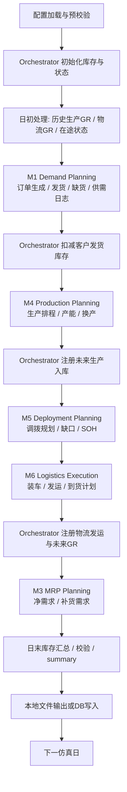

# Global Module Data Flow

更新时间：2026-05-08

本文描述 ChainSight 当前主链路中各模块之间的输入、输出、状态传递和数据流边界。本文不加入 `docs/INDEX.md` 索引。

## 1. 权威运行入口

| 层级 | 位置 | 职责 |
|---|---|---|
| CLI | `run.py` | 用户运行入口 |
| 运行分发 | `src/core/run/` | 参数解析、文件模式 / DB 模式分发、输出目录管理 |
| 文件模式主链路 | `src/core/main_integration/simulation_file.py` | 本地 Excel/CSV 输出、summary、库存平衡校验 |
| DB 模式主链路 | `src/core/main_integration/simulation_db.py` | DB 输出、批次写入、checkpoint、summary |
| 全局状态 | `src/core/orchestrator/` | 库存、发货、生产入库、调拨在途、open deployment、每日日志 |
| 模块输出写 DB | `pgsql_db/module_data_writer.py` | `module*_output_*`、`orchestrator_*`、`summary_output_*` 表写入 |

## 2. 全局执行顺序

每日仿真主链路保持固定顺序：

```text
日初状态恢复 / 当日到货入库
-> M1 订单生成与客户发货
-> M4 生产排程
-> M5 调拨规划
-> M6 物流执行
-> M3 MRP 补货 / 净需求
-> 日末库存与 summary
-> 文件输出或 DB batch flush / checkpoint
```

Mermaid 视图：



## 3. 模块输入输出总表

| 模块 | 主要输入 | 主要输出 | 主要消费者 |
|---|---|---|---|
| M1 Demand Planning | `M1_DemandForecast`、`M1_ForecastError`、`M1_OrderCalendar`、`M1_AOConfig`、`M1_DPSConfig`、`M1_SupplyChoiceConfig`、Orchestrator 当前库存、历史订单池 | `OrderLog`、`ShipmentLog`、`CutLog`、`SupplyDemandLog`、`Summary` | Orchestrator、M5、M3、summary |
| M4 Production Planning | `M4_MaterialLocationLineCfg`、`M4_LineCapacity`、`M4_ChangeoverMatrix`、`M4_ChangeoverDefinition`、`M4_ProductionReliability`、M3 `net_demand_df`、历史 line state、历史 allocated capacity | `ProductionPlan`、`CapacityExceed`、`Validation`、`ChangeoverLog`、`current_line_states`、`current_allocated_capacity` | Orchestrator、M5、M3、summary |
| M5 Deployment Planning | M1 `OrderLog` / `SupplyDemandLog`、M4 `ProductionPlan`、Orchestrator 库存 / open deployment / in-transit views、global network、lead time、deployment config | `DeploymentPlan`、`UnfulfilledLog`、`StockOnHandLog`、`Validation` | M6、M3、summary |
| M6 Logistics Execution | M5 `DeploymentPlan`、truck config、truck specs、priority、threshold、delivery delay distribution、Orchestrator 状态 | `DeliveryPlan`、`VehicleLog`、`TruckUsageLog`、`UnsatisfiedMDQLog`、`ValidationLog`、`BypassRuleHitLog` | Orchestrator、summary |
| M3 MRP Planning | M1 需求输出、M4 生产计划、M5 调拨计划、Orchestrator 当前库存和网络配置 | `net_demand_df` / Module3 daily output | 下一日 M4、summary |
| Summary | M1/M4/M5/M6/M3 输出、Orchestrator 日志 | `summary/*` 或 `summary_output_*` | 用户验收、BI、回归对比 |

## 4. M1 数据流

### 4.1 输入

| 输入 | 来源 | 说明 |
|---|---|---|
| `M1_DemandForecast` | 配置 | 周度需求预测，通常包含 `material`、`location`、`week`、`quantity` |
| `M1_ForecastError` | 配置 | total/weekly 周总量扰动参数，以及 AO / normal 内部结构扰动参数 |
| `M1_OrderCalendar` | 配置 | 有效下单日；重构版用于周订单拆日和每日取数过滤 |
| `M1_AOConfig` | 配置 | AO 比例和 `advance_days` |
| `M1_DPSConfig` | 配置 | demand split 规则 |
| `M1_SupplyChoiceConfig` | 配置 | 供给选择规则 |
| 当前库存 | Orchestrator | 发货可用库存 |
| 历史订单池 | 文件或 DB 内存 | AO / future order 跨日延续 |

### 4.2 输出

| 输出 | 文件 sheet / DB 表 | 关键字段 |
|---|---|---|
| `OrderLog` | `module1_output_orderlog` | `date`、`material`、`location`、`demand_type`、`quantity`、`simulation_date`、`advance_days` |
| `ShipmentLog` | `module1_output_shipmentlog` | `date`、`material`、`location`、`quantity`、`demand_type`、`order_id` |
| `CutLog` | `module1_output_cutlog` | `date`、`material`、`location`、`quantity` |
| `SupplyDemandLog` | `module1_output_supplydemandlog` | `date`、`material`、`location`、`quantity`、`demand_element` |
| `Summary` | `module1_output_summary` | 订单、发货、缺货、供需日志汇总 |

### 4.3 下游影响

- Orchestrator 使用 `ShipmentLog` 扣减客户发货库存。
- M5 使用 `OrderLog` 和 `SupplyDemandLog` 作为需求来源。
- M3 使用 M1 输出参与净需求计算。
- Summary 使用 `OrderLog` / `ShipmentLog` / `CutLog` 生成订单履约类报表。

## 5. M4 数据流

### 5.1 输入

| 输入 | 来源 | 说明 |
|---|---|---|
| `net_demand_df` | M3 输出或 DB 内存结果 | M4 生产净需求 |
| `M4_MaterialLocationLineCfg` | 配置 | material / location / delegate_line / lsk / ptf / MCT / prd_rate 等 |
| `M4_LineCapacity` | 配置 | 每条产线每天可用产能 |
| `M4_ChangeoverMatrix` | 配置 | from_material -> to_material 的 changeover id |
| `M4_ChangeoverDefinition` | 配置 | 每条线的 changeover 时间和成本参数 |
| `M4_ProductionReliability` | 配置 | 生产可靠性扰动 |
| line state | 文件或 DB runtime state | 跨天换产连续性 |
| allocated capacity | 文件或 DB runtime state | 历史已占用产能 |

### 5.2 输出

| 输出 | 文件 sheet / DB 表 | 说明 |
|---|---|---|
| `ProductionPlan` | `module4_output_productionplan` | 当日及未来可用生产计划 |
| `CapacityExceed` | `module4_output_capacityexceed` | 产能不足或未满足生产量 |
| `Validation` | `module4_output_validation` | M4 校验问题 |
| `ChangeoverLog` | `module4_output_changeoverlog` | 换产明细和指标 |
| `current_line_states` | JSON / checkpoint runtime state | 下一日跨天换产状态 |
| `current_allocated_capacity` | JSON / checkpoint runtime state | 下一日历史产能占用 |

### 5.3 下游影响

- Orchestrator 注册 `available_date` 在未来的生产入库。
- M5 使用未来生产计划判断可调拨供给。
- M3 使用生产计划作为补货和净需求计算的一部分。
- Summary 生成生产计划、超产能和换产报告。

## 6. M5 数据流

### 6.1 输入

| 输入 | 来源 | 说明 |
|---|---|---|
| `OrderLog` | M1 | 客户订单需求 |
| `SupplyDemandLog` | M1 | forecast / other demand |
| `ProductionPlan` | M4 | 未来生产供给 |
| 当前库存 | Orchestrator | SOH 和可用库存 |
| open deployment / in-transit | Orchestrator | 未完成调拨和在途供给 |
| network / lead time / deployment config | 配置 | 调拨路径、提前期、优先级、约束 |

### 6.2 输出

| 输出 | 文件 sheet / DB 表 | 说明 |
|---|---|---|
| `DeploymentPlan` | `module5_output_deploymentplan` | 调拨计划 |
| `UnfulfilledLog` | `module5_output_unfulfilledlog` | 未满足需求 |
| `StockOnHandLog` | `module5_output_stockonhandlog` | SOH 过程记录 |
| `Validation` | `module5_output_validation` | 调拨校验问题 |

### 6.3 下游影响

- M6 使用 `DeploymentPlan` 执行物流装车和发运。
- M3 使用调拨结果和未满足需求参与后续净需求。
- Summary 生成 deployment report。

## 7. M6 数据流

### 7.1 输入

| 输入 | 来源 | 说明 |
|---|---|---|
| `DeploymentPlan` | M5 | 待执行调拨计划 |
| truck config / specs | 配置 | 车辆能力和限制 |
| priority / threshold | 配置 | 装车和绕行策略 |
| delivery delay distribution | 配置 | 物流延迟分布 |
| Orchestrator shipment / inventory state | Orchestrator | 物流执行约束和状态 |

### 7.2 输出

| 输出 | 文件 sheet / DB 表 | 说明 |
|---|---|---|
| `DeliveryPlan` | `module6_output_deliveryplan` | 发运和到货计划 |
| `VehicleLog` | `module6_output_vehiclelog` | 车辆装载记录 |
| `TruckUsageLog` | `module6_output_truckusagelog` | 卡车使用统计 |
| `UnsatisfiedMDQLog` | `module6_output_unsatisfiedmdqlog` | 未满足最小发运量 |
| `ValidationLog` | `module6_output_validationlog` | 物流校验问题 |
| `BypassRuleHitLog` | `module6_output_bypassrulehitlog` | 绕行规则命中 |

### 7.3 下游影响

- Orchestrator 注册物流发运和未来到货 GR。
- Summary 生成 delivery report 和 truck usage report。

## 8. M3 数据流

### 8.1 输入

| 输入 | 来源 | 说明 |
|---|---|---|
| M1 输出 | M1 | 订单、供需、发货 |
| M4 输出 | M4 | 生产计划 |
| M5 输出 | M5 | 调拨计划、未满足需求、SOH |
| Orchestrator 状态 | Orchestrator | 当日库存、在途、open deployment、GR |
| network / BOM / lead time / MRP config | 配置 | 层级网络和补货参数 |

### 8.2 输出

| 输出 | 文件 sheet / DB 表 | 说明 |
|---|---|---|
| `net_demand_df` | Module3 daily output / `module3_output_*` | 按 material / location / requirement_date 的净需求 |

### 8.3 下游影响

- 下一日 M4 使用 M3 `net_demand_df` 生成生产计划。
- Summary 和回归分析使用 M3 输出解释补货与库存变化。

## 9. Orchestrator 状态流

Orchestrator 是模块间状态共享的核心，不是单独业务模块。

| 状态 | 写入者 | 读取者 | 说明 |
|---|---|---|---|
| `unrestricted_inventory` | 初始化、M1、M4 GR、M6 GR | M1、M5、M3、summary | 可用库存 |
| `shipment_log` | M1 | summary、M6 约束、库存校验 | 客户发货 |
| `production_gr` | M4 未来计划到期时 | M1、M5、M3、summary | 生产入库 |
| `delivery_gr` | M6 到货计划到期时 | M1、M5、M3、summary | 调拨到货 |
| `open_deployment` | M5 / M6 | M5、M6、M3 | 未完成调拨 |
| `delivery_shipment_log` | M6 | summary、库存校验 | 调拨发运 |
| `daily_logs` | 主链路 | DB writer、summary、验收 | 每日运行汇总 |

## 10. 本地文件模式与 DB 模式差异

| 维度 | 本地文件模式 | DB 模式 |
|---|---|---|
| 模块输出 | `outputs/.../module*/...xlsx` 或 CSV | `module*_output_*` 表 |
| Orchestrator 状态 | CSV / 内存对象 | `orchestrator_*` 表 + checkpoint JSON |
| M4 line state / capacity | JSON 文件 | `DbRuntimeState` / checkpoint runtime state |
| 历史 M1 订单 | 读取历史 `module1_output_YYYYMMDD.xlsx` | 内存 `m1_previous_orders` 或 DB fallback |
| Summary | `summary/*.xlsx` / `.csv` | `summary_output_*` 表，也可生成文件报告 |
| 断点续跑 | 文件状态有限 | `sim_checkpoint` 控制 |

要求：

- 文件模式和 DB 模式的模块输出 schema 必须保持等价。
- DB 模式不得在模块失败或 batch 写入失败时推进 checkpoint。
- Summary 失败不得把 run 标记为 completed，除非明确允许跳过 summary。

## 11. 关键数据契约

### 11.1 标识符

| 字段 | 规则 |
|---|---|
| `material` | 统一字符串化，必要时去除 `.0` 后缀 |
| `location` / `sending` / `receiving` | 统一字符串化，是否 zfill 取决于模块边界，进入 Orchestrator 前应使用统一 normalization |
| `line` / `delegate_line` | 统一字符串化，M4 内部要区分配置字段和输出字段 |

### 11.2 日期字段

| 字段 | 含义 |
|---|---|
| `simulation_date` | 当前仿真日；在 M1 `OrderLog` 中表示下单日 |
| `date` | 业务事件日期，具体含义取决于表；在 M1 `OrderLog` 中表示需求日期 / 到期日期 |
| `requirement_date` | 需求要求日期，M3 / M4 使用较多 |
| `production_plan_date` | 计划生产日期 |
| `available_date` | 生产可用 / 入库日期 |
| `planned_deploy_date` | 计划调拨日期 |
| `actual_ship_date` | 实际发运日期 |

所有模块边界上的日期字段应在进入核心逻辑前转换为 `datetime` 并 normalize 到日粒度。

## 12. Summary 和验收报告流

| 报告 | 主要输入 | 输出 |
|---|---|---|
| 订单 / 发货 / 缺货汇总 | M1 `OrderLog`、`ShipmentLog`、`CutLog` | `full_order_shipment_cut_report` / `summary_output_ordershipmentcutsummary` |
| 生产计划汇总 | M4 `ProductionPlan` | `full_production_plan_report` / `summary_output_fullproductionplan` |
| 超产能汇总 | M4 `CapacityExceed` | `full_exceed_capacity_report` / `summary_output_fullcapacityexceed` |
| 换产汇总 | M4 `ChangeoverLog` | `full_changeover_report` / `summary_output_fullchangeoverlog` |
| 调拨汇总 | M5 `DeploymentPlan` | `full_deployment_plan_report` / `summary_output_fulldeploymentplan` |
| 物流汇总 | M6 `DeliveryPlan`、`TruckUsageLog` | delivery / truck usage reports |
| 历史库存汇总 | Orchestrator CSV / DB 表 + M1 输出 | `historical_inventory_record` |

## 13. 改代码时必须同步检查的边界

| 改动类型 | 必查范围 |
|---|---|
| M1 输出列变化 | M5 data loader、M3 config loader、summary、DB schema |
| M4 多产线逻辑变化 | M4 output writer、M5 production input、M3 production input、summary、line state / capacity state |
| M5 调拨字段变化 | M6 input、M3 input、summary、DB schema |
| M6 delivery 字段变化 | Orchestrator delivery GR、summary、inventory balance |
| Orchestrator 状态字段变化 | DB writer、checkpoint、summary、resume |
| 日期字段语义变化 | 所有 filter by date、summary、checkpoint、E2E 对比 |

## 14. 最小回归要求

任何影响模块输入输出的数据流改动，至少执行：

1. 配置预校验。
2. 1 天 smoke run。
3. 7 天跨日状态 run。
4. 关键输出 schema 对比。
5. 库存平衡校验。
6. Summary 生成。
7. DB 模式下 checkpoint / resume 检查。

## 15. 函数级数据处理链路

本节细化到数据在各函数中的读取、转换、消费和输出逻辑。函数路径以当前代码结构为准。

### 15.0 阅读口径：函数顺序与执行顺序

本节表格的顺序是“数据处理链路顺序”，用于说明数据如何被读取、转换、消费和输出；它不等同于所有函数在运行时的严格调用顺序。

严格执行顺序以第 2 节的每日主链路和主入口调用栈为准：

```text
CLI / runner
-> 配置加载
-> Orchestrator 日初状态
-> M1
-> Orchestrator 扣减客户发货库存
-> M4
-> Orchestrator 注册未来生产入库
-> M5
-> M6
-> Orchestrator 注册物流发运与未来到货
-> M3
-> 日末库存、summary、文件输出或 DB 写入
```

函数表中的函数关系按以下口径理解：

| 类型 | 含义 | 示例 |
|---|---|---|
| 主入口 | 运行时一定从该函数进入当前模块或模式分支 | `run_integrated_simulation()`、`run_daily_order_generation()` |
| 主链路 | 当前模式下按业务顺序执行的数据处理步骤 | M1 生成订单后再生成发货和供需日志 |
| 分支 | 仅在特定模式、配置或数据来源下执行 | M5 从内存读取 M1 输出或从文件读取 M1 输出 |
| helper | 被主链路调用的内部处理函数，不代表独立业务阶段 | `_filter_by_date()`、`_lookup_changeover()` |
| fallback | 主路径不可用或配置指定时才执行的替代路径 | 文件模式 / DB 模式、orchestrator view / module result |
| 输出写入 | 数据已生成后的落盘、DB 写入或 summary 汇总步骤 | `write_output()`、`_flush_batch_to_db()` |

### 15.1 全局主流程函数链路

| 阶段 | 函数 | 输入数据 | 处理逻辑 | 输出 / 下游 |
|---|---|---|---|---|
| CLI 入口 | `src/core/main_integration/cli.py::main()` | 命令行参数 | 解析运行模式、配置、日期范围、输出目录 | 调用 run 层 |
| DB 运行入口 | `src/core/run/db_runner.py::_run_with_database()` | CLI namespace、DB 配置名 | 加载 DB 配置、同步本地配置差异、构建日志目录 | `run_integrated_simulation_from_dict()` |
| DB 配置加载 | `src/core/run/db_config.py::_load_config_from_database()` | DB config 表 | 从数据库读取配置并转为 `config_dict` | DB 模式主链路 |
| 文件配置加载 | `src/core/main_integration/config_loader.py::load_configuration()` | Excel 配置文件 | 读取配置表、CSV override、字段标准化 | 文件模式主链路 |
| DB dict 配置加载 | `src/core/main_integration/config_loader.py::load_configuration_from_dict()` | DB 配置 dict | 转换为与文件模式等价的 `config_dict` | DB 模式主链路 |
| 文件模式主循环 | `src/core/main_integration/simulation_file.py::run_integrated_simulation()` | `config_dict`、日期范围、输出目录 | 按日执行 M1 -> M4 -> M5 -> M6 -> M3，生成本地输出和 summary | 本地 Excel/CSV 输出 |
| DB 模式主循环 | `src/core/main_integration/simulation_db.py::run_integrated_simulation_from_dict()` | `config_dict`、日期范围、DB runtime state | 按日执行模块、批量写 DB、维护 checkpoint / runtime state | DB 表和 checkpoint |
| 批量写 DB | `src/core/main_integration/db_helpers.py::_flush_batch_to_db()` | 批次模块结果、Orchestrator 状态、runtime state | 原子删除旧批次、copy 新批次、更新 checkpoint | `module*_output_*`、`orchestrator_*`、`sim_checkpoint` |

### 15.2 M1 Demand Planning 函数链路

| 数据对象 | 函数 | 处理逻辑 | 输出 |
|---|---|---|---|
| M1 配置 | `src/modules/demand_planning_refactor/integration.py::_validate_config()` | 读取 `M1_DemandForecast`、`M1_ForecastError`、`M1_OrderCalendar`、`M1_AOConfig`，检查必填表，日期转换，负需求裁零，标识符标准化 | 标准化后的 forecast、error、calendar、AO config |
| forecast 基线 | `src/modules/demand_planning_refactor/integration.py::_prepare_forecasts()` | DPS 后保留周级订单基线，同时拆出日级消耗基线；DPS + SupplyChoice 后拆出供需日志基线 | `weekly_for_orders`、`daily_for_consumption`、`daily_for_supply` |
| DPS 拆分 | `src/modules/demand_planning_refactor/dps.py::apply_dps()` | 按 DPS 配置拆分 demand location / quantity | DPS 后周级 forecast |
| 供给选择 | `src/modules/demand_planning_refactor/dps.py::apply_supply_choice()` | 按 supply choice 配置调整供给来源口径 | supply choice 后周级 forecast |
| 周转日 forecast | `src/modules/demand_planning_refactor/forecast.py::expand_forecast_to_days_integer_split()` | `base_qty = quantity // 7`，余数分配到前 N 天，生成日级 forecast | 日级 forecast |
| 当日订单入口 | `src/modules/demand_planning_refactor/order.py::generate_daily_orders()` | 按输入结构分发：周级 forecast 走周级订单路径，日级 forecast 走兼容路径 | `orders_df`、`consumed_forecast` |
| 周级订单 | `src/modules/demand_planning_refactor/order.py::generate_weekly_orders()` | 生成 weekly total，再按 AO / normal 结构抽样并归一回周总量 | 周级 AO / normal 订单中间表 |
| 周订单拆日 | `src/modules/demand_planning_refactor/order.py::split_weekly_orders_to_daily()` | 按本周 `M1_OrderCalendar` 有效下单日拆分数量，并只返回当前 `simulation_date` 的订单 | 当日 `OrderLog` 行 |
| 订单聚合 | `src/modules/demand_planning_refactor/order.py::_aggregate_orders()` | 按 `date/material/location/demand_type/simulation_date/advance_days` 聚合数量 | 聚合后日订单 |
| forecast 消耗 | `src/modules/demand_planning_refactor/consume.py::consume_orders()` | 调度优化版或串行/并行版消耗逻辑，AO 优先再 normal | 消耗后 forecast |
| 优化消耗 | `src/modules/demand_planning_refactor/consume_optimized.py::consume_orders_vectorized()` | 建立 `(material, location, date)` -> row index 映射，用数组更新数量 | 消耗后 forecast |
| 历史订单读取 | `src/modules/demand_planning_refactor/io_utils.py::load_previous_orders()` | 找到历史 `module1_output_YYYYMMDD.xlsx` 并读取 `OrderLog` | 历史订单池 |
| 历史订单合并 | `src/modules/demand_planning_refactor/integration.py::_merge_with_history()` | 合并历史订单和当日订单，过滤未到期订单、去重、标准化 | 累计订单池 |
| 发货计算 | `src/modules/demand_planning_refactor/shipment.py::generate_shipment_with_inventory_check()` | 筛选当日到期订单，从 Orchestrator 获取可用库存，计算 shipped / cut | `ShipmentLog`、`CutLog` |
| 库存视图 | `src/modules/demand_planning_refactor/shipment.py::_build_available_inventory_from_orchestrator()` | 合并 beginning inventory、production GR、delivery GR | 可用库存 dict |
| SupplyDemandLog | `src/modules/demand_planning_refactor/integration.py::generate_supply_demand_log_for_integration()` | 从消耗后的 future forecast 中截取未来窗口，标记 `demand_element=forecast` | `SupplyDemandLog` |
| M1 输出 | `src/modules/demand_planning_refactor/io_utils.py::save_module1_output_with_supply_demand()` | 保证输出列存在，写 `OrderLog`、`ShipmentLog`、`CutLog`、`SupplyDemandLog`、`Summary` | M1 Excel 输出 |
| M1 返回 | `src/modules/demand_planning_refactor/integration.py::run_daily_order_generation()` | 串联 M1 全流程，返回累计订单、发货、缺货、供需日志、summary 和下一日订单池 | `m1_result` |

### 15.3 M4 Production Planning 函数链路

| 数据对象 | 函数 | 处理逻辑 | 输出 |
|---|---|---|---|
| M4 集成入口 | `src/modules/production_planning/integration.py::run_daily_production_planning_integrated()` | 薄包装，延迟导入 core implementation，保持模块公开入口稳定 | 调用 core production runner |
| M4 主处理 | `src/core/main_integration/production_runner.py::run_daily_production_planning_integrated()` | 校验 M4 必填配置，加载 M3 净需求，构建无约束计划，分配产能，仿真生产，生成 M4 输出 | `m4_result` |
| M3 净需求 | `src/modules/production_planning/demand_loader.py::load_daily_net_demand()` | 从 Module3 输出文件读取净需求 | `net_demand_df` |
| 净需求标准化 | `src/modules/production_planning/demand_loader.py::_filter_and_normalize_demand()` | 过滤 layer 0、数量取绝对值、日期转换 | M4 可用净需求 |
| 无约束计划 | `src/modules/production_planning/plan_builder.py::build_unconstrained_plan_for_single_day()` | 遍历 material / location / line 配置，判断 review day，生成无约束计划 | `uncon_plan` |
| 单物料计划 | `src/modules/production_planning/plan_builder.py::_build_plan_for_material()` | 获取对应净需求，merge 产线配置，按日期过滤，创建计划行 | 单 material/location 计划 |
| 需求过滤 | `src/modules/production_planning/plan_builder.py::_get_material_demands()` | 按 material / location 从 `net_demand_df` 取需求子集 | `nd_sub` |
| 配置合并 | `src/modules/production_planning/plan_builder.py::_merge_with_config()` | 将净需求与 `MaterialLocationLineCfg` 合并，带入 line、MCT、prd_rate 等字段 | enriched demand |
| 日期过滤 | `src/modules/production_planning/plan_builder.py::_filter_by_date()` | 只保留当前 simulation_date 的 requirement_date | 当日需求 |
| 计划记录 | `src/modules/production_planning/plan_builder.py::_create_plan_record()` | 计算最小批、舍入数量、计划日期、line | 无约束计划行 |
| 产能分配入口 | `src/modules/production_planning/capacity_allocator.py::centralized_capacity_allocation_with_changeover()` | 构建 `CapacityAllocator` 并执行分配 | `plan_log`、`exceed_log` |
| 产能映射 | `CapacityAllocator._build_capacity_map()` | 将 `LineCapacity` 转为 `(location,line,date)` 或 `(line,date)` -> capacity | `cap_map` |
| 分配主逻辑 | `CapacityAllocator.allocate()` | 按 line / simulation_date 分组，逐线处理 batch | 生产计划和超产能记录 |
| 产线分组 | `CapacityAllocator._allocate_line_group()` | 对同线 batch 排换产顺序，初始化线状态，逐 batch 分配 | 单线计划 |
| 换产排序 | `src/modules/production_planning/plan_builder.py::optimal_changeover_sequence()` | 根据 changeover matrix / definition 选择换产顺序 | batch sequence |
| 单批次分配 | `CapacityAllocator._allocate_batch()` | 读取 line config，计算计划窗口和换产，进入 horizon 分配 | batch plans / exceed |
| 换产计算 | `CapacityAllocator._calculate_changeover()` / `_lookup_changeover()` | 根据上一物料和当前物料查 changeover id / time | changeover info |
| horizon 分配 | `CapacityAllocator._allocate_to_horizon()` | 在 PTF/LSK 窗口内逐日分配产能，直到产量满足或超期 | plan rows / exceed row |
| 单日分配 | `CapacityAllocator._allocate_day()` | 扣减历史已占用产能、换产时间、生产小时，计算 `available_date` | `ProductionPlan` row |
| 生产可靠性 | `src/modules/production_planning/capacity_allocator.py::simulate_production()` | 按 `ProductionReliability` 扰动 planned qty，得到 produced qty | 最终生产计划 |
| 换产日志 | `calculate_changeover_metrics()` | 从生产计划和 changeover definition 生成换产指标 | `ChangeoverLog` |
| line state | `extract_line_states_from_plan()` | 提取最后生产物料、未完成换产状态 | `current_line_states` |
| capacity state | `extract_allocated_capacity_from_plan()` | 计算每个 location/line/date 已使用小时 | `current_allocated_capacity` |
| 输出写入 | `src/modules/production_planning/output_writer.py::write_output()` | 写 `ProductionPlan`、`CapacityExceed`、`Validation`、`ChangeoverLog` | M4 Excel 输出 |
| 历史生产 GR | `src/core/main_integration/production_runner.py::load_current_date_production_gr()` | 读取历史 M4 输出，筛选 `available_date == current_date` | 日初生产入库 |

### 15.4 M5 Deployment Planning 函数链路

| 数据对象 | 函数 | 处理逻辑 | 输出 |
|---|---|---|---|
| M5 主入口 | `src/modules/deployment_planning/main.py::run_daily_deployment_planning()` | 加载集成配置，按层处理需求，分配供给，生成调拨计划和校验 | M5 输出 dict |
| 集成配置 | `src/modules/deployment_planning/data_loader.py::load_integrated_config()` | 加载静态配置、M1 输出、M4 生产、Orchestrator 动态状态 | M5 `config` |
| 静态配置 | `data_loader._load_static_config()` | 装载 network、lead time、priority、deploy config 等 | static config |
| M1 内存输出 | `data_loader._load_module1_data_from_memory()` | 从 `module1_result` 读取 `OrderLog`、`SupplyDemandLog`、`ShipmentLog` | M1 demand tables |
| M1 文件输出 | `data_loader._load_module1_data_from_file()` | 从 M1 Excel 读取订单和供需日志 | M1 demand tables |
| M4 生产输入 | `data_loader._load_production_from_module4()` / `_load_production_from_orchestrator()` | 从 M4 result 或 Orchestrator 视图读取未来生产 | `ProductionPlan` |
| Orchestrator 动态状态 | `data_loader._load_orchestrator_dynamic_data()` | 读取库存、delivery GR、open deployment 等视图 | M5 dynamic config |
| 配置校验 | `src/modules/deployment_planning/validation.py::validate_config_before_run()` | 校验需求优先级、输入表和动态表 | validation log |
| 索引构建 | `src/modules/deployment_planning/cache_utils.py::build_sdl_index()` / `build_order_log_index()` / `build_safety_stock_index()` | 将 M1 需求表和 safety stock 建成快速索引 | demand indices |
| 网络层级 | `src/modules/deployment_planning/cache_utils.py::assign_location_layers()` | 从 active network 计算 location 层级 | layer table |
| 节点需求收集 | `src/modules/deployment_planning/demand_collector.py::collect_node_demands()` | 汇总 forecast、AO/normal order、safety stock、gap demands | node demand rows |
| SDL 需求 | `demand_collector._collect_sdl_demands()` | 从 `SupplyDemandLog` 取 forecast / other demand | demand rows |
| 安全库存需求 | `demand_collector._collect_safety_stock_demands()` | 根据 safety stock 生成需求 | demand rows |
| 订单需求 | `demand_collector._collect_order_demands()` | 从 `OrderLog` 取 AO / normal 需求 | demand rows |
| gap 需求 | `demand_collector._collect_gap_demands()` | 收集上游缺口传递需求 | demand rows |
| 层级处理 | `src/modules/deployment_planning/main.py::_process_layer_demands()` | 对每层节点收集需求，调用供给分配 | layer result |
| 管道供给分配 | `src/modules/deployment_planning/main.py::_allocate_pipeline_sources()` | 分配库存、在途、open deployment、future production | adjusted demand rows |
| MOQ/RV | `src/modules/deployment_planning/allocation.py::apply_moq_rv()` / `apply_grouped_moq_rv()` | 按 MOQ / rounding value 调整调拨量 | adjusted quantities |
| 优先级分配 | `allocation.apply_priority_allocation_vectorized()` | 按需求优先级分配可用供给 | allocated quantities |
| pipeline supply | `allocation.allocate_pipeline_supply()` | 分配 in-transit / open deployment / future production | supply allocation |
| 收货空间 | `allocation.apply_receiving_space_quota()` | 按 receiving space 限制调拨量 | quota-adjusted plan |
| 生成计划 | `src/modules/deployment_planning/main.py::_process_gaps_and_create_plans()` | 将缺口、分配结果和上游需求转为 DeploymentPlan / UnfulfilledLog | deployment rows |
| SOH 更新 | `src/modules/deployment_planning/main.py::_update_soh_dict()` | 根据调拨和需求更新库存估算 | `StockOnHandLog` |
| 输出记录 | `src/modules/deployment_planning/validation.py::log_outputs()` | 写 `DeploymentPlan`、`UnfulfilledLog`、`StockOnHandLog`、`Validation` | M5 Excel 输出 |

### 15.5 M6 Logistics Execution 函数链路

| 数据对象 | 函数 | 处理逻辑 | 输出 |
|---|---|---|---|
| M6 主入口 | `src/modules/logistics_execution/main.py::run_daily_physical_flow()` | 集成模式物流执行入口 | M6 输出 dict |
| 运行参数 | `main._initialize_run_params()` / `_init_integrated_params()` | 组装日期、输入、输出、Orchestrator、M5 result | run params |
| 数据准备 | `src/modules/logistics_execution/main.py::_prepare_data()` | 加载 config、deployment plan、truck specs、priority、capacity | prepared data |
| 集成配置 | `src/modules/logistics_execution/config_loader.py::load_integrated_config()` | 从 `config_dict` 和 M5 result 中生成 M6 config | M6 config |
| DeploymentPlan | `config_loader._load_deployment_plan()` | 读取 M5 调拨计划并做日期和字段标准化 | deployment rows |
| M6 配置 | `config_loader._load_m6_configs()` | 读取 truck、priority、delay distribution、threshold 等 | logistics config |
| 数据校验 | `src/modules/logistics_execution/validators.py::validate_deployment_plan()` / `validate_truck_config()` / `validate_priority_mapping()` / `validate_threshold_config()` / `validate_truck_specs()` | 校验物流执行所需输入 | validation log |
| 容量标准化 | `src/modules/logistics_execution/capacity_manager.py::normalize_capacity_plan()` | 将 daily / range truck capacity 展开到日粒度 | capacity daily table |
| 容量映射 | `capacity_manager.build_capacity_map()` | 构建 route / truck / date capacity map | capacity map |
| 仿真循环 | `src/modules/logistics_execution/simulation.py::run_simulation_loop()` | 按日和 route 处理调拨需求 | delivery / vehicle / usage logs |
| 每日需求 | `simulation._process_daily_demands()` | 筛选当天待处理 deployment demands | daily demands |
| route 处理 | `simulation._process_routes()` / `_process_single_route()` | 按 sending / receiving / truck type 处理装车 | route shipment records |
| truck type 处理 | `simulation._process_truck_type()` | 计算容量、优先级、MDQ、装车策略 | truck loading |
| 装车 | `simulation._first_pass_loading()` / `_second_pass_loading()` | 执行首轮和补充装载 | load records |
| 车辆装箱 | `src/modules/logistics_execution/vehicle_packer.py::VehiclePacker` | 管理单车容量、体积、重量和装载项 | vehicle log entries |
| 延迟抽样 | `src/modules/logistics_execution/delivery_processor.py::sample_delivery_delay()` | 根据 delay distribution 抽样延迟天数 | delay days |
| 到货日期 | `delivery_processor.calculate_actual_delivery_date()` | lead time + delay 计算实际到货日 | actual delivery date |
| delivery record | `delivery_processor.create_delivery_record()` | 生成 `DeliveryPlan` 行 | delivery rows |
| bypass / unsat | `create_bypass_record()` / `create_unsatisfied_record()` | 记录绕行和未满足 MDQ | bypass / unsat rows |
| 库存更新 | `src/modules/logistics_execution/inventory_manager.py::update_inventory_after_load()` | 装车后扣减可用库存或在途 | inventory state |
| 输出约束 | `src/modules/logistics_execution/output_writer.py::enforce_shipment_constraint()` / `validate_shipment_delivery_constraint()` | 确保发运量和 delivery 量一致 | validation log |
| 输出生成 | `output_writer.generate_outputs()` | 构造所有输出 DataFrame | M6 output tables |
| 输出写入 | `output_writer.write_excel_output()` | 写 `DeliveryPlan`、`VehicleLog`、`TruckUsageLog`、`UnsatisfiedMDQLog`、`ValidationLog`、`BypassRuleHitLog` | M6 Excel 输出 |

### 15.6 M3 MRP Planning 函数链路

| 数据对象 | 函数 | 处理逻辑 | 输出 |
|---|---|---|---|
| M3 主入口 | `src/modules/mrp_planning/integration.py::run_integrated_mode()` | 按日期范围加载 M1 / Orchestrator / 配置，计算净需求并保存 | M3 result |
| 静态配置 | `integration._load_static_configs()` | 加载 network、BOM、lead time、MRP 参数等 | static configs |
| 单日处理 | `integration._process_single_day()` | 加载当日数据，计算净需求，保存输出 | daily net demand |
| M1 数据 | `integration._load_module1_data()` | 从内存或文件读取 M1 SDL、Shipment、Order | M1 input tables |
| M1 文件读取 | `src/modules/mrp_planning/config_loader.py::load_module1_daily_outputs()` | 定位 M1 output 文件并读取相关 sheet | M1 daily outputs |
| Orchestrator 数据 | `integration._load_orchestrator_data()` | 读取 beginning inventory、production GR、delivery GR、open deployment、shipment 等视图 | orchestrator input tables |
| 净需求计算入口 | `integration._calculate_net_demand()` | 选择 DuckDB batch 或 pandas / node 处理逻辑 | `net_demand_df` |
| DuckDB 批量计算 | `src/modules/mrp_planning/duckdb_batch_calculator.py::batch_calculate_net_demand_duckdb()` | 聚合 supply side / demand side 并批量计算 gap | net demand |
| pandas fallback | `duckdb_batch_calculator._batch_calculate_pandas()` | pandas 方式计算净需求 | net demand |
| 单点净需求 | `src/modules/mrp_planning/net_demand.py::calculate_daily_net_demand()` | 对单 material/location/date 计算 supply、demand、gap | node demand |
| supply side | `net_demand._calculate_supply_side()` | beginning inventory、production、delivery、open deployment inbound 等供给汇总 | supply qty |
| demand side | `net_demand._calculate_demand_side()` | AO、forecast、safety stock、open deployment out 等需求汇总 | demand qty |
| gap 计算 | `net_demand._calculate_gaps()` | 计算 net demand / planned qty / shortage | gap rows |
| 节点处理 | `src/modules/mrp_planning/node_processor.py::NodeProcessor` | 对网络节点逐层处理并生成记录 | net demand records |
| 层级分配 | `src/modules/mrp_planning/layer_assignment.py::assign_location_layers()` | 根据网络关系分配 location layer | layer table |
| 输出保存 | `integration._save_daily_output()` | 写 Module3 daily output 或 memory store | M3 output |
| 结果构造 | `integration._build_result()` | 合并每日净需求，返回给主链路和下一日 M4 | `module3_result` |

### 15.7 Orchestrator 函数链路

| 状态数据 | 函数 | 处理逻辑 | 输出 / 消费方 |
|---|---|---|---|
| 创建对象 | `src/core/orchestrator/orchestrator_main.py::create_orchestrator()` | 初始化 Orchestrator 和各 mixin 状态 | Orchestrator 实例 |
| 初始库存 | `Orchestrator.initialize_inventory()` | 从 `M1_InitialInventory` 初始化 unrestricted inventory | beginning inventory |
| 空间容量 | `Orchestrator.set_space_capacity()` | 设置地点空间容量 | M5 / validation |
| M1 发货 | `src/core/orchestrator/processors.py::process_module1_shipments()` | 按 M1 `ShipmentLog` 扣减 unrestricted inventory，写 shipment log | 库存和 shipment 状态 |
| M4 生产 | `processors.py::process_module4_production()` | 注册生产计划，按 available date 转为未来 GR | production backlog / production GR |
| M6 物流 | `processors.py::process_module6_deliveries()` | 注册 delivery shipment / delivery GR / open deployment 状态 | logistics state |
| 每日操作 | `src/core/orchestrator/daily_ops.py` 中 daily ops mixin 方法 | 处理到期生产、到期物流、open deployment 清理 | 日初状态 |
| 库存视图 | `src/core/orchestrator/views.py::get_beginning_inventory_view()` | 输出指定日期 beginning inventory | M1/M3/M5 |
| 生产 GR 视图 | `views.py::get_production_gr_view()` | 输出指定日期生产入库 | M1/M3/M5 |
| 物流 GR 视图 | `views.py::get_delivery_gr_view()` | 输出指定日期物流到货 | M1/M3/M5 |
| open deployment 视图 | `views.py::get_open_deployment_view()` | 输出未完成调拨 | M5/M3 |
| summary stats | `Orchestrator.get_summary_statistics()` | 汇总每日库存、发货、GR 等统计 | daily logs / final stats |
| daily summary | `Orchestrator.output_daily_inventory_summary()` | 输出每日库存摘要 | 文件 / DB summary |

### 15.8 DB 写入与 Summary 函数链路

| 数据对象 | 函数 | 处理逻辑 | 输出 |
|---|---|---|---|
| 模块结果入库 | `pgsql_db/module_data_writer.py::ModuleDataWriter` | 将模块输出 DataFrame 映射到 DB 表并写入 | module output tables |
| 一次性写入 | `pgsql_db/module_data_writer.py::write_run_data_to_db()` | 外部便捷入口，写完整 run 数据 | DB tables |
| 批次原子写入 | `src/core/main_integration/db_helpers.py::_atomic_copy_batch()` | COPY prepared tables 到 DB | module/orchestrator tables |
| 批次删除 | `db_helpers._atomic_delete_batch()` | 删除同 run_id / date range 旧数据，避免重复 | clean batch window |
| Orchestrator 表准备 | `db_helpers.prepare_orchestrator_day_dataframes_from_orch()` | 从 Orchestrator 视图准备 DB 写入 DataFrame | `orchestrator_*` tables |
| 文件 summary | `src/services/summary_report_generator.py::SummaryReportGenerator.generate_all_reports()` | 读取模块输出和 Orchestrator 文件，生成汇总报告 | `summary/*` |
| 订单履约 summary | `SummaryReportGenerator._generate_order_shipment_cut_report()` | 聚合 M1 `OrderLog` / `ShipmentLog` / `CutLog` | order shipment cut report |
| M4 summary | `_generate_production_report()` / `_generate_capacity_exceed_report()` / `_generate_changeover_report()` | 聚合生产、超产能、换产 | M4 summary reports |
| M5 summary | `_generate_deployment_report()` | 聚合部署计划 | deployment report |
| M6 summary | `_generate_delivery_report()` / `_generate_truck_usage_report()` | 聚合物流与卡车使用 | logistics reports |
| 库存 summary | `_generate_historical_inventory_report()` | 结合 Orchestrator 日志和 M1 输出 | historical inventory record |
