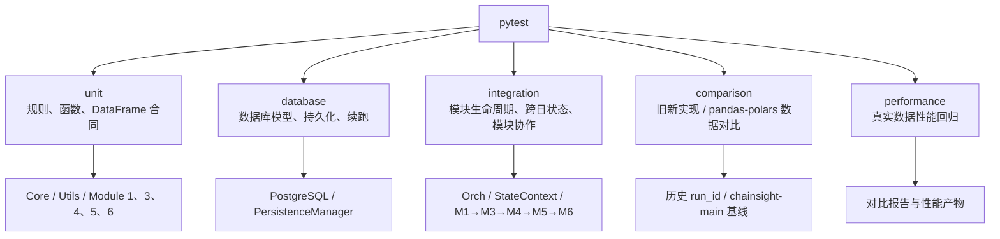
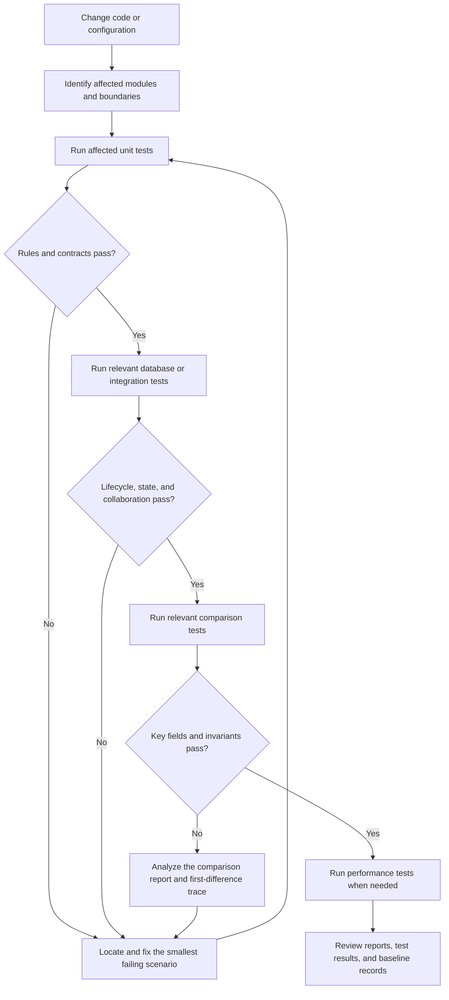
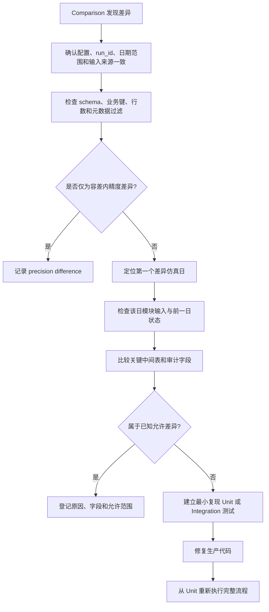

# ChainSight-Decoupling 测试框架设计

## 1. 测试目标

ChainSight-Decoupling 使用 pytest 组织测试，围绕供应链仿真的业务正确性、模块协作、数据库持久化、旧新实现数据一致性和性能回归建立分层测试。

测试的核心原则是：

1. **先验证规则，再验证协作，再验证真实数据回放。**
2. **测试输入、输出和状态合同，不依赖实现内部细节。**
3. **数据对比按业务键进行，保留差异明细、样本和运行上下文。**
4. **真实数据库测试必须隔离事务；真实基线数据只读，不被测试修改。**
5. **性能测试与正确性测试分开：先确认结果可接受，再分析耗时。**

## 2. 测试分层



测试目录如下：

```text
tests/
  unit/          # 纯内存规则、函数、DataFrame 合同
  database/      # PostgreSQL、模型、持久化、断点续跑
  integration/   # Orch、StateContext、模块协作、多日仿真
  comparison/    # 旧/新、pandas/polars、历史 run_id 数据对比
  performance/   # 真实场景、多轮性能采样和性能门槛
  support/       # DataFrame 工厂、配置工厂、共用运行辅助
  compare_utils.py
  conftest.py
```

### 2.1 Unit：规则、函数和 DataFrame 合同

Unit 测试只构造触发目标行为所需的最小 DataFrame 或对象，不读取真实数据库、Excel、历史输出或网络资源。目标是快速定位规则错误。

| 范围 | 需要测试的内容 |
|---|---|
| Core / Utils | 日期与工作日计算、配置默认值、标识符归一化、类型转换、空值处理、随机种子、资源参数、公共异常信息、DataFrame 输入输出列合同。 |
| `Orch` / `StateContext` | 配置注入、每日 `day_start()` / `day_end()`、库存和动态事实的副本隔离、模块输出写入后的状态更新、跨日读取前一日状态、禁止不同物料/地点状态混用。 |
| Module 1（需求规划） | 需求拆分、订单日、预测与订单转换、初始库存、发货、削减、供需日志、汇总表、订单跨日传递、随机种子确定性、空输入和缺失配置。 |
| Module 3（MRP 规划） | 净需求、库存/在途/生产供给抵扣、安全库存、需求日期与提前期、物料地点隔离、空需求、负库存和跨日需求滚动。 |
| Module 4（生产规划） | 无约束计划、产线筛选、产能分配、共享产线、换型、换型损失、超产能、生产数量边界、产线状态、累计已分配产能、跨日计划窗口。 |
| Module 5（部署规划） | 网络层级、供给节点与需求节点、优先级分配、库存/在途/开放调拨/未来生产三池扣减、MOQ/RV、push/pull、未满足需求、库存日志、部署校验和多节点隔离。 |
| Module 6（物流执行） | 交付计划、运输提前期、车辆/线路选择、装载与容量、卡车使用日志、交付日期、无法交付记录和空部署计划。 |
| 输出合同 | 每张公开输出表在正常、空输入和无结果时仍具有固定列；关键键、数量列、日期列、审计字段、dtype 和排序规则保持稳定。 |

Unit 测试应覆盖正常值、零值、空值、空表、重复业务键、非法值、边界日期、跨月/跨年、无库存、无产能、无网络、无需求和多物料并行等场景。

### 2.2 Database：数据库模型、持久化和断点续跑

Database 测试使用专用 PostgreSQL 测试库。每个测试在独立事务中运行，结束后自动回滚；建表和迁移在测试会话开始时执行。

| 范围 | 需要测试的内容 |
|---|---|
| 数据库连接与初始化 | 数据库不存在时的创建逻辑、连接错误传播、`migrate()` 建表、表和 schema 存在性、连接关闭和错误处理。 |
| ORM / 表模型 | 模型表名、列名、元数据列、类型映射、输出 key 到表名的映射、各模块输出注册表与实际模型一致。 |
| DataFrame 读写 | 空表、日期、nullable 类型、字符串标识符、浮点数、重复键和大批量数据的写入读取往返；写库元数据正确生成。 |
| 运行事件 | run 创建、幂等重复创建、DQ 状态、运行中状态、进度日期、完成状态、失败/阻塞状态和历史运行查询。 |
| M1 快照与续跑 | `order_df`、`daily_detail`、`daily_detail_sc`、`order_cal` 的保存、读取、空表跳过、重复保存幂等、不同 `run_id` / `sim_date` 隔离、完成后清理。 |
| Checkpoint / 恢复 | checkpoint 保存和加载、找回未完成运行、从正确日期续跑、完成运行不再被识别为未完成、配置变更时的恢复策略。 |
| 输出落库边界 | 各模块结果按 `run_id + sim_date` 写入；同一运行不同日期隔离；不同运行不串数据；读取历史基线时剥离写库元数据。 |

### 2.3 Integration：模块生命周期和跨日协作

Integration 测试使用公开的 `Orch`、`StateContext`、模块 `prepare()`、`run()`、`output()` 和运行入口，验证真实模块边界，不在测试中重新实现业务算法。

| 协作范围 | 需要测试的内容 |
|---|---|
| 配置到运行时 | 配置加载、默认值合并、配置表类型、模块配置投影、文件模式与数据库模式的输入边界。 |
| 模块生命周期 | `prepare()` 只执行静态准备；`run()` 每日执行；`output()` 结构稳定；重复调用不会污染静态配置或上一日状态。 |
| M1→M3 | M1 的订单、发货、供需结果进入 M3；库存与需求事实使用正确日期；物料和地点不串扰。 |
| M3→M4 | M4 消费正确日期的净需求；一日滞后规则明确；首日空输入行为正确；生产结果和产线状态可供下一日使用。 |
| M4→M5 | M4 的生产计划进入 M5；生产供给日期、数量和地点正确；历史产能状态不被 M5 改写。 |
| M1/M4→M5 | M5 同时消费订单/供需/发货和生产输入；库存、在途、部署计划和未满足需求按日更新。 |
| M5→M6 | M6 消费部署计划；运输、车辆、交付和卡车使用结果与部署输入一致。 |
| 多日仿真 | 每日开始和结束状态、库存滚动、在途滚动、M4 产线状态、M5 部署状态、恢复运行前后结果一致。 |
| 文件与 CLI | 配置目录、CSV 覆盖 Excel、输出目录、运行参数、`--resume`、`--force-restart`、`--use-db` 和非法参数组合。 |

集成测试应至少包含：两到五日的最小业务场景、一个跨月或跨年场景、一个中断后恢复场景，以及一个包含多物料、多地点和多产线的隔离场景。

### 2.4 Comparison：历史基线和后端数据对比

Comparison 是解耦重构的核心验收层。它使用相同配置、相同日期范围和相同历史动态输入，分别运行旧实现、解耦实现、pandas 后端或 polars 后端，并按业务键比较输出。

| 对比范围 | 需要比较的内容 |
|---|---|
| 通用比较规则 | schema、行数、业务键集合、重复键稳定配对、数值容差、日期标准化、字符串归一化、左右独有记录、字段级差异和有限样本。 |
| Module 1 | OrderLog、ShipmentLog、CutLog、SupplyDemandLog、Summary；订单跨日传递、库存影响、每日结果和五日累计结果。 |
| Module 3 | NetDemand；需求、库存、在途、生产供给、安全库存和需求日期维度的结果。 |
| Module 4 | ProductionPlan、CapacityExceed、ChangeoverLog、无约束计划、问题表、`current_line_states`、`current_allocated_capacity`。 |
| Module 5 | DeploymentPlan、UnfulfilledLog、StockOnHandLog、Validation；部署数量、来源池、库存结余、未满足需求和网络节点。 |
| Module 6 | DeliveryPlan、VehicleLog、TruckUsageLog；运输量、交付日期、车辆分配和线路使用。 |
| 后端一致性 | pandas 与 polars 在相同输入下的输出结构、业务键、确定性字段和允许误差字段。 |
| 历史基线一致性 | `chainsight-main` 旧实现或固定历史 `run_id` 与 Decoupling 输出的逐日、累计和跨日状态差异。 |

对比结果应写入 `outputs/*_compare/`，至少包含：

- JSON：完整比较结果、schema 差异、左右独有键、字段差异、样本和运行参数；
- Markdown：比较范围、输入来源、实现版本、耗时摘要和结论；
- progress log：长任务开始、逐日进度、完成时间和报告路径；
- trace：首次差异的输入、关键中间结果和定位信息。

比较结论分为三类：

1. **一致：**结构和业务字段满足严格规则或容差；
2. **已知差异：**经过确认的实现路径差异，单独列出原因、影响字段和允许范围；
3. **待修复差异：**业务键、数量、日期、状态或关键审计字段异常，必须定位到首次出现的模块和仿真日。

### 2.5 Performance：真实数据性能回归

Performance 测试在结果可接受的前提下，使用真实配置和真实历史输入衡量运行成本。性能结果不能替代数据一致性结论。

| 范围 | 需要测试的内容 |
|---|---|
| 模块性能 | M1、M3、M4、M5、M6 的单日与多日耗时、累计耗时和每日期望耗时。 |
| 后端性能 | 旧实现、Decoupling pandas、Decoupling polars 的相对耗时、加速倍数和内存使用。 |
| 规模性能 | 不同物料数、地点数、产线数、网络边数、订单量和仿真天数下的耗时增长。 |
| 稳定性 | 预热后多轮执行的最小值、中位数、均值、波动范围和失败率。 |
| 输出成本 | 数据库读取、配置初始化、计算、报告生成和文件/数据库写入分别计时。 |

性能报告必须记录配置名、`run_id`、日期范围、Python 与依赖版本、后端、机器资源、采样次数和是否包含 I/O。性能门槛应以基准版本和允许波动范围定义，不能只根据一次运行结果判断回归。

## 3. 数据对比规范

所有 DataFrame 对比优先使用业务键，而不是依赖行号。默认业务键包括日期、物料、地点、产线、收发点、需求元素和换型标识；若业务键重复，则在每组内按稳定排序追加序号后配对。

数值字段使用明确容差：

$$
|x_{baseline} - x_{candidate}| \le \varepsilon
$$

其中默认 $\varepsilon = 10^{-6}$。日期统一比较到业务需要的粒度，标识符统一转为字符串并去除首尾空白，写库元数据不参与业务结果比较。

对于随机生成字段，必须固定随机种子；若不同后端的随机数消耗顺序无法完全一致，应分别定义：

- 必须严格一致的结构、计划、约束和守恒字段；
- 可在统计范围或业务不变量内验证的随机结果字段；
- 不参与严格 parity 的字段及其原因。

## 4. 测试执行流程

### 4.1 日常开发与提交前流程



执行顺序遵循“由小到大、由快到慢、由确定到真实”：

1. 先执行修改函数、模块的 Unit 测试；
2. 再执行使用数据库模型、续跑或持久化时的 Database 测试；
3. 再执行受影响模块上下游的 Integration 测试；
4. 涉及重构、后端、状态或真实业务逻辑调整时，执行 Comparison 测试；
5. 修改了算法复杂度、DataFrame 操作、SQL、后端实现或大规模数据路径时，最后执行 Performance 测试。

### 4.2 按改动类型选择测试

| 改动类型 | 最低验证范围 | 扩大验证范围 |
|---|---|---|
| 纯函数、日期、归一化、DataFrame 列处理 | 对应 Unit | 相关模块 Unit |
| 模块内部算法 | 对应 Unit + 模块 Integration | 对应 Comparison + Performance |
| 输出字段、表模型、写库逻辑 | Unit 合同 + Database | Integration + Comparison |
| `StateContext`、库存、跨日状态 | Unit + Integration 多日场景 | M4/M5/M6 Comparison |
| 配置加载、CLI、文件输入 | Unit + Integration | 文件模式与数据库模式回归 |
| M1/M3/M4/M5/M6 模块边界 | 上下游 Integration | 历史基线 Comparison |
| pandas / polars 代码 | Unit + 后端 Integration | pandas/polars Comparison + Performance |
| SQL、索引、批量读写 | Database | Integration + Performance |
| 断点续跑 | Database + Integration 中断恢复 | 历史运行恢复 Comparison |

### 4.3 差异处理流程



## 5. 结论

该框架以 Unit、Database、Integration、Comparison、Performance 五层覆盖 ChainSight-Decoupling：

- Unit 锁定各模块和公共组件的业务规则与 DataFrame 合同；
- Database 锁定 PostgreSQL、模型、持久化和断点续跑；
- Integration 锁定模块生命周期、跨日状态和 M1→M3→M4→M5→M6 协作；
- Comparison 锁定历史基线、旧新实现和 pandas/polars 的真实数据一致性；
- Performance 锁定真实规模下的效率和稳定性。

每次修改都先从最小受影响测试开始，再逐步扩大到模块协作、数据对比和性能验证；出现差异时，以业务键、首次差异日、输入状态和审计字段为线索完成定位，而不是只比较总行数或总数量。
