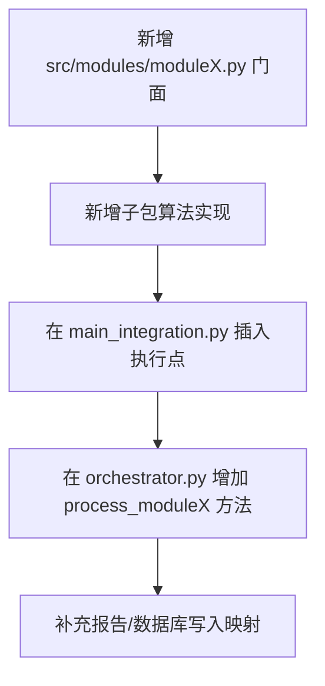

# ChainSight 模块规格文档（Module Specification）

## 文档信息

| 项 | 内容 |
|---|---|
| 文档版本 | v1.0 |
| 最后更新 | 2026-03-05 |
| 适用范围 | `src/` 本地版 + `--use-db` 数据库模式 |
| 目标读者 | 算法工程师、后端开发、测试工程师、技术支持 |

---

## 模块总览

ChainSight 的业务计算主链包含 M1、M3、M4、M5、M6 五个公开模块，业务语义上包含六大能力（M2 供给策略内嵌在 M1）。

| 模块 | 公开入口 | 核心职责 |
|---|---|---|
| M1 | `module1.run_daily_order_generation` | 需求展开、订单生成、发货与缺货 |
| M2（内嵌） | `apply_dps` / `apply_supply_choice` | 供给策略和地点拆分 |
| M3 | `module3.run_integrated_mode` | 净需求与分层 MRP 计算 |
| M4 | `module4.run_daily_production_planning` | 生产计划与产能/换型约束 |
| M5 | `module5.main` | 多层级调拨规划 |
| M6 | `module6.run_daily_physical_flow` | 物流装载、发运与到货 |

---

## Module1：需求规划（含 M2 策略内嵌）

### 1.1 功能说明

M1 负责将周度预测转换为可执行的日度订单与发货决策，并向下游模块输出供需日志。核心包含：

1. 周度预测拆分（日粒度整数分配）；
2. AO/Normal 订单生成；
3. 基于可用库存的发货与缺货计算；
4. 供需日志输出，供 M3/M5 使用；
5. M2 供给策略（DPS + SupplyChoice）内嵌执行。

### 1.2 输入数据格式

| 输入表 | 必填字段（关键） | 用途 |
|---|---|---|
| `M1_DemandForecast` | `week, material, location, quantity` | 周度需求预测 |
| `M1_ForecastError` | `material/location` 及误差字段 | 订单扰动参数 |
| `M1_OrderCalendar` | `date` | 可下单日判断 |
| `M1_AOConfig` | `advance_days, ao_percent` 等 | AO订单规则 |
| `M1_DPSConfig` | `dps_location, dps_percent` | 需求地点拆分 |
| `M1_SupplyChoiceConfig` | 供给选择规则字段 | 供给源调整 |

### 1.3 输出数据格式

| 输出名 | 字段示例 | 下游使用方 |
|---|---|---|
| `orders_df` | `date, material, location, quantity, demand_element` | M3/M5 |
| `shipment_df` | `date, material, location, quantity` | Orchestrator |
| `cut_df` | `date, material, location, quantity` | 报表/分析 |
| `supply_demand_df` | `date, material, location, quantity, demand_element` | M3/M5 |
| `summary_df` | `Total_Orders, Total_Shipments...` | DB 汇总写入 |

### 1.4 核心算法

#### 算法 A：周度到日度拆分

公式：

- `base_qty = week_qty // 7`
- `remainder = week_qty % 7`
- 前 `remainder` 天分配 `base_qty+1`，其余分配 `base_qty`

**代码示例 1：周转日拆分入口**

```python
daily_df = expand_forecast_to_days_integer_split(
    demand_weekly=demand_forecast,
    start_date=sim_start,
    num_weeks=max_week,
)
```

#### 算法 B：库存约束发货

在 `(material, location)` 粒度上：

- `shipped = min(qty_ordered, qty_avail)`
- `cut = qty_ordered - shipped`

**代码示例 2：M1 日度主入口**

```python
result = run_daily_order_generation(
    config_dict=config_dict,
    simulation_date=current_date,
    output_dir="./outputs/module1",
    orchestrator=orch,
)
```

### 1.5 参数说明

| 参数 | 默认值 | 影响 |
|---|---|---|
| `skip_file_output` | `False` | `True` 时仅返回内存结果，不落地 Excel |
| `previous_orders_df` | `None` | 传入后可跳过历史文件读取（DB 模式） |
| `DEFAULT_MAX_ADVANCE_DAYS` | 常量 | AO 订单提前窗口上限 |

### 1.6 限制条件

1. `M1_DemandForecast`、`M1_OrderCalendar`、`M1_AOConfig` 不能为空；
2. 标识符需规范化（material 去 `.0`，location 补零）；
3. 无库存时发货会退化为全缺货。

### 1.7 本地版 vs DB版差异

| 维度 | 本地版 | DB版 |
|---|---|---|
| 中间结果 | 写 `Module1Output_YYYYMMDD.xlsx` | 优先内存返回并直接写 DB |
| 历史订单 | 从文件读取合并 | 从 `module1_result` 传递 |
| 汇总生成 | 文件后处理 | 表级聚合写 `summary_output_*` |

### 1.8 扩展指南

- 新增需求类型：在订单生成与优先级映射中增加 `demand_element`；
- 新增拆分策略：扩展 `forecast.py` 后保持输出列协议不变；
- 新增供应策略：优先在 M2 内嵌函数扩展，不改 M1 主入口签名。

### 1.9 异常与诊断

| 现象 | 常见原因 | 诊断动作 |
|---|---|---|
| 当日订单为 0 | `OrderCalendar` 无有效日期或过滤条件过严 | 检查 `date` 类型与时区，确认日历覆盖仿真窗口 |
| AO 订单占比异常 | `AOConfig` 参数越界（如 >1） | 校验 `ao_percent` 范围并打印参数快照 |
| 缺货突然升高 | 库存输入缺失或 location 编码不一致 | 对 `material/location` 做规范化前后对比 |

**建议日志字段**：`run_id/date/material/location/demand_element/ordered/shipped/cut`。

---

## Module3：MRP 规划

### 2.1 功能说明

M3 执行分层净需求计算，将下游缺口逐层向上游传导，形成计划需求。

### 2.2 输入数据格式

| 输入表/视图 | 关键字段 | 来源 |
|---|---|---|
| `supply_demand_df` | `material, location, date, quantity` | M1 |
| `order_df` | `demand_element, quantity` | M1 |
| `beginning_inventory_df` | `material, location, quantity` | Orchestrator |
| `in_transit_df` | `material, receiving, quantity` | Orchestrator |
| `delivery_gr_df` | `material, receiving, quantity` | Orchestrator |
| `all_production_df` | `material, location, available_date` | M4+Orchestrator |
| `open_deployment_df` | `material, sending, receiving, deployed_qty` | M5+Orchestrator |

### 2.3 输出数据格式

| 输出 | 字段示例 | 用途 |
|---|---|---|
| `net_demand_df` | `material, location, requirement_date, quantity, demand_element, layer` | M4 生产计划输入 |

### 2.4 核心算法

#### 算法 A：层级分配

- 按物料维度构建网络图；
- 根节点层级为 0，下游层级递增；
- 用于确定需求回传路径。

**代码示例 3：层级分配**

```python
layer_df = assign_location_layers(active_network_df)
```

#### 算法 B：净需求计算

核心平衡：

`total_supply = BI + InTransit + DeliveryGR + Production + OpenDeploymentIn - Shipment - OpenDeploymentOut`

然后按 AO -> Forecast -> Safety 顺序扣减，输出 `ao_gap/fc_gap/ss_gap`。

**代码示例 4：净需求 API**

```python
ao_gap, fc_gap, ss_gap = calculate_daily_net_demand(
    material="1001",
    location="0101",
    date=current_date,
    supply_demand_df=sdl_df,
    safety_stock_df=ss_df,
    beginning_inventory_df=bi_df,
    in_transit_df=it_df,
    delivery_gr_df=dgr_df,
    future_production_df=prod_df,
    today_shipment_df=ship_df,
    open_deployment_df=od_df,
    downstream_forecast_gap=0,
    downstream_safety_gap=0,
    horizon=7,
)
```

#### 算法 C：MOQ/RV 应用

- 小于 MOQ 则补到 MOQ；
- 否则按 RV 向上取整。

### 2.5 参数说明

| 参数 | 说明 |
|---|---|
| `skip_file_output` | 可跳过 M3 输出文件写入 |
| `module1_result` | 优先使用内存订单/供需结果 |
| `horizon` | 每个节点需求规划窗口天数 |

### 2.6 限制条件

1. `Global_Network` 为空时 M3 无法执行；
2. `Global_LeadTime` 缺失时会回退默认 horizon；
3. 上游层级缺失会影响缺口传递精度。

### 2.7 本地版 vs DB版差异

| 维度 | 本地版 | DB版 |
|---|---|---|
| 数据加载 | 文件读取 `Module1Output` | 内存结果直传 |
| 输出 | 每日 Excel | DataFrame 直写 DB |
| 加速 | 可选内存模式 | DuckDB/增量接口更常用 |

### 2.8 扩展指南

- 新增需求优先级：修改 demand_element 优先顺序；
- 引入新 lead time 规则：扩展 `determine_lead_time()`；
- 性能优化优先点：`DataIndexer` 与批量节点计算。

### 2.9 异常与诊断

| 现象 | 常见原因 | 诊断动作 |
|---|---|---|
| `net_demand_df` 为空 | 上游输入空或层级网络断裂 | 先检查 `Global_Network`，再检查 M1 订单是否存在 |
| gap 值为负且波动大 | 供给/需求时间口径不一致 | 统一 `requirement_date` 与 `available_date` 到日粒度 |
| 运行耗时显著上升 | 节点增多但仍走逐条计算 | 开启批处理路径并缓存 key 索引 |

**建议日志字段**：`layer/material/location/date/ao_gap/fc_gap/ss_gap/supply_total`。

---

## Module4：生产计划

### 3.1 功能说明

M4 将净需求转化为可执行生产计划，考虑产线产能、换型矩阵、换型定义和生产可靠性。

### 3.2 输入数据格式

| 输入表 | 关键字段 |
|---|---|
| `M4_MaterialLocationLineCfg` | `material, location, delegate_line, prd_rate, min_batch, rv, ptf, lsk` |
| `M4_LineCapacity` | `line, date, capacity` |
| `M4_ChangeoverMatrix` | `from_material, to_material, changeover_id` |
| `M4_ChangeoverDefinition` | `changeover_id, line, time` |
| `M4_ProductionReliability` | 可靠性参数 |
| `net_demand_df` | `material, location, requirement_date, quantity` |

### 3.3 输出数据格式

| 输出 | 说明 |
|---|---|
| `production_df` | 生产计划主表（含 `available_date`） |
| `exceed_log` | 产能超限记录 |
| `changeover_log` | 换型日志 |
| `issues_df` | 配置/数据问题记录 |

### 3.4 核心算法

#### 算法 A：无约束计划构建

- 在审查日规则下聚合净需求；
- 按 `min_batch` 和 `rv` 做批量取整。

**代码示例 5：无约束计划**

```python
uncon_df = build_unconstrained_plan_for_single_day(
    net_demand_df=net_demand_df,
    mlcfg=mlcfg,
    simulation_date=current_date,
    simulation_start=sim_start,
    issues=[],
)
```

#### 算法 B：集中产能分配与换型优化

1. 对同产线批次做换型序列优化；
2. 按产能窗口逐批分配；
3. 记录超额与剩余。

**代码示例 6：产能分配主函数**

```python
plan_log, exceed_log = centralized_capacity_allocation_with_changeover(
    uncon=uncon_df,
    cap_df=cap_df,
    rate_map=rate_map,
    co_mat=co_mat,
    co_def=co_def,
    mlcfg=mlcfg,
)
```

### 3.5 参数说明

| 参数 | 说明 |
|---|---|
| `previous_line_states` | 跨天换型连续性输入 |
| `previously_allocated_capacity` | 历史已分配产能 |
| `issues` | 质量问题收集容器 |

### 3.6 限制条件

1. `M4_LineCapacity` 缺失会导致无法有效分配；
2. 换型矩阵键类型不一致会导致换型失败；
3. `material/location/line` 类型不统一会产生 merge 风险。

### 3.7 本地版 vs DB版差异

| 维度 | 本地版 | DB版 |
|---|---|---|
| 净需求输入 | 读取 Module3 文件 | 优先从内存结果获取 |
| 输出落地 | Excel 文件 | DataFrame 入库 |
| 状态持久化 | 本地产线状态文件 | 仍可用本地状态 + DB 汇总 |

### 3.8 扩展指南

- 新增换型策略：扩展 `optimal_changeover_sequence()`；
- 新增产线约束：在 `CapacityAllocator` 中加入约束检查；
- 可靠性模型升级：扩展 `simulate_production` 输入参数。

### 3.9 异常与诊断

| 现象 | 常见原因 | 诊断动作 |
|---|---|---|
| 大量 `exceed_log` | 产能不足或 `min_batch` 设置过大 | 对比 `LineCapacity` 与当日需求总量 |
| 换型时间异常 | `ChangeoverMatrix` / `Definition` 键不匹配 | 检查键类型与清洗规则（字符串、大小写、空格） |
| 产线状态跨天丢失 | 状态文件未保存或恢复路径错误 | 检查 `save_line_state/load_line_state` 调用链 |

**建议日志字段**：`line/material/from_material/to_material/capacity_used/changeover_time`。

---

## Module5：调拨规划

### 4.1 功能说明

M5 在网络层级中进行节点调拨规划，综合库存、在途、未来生产、优先级和 MOQ/RV 约束，生成当日部署计划。

### 4.2 输入数据格式

| 输入 | 关键字段 |
|---|---|
| `Network` | `material, location, sourcing, eff_from, eff_to` |
| `DeployConfig` | `material, sending, moq, rv, lsk` |
| `PushPullModel` | `material, sending, model` |
| `LeadTime` | `sending, receiving, PDT, GR, MCT` |
| `SupplyDemandLog` | 需求日志 |
| `OrderLog` | AO/normal 订单 |
| `SafetyStock` | 安全库存需求 |

### 4.3 输出数据格式

| 输出 | 说明 |
|---|---|
| `deployment_plan` | 调拨计划主表 |
| `unfulfilled_log` | 未满足需求日志 |
| `stock_on_hand_log` | 日库存轨迹 |
| `validation_log` | 规则校验日志 |

### 4.4 核心算法

#### 算法 A：需求收集

需求来源四类：SDL、SafetyStock、OrderLog、上游 Gap。

**代码示例 7：节点需求收集**

```python
rows = collect_node_demands(
    material="1001",
    location="0101",
    sim_date=current_date,
    config=config,
    up_gap_buffer=up_gap,
    sdl_index=sdl_index,
    ss_index=ss_index,
    order_index=order_index,
)
```

#### 算法 B：优先级向量化分配

- 按 `demand_priority` 从高到低分配；
- 最后一个部分满足优先级按比例分配。

#### 算法 C：push/soft-push 补货

- 在非 push 需求满足后，使用剩余库存补货；
- 采用“挡位（bucket）+ 比例兜底”。

**代码示例 8：M5 主入口（集成模式）**

```python
m5_result = main(
    config_dict=config_dict,
    orchestrator=orch,
    current_date=current_date.strftime("%Y-%m-%d"),
    skip_file_output=True,
    module1_result=m1_result,
    module4_result=m4_result,
)
```

### 4.5 参数说明

| 参数 | 说明 |
|---|---|
| `current_date` | 集成模式下单日运行日期 |
| `module1_result` | 内存订单和供需输入 |
| `module4_result` | 内存生产计划输入 |
| `skip_file_output` | 跳过 Excel 输出 |

### 4.6 限制条件

1. `DemandPriority` 缺失会导致默认优先级退化；
2. `DeployConfig` 缺失会影响 MOQ/RV 和 LSK 逻辑；
3. 网络层级不完整会影响上游缺口传导。

### 4.7 本地版 vs DB版差异

| 维度 | 本地版 | DB版 |
|---|---|---|
| 运行模式 | 文件+内存混合 | 内存结果直写 DB |
| 汇总 | 文件汇总 | 数据库聚合汇总 |
| 清理策略 | 目录级 | `run_id` 级删除 |

### 4.8 扩展指南

- 新增分配规则：扩展 `allocation.py` 并保留输出字段；
- 新增需求来源：在 `collect_node_demands` 中追加来源函数；
- 新增空间/运输约束：在主循环层按层级注入约束检查。

### 4.9 异常与诊断

| 现象 | 常见原因 | 诊断动作 |
|---|---|---|
| `unfulfilled_log` 激增 | 优先级配置缺失或库存不足 | 校验 `DemandPriority` 覆盖率并核对可用库存 |
| 调拨方向反常 | `Network` 上下游关系误配 | 抽样检查 `sending/receiving/sourcing` 是否成链 |
| push 补货过量 | push 桶规则过宽或阈值偏高 | 回放 bucket 计算过程并调整比例参数 |

**建议日志字段**：`sending/receiving/model/priority/requested/allocated/reason`。

---

## Module6：物流执行

### 5.1 功能说明

M6 负责调拨计划的物理执行：车辆装载、MDQ 规则判定、延迟采样、到货日期计算和日志输出。

### 5.2 输入数据格式

| 输入表 | 关键字段 |
|---|---|
| `M6_TruckReleaseCon` | 发车触发规则 |
| `M6_TruckCapacityPlan` | 路线-车型容量规划 |
| `M6_TruckTypeSpecs` | 车型重量/体积参数 |
| `M6_DeliveryDelayDistribution` | 延迟分布 `delay_days/probability` |
| `M6_MDQBypassRules` | MDQ 旁路条件表达式 |
| `open_deployment` | 发送-接收-数量需求 |

### 5.3 输出数据格式

| 输出 | 说明 |
|---|---|
| `delivery_plan` | 发运计划明细 |
| `vehicle_log` | 车辆装载日志 |
| `truck_usage` | 车型使用汇总 |
| `unsatisfied_log` | 未满足 MDQ/容量需求 |
| `validation_log` | 校验问题 |
| `bypass_log` | MDQ 旁路命中记录 |

### 5.4 核心算法

#### 算法 A：车辆装载与触发

- 按线路和需求元素聚合；
- 根据触发条件和容量约束装载；
- 生成车辆级与线路级日志。

#### 算法 B：延迟采样

- 精确路由匹配；
- 无精确匹配时使用全局 `ALL->ALL`；
- 仍无匹配则默认 0 天。

**代码示例 9：M6 日度入口**

```python
m6_result = run_daily_physical_flow(
    config_dict=config_dict,
    orchestrator=orch,
    current_date=current_date,
    output_dir="./outputs/module6",
    skip_file_output=True,
)
```

**代码示例 10：批量延迟采样（DuckDB）**

```python
delays = batch_sample_delivery_delays_duckdb(
    routes=[("0101", "0201"), ("0101", "0301")],
    dist_df=delay_dist_df,
    seed=42,
)
```

### 5.5 参数说明

| 参数 | 说明 |
|---|---|
| `max_wait_days` | 需求最大等待天数 |
| `random_seed` | 随机采样可复现实验 |
| `skip_file_output` | 跳过文件写入，返回内存结果 |

### 5.6 限制条件

1. 延迟分布表字段必须齐全（`delay_days/probability/sending/receiving`）；
2. MDQ 旁路表达式必须通过安全表达式校验；
3. 车型参数缺失时会影响装载结果可靠性。

### 5.7 本地版 vs DB版差异

| 维度 | 本地版 | DB版 |
|---|---|---|
| 输出 | Excel + CSV | DataFrame/表写入 |
| 延迟采样 | 单条/批量混用 | 批量路径更常用 |
| 汇总 | 文件后处理 | DB 直接汇总 |

### 5.8 扩展指南

- 新增车型：扩展 `TruckTypeSpecs` 并更新装载策略；
- 新增旁路规则变量：扩展 `SafeExpressionEvaluator` 白名单；
- 新增运输成本模型：在生成发运记录时追加成本字段计算。

### 5.9 异常与诊断

| 现象 | 常见原因 | 诊断动作 |
|---|---|---|
| 发车量过低 | 触发阈值过高或车型容量配置不合理 | 检查 `TruckReleaseCon` 与车型容量匹配关系 |
| 到货集中在同一天 | 延迟分布配置缺失退化到 0 天 | 检查 `DeliveryDelayDistribution` 是否存在路由明细 |
| bypass 命中异常 | 表达式字段缺失或条件写反 | 对命中样本做表达式逐条重算 |

**建议日志字段**：`route/truck_type/loaded_qty/delay_days/bypass_hit/mdq_status`。

---

## 模块间依赖关系

### 6.1 执行顺序

`M1 -> M4 -> M5 -> M6 -> M3`

### 6.2 数据流向图


### 6.3 状态共享说明

| 状态对象 | 写入模块 | 读取模块 |
|---|---|---|
| `unrestricted_inventory` | M1/M4/M5/M6 | M1/M3/M5 |
| `open_deployment` | M5 | M6/M3 |
| `in_transit` | M6 | M3/M5 |
| `production_gr` | M4 | M3/M5 |
| `delivery_gr` | M6 | M3/M5 |

### 6.4 同步机制

1. 每模块结束后通过 `orchestrator.process_module*()` 写回；
2. 日终统一 `save_daily_state()` 固化状态；
3. 失败重试可依赖日快照恢复。

---

## 扩展性指南

### 7.1 如何修改模块算法

1. 优先修改子包实现（如 `deployment_planning/`），保持 `moduleX.py` 入口不变；
2. 保持输入输出列协议稳定；
3. 修改后执行模块级回归 + 全链路库存平衡校验。

### 7.2 如何添加新模块



### 7.3 如何集成自定义规则

| 规则类型 | 推荐接入点 |
|---|---|
| 需求优先级规则 | M1/M5 优先级映射 |
| 生产约束规则 | M4 `CapacityAllocator` |
| 调拨策略规则 | M5 分配与 push 阶段 |
| 物流旁路规则 | M6 `MDQBypassRules` + 表达式引擎 |

### 7.4 测试建议

1. 模块单测：固定输入/固定随机种子；
2. 日度回放：对比关键输出表行数与主键分布；
3. 全链路测试：检查库存平衡和核心汇总报表一致性。

## 性能与容量基准（建议）

下表给出模块级容量规划的参考口径，便于压测和资源评估。

| 模块 | 推荐数据规模（单日） | 典型瓶颈 | 首选优化手段 |
|---|---|---|---|
| M1 | 订单 10万~50万行 | 日度展开与分组聚合 | 预索引 + 向量化聚合 |
| M3 | 网络节点 1万+ | 多层回传与窗口计算 | 分层批处理 + 缓存 |
| M4 | 产线 500+、物料 2万+ | 换型序列与约束分配 | 启发式排序 + 分片求解 |
| M5 | 路由 5万+ | 优先级分配与 push 兜底 | 向量化 + 字典缓存 |
| M6 | 线路 5万+ | 装载模拟与延迟采样 | 批量采样 + DuckDB 加速 |

**压测建议**：

1. 先做模块压测（隔离上下游）；
2. 再做 7 日与 30 日全链路压测；
3. 固定随机种子后对比优化前后耗时与结果一致性。

## 交付验收清单（模块视角）

| 检查项 | 通过标准 |
|---|---|
| 输入契约 | 必填列完整，类型可解析，标识符已规范化 |
| 输出契约 | 标准输出列齐全，空结果保留 schema |
| 可追溯性 | 每条输出具备 `run_id/date/module` 追溯信息 |
| 可恢复性 | 支持按日恢复，失败不污染历史已完成日 |
| 一致性 | 库存平衡校验通过，关键汇总口径一致 |
| 性能 | 在目标数据规模内满足 SLA（模块级/全链路） |

---

## 附录 A：关键函数速查

| 模块 | 关键函数 |
|---|---|
| M1 | `run_daily_order_generation`、`generate_supply_demand_log_for_integration` |
| M3 | `run_integrated_mode`、`calculate_daily_net_demand` |
| M4 | `run_daily_production_planning`、`centralized_capacity_allocation_with_changeover` |
| M5 | `main`、`collect_node_demands`、`apply_priority_allocation_vectorized` |
| M6 | `run_daily_physical_flow`、`sample_delivery_delay` |

## 附录 B：常见限制与规避

| 风险 | 规避建议 |
|---|---|
| 标识符类型不一致导致 join 失败 | 统一使用规范化函数 |
| 空表导致下游 KeyError | 输出空表时保留标准列 |
| 模块顺序调整引发状态错乱 | 严格保持 M1->M4->M5->M6->M3 |
| 规则扩展影响口径一致 | 新规则通过 feature flag 灰度启用 |

## 附录 C：模块输入输出契约（字段级）

以下契约用于接口联调与自动化校验，建议在回归测试中按“字段存在 + 类型可解析 + 主键唯一”三层校验。

### C.1 M1 关键输出契约

| 输出 | 必需字段 | 建议类型 | 主键建议 |
|---|---|---|---|
| `orders_df` | `date, material, location, quantity, demand_element` | `date/string/string/float/string` | `date+material+location+demand_element` |
| `shipment_df` | `date, material, location, quantity` | `date/string/string/float` | `date+material+location` |
| `cut_df` | `date, material, location, quantity` | `date/string/string/float` | `date+material+location` |
| `supply_demand_df` | `date, material, location, quantity, demand_element` | 同上 | `date+material+location+demand_element` |

### C.2 M3 关键输出契约

| 输出 | 必需字段 | 建议类型 | 说明 |
|---|---|---|---|
| `net_demand_df` | `material, location, requirement_date, quantity, demand_element, layer` | `string/string/date/float/string/int` | `layer` 用于分层回传，必须可排序 |

### C.3 M4 关键输出契约

| 输出 | 必需字段 | 建议类型 | 说明 |
|---|---|---|---|
| `production_df` | `date, material, location, line, quantity, available_date` | `date/string/string/string/float/date` | `available_date` 供 M3/M5 读取未来供给 |
| `exceed_log` | `date, line, reason, exceed_qty` | `date/string/string/float` | 超额原因必须可枚举 |
| `changeover_log` | `date, line, from_material, to_material, changeover_time` | `date/string/string/string/float` | 用于换型审计 |

### C.4 M5 关键输出契约

| 输出 | 必需字段 | 建议类型 | 说明 |
|---|---|---|---|
| `deployment_plan` | `date, material, sending, receiving, deployed_qty, demand_element` | `date/string/string/string/float/string` | 下游 M6 直接消费 |
| `unfulfilled_log` | `date, material, location, demand_element, short_qty` | `date/string/string/string/float` | 作为缺口追踪输入 |
| `stock_on_hand_log` | `date, material, location, soh` | `date/string/string/float` | 用于库存轨迹审计 |

### C.5 M6 关键输出契约

| 输出 | 必需字段 | 建议类型 | 说明 |
|---|---|---|---|
| `delivery_plan` | `date, material, sending, receiving, shipped_qty, eta_date` | `date/string/string/string/float/date` | `eta_date` 写回 Orchestrator 的 `in_transit` |
| `vehicle_log` | `date, route, truck_type, loaded_qty` | `date/string/string/float` | 车辆利用率分析输入 |
| `unsatisfied_log` | `date, route, reason, qty` | `date/string/string/float` | 物流瓶颈定位输入 |

## 附录 D：模块故障分级与处理SOP

| 等级 | 典型故障 | 影响范围 | 处理时限 | 建议动作 |
|---|---|---|---|---|
| P1 | 主流程中断（模块抛异常退出） | 全链路阻断 | 15分钟内 | 立即回滚到上一个完整日快照并续跑 |
| P2 | 关键输出缺失（如 M5 无调拨主表） | 下游部分阻断 | 1小时内 | 补跑单模块并做字段契约校验 |
| P3 | 指标偏差（数量异常但流程可运行） | 结果质量风险 | 当日内 | 执行 A/B 对比、核对参数与配置 |
| P4 | 非关键告警（日志噪声、轻微慢查询） | 无直接业务中断 | 下个迭代 | 纳入优化清单并灰度修复 |

**SOP 流程**：

1. 定位故障模块与故障日期；
2. 提取该日输入快照与模块输出；
3. 按“输入契约 -> 算法执行 -> 输出契约”三段复盘；
4. 修复后先做单模块重放，再做最少 3 日全链路回归；
5. 更新变更说明，记录规则口径差异。

## 附录 E：契约校验脚本模板

以下脚本可作为测试基线（可放入 `tests/` 或临时诊断工具），用于快速验证模块输出是否满足最小契约。

```python
import pandas as pd


def assert_required_columns(df: pd.DataFrame, cols: list[str], name: str):
    missing = [c for c in cols if c not in df.columns]
    if missing:
        raise AssertionError(f"{name} missing columns: {missing}")


def assert_non_negative(df: pd.DataFrame, col: str, name: str):
    if (df[col].fillna(0) < 0).any():
        raise AssertionError(f"{name}.{col} has negative values")


def validate_m5_outputs(m5_result: dict):
    deployment = m5_result["deployment_plan"]
    unfulfilled = m5_result["unfulfilled_log"]

    assert_required_columns(
        deployment,
        ["date", "material", "sending", "receiving", "deployed_qty", "demand_element"],
        "deployment_plan",
    )
    assert_required_columns(
        unfulfilled,
        ["date", "material", "location", "demand_element", "short_qty"],
        "unfulfilled_log",
    )
    assert_non_negative(deployment, "deployed_qty", "deployment_plan")
    assert_non_negative(unfulfilled, "short_qty", "unfulfilled_log")


def validate_m6_outputs(m6_result: dict):
    delivery = m6_result["delivery_plan"]
    assert_required_columns(
        delivery,
        ["date", "material", "sending", "receiving", "shipped_qty", "eta_date"],
        "delivery_plan",
    )
    assert_non_negative(delivery, "shipped_qty", "delivery_plan")
```

该模板建议与随机种子固定、样本回放数据一起使用，以便在回归中稳定复现问题。
