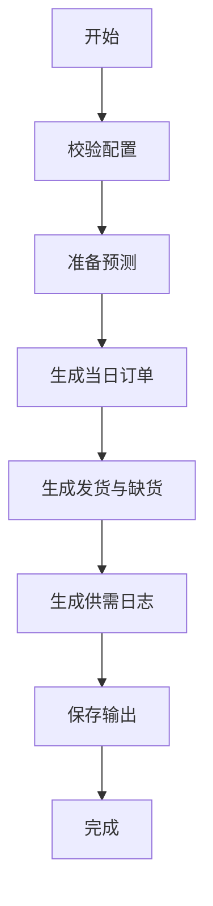
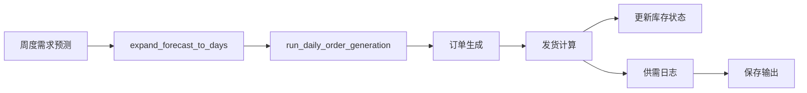

# src/modules/demand_planning 模块详细文档

## 文档信息

| 项 | 内容 |
|---|---|
| 文档版本 | v1.0 |
| 最后更新 | 2026-03-05 |
| 适用范围 | `src/modules/demand_planning/` 目录 |
| 目标读者 | 算法工程师、测试工程师、业务分析师 |

---

## 目录

1. [模块概述](#1-模块概述)
2. [主要文件说明](#2-主要文件说明)
3. [核心函数详解](#3-核心函数详解)
4. [辅助函数说明](#4-辅助函数说明)
5. [数据流](#5-数据流)

---

## 1. 模块概述

**模块路径**: `src/modules/demand_planning/`

**主要职责**:
- Module 1 需求规划与发货计算
- 需求预测与分解（周度→日度）
- 客户订单生成
- 发货与缺货计算
- 供给策略应用（DPS、供给选择）
- 供需日志生成

**核心功能点**:
1. **需求预测**: 从周度需求预测拆分到日度
2. **订单生成**: 根据需求预测和库存可用量生成客户订单
3. **发货计算**: 基于订单、库存和生产计划计算实际发货量和缺货量
4. **库存检查**: 确保有足够库存可发货
5. **供给策略**: 应用 DPS（需求点选择）和供给选择规则
6. **供需日志**: 生成每日供需平衡日志

---

## 2. 主要文件说明

| 文件名 | 主要类/函数 | 核心功能 |
|---|---|---|
| `integration.py` | `run_daily_order_generation()` | 集成模式主入口 |
| `forecast.py` | `expand_forecast_to_days_integer_split()` | 周度预测转日度预测 |
| `shipment.py` | `simulate_shipment_for_single_day()` | 单日发货与缺货计算 |
| `order.py` | `generate_daily_orders()` | 每日订单生成 |
| `consume.py` | 消耗计算 |
| `dps.py` | DPS 与供给选择应用 |
| `normalization.py` | 标识符标准化 |
| `io_utils.py` | 输入输出工具函数 |
| `constants.py` | 常量定义 |
| `consume_optimized.py` | 优化版消耗计算 |

---

## 3. 核心函数详解

### 3.1 integration.py 主函数

#### 3.1.1 `run_daily_order_generation()`

**功能**: 集成模式主入口：生成指定日期的订单与发货

**函数签名**:
```python
def run_daily_order_generation(
    config_dict: dict,
    simulation_date: pd.Timestamp,
    output_dir: str,
    orchestrator: object = None,
    skip_file_output: bool = False,
    previous_orders_df: Optional[pd.DataFrame] = None
) -> dict
```

**参数**:

| 参数名 | 类型 | 必填 | 说明 |
|---|---|---|---|
| `config_dict` | `dict` | 是 | 配置数据字典 |
| `simulation_date` | `pd.Timestamp` | 是 | 仿真日期 |
| `output_dir` | `str` | 是 | 输出目录 |
| `orchestrator` | `object` | 否 | 编排器对象（用于更新状态） |
| `skip_file_output` | `bool` | 否 | 是否跳过文件输出 |
| `previous_orders_df` | `pd.DataFrame` | 否 | 历史订单数据（用于 DB 模式） |

**返回值**:
```python
{
    'orders_df': pd.DataFrame,           # 客户订单
    'shipment_df': pd.DataFrame,         # 发货记录
    'cut_df': pd.DataFrame,             # 缺货记录
    'supply_demand_df': pd.DataFrame,      # 供需日志
    'summary_df': pd.DataFrame,          # 汇总数据
    'output_file': str,                  # 输出文件路径
    'all_orders_for_next_day': pd.DataFrame  # 累积订单供下一天使用
}
```

**处理流程**:


**处理步骤**:
1. 校验配置（需求预测、订单日历、AO 配置）
2. 准备日度预测（订单和供需）
3. 生成当日订单
4. 生成发货（使用累积订单，考虑库存）
5. 生成供需日志
6. 保存输出
7. 生成 Summary（供数据库模式）

---

#### 3.1.2 `generate_supply_demand_log_for_integration()`

**功能**: 生成供需日志

**函数签名**:
```python
def generate_supply_demand_log_for_integration(
    demand_forecast: pd.DataFrame,
    simulation_date: pd.Timestamp
) -> pd.DataFrame
```

**参数**:

| 参数名 | 类型 | 必填 | 说明 |
|---|---|---|---|
| `demand_forecast` | `pd.DataFrame` | 是 | 需求预测数据 |
| `simulation_date` | `pd.Timestamp` | 是 | 仿真日期 |

**返回值**:
- `pd.DataFrame`: 供需日志，包含列 `[date, material, location, demand_type, quantity]`

---

### 3.2 forecast.py 预测模块

#### 3.2.1 `expand_forecast_to_days_integer_split()`

**功能**: 将周度预测拆分为日度预测（整数分配）

**函数签名**:
```python
def expand_forecast_to_days_integer_split(
    demand_weekly: pd.DataFrame,
    start_date: pd.Timestamp,
    num_weeks: int,
    simulation_end_date: Optional[pd.Timestamp] = None
) -> pd.DataFrame
```

**参数**:

| 参数名 | 类型 | 必填 | 说明 |
|---|---|---|---|
| `demand_weekly` | `pd.DataFrame` | 是 | 周度预测，包含 `[material, location, week, quantity]` |
| `start_date` | `pd.Timestamp` | 是 | 仿真开始日期 |
| `num_weeks` | `int` | 是 | 周数 |
| `simulation_end_date` | `pd.Timestamp` | 否 | 可选结束日期 |

**返回值**:
- `pd.DataFrame`: 日度预测，包含列 `[date, material, location, week, demand_type, quantity, original_quantity]`

**处理逻辑**:
1. 将周度数量均匀分配到 7 天
2. 余数分配给前 N 天，其中 N = quantity % 7
3. 前 N 天多分配 1 个单位
4. 过滤结束日期（如果提供）
5. 标记 `demand_type` 为 'normal'

**使用示例**:
```python
weekly_forecast = pd.DataFrame({
    'material': ['80813644', '80813644'],
    'location': ['0001', '0001'],
    'week': [1, 2],
    'quantity': [140, 168]
})

daily_forecast = expand_forecast_to_days_integer_split(
    demand_weekly=weekly_forecast,
    start_date=pd.Timestamp('2025-01-01'),
    num_weeks=4
)
```

---

### 3.3 shipment.py 发货模块

#### 3.3.1 `simulate_shipment_for_single_day()`

**功能**: 计算单日的发货（shipment）与缺货（cut）

**函数签名**:
```python
def simulate_shipment_for_single_day(
    simulation_date: pd.Timestamp,
    order_log: pd.DataFrame,
    current_inventory: Dict[Tuple[str, str], int],
    material_list: list,
    location_list: list,
    production_plan: Optional[pd.DataFrame] = None,
    delivery_plan: Optional[pd.DataFrame] = None
) -> Tuple[pd.DataFrame, pd.DataFrame, Dict[Tuple[str, str], int]]
```

**参数**:

| 参数名 | 类型 | 必填 | 说明 |
|---|---|---|---|
| `simulation_date` | `pd.Timestamp` | 是 | 仿真日期 |
| `order_log` | `pd.DataFrame` | 是 | 订单日志，包含 `[date, material, location, quantity_ordered]` |
| `current_inventory` | `Dict` | 是 | 当前库存字典 `{(material, location): quantity}` |
| `material_list` | `list` | 是 | 物料列表（用于参考） |
| `location_list` | `list` | 是 | 地点列表（用于参考） |
| `production_plan` | `pd.DataFrame` | 否 | 当天生产计划（未使用） |
| `delivery_plan` | `pd.DataFrame` | 否 | 当天调运计划（未使用） |

**返回值**:
```python
(
    shipment_df,     # 发货 DataFrame，包含 `[date, material, location, quantity]`
    cut_df,          # 缺货 DataFrame，包含 `[date, material, location, quantity]`
    current_inventory  # 更新后的当前库存字典
)
```

**处理逻辑**:
1. 筛选当日订单
2. 聚合订单为 ML 粒度（按 material, location 分组求和）
3. 构建库存 DataFrame
4. 合并订单和库存
5. 计算发货量：取 `min(qty_ordered, qty_avail)`
6. 计算缺货量：取 `max(qty_ordered - qty_avail, 0)`

**使用示例**:
```python
shipment_df, cut_df, updated_inv = simulate_shipment_for_single_day(
    simulation_date=pd.Timestamp('2025-01-15'),
    order_log=order_log,
    current_inventory={'80813644': 100},
    material_list=['80813644'],
    location_list=['0001']
)
```

---

### 3.4 order.py 订单模块

#### 3.4.1 `generate_daily_orders()`

**功能**: 根据需求预测和库存可用量生成客户订单

**处理逻辑**:
1. 从需求预测中提取当日需求
2. 应用供给策略（供给选择）
3. 检查库存可用量
4. 按服务级别生成订单

---

### 3.5 dps.py 供给策略模块

**主要功能**:
- `apply_dps()`: 应用 DPS（需求点选择）
- `apply_supply_choice()`: 应用供给选择策略

---

### 3.6 normalization.py 标准化模块

**主要函数**:
- `normalize_identifiers()`: DataFrame 级标识符标准化
- `normalize_material()`: 物料编码标准化（去小数）
- `normalize_location()`: 地点编号标准化（补零）
- `normalize_sending()`: 发送地标准化
- `normalize_receiving()`: 接收地标准化

**标准化规则**:

| 字段 | 标准化规则 |
|---|---|
| `material` | 移除数值物料的 `.0` 后缀 |
| `location` | 纯数字补零至 4 位 |
| `sending` | 纯数字补零至 4 位 |
| `receiving` | 纯数字补零至 4 位 |

---

### 3.7 consume.py 消耗计算

**功能**: 计算物料消耗（未在读取的文件中详细展示）

---

### 3.8 io_utils.py 输入输出工具

**主要函数**:
- `load_previous_orders()`: 加载历史订单
- `save_module1_output_with_supply_demand()`: 保存模块输出

---

### 3.9 constants.py 常量定义

**常量**:
```python
DEFAULT_MAX_ADVANCE_DAYS = 14  # 默认最大提前天数
```

---

## 4. 辅助函数说明

### 4.1 标识符标准化

所有标识符标准化函数统一在 `normalization.py` 中定义。

### 4.2 日期处理

使用 `pd.Timestamp` 和 `pd.to_datetime()` 进行日期转换和计算。

### 4.3 性能优化

使用 `itertuples()` 替代 `iterrows()` 提升性能（避免 Series 创建开销）。

---

## 5. 数据流



**数据输入**:
1. 需求预测（周度）
2. 订单日历
3. AO 配置
4. 生产计划（可选）

**数据输出**:
1. 订单日志
2. 发货记录
3. 缺货记录
4. 供需日志
5. 汇总数据

---

## 附录：相关文档

- [../core.md](core.md) - Core 模块文档
- [ARCHITECTURE.md](ARCHITECTURE.md) - 架构设计文档
- [API.md](API.md) - API 接口文档

---
