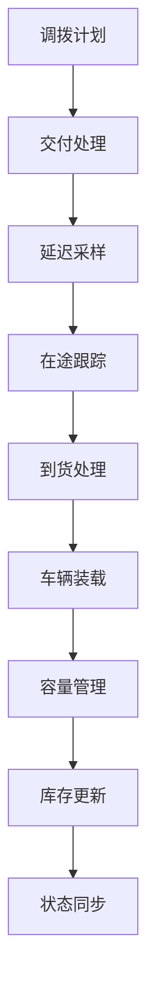

# src/modules/logistics_execution 模块详细文档

## 文档信息

| 项 | 内容 |
|---|---|
| 文档版本 | v1.0 |
| 最后更新 | 2026-03-05 |
| 适用范围 | `src/modules/logistics_execution/` 目录 |
| 目标读者 | 算法工程师、测试工程师、业务分析师 |

---

## 目录

1. [模块概述](#1-模块概述)
2. [主要类与函数列表](#2-主要类与函数列表)
3. [核心数据结构](#3-核心数据结构)
4. [依赖关系](#4-依赖关系)

---

## 1. 模块概述

**模块路径**: `src/modules/logistics_execution/`

**主要职责**:
- Module 6 物流执行与运输计算
- 调拨计划的发运处理
- 在途订单跟踪
- 延迟采样与到货计算
- 车辆装载与容量管理
- 库存扣减与更新
- 表达式求值
- 数据验证

**核心功能点**:
1. **调拨发运**: 从调拨计划生成发运记录
2. **延迟采样**: 根据路线分布采样运输延迟
3. **在途跟踪**: 跟踪已发运但未交付的订单
4. **到货处理**: 处理到达交付，更新库存
5. **车辆装载**: 优化车辆装载效率
6. **容量管理**: 管理车辆容量约束
7. **库存管理**: 扣减/增加库存
8. **DuckDB 加速**: 批量计算优化

---

## 2. 主要类与函数列表

### 2.1 capacity_manager.py - 容量管理

**主要类**:
- `CapacityManager`

**主要功能**:
- 管理车辆容量配置
- 容量约束检查
- 装载优化

**核心方法**:

| 方法名 | 功能 |
|---|---|
| `get_vehicle_capacity()` | 获取车辆容量 |
| `check_capacity_constraint()` | 检查容量约束 |
| `optimize_loading()` | 优化装载 |

### 2.2 config_loader.py - 配置加载

**主要函数**:
- 加载物流配置参数

### 2.3 delivery_processor.py - 交付处理

**主要类**:
- `DeliveryProcessor`

**核心方法**:

| 方法名 | 功能 |
|---|---|
| `process_delivery_plan()` | 处理交付计划 |
| `process_in_transit()` | 处理在途订单 |
| `process_arrival()` | 处理到货 |
| `update_inventory()` | 更新库存 |

### 2.4 duckdb_batch_calculator.py - DuckDB 批量计算

**主要函数**:
- DuckDB 批量计算优化
- 向量化延迟采样
- 批量到货处理

**核心方法**:

| 方法名 | 功能 |
|---|---|
| `batch_sample_delays()` | 批量采样延迟 |
| `batch_process_arrivals()` | 批量处理到货 |

### 2.5 expression_evaluator.py - 表达式求值

**主要功能**:
- 支持动态表达式求值
- 支持复杂表达式解析

### 2.6 inventory_manager.py - 库存管理

**主要类**:
- `InventoryManager`

**核心方法**:

| 方法名 | 功能 |
|---|---|
| `deduct_inventory()` | 扣减库存 |
| `add_inventory()` | 增加库存 |
| `get_inventory()` | 获取库存 |
| `sync_with_orchestrator()` | 与 Orchestrator 同步 |

### 2.7 validators.py - 数据验证

**主要函数**:
- 数据完整性验证
- 业务规则验证
- 约束检查

### 2.8 vehicle_packer.py - 车辆装载

**主要类**:
- `VehiclePacker`

**核心功能**:
- 车辆装载优化
- 3D装箱算法
- 容量约束处理

**核心方法**:

| 方法名 | 功能 |
|---|---|
| `pack_orders()` | 订单装箱 |
| `optimize_vehicle_usage()` | 车辆使用优化 |
| `calculate_remaining_capacity()` | 计算剩余容量 |

---

## 3. 核心数据结构

### 3.1 Delivery 数据结构

```python
{
    'delivery_uid': str,              # 交付唯一标识
    'material': str,                # 物料编码
    'sending': str,                 # 发送地
    'receiving': str,               # 接收地
    'planned_deploy_date': str,    # 计划部署日期
    'actual_ship_date': str,         # 实际发运日期
    'actual_delivery_date': str,      # 实际到货日期
    'delivery_qty': int,             # 交付数量
    'vehicle_uid': str,              # 车辆标识
}
```

### 3.2 InTransit 数据结构

```python
{
    'transit_uid': str,             # 在途唯一标识
    'material': str,                # 物料编码
    'sending': str,                 # 发送地
    'receiving': str,               # 接收地
    'actual_ship_date': str,         # 实际发运日期
    'actual_delivery_date': str,      # 实际到货日期
    'quantity': int,                # 运输数量
    'ori_deployment_uid': str,       # 原始调拨标识
    'vehicle_uid': str,              # 车辆标识
}
```

### 3.3 Vehicle 车辆数据结构

```python
{
    'vehicle_uid': str,              # 车辆唯一标识
    'capacity': int,                # 车辆容量
    'type': str,                   # 车辆类型
    'length': int,                  # 车厢长度
    'width': int,                   # 车厢宽度
    'height': int                   # 车厢高度
}
```

---

## 4. 依赖关系



**模块依赖**:
- logistics_execution 依赖 deployment_planning 的调拨计划
- 依赖 orchestrator 的库存状态
- 依赖配置模块的物流参数
- 可使用 DuckDB 进行批量计算优化

**依赖的外部模块**:
- `src/core/orchestrator.py` - 库存状态管理
- `src/modules/deployment_planning/` - 调拨计划
- `src/utils/duckdb_accelerator.py` - DuckDB 加速（可选）

---

## 附录：相关文档

- [../core.md](core.md) - Core 模块文档
- [ARCHITECTURE.md](ARCHITECTURE.md) - 架构设计文档
- [API.md](API.md) - API 接口文档

---
