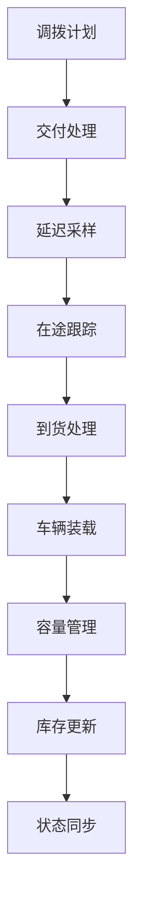

# src/modules/logistics_execution 模块详细文档

## 文档信息

| 项 | 内容 |
|---|---|
| 文档版本 | v2.0 |
| 最后更新 | 2026-04-06 |
| 适用范围 | `src/modules/logistics_execution/` 目录 |
| 目标读者 | 算法工程师、测试工程师、业务分析师 |
| 变更说明 | v2.0：原 `module6.py`（1547 行）的核心逻辑已拆分迁入本子包，新增 8 个子模块 |

---

## 目录

1. [模块概述](#1-模块概述)
2. [v2.0 新增子模块（module6.py 拆分）](#2-v20-新增子模块module6py-拆分)
3. [原有子模块](#3-原有子模块)
4. [核心数据结构](#3-核心数据结构)
5. [依赖关系](#4-依赖关系)

---

## 1. 模块概述

**模块路径**: `src/modules/logistics_execution/`

**主要职责**:
- Module 6 物流执行与运输计算
- 调拨计划的发运处理
- 在途订单跟踪
- 延迟采样与到货计算
- 车辆装载与容量管理
- 库存扣减与更新
- 表达式求值
- 数据验证

**v2.0 变更**: 原 `src/modules/module6.py`（1547 行）的核心逻辑已拆分为 8 个子模块迁入本包。原 `module6.py` 已删除，不再作为独立入口存在。

**核心功能点**:
1. **调拨发运**: 从调拨计划生成发运记录
2. **延迟采样**: 根据路线分布采样运输延迟
3. **在途跟踪**: 跟踪已发运但未交付的订单
4. **到货处理**: 处理到达交付，更新库存
5. **车辆装载**: 优化车辆装载效率
6. **容量管理**: 管理车辆容量约束
7. **库存管理**: 扣减/增加库存
8. **DuckDB 加速**: 批量计算优化

---

## 2. v2.0 新增子模块（module6.py 拆分）

### 数据流架构

```
DeploymentPlan (输入)
        │
        ▼
main.py                      ← 公开入口：run_daily_physical_flow / run_physical_flow_module
        │
        ▼
initializer.py               ← 初始化运行参数（集成/独立模式）
        │
        ▼
data_preparer.py             ← 验证、去重、构建映射
        │
        ▼
simulation_engine.py         ← 按日期迭代主循环
        │
        ▼
route_processor.py           ← 按路线遍历，两轮装载
   ┌────┴────┐
first pass  second pass（仅在触发条件满足后）
        │
        ▼
constraint_enforcer.py       ← 约束验证
        │
        ▼
output_builder.py            ← 写入 6 个 Sheet 到 Excel
```

### 2.1 constants.py — 常量定义

**新增文件**，定义 `ALLOWED_EXPRESSION_VARS`（MDQ bypass 表达式允许使用的变量白名单）。

### 2.2 initializer.py — 运行参数初始化

| 函数 | 说明 |
|------|------|
| `initialize_run_params(config)` | 合并全局配置默认值，返回运行参数字典 |
| `_init_integrated_params(config, shared_state)` | 集成模式：从 shared_state 提取部署计划、库存状态 |
| `_init_standalone_params(config)` | 独立模式：从文件读取输入数据 |

### 2.3 data_preparer.py — 数据准备

| 函数 | 说明 |
|------|------|
| `prepare_data(params)` | 验证输入、去重、构建查找映射 |
| `filter_empty_demand_element(df)` | 过滤空需求元素 |
| `_build_priority_map(demand_config)` | 构建 `demand_element → priority` 映射 |
| `_build_material_map(material_config)` | 构建 `material → {weight, volume}` 映射 |
| `_build_spec_map(spec_config)` | 构建规格映射 |
| `_process_material_metadata(...)` | 处理物料元数据 |
| `_log_missing_materials(...)` | 记录缺失物料 |
| `_prepare_deployment_plan(df)` | 稳定排序并生成 UID |
| `_handle_uid_duplicates(df)` | 处理 UID 重复 |

### 2.4 simulation_engine.py — 仿真循环引擎

| 函数 | 说明 |
|------|------|
| `run_simulation_loop(params, state)` | 主仿真循环，按日期迭代 |
| `_init_aggregation_status(deployment_plan_df)` | 初始化每个 UID 的聚合状态 |
| `_process_daily_demands(simulation_date, agg_status, deployment_plan_df)` | 收集当日 pending 需求 |
| `_collect_pending_demands(agg_status, deployment_plan_df)` | 遍历 agg_status 构建 pending 列表 |

**聚合状态结构**：

```python
agg_status[uid] = {
    "remaining_qty": float,    # 剩余待发数量
    "deployed_qty": float,     # 已部署数量
    "waiting_days": int,       # 已等待天数
    "status": str              # "pending" | "shipped" | "unsatisfied"
}
```

### 2.5 route_processor.py — 路线处理与装载

| 函数 | 说明 |
|------|------|
| `process_routes(pending_demands, params, state)` | 按路线处理 pending 需求 |
| `_process_single_route(route, truck_types, demands, params, state)` | 单路线处理 |
| `_process_truck_type(route, truck_type, demands, params, state)` | 核心两轮装载 |
| `_first_pass_loading(demands, capacity, params)` | 第一轮装载（按优先级） |
| `_second_pass_loading(demands, capacity, loaded_indices, params)` | 第二轮补充装载 |
| `_build_context(demand, agg_status, params)` | 构建 MDQ bypass 上下文 |
| `_generate_shipment_records(...)` | 生成发运记录，更新状态 |
| `_handle_remaining_demands(...)` | 超期需求处理 |

**两轮装载机制**：

| 轮次 | 目标 | 触发条件 |
|------|------|---------|
| 第一轮 | 尽量装载，不超容量上限 | 始终执行 |
| 第二轮 | 贴近满载率 | WFR/VFR 超阈值、MDQ bypass 命中、等待超过 max_wait_days |

### 2.6 constraint_enforcer.py — 约束验证

| 函数 | 说明 |
|------|------|
| `enforce_shipment_constraint()` | 按比例裁剪出货量（**已注释禁用**） |
| `validate_shipment_delivery_constraint()` | 验证出货量是否超约束（仅报告不裁剪） |

### 2.7 output_builder.py — 输出构建

| 函数 | 说明 |
|------|------|
| `generate_outputs(state, params)` | 构建 6 个 DataFrame 并写入 Excel |
| `_build_delivery_plan_df(...)` | 交付计划 |
| `_build_vehicle_df(...)` | 车辆日志（结构保留，实际为空表） |
| `_build_usage_df(...)` | 按路线、车型的 groupby 使用统计 |
| `_build_unsat_df(...)` | 未满足需求日志 |
| `_build_validation_df(...)` | 约束验证报告 |
| `_build_bypass_df(...)` | MDQ bypass 规则命中记录 |
| `_write_excel_output(output_path, sheets_dict)` | 写入 Excel |

### 2.8 main.py — 公开入口

| 函数 | 说明 |
|------|------|
| `run_daily_physical_flow(simulation_date, config, shared_state)` | 集成模式日度入口 |
| `run_physical_flow_module(config, mode, deployment_plan_df, ...)` | 主入口（standalone/integrated） |
| `main` | `run_physical_flow_module` 的别名 |

---

## 3. 原有子模块

### 3.1 capacity_manager.py - 容量管理

**主要类**:
- `CapacityManager`

**主要功能**:
- 管理车辆容量配置
- 容量约束检查
- 装载优化

**核心方法**:

| 方法名 | 功能 |
|---|---|
| `get_vehicle_capacity()` | 获取车辆容量 |
| `check_capacity_constraint()` | 检查容量约束 |
| `optimize_loading()` | 优化装载 |

### 3.2 config_loader.py - 配置加载

**主要函数**:
- 加载物流配置参数

### 3.3 delivery_processor.py - 交付处理

**主要类**:
- `DeliveryProcessor`

**核心方法**:

| 方法名 | 功能 |
|---|---|
| `process_delivery_plan()` | 处理交付计划 |
| `process_in_transit()` | 处理在途订单 |
| `process_arrival()` | 处理到货 |
| `update_inventory()` | 更新库存 |

### 3.4 duckdb_batch_calculator.py - DuckDB 批量计算

**主要函数**:
- DuckDB 批量计算优化
- 向量化延迟采样
- 批量到货处理

**核心方法**:

| 方法名 | 功能 |
|---|---|
| `batch_sample_delays()` | 批量采样延迟 |
| `batch_process_arrivals()` | 批量处理到货 |

### 3.5 expression_evaluator.py - 表达式求值

**主要功能**:
- 支持动态表达式求值
- 支持复杂表达式解析

### 3.6 inventory_manager.py - 库存管理

**主要类**:
- `InventoryManager`

**核心方法**:

| 方法名 | 功能 |
|---|---|
| `deduct_inventory()` | 扣减库存 |
| `add_inventory()` | 增加库存 |
| `get_inventory()` | 获取库存 |
| `sync_with_orchestrator()` | 与 Orchestrator 同步 |

### 3.7 validators.py - 数据验证

**主要函数**:
- 数据完整性验证
- 业务规则验证
- 约束检查

### 3.8 vehicle_packer.py - 车辆装载

**主要类**:
- `VehiclePacker`

**核心功能**:
- 车辆装载优化
- 3D装箱算法
- 容量约束处理

**核心方法**:

| 方法名 | 功能 |
|---|---|
| `pack_orders()` | 订单装箱 |
| `optimize_vehicle_usage()` | 车辆使用优化 |
| `calculate_remaining_capacity()` | 计算剩余容量 |

---

## 4. 核心数据结构

### 3.1 Delivery 数据结构

```python
{
    'delivery_uid': str,              # 交付唯一标识
    'material': str,                # 物料编码
    'sending': str,                 # 发送地
    'receiving': str,               # 接收地
    'planned_deploy_date': str,    # 计划部署日期
    'actual_ship_date': str,         # 实际发运日期
    'actual_delivery_date': str,      # 实际到货日期
    'delivery_qty': int,             # 交付数量
    'vehicle_uid': str,              # 车辆标识
}
```

### 3.2 InTransit 数据结构

```python
{
    'transit_uid': str,             # 在途唯一标识
    'material': str,                # 物料编码
    'sending': str,                 # 发送地
    'receiving': str,               # 接收地
    'actual_ship_date': str,         # 实际发运日期
    'actual_delivery_date': str,      # 实际到货日期
    'quantity': int,                # 运输数量
    'ori_deployment_uid': str,       # 原始调拨标识
    'vehicle_uid': str,              # 车辆标识
}
```

### 3.3 Vehicle 车辆数据结构

```python
{
    'vehicle_uid': str,              # 车辆唯一标识
    'capacity': int,                # 车辆容量
    'type': str,                   # 车辆类型
    'length': int,                  # 车厢长度
    'width': int,                   # 车厢宽度
    'height': int                   # 车厢高度
}
```

---

## 5. 依赖关系



**模块依赖**:
- logistics_execution 依赖 deployment_planning 的调拨计划
- 依赖 orchestrator 的库存状态
- 依赖配置模块的物流参数
- 可使用 DuckDB 进行批量计算优化

**依赖的外部模块**:
- `src/core/orchestrator/` - 库存状态管理
- `src/modules/deployment_planning/` - 调拨计划
- `src/utils/duckdb_accelerator.py` - DuckDB 加速（可选）
- `src/utils/normalization.py` - 标识符规范化

---

## 附录：相关文档

- [../core.md](core.md) - Core 模块文档
- [ARCHITECTURE.md](ARCHITECTURE.md) - 架构设计文档
- [API.md](API.md) - API 接口文档

---
