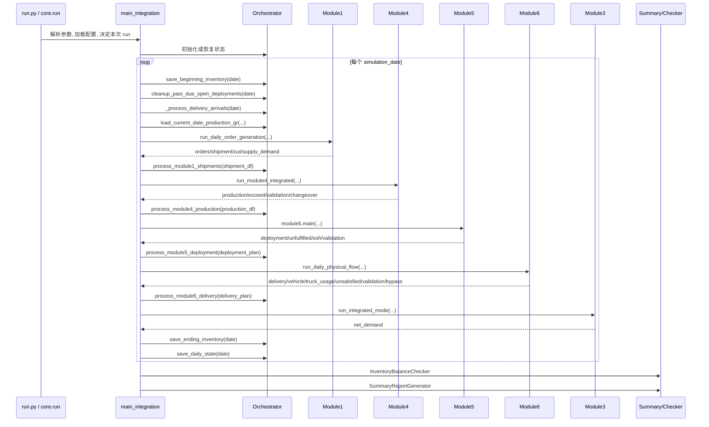
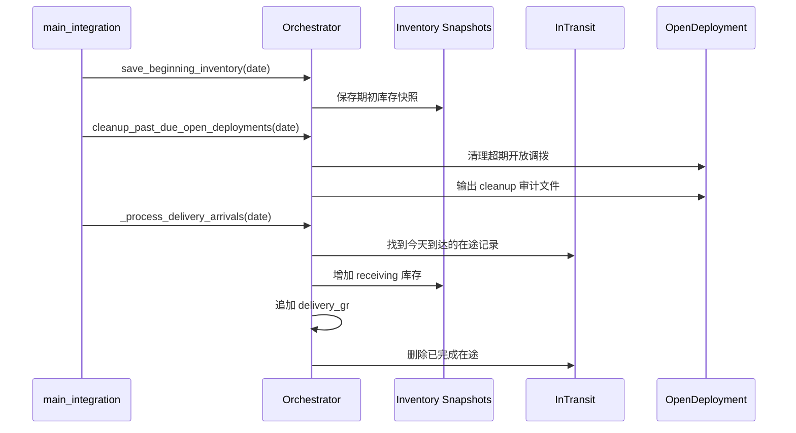
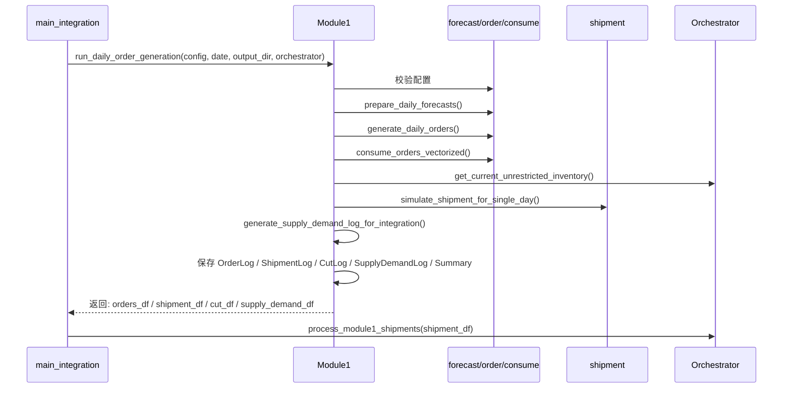
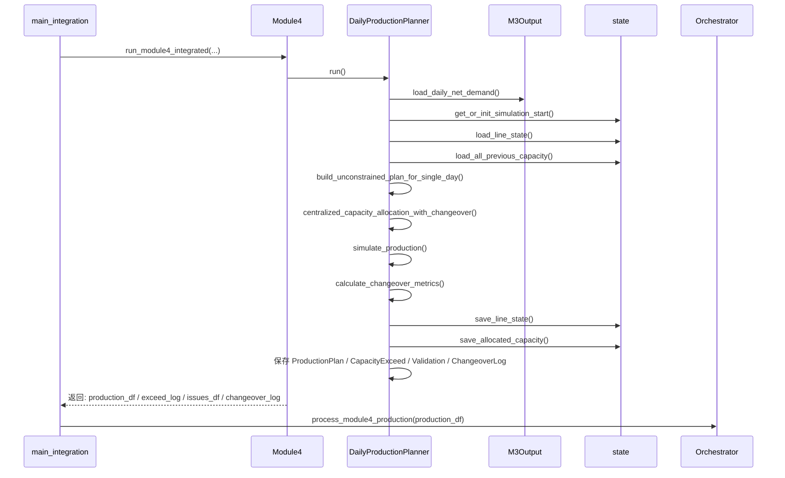
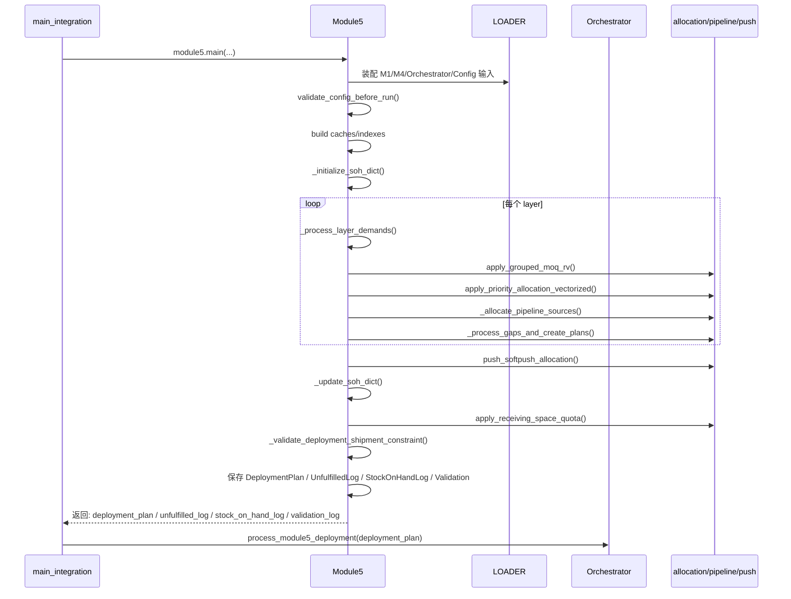
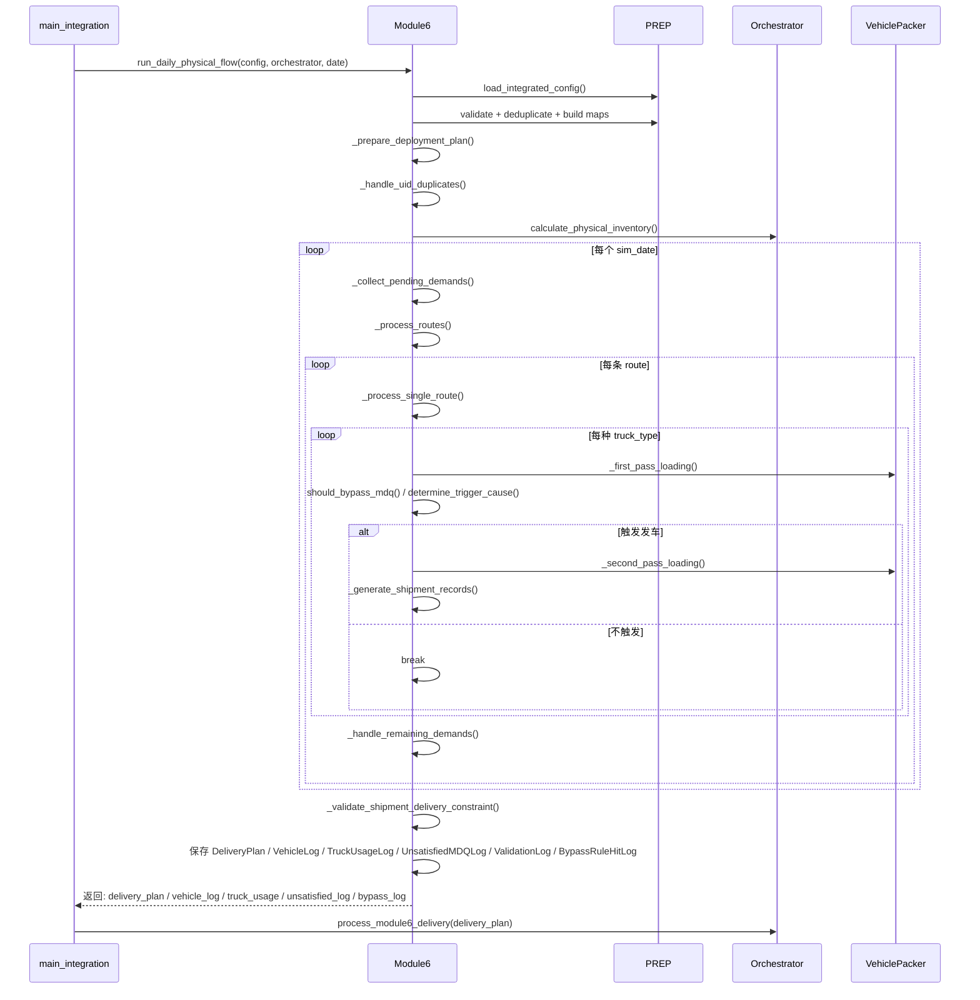
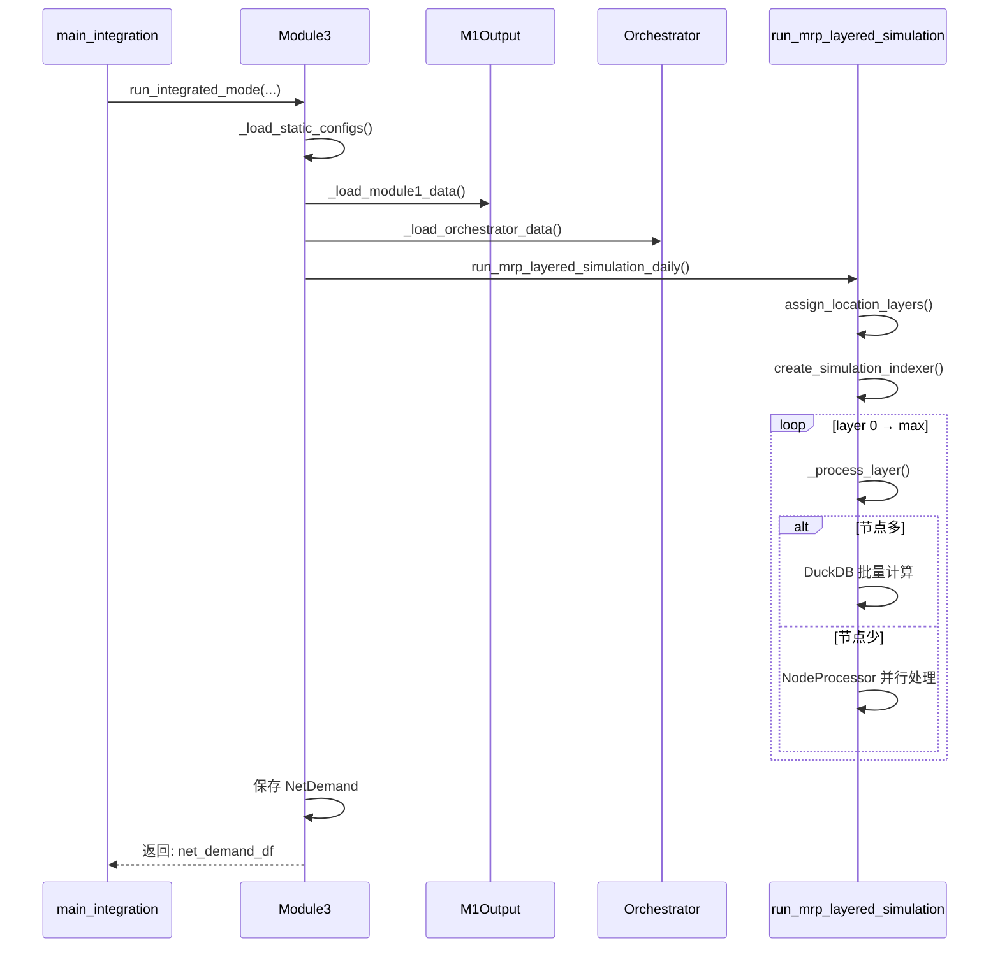
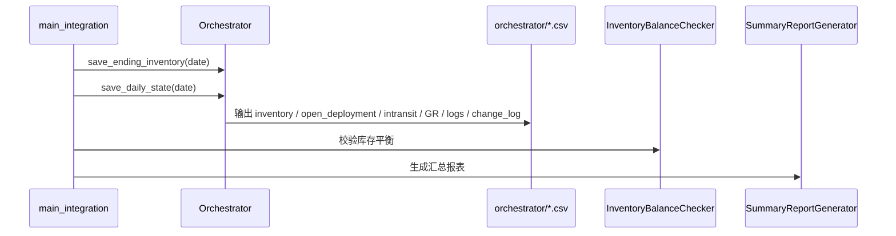
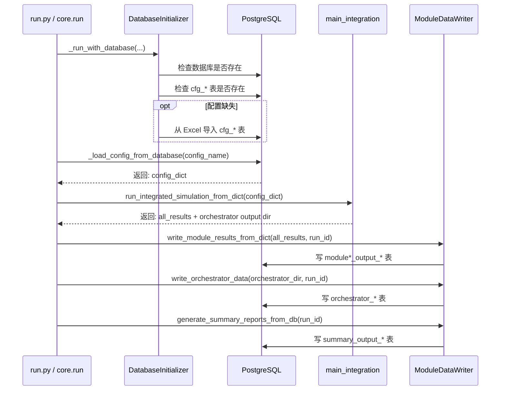

# ChainSight 模块级时序图文档

## 封面信息

- 文档名称：ChainSight 模块级时序图文档
- 文档编号：CS-SEQ-20260306-001
- 文档版本：v1.1
- 编写日期：2026-04-10
- 编写人：陈显跃
- 文档状态：正式交付版

## 审批栏

| 角色 | 姓名 | 状态 | 日期 | 备注 |
|---|---|---|---|---|
| 编写 | 陈显跃 | 已完成 | 2026-04-10 | 对齐第三阶段包化重构 |
| 复核 | 待填写 | 待复核 | 待填写 |  |
| 审批 | 待填写 | 待审批 | 待填写 |  |

## 修订记录

| 版本 | 日期 | 修订人 | 修订说明 |
|---|---|---|---|
| v1.0 | 2026-03-06 | 陈显跃 | 首次形成模块级执行顺序与状态回写时序文档 |
| v1.1 | 2026-04-10 | 陈显跃 | 对齐第三阶段重构：`run.py` / `main_integration.py` / `orchestrator.py` / `parallel_executor.py` / `module1~6.py` 全部转为包目录，时序语义不变。 |

## 文档定位

- 本文重点不是讲每个函数细节，而是讲清楚模块顺序、状态回写节点和关键时序。
- 适合做培训、评审、交付汇报和排障入口材料。

## 1. 文档目的

- 本文档专门解决一个问题：ChainSight 每天到底按什么顺序跑，模块之间的数据是怎么一层层传下去、再回写回来的。
- 它适合作为交接培训材料、排障参考材料、设计评审材料。
- 阅读时建议先看第 2 章的总时序，再看第 3 章到第 8 章的分模块时序。

## 2. 每日总时序图

### 2.1 总链路概览

### 2.2 一句话理解每天在干什么

- 日初先把“之前已经在路上、今天该到的货”入库。
- 然后 M1 先看客户侧，决定今天有哪些订单、能发多少。
- M4 再看生产，决定今天真正能排多少产。
- M5 再看网络，决定今天各节点之间怎么调拨。
- M6 再把调拨计划变成真实发运和在途。
- 最后 M3 再根据今天执行后的最新状态，反推整个网络今天还缺什么。

## 3. 日初状态处理时序

### 3.1 日初处理图

### 3.2 关键说明

- 这一步必须发生在 M1/M4/M5/M6 前面，否则当天看见的库存会偏小。
- 这一步做的是“历史事务入账”，不是今天的新业务动作。

## 4. M1 时序图

### 4.1 M1 内部时序

### 4.2 M1 处理后状态变化

- 客户订单被生成。
- 一部分订单转成真实 shipment。
- 对应库存被从 Orchestrator 中扣掉。
- 未满足部分进入 `CutLog`。
- 供需日志进入后续模块视野。

## 5. M4 时序图

### 5.1 M4 内部时序

### 5.2 M4 处理后状态变化

- 一部分未来生产进入 `production_plan_backlog`。
- 当天 `available_date == date` 的实际生产入库进入 `production_gr`。
- 可用库存被增加。
- 产线状态和已占产能被持久化，供明天继续接着排。

## 6. M5 时序图

### 6.1 M5 内部时序

### 6.2 M5 处理后状态变化

- 新生成的部署计划写进 `DeploymentPlan`。
- 对应调拨需求进入 Orchestrator 的 `open_deployment`。
- 每条部署需求都会获得稳定 `ori_deployment_uid`。
- M5 自己的 SOH 会滚动到下一天。

## 7. M6 时序图

### 7.1 M6 内部时序

### 7.2 M6 处理后状态变化

- 待发运的开放调拨被实际装车并发运。
- 发送地库存被扣减。
- 同天到货会立即进入 `delivery_gr` 并加库存。
- 未来到货会进入 `in_transit`。
- 未满足 MDQ 或等待过久的需求进入 `UnsatisfiedMDQLog`。

## 8. M3 时序图

### 8.1 M3 内部时序

### 8.2 M3 处理后状态变化

- 生成当天全网络的净需求结果。
- 这些净需求中的 layer=0 会在下一天成为 M4 的直接输入。
- 上游 gap 传递结果决定下一层物料与地点的补货压力。

## 9. 日末状态保存时序

### 9.1 日末收尾图

### 9.2 日末生成的核心文件

- `unrestricted_inventory_YYYYMMDD.csv`
- `open_deployment_YYYYMMDD.csv`
- `planning_intransit_YYYYMMDD.csv`
- `space_quota_YYYYMMDD.csv`
- `production_plan_backlog_YYYYMMDD.csv`
- `production_gr_YYYYMMDD.csv`
- `delivery_gr_YYYYMMDD.csv`
- `shipment_log_YYYYMMDD.csv`
- `delivery_shipment_log_YYYYMMDD.csv`
- `inventory_change_log_YYYYMMDD.csv`
- `daily_logs_YYYYMMDD.csv`

## 10. DB 模式时序图

### 10.1 DB 版端到端时序

### 10.2 DB 模式和本地模式的最大区别

- 算法核心还是同一套，不是两套不同算法。
- 本地模式的主要介质是 Excel + CSV。
- DB 模式的主要介质是 `cfg_*` 表、`module*_output_*` 表、`orchestrator_*` 表、`summary_output_*` 表。

## 11. 交接建议

- 如果你是第一次接手项目，先把第 2 章到第 8 章通读一遍，再看 `docs/函数上下游依赖矩阵.md`。
- 如果你在查某一天为什么结果变了，优先沿着“日初 -> M1 -> M4 -> M5 -> M6 -> M3 -> 日末”这个顺序追。
- 如果你在查 UID、库存、在途或 DB 对账问题，优先看：
  - `src/core/orchestrator/`（原 `orchestrator.py`）
  - `src/modules/deployment_planning/main.py`（原 `module5.main`）
  - `src/modules/logistics_execution/`（原 `module6.py`）
  - `module_data_writer.py`

## 12. 结论

- ChainSight 的复杂度不是来自某一个模块，而是来自“日度顺序 + 跨模块状态回写 + 多介质输出”的组合。
- 真正需要守住的不是某一段代码风格，而是顺序、键、状态和输出契约。

## 附录 A. 推荐配套文档

- `docs/项目交接文档.docx`
- `docs/函数上下游依赖矩阵.docx`
- `docs/函数级接口与文件格式总表.docx`
